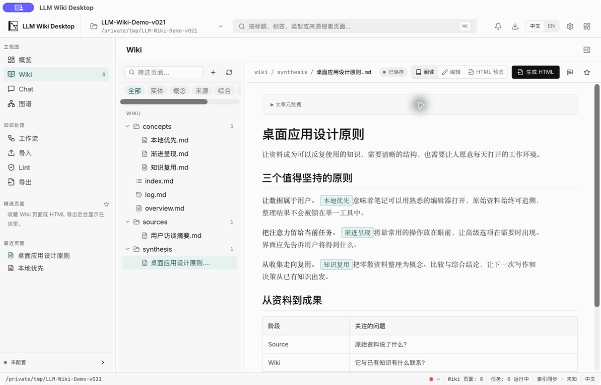

<div align="center">
  
  <h1>LLM Wiki Desktop</h1>
  <p><strong>资料在本地，知识有连接，AI 由你选择。</strong></p>
  <p>将文档、网页与影音资料整理为相互关联的 Markdown 知识库。</p>
  <p><a href="https://github.com/StoneLL1/llm-wiki-desktop/releases/latest">下载应用</a> · <a href="#开始使用">开始使用</a> · <a href="README.md">English</a> · <a href="CONTRIBUTING.md">参与贡献</a></p>
</div>



## 从资料到知识，保留每一步的来源

导入资料，得到可阅读的 **Source**；再通过明确的整理操作构建 **Wiki**。阅读、编辑、探索图谱、提问和导出都在同一个桌面工作台中完成。知识库始终是可以用其他编辑器打开的本地文件夹。

| 功能 | 用途 |
| :-- | :-- |
| **收集资料** | 导入文档、网页、图片、音频与视频。按需安装 OCR、转写、浏览器提取和文档转换引擎。 |
| **连接知识** | 阅读和编辑 Markdown、查看反向链接、本地搜索、探索知识图谱；支持原生项目和兼容 Markdown 库。 |
| **基于资料提问** | 通过自行配置的 API、本地 Ollama 或受支持的 Agent CLI，与 Source 和 Wiki 对话。 |
| **明确执行工作流** | 更新 Wiki、健康检查、生成内容与 HTML 导出都有可见状态，长任务支持取消。 |
| **保留控制权** | 对敏感修改进行确认，并通过本地 Git 版本记录保护受支持的写入操作。原始材料与衍生页面分开保存。 |

支持简体中文与英文、浅色与深色主题，无需注册应用账号。

## 下载

**[下载 v0.2.1 →](https://github.com/StoneLL1/llm-wiki-desktop/releases/tag/app-v0.2.1)**

| 平台 | 安装包 |
| :-- | :-- |
| macOS · Apple Silicon | [下载 DMG](https://github.com/StoneLL1/llm-wiki-desktop/releases/download/app-v0.2.1/darwin-aarch64-LLM.Wiki.Desktop_0.2.1_aarch64.dmg) |
| macOS · Intel | [下载 DMG](https://github.com/StoneLL1/llm-wiki-desktop/releases/download/app-v0.2.1/darwin-x86_64-LLM.Wiki.Desktop_0.2.1_x64.dmg) |
| Windows · x64 | [下载安装程序](https://github.com/StoneLL1/llm-wiki-desktop/releases/download/app-v0.2.1/windows-x86_64-LLM.Wiki.Desktop_0.2.1_x64-setup.exe) |
| Linux · x64 | [下载 AppImage](https://github.com/StoneLL1/llm-wiki-desktop/releases/download/app-v0.2.1/linux-x86_64-LLM.Wiki.Desktop_0.2.1_amd64.AppImage) |

macOS 将应用拖入 Applications；Windows 运行安装程序；Linux 为 AppImage 添加执行权限后启动，CI 使用 Ubuntu 24.04 验证。

macOS 版本尚未经过 Apple 公证，Windows 安装程序尚无 Authenticode 身份签名，首次启动可能出现系统提示。具体操作见[安装说明](docs/release/known-limitations.md)。应用更新和可选能力包均验证签名。

release 中的其他文件用于自动更新及校验。OCR、语音、浏览器等引擎在应用内按需下载，不必手动下载全部能力包。

## 开始使用

1. **新建或打开知识库。** 在新的文件夹中创建项目，或打开已有的兼容 Markdown 库；现有库保留原有结构。
2. **导入第一份资料。** 添加文档或链接，查看生成的 Source；仅在格式需要时安装相应引擎。
3. **选择 AI。** 在设置中配置模型服务、本地 Ollama 或已安装的 Agent CLI。阅读、编辑、图谱和关键词搜索无需 AI。
4. **整理与使用。** 在 Workflows 中运行「更新 Wiki」，查看整理结果，再通过图谱、Chat 或 HTML 导出使用这些知识。

### AI 与隐私

支持 OpenAI、Anthropic、Google、Ollama 及 OpenAI 兼容接口。模型访问与 Agent CLI 由你自行配置，应用不附带付费模型订阅。

密钥存放在操作系统凭据存储中。执行 AI 任务时，相关内容会发送至你选择的服务或 Agent；使用远程模型时不属于离线处理。可选导入引擎首次使用时可能需要下载运行时或模型。

### 文件属于你

```text
my-knowledge-base/
├── raw/       原始材料与可阅读的 Source
├── wiki/      相互关联的 Markdown 页面
├── .app/      项目设置与操作状态
├── exports/   HTML 等导出结果
└── skills/    项目专用指导
```

没有内容数据库，也不要求云端同步。兼容库保留原有 Markdown 布局，应用指导信息放在 `.app/compat/`。本地版本记录提供受支持操作的恢复能力，可与你原有的备份方式配合使用。

## 开发

技术栈：**Tauri 2 · React 19 · TypeScript · Rust**。

推荐使用与 CI 一致的 Node.js **22.23.1**、Rust **1.92.0**，并安装 [Tauri 平台依赖](https://v2.tauri.app/start/prerequisites/)。版本记录功能需要 Git。

```bash
git clone https://github.com/StoneLL1/llm-wiki-desktop.git
cd llm-wiki-desktop
npm ci
npm run tauri -- dev
```

```bash
npm run check:quick   # 日常快速检查
npm run check         # 完整验证
npm run tauri -- build --config '{"bundle":{"createUpdaterArtifacts":false}}'
```

`npm run dev` 仅启动前端服务器；完整桌面应用使用 `npm run tauri -- dev`。本地构建使用开发能力配置，签名的分发目录由 release 工作流生成。上述本地构建命令关闭更新包签名，正式版本由 CI 签名发布。

[贡献指南](CONTRIBUTING.md) · [架构说明](SPEC/TECH_STACK.md) · [维护排错](docs/maintainers/troubleshooting.md) · [发布流程](docs/release/release-runbook.md) · [版本记录](CHANGELOG.md) · [安全反馈](SECURITY.md)

## 许可证

[Apache-2.0](LICENSE)。可选能力包中包含各自第三方组件的许可证与声明。
