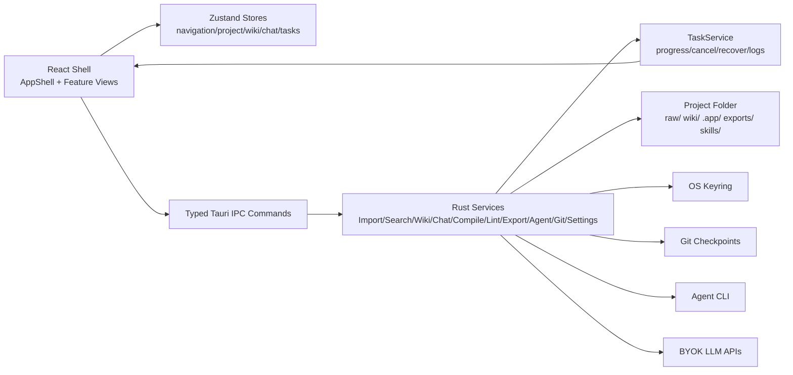

# llm-wiki 桌面端项目审查报告

审查时间：2026-07-09  
审查范围：`src/`、`src-tauri/src/`、`SPEC/`、`UI-Frontend-design/`、构建配置、测试与工程化配置。  
竞品调研范围：Obsidian（非开源但行业基准）、Logseq、TriliumNext、SiYuan、Khoj、AutoWiki、GPT Researcher、Local Deep Research、Open Deep Research、AgentMemory、Codebase Memory MCP。

## 一、执行摘要（TL;DR）

### 总体评分

| 维度 | 评分 | 判断 |
| --- | ---: | --- |
| 架构设计 | 7.2/10 | 分层方向正确，安全边界清晰；但服务层与 shell 组件已出现“大文件/多职责”风险。 |
| 功能完整度 | 6.4/10 | MVP 主链路覆盖较广；与成熟 PKM/研究 Agent 相比，插件、版本化、块级引用、研究策略与发布能力缺口明显。 |
| 代码质量 | 7.0/10 | 测试意识强、DTO/路径/密钥处理较稳；但 lint 规则偏基础，超大服务和重复 orchestration 抬高维护成本。 |
| 用户体验（UX） | 6.8/10 | Codex-like 桌面壳、任务进度、取消、左右栏信息密度较好；新手引导、确认体验、复杂流程解释仍不够。 |
| 性能与工程化 | 5.8/10 | 已做懒加载和 WikiIndex；但缺 CI/CD、包体预算、跨平台自动验证、发布/更新管线。 |
| 安全与可靠性 | 7.0/10 | Keyring、路径边界、Git checkpoint、任务恢复是亮点；CSP 关闭、更新签名缺失、渲染隔离与恢复策略需补强。 |

### 3 个最紧急的问题（P0）

1. **Tauri CSP 关闭**：`src-tauri/tauri.conf.json:24-25` 设置 `"csp": null`，而应用会渲染 Markdown/HTML、外部导入文本和导出预览，建议立即定义严格 CSP 和预览隔离策略。
2. **CI/CD 缺失**：仓库当前无 `.github` 工作流，`package.json:6-12` 也没有统一 `check` 脚本。对本项目这种跨平台文件/Git/Agent 桌面工具来说，缺自动验证会放大回归风险。
3. **发布与更新机制未闭环**：`src-tauri/tauri.conf.json:28-31` 启用 bundle 但 `icon: []`；`src/stores/settingsStore.ts:45` 有 `autoDownloadUpdates` 状态，但未见 updater 插件/命令链路。桌面端交付可信度不足。

### 3 个最大的改进机会

1. **把“LLM 编译知识库”做成核心差异化**：对标 AutoWiki 和 GPT Researcher，把 compile 从“生成 manifest”升级为“计划-证据-页面-引用-审查”的可视流水线。
2. **把现有安全工程显性化到 UX**：你已经有 Git checkpoint、source immutability、keyring、task recovery，但用户界面还没有把“现在安全到哪一步”讲清楚。
3. **拆出可演进的领域服务边界**：导入、搜索、Lint、Chat、Compile 都已成熟到需要子模块化，继续堆在单 service 会拖慢功能迭代。

## 二、项目架构分析

### 项目架构摘要（≤500 字）

llm-wiki-desktop 已是一个完整 Tauri v2 桌面骨架：React 19/Vite/Tailwind/shadcn-like primitives 负责 Codex-like shell 和 feature views，Zustand 维护前端视图状态；所有文件、Git、Agent、LLM、密钥、任务逻辑通过 typed Tauri IPC 进入 Rust commands，再下沉到 services/models/tasks。项目数据坚持本地 Markdown/JSON/local files：`raw/` 放源，`wiki/` 放知识页，`.app/` 放索引、任务、设置、聊天等 app 状态，`exports/` 放输出。核心已覆盖导入、编译、Wiki、图谱、Chat、Agent/BYOK、Lint、导出和设置；主要风险是服务层与 AppShell 逐渐承担过多编排职责。

### 技术栈与依赖关系

| 层 | 当前实现 | 证据 |
| --- | --- | --- |
| 前端 | React 19、TypeScript、Vite、Tailwind v4、Zustand、react-i18next、Lucide、Milkdown、sigma/graphology | `package.json:14-46` |
| 后端 | Tauri v2、Rust services、serde DTO、tokio/reqwest、keyring、pdf/docx/html/csv 提取 | `src-tauri/Cargo.toml`；命令/服务目录结构 |
| 本地内容 | Markdown + JSON + local files，无数据库 | `src-tauri/src/models/paths.rs:32-44`、`src-tauri/src/services/import_service.rs:84-94` |
| 安全边界 | Keyring、路径校验、Git checkpoint、任务取消/恢复 | `secret_service.rs:21-83`、`paths.rs:32-130`、`git_service.rs:115-150`、`task_service.rs:341-370` |

## 三、竞品对比矩阵

### 重点竞品快照（2026-07-09）

| 项目 | 方向 | Stars/活跃度 | 亮点 | 高频好评/吐槽 |
| --- | --- | --- | --- | --- |
| Obsidian | 本地 Markdown PKM | 非开源，行业基准 | 本地 Markdown vault、双链、图谱、插件/主题生态、移动端 | 好评：可迁移、插件生态强；吐槽：部分图谱/搜索场景需要插件补足。 |
| Logseq | 本地/大纲 PKM | 约 43.8k stars，近期活跃 | Privacy-first、Markdown/Org、本地优先、大纲/双链/图谱 | 好评：大纲和双链强；官方/社区反馈提到大图谱性能、同步数据风险、撤销/发布短板。 |
| TriliumNext | 本地/自托管 Wiki | 约 36.8k stars，近期活跃 | 深层树、note cloning、WYSIWYG、版本化、属性查询、脚本、单笔记加密、自托管同步 | 好评：自托管和结构化强；吐槽：复杂度和学习成本较高。 |
| SiYuan | 本地 PKM/块编辑 | 约 45.0k stars，近期活跃 | 块级引用、双链、WYSIWYG、SQL 查询嵌入、导出、AI Q&A、OCR、移动端、市场 | 好评：功能全；吐槽：部分高级能力商业化/生态复杂。 |
| Khoj | AI 第二大脑 | 约 35.5k stars | 文档/网页问答、语义搜索、自定义 agents、自动化、桌面/浏览器/Obsidian/手机入口 | 好评：AI 能力完整；吐槽：系统复杂、部署/索引成本更高。 |
| AutoWiki | LLM 编译知识库 | 约 61 stars，小而贴近定位 | “raw sources in, Obsidian wiki out”，里程碑、聚类、层级树、时间演化、交叉链接 | 好评：定位极近；吐槽：项目小，工程成熟度和生态有限。 |
| GPT Researcher / Local Deep Research | LLM 研究编译 | 约 28.1k / 8.7k stars | Planner/Execution/Publisher、多搜索策略、source tracking、并行/agentic research | 好评：研究流程清晰；吐槽：结果质量依赖模型/检索，成本和配置复杂。 |
| AgentMemory / Codebase Memory MCP | Agent 记忆/知识图谱 | 约 24.8k / 28.4k stars | 记忆生命周期、知识图谱、混合搜索、MCP、团队共享索引、安全发布 | 好评：Agent 上下文复用强；吐槽：引入新索引/服务会增加运维复杂度。 |

### 功能对比矩阵

| 功能维度 | llm-wiki-desktop | Obsidian | Logseq | TriliumNext | SiYuan | Khoj | AutoWiki | GPT Researcher/LDR | AgentMemory/Codebase MCP |
| --- | --- | --- | --- | --- | --- | --- | --- | --- | --- |
| 本地 Markdown 作为内容源 | ✅ | ✅ | ✅ | ⚠️ 支持导入/导出但内部模型不同 | ✅/块模型 | ✅ 文档源 | ✅ 输出 Obsidian wiki | ⚠️ 报告为主 | ⚠️ 结构索引为主 |
| 原始 source 不可变 | ✅ 项目硬规则 | ⚠️ 无同类概念 | ⚠️ | ⚠️ | ⚠️ | ⚠️ | ✅ raw sources 思路接近 | ⚠️ | ⚠️ |
| 双链/反链 | ⚠️ 图谱/链接已有，反链面板不完整 | ✅ | ✅ | ✅ | ✅ 块级 | ⚠️ | ✅ | ⚠️ | ✅ 知识图谱 |
| 图谱 | ✅ sigma/graphology | ✅ 全局/局部图 | ✅ | ✅ relation/link map | ✅ | ⚠️ | ✅ 输出给 Obsidian | ⚠️ 研究图弱 | ✅ 结构图谱 |
| WYSIWYG 编辑 | ✅ Milkdown | ✅ | ✅ | ✅ | ✅ | ❌ | ❌ | ❌ | ❌ |
| 导入/提取 PDF/DOCX/HTML/CSV | ✅ | 插件依赖 | ⚠️ | ✅ | ✅ | ✅ | ✅ 论文/PDF | ✅ 网络/私有文档 | ❌ |
| LLM 编译成 Wiki | ✅ Agent/BYOK | 插件依赖 | 插件依赖 | ❌ | AI 写作/Q&A | ❌ | ✅ 核心 | ✅ 研究报告 | ⚠️ 记忆/索引 |
| Planner/Reviewer/Exporter 流程 | ⚠️ 部分 plan/manifest | ❌ | ❌ | ❌ | ❌ | ⚠️ Agents | ✅ 聚类/层级 | ✅ | ⚠️ |
| Chat/Q&A with citations | ✅ | 插件依赖 | 插件依赖 | ❌ | ✅ OpenAI API | ✅ | ✅ Ask | ⚠️ | ✅ Agent 查询 |
| Git checkpoint/rollback | ✅ | 插件/用户自管 | Git 同步 | ❌ | 数据仓库 | ❌ | ❌ | ❌ | ❌ |
| OS 密钥存储 | ✅ keyring | 应用/插件 | 应用/插件 | ⚠️ | ⚠️ | 部署侧 | ❌ | env/secrets | 本地配置 |
| 加密 | ❌ | 依赖第三方/同步 | ⚠️ | ✅ per-note encryption | ✅ 数据仓库 key | 部署侧 | ❌ | ❌ | ❌ |
| 插件/市场 | ❌ | ✅ 强 | ✅ | 脚本/插件 | ✅ | 集成生态 | ❌ | Python 包生态 | MCP/Agent 生态 |
| 发布/更新/签名 | ⚠️ 未闭环 | ✅ | ✅ | ✅ | ✅ | ✅ | ❌ | ✅ Python 包/Docker | ✅ 签名/校验示例 |

## 四、六维度深度审查

### 4.1 架构设计

**现状分析**  
当前架构基本符合项目约束：React 只做 UI 与 IPC 调用，Rust service 负责文件、Git、Agent、密钥、任务。`src-tauri/src/models/paths.rs:32-44` 统一解析项目相对路径，`src-tauri/src/services/secret_service.rs:21-83` 统一 keyring 读写，`src-tauri/src/tasks/task_service.rs:341-370` 支持取消，`src-tauri/src/tasks/task_service.rs:453-505` 支持任务持久化/恢复。

**对比基准**  
Obsidian/Logseq 的强项是插件/数据模型边界；Trilium/SiYuan 的强项是 note/block 模型和查询能力；GPT Researcher 的强项是 Planner/Execution/Publisher 明确分层；Codebase Memory MCP 的强项是把“结构索引后端”和“LLM 智能层”分离。

**我做得好的**
- 本地文件夹是 source of truth，路径边界和 Git checkpoint 比多数 PKM 工具更安全。
- Agent CLI 与 BYOK 并行，不把核心功能绑死在某一个 Agent。
- TaskService 把长任务做成可取消、可恢复、可记录，符合桌面工具可靠性要求。

**具体问题**
- 后端服务过大：`lint_service.rs` 2833 行、`search_service.rs` 2313 行、`import_service.rs` 2275 行、`chat_service.rs` 2197 行、`compile_service.rs` 1838 行、`extraction_service.rs` 1983 行。单文件多职责会降低审查和测试定位效率。
- `src/components/app/AppShell.tsx` 746 行，并直接编排导入确认、编译启动、LLM provider 保存、Agent 默认设置、任务取消、secret 删除等多域逻辑；例如 `AppShell.tsx:480-505` 处理导入确认后扫描/编译，`AppShell.tsx:510-527` 保存 provider/secret/default agent，`AppShell.tsx:615-627` 处理任务取消和 secret 删除。
- 视图分发仍集中在 `AppShell.tsx:657-733` 的大条件分支；新增 feature 时会继续推高 shell 的变更频率。

**竞品做得更好的地方**
- GPT Researcher 明确将研究拆成 planner、execution agent、publisher/source tracking 流程，而不是把策略混在一个服务里。
- Codebase Memory MCP 明确把知识图谱索引后端与 Agent/MCP 客户端分开，便于独立优化索引、缓存、查询接口。
- Obsidian/Logseq 通过插件/扩展点降低核心壳层承担的功能压力。

**改进建议**
- **P1：拆分服务层 use-case 模块**。优先拆 `import_service`（preview/confirm/source action/extraction promotion）、`lint_service`（rules/fixes/report/history）、`chat_service`（session/retrieval/citations/convenience edit）和 `search_service`（index/query/excerpt）。依据：上述 1800-2800 行大文件。
- **P1：把 AppShell 编排下沉为 feature controllers/hooks**。例如 `useImportWorkflow`、`useProviderWorkflow`、`useAgentWorkflow`，AppShell 只接线 layout。依据：`AppShell.tsx:480-733` 多领域逻辑集中。
- **P2：定义插件/skill 扩展边界**。先不做完整市场，但可把 HTML export skill、wiki-query skill、lint rules 做成可注册能力，向 Obsidian/SiYuan 的生态模式靠拢。

### 4.2 功能完整度

**现状分析**  
核心 MVP 覆盖面不错：项目、导入、提取、Wiki、图谱、Chat、Agent/BYOK、Lint、HTML export、设置、任务抽屉都有实现。`package.json:14-46` 显示关键依赖已引入；`import_service.rs:84-94` 已按 source 类型归档；`AgentView.tsx:316-341` 有进度和取消；`GraphView.tsx:452` 有 rebuild overlay。

**对比基准**  
Obsidian/Logseq/SiYuan 的基准是完整 PKM：反链、出链、局部图、块引用、插件、移动端、同步。AutoWiki/GPT Researcher/LDR 的基准是研究/编译流程：计划、聚类、source tracking、review、export。Khoj 的基准是多入口 AI、语义搜索、自定义 agents、自动化。

**我做得好的**
- “raw source -> wiki/sources -> compile -> wiki -> graph/chat/export”链路清晰，和 AutoWiki 的定位非常接近。
- Git checkpoint + confirmation 让 destructive workflows 比普通笔记软件更可信。
- Chat 与 Wiki 页侧栏结合，已经具备“阅读时问当前页”的工作流雏形。

**具体问题**
- 缺少成熟 PKM 的反链/出链工作台：当前有图谱和搜索，但未见像 Obsidian backlinks/local graph 那样围绕当前页的 linked/unlinked mentions、outgoing links、上下文过滤面板；相关 UI 主要集中在 `GraphView.tsx` 和 Wiki/Chat 视图。
- Compile 还缺少对用户可见的 planner/reviewer/exporter 分层。`compile_service.rs` 已有 plan/manifest 校验，但报告链路里没有 GPT Researcher 式“问题生成-逐源总结-source tracking-过滤聚合”的显性用户界面。
- 发布/更新功能不完整：`settingsStore.ts:45` 有 `autoDownloadUpdates`，`src/types/settings.ts:55` 有类型字段，但 `package.json:14-46` 与 Tauri 配置未显示 updater 插件/命令链。
- 插件/扩展生态缺位：仓库有 `skills/` 与 `src-tauri/templates/skills/` 思路，但用户侧还没有安装、启用、权限、版本管理 UI。

**竞品做得更好的地方**
- Obsidian 提供 backlinks、local graph、community plugins，使 Markdown vault 能长期演化。
- SiYuan 提供块级引用、SQL query embed、模板/snippet、移动端、市场，覆盖更完整 PKM 场景。
- AutoWiki 把论文编译明确做成里程碑、聚类、层级树、时间演化和交叉链接。
- GPT Researcher/LDR 提供 planner/agentic search/source tracking，让“研究结果为什么这么写”更可追溯。

**改进建议**
- **P1：补当前页知识工作台**：反链、出链、未链接提及、来源引用、邻居节点、最近编辑统一进入右侧 context panel。依据：当前右栏已有结构，但功能未达到 Obsidian/Logseq 基准。
- **P1：将 Compile 设计为可观察流水线**：Plan、Source Map、Draft Pages、Review Findings、Apply Manifest 五步 UI。依据：`compile_service.rs` 已有底层能力，竞品 GPT Researcher/AutoWiki 证明该分层是核心体验。
- **P2：设计最小插件/skill 管理**：先支持本地 skill 的列表、启用/禁用、权限说明、版本与来源，不急着做市场。
- **P2：补缺失导出目标**：在 HTML export 稳定后，按 Trilium/SiYuan 基准增加 PDF/Markdown package/Word 或静态站点发布计划。

### 4.3 代码质量

**现状分析**  
代码整体有较强的安全与测试意识：路径、source 操作、密钥、LLM URL、Agent install guidance 都有显式测试和防线。`src-tauri/src/services/import_service.rs:344-463` 在删除/替换 source 前做 hash 校验、备份、scoped checkpoint 和回滚；`src-tauri/src/services/llm_service.rs:59-72` 禁止 base URL 携带 secret query/credential；`secret_service.rs:21-83` 使用 keyring。

**对比基准**  
成熟项目通常会有更严格的 lint/format/CI 合约。AgentMemory README 显示大量测试与 integration test 分层；Codebase Memory MCP 展示了发布扫描/签名/校验链；Logseq/SiYuan 这类大项目有持续集成和多平台发布经验。

**我做得好的**
- Rust 后端强类型 DTO 与 `BackendError` 风格统一。
- 危险文件操作有 hash/state mismatch 检查和 Git checkpoint。
- 前端已用 Testing Library/Vitest 覆盖多个 UX/状态边界，且无实际 `console.log` 残留。

**具体问题**
- ESLint 规则偏基础：`eslint.config.js:5-23` 只使用 JS/TS recommended 和 `no-unused-vars`，缺少 no-floating-promises、consistent-type-imports、exhaustive deps 等对异步桌面 app 很有价值的规则。
- 大服务导致重复错误处理与 orchestration。比如 AppShell 与 Chat/Agent/Settings 都在各自处理 invoke/error/toast/capability refresh，增加漏刷状态风险。
- `window.confirm` 仍出现在关键 Chat 操作：`src/features/chat/ChatView.tsx:152` 启用便利写入，`ChatView.tsx:169` 与 `ChatView.tsx:484` 删除会话。它绕过设计系统、难以统一文案层级与可访问性。
- TODO/FIXME/HACK 扫描没有真实标记，但匹配到 `autoDownloadUpdates` 字段：`src/stores/settingsStore.ts:45`、`src/types/settings.ts:55`。说明更新功能有状态占位但实现未闭环。

**竞品做得更好的地方**
- Codebase Memory MCP 将“结构索引”和 MCP tools 做成清晰 API，减少前端/Agent 之间的隐式协议。
- AgentMemory 对 memory lifecycle、confidence、hybrid search 这类概念显式建模，减少“字符串约定”。
- Obsidian 插件 API 让第三方扩展不必修改核心壳层。

**改进建议**
- **P1：提升 lint/TS 严格度**：加入 `typescript-eslint` 的 type-aware rules，如 no-floating-promises、no-misused-promises、consistent-type-imports；逐步启用，不一次性压爆。
- **P1：给 Rust services 建立模块内子测试目录**：把超大 service 的规则、DTO、mutation、rollback、prompt 分开测。
- **P1：替换 `window.confirm` 为统一 Modal/Dialog**：Chat 写入授权和删除会话属于高风险/不可逆认知操作，应使用带影响范围、checkpoint 状态、按钮层级的设计系统对话框。
- **P2：建立“占位设置必须有实现/隐藏”的规则**：`autoDownloadUpdates` 在 updater 实现前不应作为用户承诺露出。

### 4.4 用户体验（UX）

**现状分析**  
整体视觉方向对齐项目要求：紧凑桌面 shell、左侧导航、中心工作面、右侧上下文、底部状态。`LeftSidebar.tsx:99-128` 有 `aria-current` 和 navigation role；`TopBar.tsx:279-296` 有搜索和 listbox；`TopBar.tsx:308-327` 有语言切换；`AgentView.tsx:316-341` 有 progressbar 和取消；`GraphView.tsx:452` 有 rebuild 状态层。

**对比基准**  
Obsidian/Logseq 优势在“打开即写、边写边链接、上下文面板成熟”；Trilium/SiYuan 优势在信息架构深度、属性/块引用/版本；Khoj 优势在 AI 入口多且自然；AutoWiki 的优势是把“你丢原文，我编知识库”讲得极清楚。

**我做得好的**
- 任务进度、取消、日志与 Git 安全概念已经进入 UI，适合长任务桌面应用。
- 语言切换、CJK 路径、图谱 rebuild、右栏上下文都有工程化考虑。
- Lazy boundary 与 ViewErrorBoundary 降低 chunk 加载失败导致白屏的风险：`AppShell.tsx:657-733`。

**具体问题**
- 新手路径仍偏“工具集合”而非“首个 wiki 成果”。用户从导入到编译再到检查图谱/Chat 的成功标准不够明确；相关编排散在 `AppShell.tsx:480-505` 和各 feature view。
- 高风险 Chat 便利写入用原生 confirm：`ChatView.tsx:152`，缺少影响范围、回滚点、会修改哪些路径、是否已有 checkpoint 的说明。
- 删除会话也用 `window.confirm`：`ChatView.tsx:169`、`ChatView.tsx:484`，视觉与交互不符合 shadcn/Codex-like 统一体验。
- 图谱 layout 持久化每次保存只在 `persistLayout` 做 NaN/Infinity 清理：`GraphView.tsx:738-758`，但 UX 上缺少“布局已保存/恢复/重置”的可见反馈。

**竞品做得更好的地方**
- Obsidian 的 local graph/backlinks 让用户围绕“当前笔记”理解上下文，而不是先进入全局图。
- Trilium/SiYuan 的 note tree/block zoom-in/attributes 帮用户在大知识库里导航。
- Khoj 把 Chat、文档、agents、自动化放到明确入口，降低“我下一步该点什么”的成本。
- AutoWiki 的首页叙事非常贴近本项目：raw sources -> LLM compiles -> browse in Obsidian。

**改进建议**
- **P1：增加 First Wiki Run 引导**：选择项目/导入 1-3 个源/预览/编译/打开第一篇页面/查看图谱/问一个问题，做成可恢复 checklist，不做营销 hero。
- **P1：右侧上下文面板改成当前页工作台**：展示 path/index/links/tasks/citations/source provenance/backlinks，而不是仅做项目信息容器。
- **P1：统一风险确认 Dialog**：删除、替换 source、Chat convenience write、rollback 都显示 affected paths、checkpoint hash、是否可撤销。
- **P2：补键盘与可访问性验收**：搜索、导航、会话列表、图谱侧栏、modal focus trap，按真实键盘流测一遍。

### 4.5 性能与工程化

**现状分析**  
项目已有性能意识：AppShell 用 lazy/Suspense，Graph 有 render snapshot/布局持久化，Search 有 WikiIndex 进展记录。`package.json:8` 的 build 包含 `tsc -b && vite build`，`package.json:10-11` 有 test/lint。图谱保存会清理非法坐标避免缓存损坏：`GraphView.tsx:750-758`。

**对比基准**  
Logseq 官方/社区反馈显示大图谱和同步容易成为长期痛点；Codebase Memory MCP 公开强调索引速度、压缩 artifact、增量更新、发布校验；Local Deep Research 提供策略/benchmark 指标；成熟桌面应用应有跨平台 CI、bundle budget、release signing/updater。

**我做得好的**
- 之前已做首屏 bundle 拆分，重路径 lazy load。
- WikiIndex 避免每次全量重复读盘，是正确方向。
- Task terminal wait、Graph reducer 热路径等已有专项修复记录，说明性能问题不是没人管。

**具体问题**
- 无 CI/CD：命令确认 `.github` 目录不存在；这与跨平台 Tauri 桌面项目风险不匹配。
- `package.json:6-12` 没有统一 `check` 脚本聚合 test/lint/build/Rust test，也没有 bundle budget 脚本。
- Tauri bundle 配置未完成：`src-tauri/tauri.conf.json:28-31` active bundle 但 `icon: []`，发布资产缺失。
- Rust 默认测试在 Windows 有 GUI-linked loader gotcha，项目已有规避记录，但 CI 如果不固化 `cargo test --manifest-path src-tauri/Cargo.toml --no-default-features` 会重复踩坑。

**竞品做得更好的地方**
- Codebase Memory MCP 展示 release binary signed/checksummed/scanned，并把索引 artifact 作为可共享工程资产。
- Local Deep Research 用 benchmark/策略结果指导模型和搜索策略选择。
- Logseq/SiYuan 这类成熟桌面/移动项目具备持续发布和多平台构建经验。

**改进建议**
- **P0：新增 CI 工作流**：Windows/macOS/Linux 跑 `npm ci`、`npm run test`、`npm run lint`、`npm run build`、`cargo test --manifest-path src-tauri/Cargo.toml --no-default-features`。
- **P1：新增 `npm run check`**：聚合 test/lint/build/console.log scan；Rust 用 `npm run check:rust` 或 Make/just 脚本，避免人工漏跑。
- **P1：加 bundle budget 与 chunk regression 检查**：保护已做的 lazy split，防止 Markdown/Milkdown/Sigma 回流首屏。
- **P1：建立 500/2000/10000 页样本性能基准**：覆盖启动、扫描、搜索、图谱、Chat retrieval、导出，记录内存与耗时。

### 4.6 安全与可靠性

**现状分析**  
安全基础较好：路径校验防止项目逃逸，Keyring 管理 provider secret，LLM base URL 拒绝 credential/query secret，source delete/replace 前有 hash + checkpoint + rollback，任务可取消可恢复。

**对比基准**  
Trilium 有 per-note encryption 与自托管同步；SiYuan 有数据仓库 key；Codebase Memory MCP 将签名、checksum、VirusTotal 扫描写进发布说明；Obsidian/Logseq 的同步/数据丢失争议说明“本地优先 + 明确恢复策略”非常关键。

**我做得好的**
- `secret_service.rs:21-83` 走 OS keyring，且可 mask。
- `llm_service.rs:59-72` 拒绝 URL 中携带 secret，`llm_service.rs:137-145` 校验缺失 secret。
- `paths.rs:32-130` 防绝对路径、冒号路径和可检测 symlink escape。
- `import_service.rs:344-463` 对 source 删除/替换做 checkpoint、备份、错误恢复。
- `task_service.rs:341-370` cancel 幂等处理，减少用户点取消后的困惑。

**具体问题**
- **CSP 关闭**：`src-tauri/tauri.conf.json:24-25` 的 `"csp": null` 是当前最突出的安全缺口。即便 Tauri capability 很小，WebView 渲染层仍应限制脚本/连接/图片/样式来源。
- **更新/发布信任链缺失**：`tauri.conf.json:28-31` bundle 配置不完整；无 updater、签名、checksum、发布流程记录。对桌面端来说，用户无法判断下载包可信。
- **Chat convenience write UX 安全解释不足**：`ChatView.tsx:152` 启用写入仅用 confirm，未展示“会让 Agent 修改项目文件、回滚边界是什么、哪些路径禁止”。
- **加密能力缺失**：相比 Trilium/SiYuan，本项目没有 wiki/project-level encryption。考虑到它处理个人知识库和 API keys，至少需要明确“不加密本地内容”的产品声明与威胁模型。

**竞品做得更好的地方**
- TriliumNext 支持 per-note encryption、versioning、自托管同步。
- SiYuan 有数据仓库 key、块级引用和多端能力。
- Codebase Memory MCP 明确发布签名/校验/扫描，本地处理边界透明。
- Obsidian/Logseq 的社区争议反过来说明：同步/恢复/备份必须显式说明，不能让用户猜。

**改进建议**
- **P0：启用严格 CSP**：例如默认 `default-src 'self'`，按需允许 `asset:`/`tauri:`/本地 blob，网络连接仅允许已配置 LLM endpoint；HTML 预览使用 sandboxed iframe/webview 或净化后的静态文件。
- **P0：补发布信任链**：Tauri updater/signing、平台图标、checksum、release notes、回滚说明；在 Settings 中显示当前版本和更新策略。
- **P1：建立 Threat Model 文档**：覆盖本地文件、raw sources、Agent CLI、BYOK、导出 HTML、Chat convenience write、Git rollback、日志中 secret redaction。
- **P1：高风险操作 Dialog 显示 checkpoint 状态**：把 `create_scoped_checkpoint` 的 commit hash/affected paths 暴露给用户。
- **P2：研究项目级可选加密**：不急着实现，但先确定是否支持、是否与 Markdown 互操作冲突、是否破坏 local-first 可编辑性。

## 五、改进路线图（按依赖关系排序）

1. **P0 安全/工程底座**
   - 启用 CSP 与 HTML/Markdown 预览隔离。
   - 建立 CI：npm test/lint/build + Rust no-default-features tests。
   - 完成 release/update/signing/checksum/icon/version 展示。

2. **P1 架构瘦身**
   - 拆 `AppShell` 为 workflow hooks/controllers。
   - 拆超大 Rust service：Import、Search、Lint、Chat、Compile。
   - 新增统一 `check` 脚本、bundle budget、性能样本。

3. **P1 用户核心工作流**
   - First Wiki Run 引导。
   - 当前页知识工作台：反链/出链/来源/引用/邻居/任务。
   - 统一高风险确认 Dialog，替换 `window.confirm`。

4. **P1 LLM 编译差异化**
   - Compile 可视化五步：Plan -> Source Map -> Draft Pages -> Review -> Apply。
   - 引入 reviewer/source tracking 指标，输出“为什么生成这些页面”。
   - 对齐 AutoWiki 的里程碑/聚类/时间演化能力。

5. **P2 生态与高级能力**
   - 本地 skill/plugin 管理。
   - 更多导出目标与静态站点发布。
   - 可选加密/备份/同步策略研究。

## 六、附录（关键代码片段、竞品链接列表）

### 关键代码依据

- `src-tauri/tauri.conf.json:24-25`：CSP 为 `null`。
- `src-tauri/tauri.conf.json:28-31`：bundle active 但 icon 为空。
- `package.json:6-12`：仅有 dev/build/preview/test/lint/tauri，无 check/CI 聚合。
- `eslint.config.js:5-23`：lint 规则基础。
- `src/components/app/AppShell.tsx:480-733`：导入、编译、provider、secret、task、view dispatch 集中。
- `src/features/chat/ChatView.tsx:152`、`:169`、`:484`：高风险/删除确认使用 `window.confirm`。
- `src/features/graph/GraphView.tsx:738-758`：layout 持久化与坐标清理。
- `src-tauri/src/models/paths.rs:32-130`：项目路径边界校验。
- `src-tauri/src/services/secret_service.rs:21-83`：OS keyring secret set/get/delete/mask。
- `src-tauri/src/services/llm_service.rs:59-72`、`:137-145`：LLM URL/secret 校验。
- `src-tauri/src/services/import_service.rs:344-463`：source 删除/替换 checkpoint、备份、恢复。
- `src-tauri/src/services/git_service.rs:115-150`：scoped checkpoint。
- `src-tauri/src/tasks/task_service.rs:341-370`、`:453-505`：取消与任务持久化/恢复。

### 竞品链接列表

- Obsidian: https://obsidian.md/ 、Graph help: https://obsidian.md/help/plugins/graph
- Logseq: https://github.com/logseq/logseq 、数据库版本限制讨论: https://discuss.logseq.com/t/why-the-database-version-and-how-its-going/26744
- TriliumNext: https://github.com/TriliumNext/trilium 、https://triliumnotes.org/
- SiYuan: https://github.com/siyuan-note/siyuan
- Khoj: https://github.com/khoj-ai/khoj
- AutoWiki: https://github.com/AlphaLab-USTC/AutoWiki-skill
- GPT Researcher: https://github.com/assafelovic/gpt-researcher
- Local Deep Research: https://github.com/LearningCircuit/local-deep-research
- Open Deep Research: https://github.com/langchain-ai/open_deep_research
- AgentMemory: https://github.com/rohitg00/agentmemory
- Codebase Memory MCP: https://github.com/DeusData/codebase-memory-mcp

## 自我验证

### 验证命令

- `npm run test`：通过，52 个测试文件、383 个测试。
- `npm run lint`：通过，`eslint . --max-warnings=0` 无报错。
- `npm run build`：通过，包含 `tsc -b` 与 Vite production build，导入路径/类型解析正常。
- `cargo test --manifest-path src-tauri/Cargo.toml --no-default-features`：通过，457 个 lib 测试、`mvp_flow` 9 个、`sources_promotion` 9 个、`task8_contracts` 7 个；doc-test 1 个按代码标记 ignored。
- `console.log` 扫描：`src` 与 `src-tauri/src` 无匹配。
- TODO/FIXME/HACK 扫描：无真实标记；仅 `autoDownloadUpdates` 的字段名在 `src/stores/settingsStore.ts:45` 与 `src/types/settings.ts:55` 被 `TODO` 子串误命中。

### 检查清单

- [x] 每条“不足”都附了具体代码位置或明确设计依据。
- [x] 每条“竞品做得更好”都附了具体竞品项目名和做法。
- [x] 每条“改进建议”都有 P0/P1/P2 优先级。
- [x] 功能对比矩阵覆盖至少 3 个竞品，实际覆盖 8 组。
- [x] 六个维度都有实质内容。
- [x] 报告包含“我做得好的”部分。
- [x] 改进路线图按依赖关系排序：安全/工程底座 -> 架构瘦身 -> UX -> LLM 差异化 -> 生态。
- [x] 检查了实际代码中的 TODO/FIXME/HACK 标记；无真实 TODO/FIXME/HACK 或 `console.log`，仅 `autoDownloadUpdates` 字段被 TODO 子串误命中。
- [x] UX 部分考虑真实用户场景：首次导入/编译、当前页问答、高风险写入、删除会话、图谱布局反馈。

### 🔍 对抗审查补充

**作为挑剔用户，最可能反驳的建议**  
“为什么把 CI/CD、CSP、updater 列为 P0？我现在只是本地自用，功能不完善才是痛点。”  
补充判断：这个反驳成立一半。若只在开发机自用，功能体验确实更痛；但桌面端一旦让普通用户安装，CSP、更新签名、跨平台自动验证就是信任底座。建议路线图把 P0 安全/工程底座控制在小步交付，不抢走所有功能迭代。

**作为攻击者，报告初稿容易漏掉的风险**  
Agent/BYOK 生成内容可能通过 Markdown/HTML 渲染进入 WebView，再通过导出 HTML 被二次打开。即使路径和 secret 存储安全，渲染链如果没有 CSP/sanitization/sandbox，会形成“内容注入 -> 本地预览/导出执行”的攻击面。已补入 4.6 的 CSP/预览隔离 P0，并建议在 Threat Model 中专门覆盖 Markdown、HTML、导出物和 LLM 输出。

**自检轮次**：第 1 轮通过。
