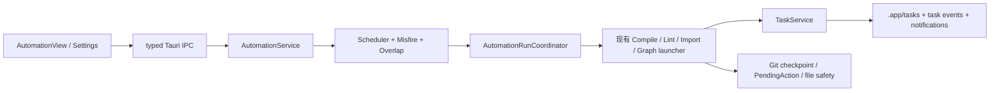

# LLM Wiki Desktop「自动化」调研报告与实现方案

> 日期：2026-07-20
> 状态：仅调研与方案设计，未修改应用源码
> 目标：让软件可以按计划执行 Wiki 编译、Lint、导入等操作，同时保持本地优先、文件可读、Git 可恢复和任务状态可追踪。

## 1. 执行摘要

建议把“自动化”定义为：**持久化的计划（Automation）+ 可重入的运行记录（Run）+ 现有后台任务（Task）的调度入口**，而不是另起一套工作流引擎。

第一阶段应聚焦个人知识库最有价值、最容易保证安全的场景：

1. 项目级创建、编辑、暂停、恢复、立即运行和删除自动化计划。
2. 支持 `interval` 和 `cron + IANA 时区` 两种定时方式，并在保存前展示未来几次运行时间。
3. 复用现有 `TaskService`、任务事件、日志抽屉、取消、通知和 Git 安全边界。
4. 默认采用“同一自动化不并行”和“错过的计划不自动补跑”，避免电脑休眠或应用重启后突然堆积编译任务。
5. 定时 Lint 默认只运行确定性的本地扫描；深度 Lint 可以后台运行但不能自动修复。
6. 定时编译必须在运行前创建 Git 检查点；遇到外部编辑冲突、缺少能力或需要登录时进入 `waiting_for_confirmation`，通知用户处理，不能模拟用户确认。
7. 定时导入第一阶段只允许“用户明确选择过的目录/文件模式”，并采用追加、跳过重复、保留原始来源的策略；不允许静默替换或删除 `raw/sources/` 原件。

这一路线与当前项目架构一致：React 只负责配置和展示，Rust 后端负责调度、路径校验、任务启动、文件操作、Git 和凭据边界；项目内容仍然只使用 Markdown、JSON 和本地文件，不引入数据库。

## 2. 调研范围与当前项目上下文

本报告首先按项目内的 `skills/llm-wiki-desktop-context/SKILL.md` 建立上下文，并核对了以下项目规范：

- `AGENTS.md`
- `SPEC/SPEC.md`，特别是第 16 节当前实现对齐记录
- `SPEC/APP_flow.md`
- `SPEC/TECH_STACK.md`
- `SPEC/BACKEND_STRUCTURE.md`
- 当前 `src-tauri/src/tasks/`、任务 command、编译/Lint/Import command 与前端 `taskStore`

为了避免把现状和设计目标混在一起，以下分成“已验证现状”和“本报告新增方案”。源码路径是当前仓库中的验证入口，不代表自动化已经实现。

已验证的可复用基础：

- `src-tauri/src/tasks/task_service.rs` 的 `TaskService` 统一管理任务创建、状态转换、取消、进度、日志、活动事件和任务快照持久化；`src/stores/taskStore.ts` 负责前端事件/快照合并。
- 当前 Task 状态覆盖 `queued`、`running`、`waiting_for_confirmation`、`cancelling`、`cancelled`、`succeeded`、`failed`。重启时，Task 快照恢复是恢复历史和可见性；当前实现会把未终态任务按 `TASK_RECOVERY` 收敛为失败，不会自动继续执行，也不能模拟用户确认。
- `src-tauri/src/commands/compile_commands.rs` 已有编译后台任务、Git checkpoint、PendingAction 和外部编辑冲突保护。
- `src-tauri/src/commands/lint_commands.rs` 的 `run_local_lint` 当前是同步 command，不创建 Task；深度 Lint 才进入后台任务。因此自动化不能假设 Local Lint 已经属于 TaskService。
- Import V2 已有批次、子任务、取消、恢复和扫描证据；`start_add_import_paths_v2` 与 `confirm_import_session_v2` 是分开的流程，后者由用户确认后重新启动导入，不是 scheduler 可以直接推进的既有等待任务。
- Git checkpoint、PendingAction、冲突 Diff、任务日志抽屉和系统通知已经是现有安全/可观测性的一部分。

本报告新增的目标方案：

- 新增持久化的计划定义、版本号和单次 Run 记录。
- 新增计划触发时间、时区、错过运行和重叠运行的明确语义。
- 新增计划—Run—Task 的稳定关联、启动 reconcile 和跨文件幂等协议。
- 第一阶段把自动化 Local Lint 设计为新的 `LocalLint` TaskType，使自动运行也进入统一任务抽屉；这不是当前已有的 TaskType，实际编码时需要单独评审 DTO/迁移影响。
- 第一阶段只把 Import 作为“发现/预览”自动化；真正 Import Commit 仍由用户确认流程完成，不由 scheduler 模拟确认。
- 对定时编译、定时导入等高风险操作新增明确的“候选生成 / 用户确认 / 应用写入”边界。

目前缺少的不是“执行长任务”的能力，而是以下一层：

- 持久化的计划定义与版本号。
- 计划触发时间、时区、错过运行和重叠运行的明确语义。
- 计划与单次运行、单次运行与后台 Task 的稳定关联。
- 应用重启、休眠、项目切换、计划编辑期间的幂等和恢复。
- 对定时编译、定时导入等高风险操作的自动化安全策略。

详细的当前约束见 [SPEC/SPEC.md](../SPEC/SPEC.md)、[APP_flow.md](../SPEC/APP_flow.md)、[TECH_STACK.md](../SPEC/TECH_STACK.md) 和 [BACKEND_STRUCTURE.md](../SPEC/BACKEND_STRUCTURE.md)。

## 3. 开源项目最佳实践调研

### 3.1 Open Design：自动化模板、计划例程与自演化闭环

Open Design 是本次最接近产品形态的参考项目。其 README 将 Automation 描述为“把重复的设计工作编排为可复用、可调度的自动化”；0.7.0 版本加入了无人值守的 scheduled routines；后续变更又强调了 schedule picker、自然语言摘要、最新运行优先、创建后自动聚焦、本地化和 duplicate-slot cleanup。

更值得借鉴的是它的自动化自演化方案，而不是具体 UI：

- `AutomationTemplate` 是类型化配方，不只是 prompt；包含触发类型、来源类型、阶段、输出、审核策略和压缩策略。
- 不同来源先归一化为 canonical content packet，保留来源引用、采集时间、敏感级别、附件和 token 统计。
- 生成记忆、Skill、Design System 或新的 Automation 时先产生 proposal，再经过用户或策略审核。
- 自动化运行结果带 provenance，后续可以追溯“哪个来源、哪个运行、哪个提案”造成了变化。
- UI 与 CLI 共享同一 daemon/API 契约，不维护两套业务实现。
- 自动化、插件、Skill、Design System 都是可读、可版本化的文件/目录，而不是隐藏在不可导出的状态里。

对 LLM Wiki Desktop 的直接启发：

1. 计划定义应当是结构化 JSON，不能让前端拼接自由字符串协议。
2. “定时触发”和“执行动作”应分离，未来可以在同一计划模型上增加“导入完成后”“文件变化后”等事件触发器。
3. 任何自动生成/写入都要留下 provenance，并把审核门作为一等状态。
4. 不应照搬 Open Design 的所有自演化能力。记忆树、Skill 晶化、连接器、插件市场属于后续扩展，不应让第一阶段变成通用 Agent 平台。
5. Open Design 的 SQLite 是其 daemon 自身的实现选择；本项目已经明确要求知识库以 Markdown + JSON + 本地文件为事实来源，因此本项目仍应使用 `.app/automations/`、`.app/automation-runs/` 等文件状态。

本节事实核对日期为 2026-07-20；README、当前自演化规格和 Changelog 使用 `main` 的可变链接，历史版本结论只作为当时的产品演进证据，不应当被当作稳定 API。进入实现阶段前，应为采用的 Open Design 结论固定 commit/tag，并在 ADR 中记录版本和章节。

参考资料：[Open Design README](https://github.com/nexu-io/open-design)、[Open Design 0.7.0/0.9.0 Changelog](https://raw.githubusercontent.com/nexu-io/open-design/main/CHANGELOG.md)、[Automations Self-Evolution Plan](https://raw.githubusercontent.com/nexu-io/open-design/main/specs/current/automation-self-evolution.md)。

### 3.2 Temporal：计划身份、重叠策略、错过运行与 Backfill

Temporal 把 Schedule 设计成独立于 Workflow Execution 的对象。一个计划有稳定的 Schedule ID，每次触发产生独立运行；计划本身可以暂停、恢复、手动触发和 backfill。

它提供了非常清晰的重叠策略：`Skip`、`BufferOne`、`BufferAll`、`CancelOther`、`TerminateOther` 和 `AllowAll`。同时提供 catch-up window、pause-on-failure、jitter、时区和时间边界等控制。

对本项目的启发：

- `automationId` 不应等于某一次 `taskId`；计划、运行、任务必须是三层身份。
- 默认 `Skip` 最适合 Wiki 编译和 Lint，因为这些操作通常应该基于最新 Wiki 状态，而不是排队执行一批过时快照。
- 导入可以提供 `RunLatest` 或有限的 `BufferOne`，但不应默认 `BufferAll`。
- “错过的运行”必须是显式策略，而不是 scheduler 重启后的隐式行为。
- “暂停计划”只阻止未来触发，不应取消已经开始的 Task。
- Backfill 可以作为后续高级能力，但必须由用户指定时间范围、数量上限和重叠策略。

参考资料：[Temporal Schedule](https://docs.temporal.io/schedule)、[Temporal Go SDK Schedules](https://docs.temporal.io/develop/go/workflows/schedules)。

### 3.3 Apache Airflow：Timetable、Data Interval、Catchup 与并发上限

Airflow 将“什么时候触发”和“这次运行处理哪个时间区间”区分开：Timetable 负责下一次运行和 logical date/data interval。它区分 Cron Trigger 与 Cron Data Interval，也明确 `catchup` 是否补齐暂停期间的历史运行，并通过 `max_active_runs` 控制一个 DAG 的并发运行数。

对本项目的启发：

- 计划不能只保存一个“下次时间”；必须保存 `lastScheduledFor`、`nextScheduledFor` 和错过处理所需的时间基准。
- 对“每天编译昨天新增内容”这类场景，后续可以把 `dataWindow` 作为动作输入，而不是仅把当前时间传进去。
- `catchup` 默认关闭更适合本地个人应用，避免用户几天没打开应用后突然执行几十次。
- 计划并发上限和全局资源上限需要分开：单个 automation 只允许一个运行，全局 Agent/LLM 资源也需要有限并发。
- scheduler 只负责决定“应该创建哪些 run”，worker/TaskService 负责真正执行。

参考资料：[Airflow Timetables](https://airflow.apache.org/docs/apache-airflow/stable/authoring-and-scheduling/timetable.html)、[Airflow Scheduler](https://airflow.apache.org/docs/apache-airflow/stable/administration-and-deployment/scheduler.html)、[Airflow Backfill](https://airflow.apache.org/docs/apache-airflow/stable/core-concepts/backfill.html)。

### 3.4 Prefect：Cron、Interval、RRule、暂停与 Worker 分离

Prefect 支持 Cron、Interval 和 RRule 三种 schedule，并允许为每个 schedule 指定 IANA 时区；它还明确区分“schedule 生成 flow run”和“worker 执行 flow run”。计划可以 inactive，运行状态可以表现为 Scheduled、Late、AwaitingConcurrencySlot、Retrying、Paused、Crashed 等。

对本项目的启发：

- 第一阶段用 `cron` 和 `interval` 即可，RRule 留到用户确实需要“每月最后一个工作日”等复杂日历规则时再加入。
- “计划已到时间但没有资源/worker”应有 `late` 或 `blocked` 语义，不要伪装成 running。
- 暂停计划、暂停单次运行和取消单次运行是三种不同动作。
- 资源槽位、优先级和并发上限应该可观测，至少在任务详情中告诉用户为什么没有立即运行。

参考资料：[Prefect Schedules](https://docs.prefect.io/v3/concepts/schedules)、[Prefect States](https://docs.prefect.io/v3/concepts/states)、[Prefect Work Pools](https://docs.prefect.io/v3/concepts/work-pools)。

### 3.5 n8n：激活/发布、时区、执行历史与 FIFO 限流

n8n 的 Schedule Trigger 有几个很实用的产品经验：使用 Schedule Trigger 的 workflow 必须保存并发布才会生效；schedule 使用 workflow timezone，否则使用 instance timezone；可以配置秒、分钟、小时、天、周、月或 Cron；执行历史支持按状态筛选以及按原 workflow/当前 workflow 重试。

n8n 的 self-hosted concurrency control 会把超出并发上限的 production execution 放入 FIFO 队列，启动时恢复排队执行；同时明确说明 queued execution 不能直接 retry，取消 queued execution 会将其移出队列。

对本项目的启发：

- “保存计划”和“启用计划”必须是两个状态，避免用户刚编辑草稿就开始执行。
- 时区必须是计划级可见配置，不能默默使用操作系统时区。
- 运行历史需要支持按 automation、状态、时间范围筛选，并能明确重试的是原计划版本还是当前版本。
- 如果一个计划的配置发生变化，已有运行应继续使用其启动时的 `definitionRevision`；新运行才使用新版本。
- 运行队列有上限时必须向用户显示，而不是无限增加内存任务。

参考资料：[n8n Schedule Trigger](https://docs.n8n.io/integrations/builtin/core-nodes/n8n-nodes-base.scheduletrigger/)、[n8n Executions](https://docs.n8n.io/workflows/executions/all-executions/)、[n8n Concurrency Control](https://docs.n8n.io/hosting/scaling/concurrency-control/)。

### 3.6 GitHub Actions：多触发器、手动运行与现实中的调度延迟

GitHub Actions 将 workflow 定义放在仓库文件里，同时支持事件触发、手动 `workflow_dispatch` 和 schedule；schedule 默认以 UTC 解释，也可使用 IANA timezone。它还提供 concurrency group 来阻止相同资源的并发运行。

官方文档同时提醒：scheduled workflow 在高负载时可能延迟，甚至丢失排队的运行；scheduled workflow 只从默认分支生效。这说明任何本地 scheduler 也不应承诺严格的 exactly-once 或绝对准点，应记录计划时间和实际启动时间，并把延迟/跳过原因展示出来。

对本项目的启发：

- 所有计划都要提供“立即运行”作为人工补救路径。
- 每次运行记录 `scheduledFor` 与 `startedAt`，让用户区分“计划时间”和“实际执行时间”。
- 计划冲突应以稳定的资源 key 控制，例如 `projectId + actionKind + targetScope`，而不是仅依赖 UI 按钮是否 disabled。

参考资料：[GitHub workflow events](https://docs.github.com/en/actions/reference/workflows-and-actions/events-that-trigger-workflows)、[GitHub concurrency](https://docs.github.com/en/actions/concepts/workflows-and-actions/concurrency)、[GitHub scheduled event limitations](https://docs.github.com/en/actions/how-tos/troubleshoot-workflows)。

### 3.7 Tauri：开机恢复与系统通知是运行时能力，不是计划模型

Tauri v2 官方提供跨 Windows、macOS、Linux 的 autostart plugin，用于系统启动时自动启动应用；notification plugin 用于发送系统通知。它们可以支撑“后台模式 + 重启恢复”和“任务完成/失败/等待用户处理”的用户体验，但它们本身不负责 cron 计算、运行去重、错过策略或任务编排。

对本项目的建议是：先把调度模型和 Rust service 做正确，再用 Tauri autostart 让应用在用户明确开启后台自动化后启动；不要把每一条计划直接注册成三个平台各自不同的系统任务，避免出现应用内配置与系统任务漂移。

参考资料：[Tauri Autostart](https://v2.tauri.app/plugin/autostart/)、[Tauri Notifications](https://v2.tauri.app/plugin/notification/)。

## 4. 综合出的最佳实践清单

| 主题 | 建议 | 本项目默认值 |
|---|---|---|
| 身份 | 计划、运行、Task 三层 ID 分离 | `automationId` / `runId` / `taskId` |
| 时间 | 计划级 IANA 时区，内部保存 UTC 时间戳 | `Asia/Shanghai` 或用户明确选择的时区 |
| 表达式 | 先支持 interval + 5-field cron；展示未来运行预览 | 不支持自由脚本表达式 |
| 启用 | Draft、Enabled、Paused、Disabled、Invalid 分离 | 新建为 Draft，用户显式启用 |
| 错过运行 | 明确 misfire policy | Local/Deep Lint/Compile=`skip`；Import Discovery=`run_latest`；Import Commit=`skip`，必须用户确认 |
| 重叠运行 | 计划级 overlap policy | 默认 `skip`，可选 `buffer_one` |
| 并发 | 单计划、项目、全局资源三层限制 | 单计划 1；全局 Agent/LLM 受资源槽位限制 |
| 失败 | 有限重试 + 指数退避 + 可选失败后暂停 | 默认 1 次，不重试高风险写入 |
| 冲突 | 高风险操作返回 PendingAction | `pause_and_notify`，不自动确认 |
| 恢复 | 区分 Task 历史恢复、Run reconcile 和动作重跑 | in-flight Task 默认收敛为 `interrupted`/`TASK_RECOVERY`；只对确定幂等的 Local Lint 重跑 |
| 幂等 | 运行 key + 输入 fingerprint + operation lock | 至少一次触发、幂等执行 |
| 审计 | 记录版本、来源、checkpoint、affected paths、摘要 | 不记录密钥和原始 Agent 输出 |
| 人工补救 | 立即运行、暂停、取消、重试、查看日志 | 全部在计划详情和任务抽屉可用 |
| 外部能力 | 只使用已配置 Agent/BYOK/连接器 | 未配置时进入可解释的 blocked/waiting |
| 存储 | 可读、原子写入、可迁移的 JSON | 不引入用户知识库数据库 |

### 4.1 第一阶段必须冻结的时间契约

- `interval` 以用户点击 Enable 的时间作为 anchor，按固定 elapsed duration 计算；修改 interval 或暂停后重新启用会生成新的 `scheduleRevision`，不沿用旧 anchor。
- `cron` 第一阶段使用明确声明的 5-field 方言（分钟、小时、日、月、星期），不接受 shell 片段、秒字段或未验证的扩展语法；表单和未来运行预览显示计划时区与本地时间。
- IANA timezone 只作为计划解释规则保存，持久化的 `scheduledFor`/`startedAt` 仍使用 UTC RFC3339；未来预览同时显示 offset，避免 DST 时用户看到两个相同的本地钟点却无法区分。
- DST gap（不存在的本地时间）默认跳过该 slot；DST fold（重复的本地时间）默认只执行一次，选择第一次有效 offset，并在 Run 中记录解析结果。若后续开放“执行两次”，必须成为显式策略。
- tzdb 更新后，新的 slot 使用运行时最新 tzdb；已持久化的 `scheduledFor` 不回算。计划详情显示“按当前时区规则计算”，必要时提示规则变化。
- `skip`：错过 slot 直接产生 `skipped` 记录；`run_latest`：只保留 misfire 窗口内最新 slot，Run 的 `scheduledFor` 仍是那个原始 slot；`buffer_one`：最多保留一个待运行 slot；三者都不无限 catch-up。

这组契约是本项目方案选择，不是把 Temporal/Airflow/Prefect 的所有语义原样搬入；实现前应在 Phase 0 用时间推进模拟器和 DST 属性测试固定下来。

## 5. 面向当前项目的目标架构

### 5.1 分层关系



推荐的职责如下：

- `AutomationService`：计划 CRUD、schema version、校验、未来运行预览、启用/暂停、计划 revision。
- `ScheduleCalculator`：计算下一次时间、时区/DST、interval/cron、start/end 边界；不负责执行。
- `AutomationScheduler`：后台 tick、启动恢复、系统唤醒后的 reconcile、错过策略、触发去重。
- `AutomationRunCoordinator`：创建 run、应用 overlap/concurrency、生成 idempotency key、调用动作执行器、更新 run 状态。
- `AutomationActionExecutor`：把 typed action 映射到现有编译、Lint、Import、Graph 服务；不得通过“再调用 Tauri command”实现内部编排。
- `TaskService`：仍是唯一的后台任务事实来源，负责进度、日志、取消、事件和任务持久化。
- `AutomationRunStore`：保存运行摘要和审计关联，不复制完整日志；完整日志继续由 `.app/tasks/` 管理。
- React：只编辑/展示计划和运行状态，不执行文件、Git、Agent 或凭据操作。

### 5.2 建议的文件状态

计划定义使用项目内 JSON：

```text
project-root/
└── .app/
    ├── automations/
    │   ├── manifest.json              # schemaVersion + 计划摘要/索引
    │   └── <automation-id>.json       # 单个计划的完整定义
    ├── automation-runs/
    │   └── <run-id>.json              # 单次运行摘要、结果和审计关联
    └── tasks/
        └── <task-id>.json             # 现有 TaskService 快照、日志、活动
```

建议 `manifest.json` 只保存摘要、ID 和索引字段；单个计划文件才是完整定义的唯一事实源，避免两份 schedule/action/policy 漂移。

`manifest.json` 示例：

```json
{
  "schemaVersion": 1,
  "automations": [
    {
      "id": "lint-weekdays",
      "name": "工作日 Wiki 健康检查",
      "revision": 1,
      "state": "enabled",
      "timezone": "Asia/Shanghai",
      "actionKind": "local_lint",
      "nextScheduledFor": "2026-07-20T19:17:00Z",
      "updatedAt": "2026-07-20T00:00:00Z"
    }
  ]
}
```

`<automation-id>.json` 才保存完整的 `schedule`、`misfirePolicy`、`overlapPolicy`、`action`、`retryPolicy`、`safetyPolicy` 和 `notifications`。manifest 更新和单计划更新应有明确顺序与 revision 校验；manifest 损坏时可由单计划文件重建，而不是让摘要覆盖完整定义。

注意：

- 计划文件只能保存 action 的结构化参数，不能保存 shell 命令、任意 Agent prompt、API key 或 token。
- 外部导入目录必须是用户在 UI 中明确选择并授权过的路径；每次运行仍需重新校验存在性、读取权限和是否仍在允许范围内。
- `rootPath` 不应被前端当作授权依据；沿用现有 `projectId + canonical root` 项目上下文校验。
- JSON 写入必须原子化，更新计划时增加 `revision`，读取旧 schema 时走显式迁移；manifest 只作索引，不承担第二份完整定义。
- 运行记录不应重复写入完整 Agent 输出、源文件内容、凭据或结构化 stderr；只保留安全摘要、错误码、affected paths 和任务引用。

建议的 run 摘要：

```json
{
  "schemaVersion": 1,
  "runId": "run-uuid",
  "automationId": "lint-weekdays",
  "definitionRevision": 1,
  "trigger": "schedule",
  "scheduledFor": "2026-07-20T19:17:00Z",
  "status": "succeeded",
  "taskIds": ["task-uuid"],
  "startedAt": "2026-07-20T19:17:02Z",
  "completedAt": "2026-07-20T19:17:08Z",
  "checkpointHash": null,
  "affectedPaths": [".app/lint/report.json"],
  "summary": "No blocking lint issues",
  "skipReason": null
}
```

### 5.3 Task 与 Run 的关联

有两种可行方式：

1. 只在 `automation-runs/<run-id>.json` 保存 `taskIds`。
2. 给现有 `BackendTask` 增加可选的 `automationId`、`automationRunId`、`scheduledFor` 和 `triggerKind` 字段。

建议采用“**运行记录为权威关联，Task 增加可选展示字段**”：

- `RunStore` 负责完整审计和恢复。
- `BackendTask` 的可选字段让任务抽屉可以直接显示“来自哪个自动化”，并保持向后兼容。
- 旧的 `.app/tasks/*.json` 缺少这些字段时按 `None` 读取，不需要迁移所有历史任务。
- 前端不再为自动化单独创建第二套 loading/logging store。

对 Local Lint 做一个明确取舍：第一阶段新增 `LocalLint` TaskType，仍由 `TaskService` 负责取消、日志、进度和事件；它不会修改用户 Wiki，但允许写入现有的 Lint report/history。这样自动化 Lint 与任务抽屉可以统一跳转，也不需要保留“专用 run 但没有 Task”的第二条展示路径。

Automation Run 使用独立状态机，不直接复用 `TaskStatus`：

```text
queued → dispatching → running → succeeded
                         ├────→ waiting
                         ├────→ blocked
                         ├────→ failed
                         └────→ cancelled
queued/dispatching/running ─────→ interrupted
scheduled slot ──────────────────→ skipped
```

其中 `waiting`、`blocked`、`interrupted`、`skipped` 是 Run 语义；底层 Task 仍只使用当前 Task 状态。`waiting` 表示已到用户确认边界但不能自动确认，`blocked` 表示尚未启动动作，`interrupted` 表示进程/任务恢复边界不确定，不能直接当作成功或安全重跑，`skipped` 必须持久化 skip reason。`Retry now` 创建新的 Run，`Run with current definition` 使用当前 revision 创建新的 Run，不能复用旧 Run 或隐式改写其定义。

### 5.4 调度 tick 与恢复算法

建议在 Rust 后端维护一个可取消的 scheduler loop；不要在 React 中使用 `setInterval`，也不要把“应用页面是否挂载”当作调度条件。

第一阶段的生命周期边界必须先固定：scheduler 只为当前进程已注册/已打开的项目工作，并把显式 `projectId` 和 canonical root 传入 service，不读取 ambient active project。关闭主窗口但保留托盘进程时可以继续调度；应用进程完全退出后不承诺继续运行，完整的已注册项目开机恢复属于 Phase 4。

每次 tick 或启动/唤醒时：

1. 读取并校验当前项目的 enabled automation；无效计划标记为 `invalid`，显示具体原因。
2. 根据计划的 IANA timezone 计算所有到期 slot。
3. 对每个 slot 使用 `(automationId, scheduledFor, definitionRevision)` 作为幂等 key，并在持久化 index 中唯一化；同时获取 automation lock 和项目/动作资源锁。
4. 检查该 automation 是否有非终态 run：按照 `skip`、`buffer_one` 或允许并行的策略处理；项目级和全局资源队列有明确上限。
5. 根据 misfire policy 处理错过的时间点，生成 0、1 或有限个 run；不无限补跑。被跳过的 slot 也写入 `skipped` Run，保留 `scheduledFor` 与原因。
6. 先原子写入 `run=dispatching` 和幂等记录，再创建带 `automationId`/`automationRunId` 的 Task；两者不是跨文件事务，因此必须有 reconcile 规则。Task 创建成功后才把 Run 推进到 `queued`/`running`。
7. 若在第 6 步任一边界崩溃，启动时将“无 Task 的 dispatching Run”标记为 `interrupted` 并按动作策略决定是否可重试；将“有 Run ID 但 Run 未关联”的 Task 重新挂回 Run。不能仅凭 JSON 原子写入声称跨文件 exactly-once。
8. 由 `AutomationActionExecutor` 启动既有领域 service/use-case，而不是调用另一个 Tauri command；任务事件是 UI 的实时反馈，run JSON 是重启后的恢复依据。
9. 任务到达终态或 waiting 后同步 run 摘要、checkpoint、affected paths 和安全结果。

启动恢复要明确遵循当前 TaskService 的边界：历史 Task 快照可以恢复可见性，但 `TASK_RECOVERY` 的 in-flight Task 不自动继续；Compile/Import 的副作用不确定时进入 `interrupted`/人工复核，不能盲目重跑；只有输入和写入都确定幂等的 Local Lint 才可以按策略重跑；等待确认不能因重启自动确认。

错误处理要区分：

- `skipped`：策略明确跳过，如重叠或过期。
- `blocked`：能力/权限/Agent/BYOK 不可用，未执行动作。
- `waiting`：动作已经运行到需要用户确认的边界。
- `failed`：已执行但发生错误。
- `cancelled`：用户或关闭策略取消。

调度语义应承诺“**至少一次触发、尽可能幂等**”，不能承诺分布式系统意义上的 exactly-once。对于编译和导入，要在服务层以输入 hash、基线 hash、run key 和项目锁避免重复写入。

## 6. 各动作的实现策略

### 6.1 自动化 Compile

适合的初始能力：按日/周重新编译已有 `raw/extracted/`，生成或更新 Wiki。

运行边界：

- 启动前检查项目上下文、Git 状态、Agent/BYOK 路由和 extracted Markdown 是否可读。
- 运行前创建 checkpoint，并在 run 中记录 checkpoint hash；checkpoint 是恢复保护，不等于允许自动应用候选结果。
- 复用现有 compile manifest、基线快照和外部编辑冲突检查。
- 默认只生成并校验候选 manifest。将候选写入 Wiki、解决冲突和 Git commit 必须分别作为显式用户确认边界；计划配置中的 `allowHighRiskAutoApply=false` 不能被 scheduler 绕过，也不应被解释成已获得每次 Agent diff 的确认。
- 用户确认应用后再刷新 Wiki 搜索/图谱/状态；“候选生成成功”和“Wiki 已更新”必须是不同的结果摘要。
- 有冲突时保持已有安全状态，run/task 进入 waiting，通知用户打开 Diff；不得由 scheduler 自动选择“使用生成版本”。
- Agent 生成空结果、能力不足或当前项目已发生变化时失败并保留错误日志，不能把旧 Wiki 替换成空壳。

默认策略：

- overlap：`skip`
- misfire：`skip`，用户可从历史中手动 Backfill 一个时间点
- retry：默认不自动重试写入型 Compile；只允许对明确的网络/Provider 暂时性错误做一次有限重试
- high-risk auto-apply：`false`；第一阶段不自动应用 Agent 生成的 Wiki diff、不自动解决冲突、不自动 Git commit。

### 6.2 自动化 Lint

分成两类，不要把它们混成一个“Lint”开关：

1. **Local Lint**：死链、孤立页、frontmatter、索引一致性、资源缺失等确定性检查。不会修改用户 Wiki，不创建 checkpoint；运行结果可以写入已有 Lint 报告/历史，并在第一阶段关联新的 `LocalLint` Task。
2. **Deep Lint**：需要 Agent/BYOK 的深度分析。仍然只生成报告，不自动修复；必须复用现有 prompt snapshot、取消、超时、输出脱敏和项目作用域守卫。

若未来支持定时 Auto-fix，应单独建 action kind 和高风险策略，默认关闭，且必须：

- 先创建 scoped checkpoint。
- 使用扫描 hash 作为写入前提。
- 发现外部变化时 fail closed，不回滚用户外部修改。
- 结果包含 affected paths、checkpoint 和可审查 diff。

### 6.3 自动化 Import

Import 是风险最高、状态最复杂的动作，建议分两步交付。

#### Phase 1：定时发现 + 可选预览

- 用户选择一个外部目录或项目内 incoming 目录。
- scheduler 运行文件发现，使用文件 fingerprint 去重。
- 新文件进入现有 Import V2 的 discovery/session/scan 证据，原文件保持不可变；这是 `ImportDiscovery`，不是 `ImportCommit`。
- 发现结果通过任务抽屉和通知提示用户确认，不自动处理登录、OCR 能力安装或未知 connector 权限。

#### Phase 2：受策略约束的无人值守导入

仅在用户明确打开“允许自动导入”后才执行：

- 只允许新增/追加，不允许替换或删除原始来源。
- 重复文件采用 skip 或确定性 rename，不能覆盖。
- 失败项目进入 retryable/failed，不阻塞后续无关文件。
- 预览质量、能力缺失、需要登录、需要 Agent/BYOK 同意时进入 waiting，不模拟用户确认。
- commit 前创建 scoped checkpoint；完成后生成可回溯的 import batch/run 记录。
- 可选地在导入后串接 Compile，但必须按 Compile 的高风险策略执行，而不是把两步合并成一个不可见的黑箱。

当前已有 `start_add_import_paths_v2`、Import V2 batch、任务绑定、取消和 `confirm_import_session_v2` 等能力；实现自动化时应抽取公共 service/use-case，不应让 scheduler 直接复用前端 command 的交互假设，也不能直接调用 `confirm_import_session_v2` 来模拟用户确认。建议把默认策略拆成：`ImportDiscovery` 可 `run_latest`，`ImportCommit` 默认 `skip`/`waiting_for_confirmation`，只有未来经过单独产品审批的受限模式才能无人值守写入。

### 6.4 可顺带支持的动作

在主功能稳定后，可以把以下动作作为同一模型的 typed action：

- Graph rebuild / cache refresh。
- HTML export / report export。
- “文件变化后运行本地 Lint”事件触发。
- “Import batch succeeded 后运行 Compile”事件触发。
- 已配置 connector 的定时拉取，但需要单独的凭据、网络和 SSRF/权限审查。

不建议第一阶段加入任意 shell command、任意 HTTP webhook、任意 Agent prompt 或可下载的第三方 workflow。它们会把本地知识库工具迅速变成高权限自动执行器，超出当前产品安全边界。

## 7. 用户界面方案

### 7.1 位置与整体风格

沿用项目已有 Codex-like shell：左侧导航、中央工作面、右侧上下文面板、底部状态栏。Automation 应是一个一等视图，但仍然采用密集的表格/列表/抽屉，不做可视化节点画布。

主列表列建议：

| 列 | 内容 |
|---|---|
| 状态 | Draft / Enabled / Paused / Invalid |
| 名称 | 计划标题 + action 类型 |
| 计划 | `Every 6 hours` / `Weekdays 03:17` + 时区 |
| 下次运行 | 本地化时间 + `in 2h` |
| 上次运行 | 状态、耗时、task/run 入口 |
| 策略 | overlap、misfire、是否允许 checkpoint |
| 操作 | Run now、Pause/Resume、Edit、History、More |

### 7.2 创建/编辑抽屉

创建流程建议是表单优先：


1. 选择 Action：Compile、Local Lint、Deep Lint、Import discovery、Import。
2. 配置 action 参数和范围。
3. 选择 Schedule：Interval 或 Cron；设置 timezone；实时展示未来 5 次运行。
4. 配置 Missed run 和 Overlap policy；用简单文案解释，不要求用户理解调度术语。
5. 配置 Retry、通知和安全策略。
6. 展示“会读什么、会写什么、是否创建 Git checkpoint、需要什么 Agent/BYOK、冲突时怎么办”。
7. 保存为 Draft；用户点击 Enable 后才进入调度器。

对于自然语言输入，可以参考 Open Design 的“先收集结构化 brief”思路，但不建议第一阶段让自然语言直接改变计划。若后续加入，应先解析为预览表单，用户确认后才保存。

### 7.3 运行详情

运行详情应该把 Run 和现有 Task 抽屉连起来，显示：

- Scheduled for、实际开始时间、延迟时长。
- Trigger：schedule、manual、project event 等。
- 使用的 automation revision。
- Task 状态、进度、结构化活动和安全日志。
- checkpoint hash、affected paths、结果摘要。
- waiting 的下一步：打开 Diff、登录、安装/授权能力、解决冲突。
- Retry now / Run with current definition / Open original run（两种重试语义要区分）。

成功/失败/等待通知点击后，应打开对应项目、运行详情或 Diff；通知正文不包含源文件内容、API key、Agent 原始 stderr 或完整 prompt。

### 7.4 生命周期与确认状态

- 项目未打开时，第一阶段不创建新 Run；计划列表仍可从已注册项目摘要中显示为“待项目打开后调度”。Phase 4 才评估已注册项目的 headless 调度。
- 关闭主窗口但保留托盘进程时，scheduler 可以继续工作；完全退出进程、注销、关机和系统休眠后的行为必须显示为“等待恢复/按 misfire 处理”，不能承诺后台已经执行。
- 删除或禁用计划只阻止未来 slot；已有 Run/Task 不被静默删除。用户要取消活动 Run 必须有独立的 Cancel 操作，并保留日志和审计记录。
- `waiting_for_confirmation` 必须在计划列表、状态栏和任务抽屉持续可见；重启后恢复为待处理提示，但不自动确认。确认 action 必须校验 automation revision、基线 hash 和路径范围，过期后只能重新预览。
- 相同 Run 的成功/失败/等待通知需要去重；提供项目级免打扰设置，但不能抑制待确认安全动作的应用内提示。通知、历史和日志都应使用脱敏后的相对路径。

## 8. 分阶段实施路线

### Phase 0：契约与模拟器

目标：先把可测试的调度语义定下来，不马上接所有动作。

- 定义 `AutomationDefinition`、`ScheduleSpec`、`AutomationRun`、`MisfirePolicy`、`OverlapPolicy`、`AutomationAction` DTO。
- 定义 schemaVersion、迁移策略和 `.app/automations/` / `.app/automation-runs/` 文件布局。
- 实现 schedule calculator 的 interval/cron、timezone/DST 和未来运行预览。
- 实现纯内存时间推进模拟器，测试 restart、sleep、DST、duplicate tick、revision 变化。
- 定义错误码、waiting/blocked/skipped 语义。

验收：不启动真实 Agent、不修改 Wiki，也能证明计划在每个时间点只产生正确数量的 run。

### Phase 1：后台计划 + Local Lint/Compile

- Rust `AutomationService` + `AutomationScheduler` + `AutomationRunStore`。
- typed Tauri commands：list/get/create/update/delete/enable/pause/run-now/cancel-run/list-runs。
- 复用 `TaskService`，让自动化 run 与 task 可互相跳转。
- 接入新的 `LocalLint` TaskType 和 Compile；Compile 保留 checkpoint、候选/确认、冲突等待和 Git commit 安全边界。
- Automation 页面、创建抽屉、运行详情、通知。
- 应用启动时恢复当前进程已打开/注册项目的计划摘要；应用关闭主窗口但保留 tray 进程时继续后台运行。明确不把进程完全退出后的执行作为 Phase 1 承诺。

验收：应用运行中能按时执行、关闭主窗口后仍可执行、重启后不会重复创建同一个 slot；恢复的 in-flight Task 不会被误标记为成功或自动继续；Compile 候选和冲突不会被自动应用。

### Phase 2：Deep Lint + 安全导入

- Deep Lint 接入 existing Agent/BYOK routes，保留深度扫描 snapshot、超时、取消和输出脱敏。
- Import discovery 定时扫描用户选择过的目录，保存 scan evidence 和 fingerprint。
- 提供“发现即提醒”和“允许自动导入”两个明确模式。
- 加入有限 retry、waiting capability、failed item 隔离和 run history filter。

验收：CJK/Unicode 路径、文件改动竞态、重复来源、外部编辑、权限失败、导入能力缺失均 fail closed 且可恢复。

### Phase 3：事件触发、队列与资源策略

- Import succeeded、Wiki changed、file changed 等项目事件触发器。
- 项目级/动作级/global Agent 资源槽位和优先级。
- `buffer_one`、`run_latest`、有限 backfill。
- 运行中定义 revision 固定，新 revision 只影响下一次运行。

验收：事件风暴不会无限创建任务；队列可见、可取消，且优先级和重叠策略可以通过测试证明。

### Phase 4：后台模式与 headless runner

- 使用 Tauri autostart plugin 提供用户可选的开机启动。
- 用 single-instance/进程锁保证同一项目不会有两个 scheduler 同时发起 run。
- 如用户确实需要应用完全退出后仍运行，再评估 Windows Task Scheduler、macOS launchd、Linux systemd user 的统一 headless runner；不要把平台原生任务当作业务事实来源。
- 为 headless runner 提供 JSON/CLI 入口，UI 和 headless 使用同一 AutomationService/RunCoordinator。

验收：关机/重启/休眠后的 misfire 行为可解释；所有运行仍回到项目 `.app/` 和任务事件中，不出现“系统任务已跑但应用内没有记录”。

## 9. 必须覆盖的测试矩阵

### 调度语义

- interval、cron、无效表达式、start/end 边界。
- Asia/Shanghai、UTC、DST 时区；夏令时跳过和重复时间点。
- tick 恰好落在边界、应用重启、睡眠后恢复、系统时钟回拨。
- skip、run_latest、buffer_one、有限 catch-up。
- 同一计划重复 tick、计划编辑、删除/暂停与已运行实例并发。
- interval anchor、5-field Cron 方言、DST gap/fold、tzdb 更新后的稳定性；对 Cron 解析做属性测试/模糊测试。

### 任务与项目安全

- 一个 automation 只启动一个 active run。
- 运行中取消、取消后不能被 late completion 覆盖为成功。
- 项目切换后旧项目任务继续可见，但不能写入当前项目的 UI drawer/navigation/toast。
- 任务创建响应与 terminal event 竞态、应用重启后的 task/run reconcile。
- Unicode/CJK 文件名、大小写路径、Windows/macOS/Linux 路径规范化。
- dispatching→Task 创建、Task 创建→Run 关联、checkpoint 写入、结果落盘等每个持久化边界的崩溃注入；多 scheduler/多进程竞争、文件锁和 manifest/run/task 不一致。
- 项目未打开、关闭主窗口、完全退出、注销、开机恢复、计划 revision 变化和 stale confirmation。

### Compile/Lint/Import

- Compile checkpoint 创建失败、Agent 不可用、BYOK 缺失、空 manifest、外部 Wiki 编辑、冲突等待。
- Local Lint 只读；Deep Lint 超时/取消/Provider 失败；自动修复默认关闭。
- Import 重复文件、权限错误、源目录消失、原文件 hash 变化、登录/能力等待、部分 item 失败。
- `raw/sources/` 替换/删除永远不会由计划静默执行。
- symlink/junction/reparse point、TOCTOU、网络盘、超大文件、文件数量/大小配额、恶意压缩包和不可信导入内容。

### 数据与隐私

- JSON 原子写入中断后仍能恢复上一个有效版本。
- 旧 schema 迁移、未知 action kind、无效 timezone、损坏 run 文件。
- `.app/automations/`、`.app/automation-runs/`、`.app/tasks/` 不出现 API key、token、完整 prompt、原始 Agent stderr 或源文件全文。
- 清理历史时不删除 active task、待确认 action 或仍被 run 引用的 checkpoint。
- 外部来源提示注入、Agent 网络/Token/费用预算、凭据仅引用 OS credential ID、通知与日志路径脱敏、权限撤销和登录失效。

## 10. 不建议的方案

- 在 React `useEffect` 里使用 `setInterval` 作为事实调度器；页面卸载、切页和窗口休眠会造成丢失或重复。
- 新建一套和 `TaskService` 平行的 automation loading/logging/cancellation 状态。
- scheduler 直接调用 Tauri command，形成 command-to-command 依赖；应复用 service/use-case。
- 第一阶段允许任意 shell、任意 URL webhook、任意 Agent prompt 或第三方 workflow 包。
- 把自动化配置写进 `purpose.md`、`schema.md` 或用户可读 Wiki 页面，导致知识内容和应用控制面混淆。
- 只保存 `nextRunAt`，不保存计划版本、最后计划时间、misfire 规则和运行历史。
- 把“已排队”显示成“执行中”，或把 waiting-for-confirmation 显示成 worker 仍在运行。
- 为了方便而引入 SQLite 保存项目自动化状态；这会偏离本项目的文件可读与 Git 可恢复约束。
- 以“exactly once”作为产品承诺；桌面应用、系统休眠和进程崩溃下只能通过幂等和审计把重复风险降到可控。

## 11. 最终建议

推荐的产品决策是：

> **先做“可解释的计划任务”，再做“可组合的自动化模板”；先保证每次运行安全可恢复，再扩大 Agent 和连接器能力。**

第一版最值得交付的三个预置模板：

1. **工作日 Wiki Local Lint**：只读、低风险、失败通知。
2. **每日 Wiki Compile**：checkpoint、冲突等待、成功后刷新索引/图谱。
3. **每日 Import Discovery**：发现新文件、生成预览/通知；无人值守导入作为显式 opt-in 的第二阶段能力。

这三个模板能验证完整的 scheduler、Run、Task、Git、通知、项目作用域和恢复链路，又不会把项目提前推向通用自动化平台。等它们的运行历史、错过策略、重叠策略和安全确认稳定后，再吸收 Open Design 的模板注册、来源 packet、proposal review 和 UI/CLI 双入口模式。

## 12. 参考资料

- [Open Design README](https://github.com/nexu-io/open-design)
- [Open Design Changelog](https://raw.githubusercontent.com/nexu-io/open-design/main/CHANGELOG.md)
- [Open Design Automations Self-Evolution Plan](https://raw.githubusercontent.com/nexu-io/open-design/main/specs/current/automation-self-evolution.md)
- [Temporal Schedule](https://docs.temporal.io/schedule)
- [Apache Airflow Timetables](https://airflow.apache.org/docs/apache-airflow/stable/authoring-and-scheduling/timetable.html)
- [Apache Airflow Scheduler](https://airflow.apache.org/docs/apache-airflow/stable/administration-and-deployment/scheduler.html)
- [Prefect Schedules](https://docs.prefect.io/v3/concepts/schedules)
- [Prefect States](https://docs.prefect.io/v3/concepts/states)
- [n8n Schedule Trigger](https://docs.n8n.io/integrations/builtin/core-nodes/n8n-nodes-base.scheduletrigger/)
- [n8n Concurrency Control](https://docs.n8n.io/hosting/scaling/concurrency-control/)
- [GitHub Actions workflow events](https://docs.github.com/en/actions/reference/workflows-and-actions/events-that-trigger-workflows)
- [GitHub Actions concurrency](https://docs.github.com/en/actions/concepts/workflows-and-actions/concurrency)
- [Tauri Autostart plugin](https://v2.tauri.app/plugin/autostart/)
- [Tauri Notification plugin](https://v2.tauri.app/plugin/notification/)
