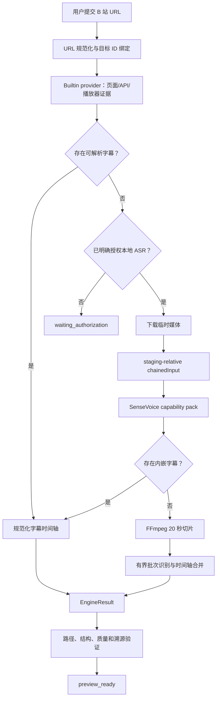

# B 站视频转 Markdown：从开源调研到运行时闭环的实现复盘

> 目标：记录本次 B 站视频导入从调研、架构设计、首次实现、连续排障到最终实机成功的完整方法，并把可复用经验整理成小红书视频/图文导入的实施指南。
>
> 对应提交：
>
> - `607a136 feat(import): complete open-source media ingestion`
> - `e77dc03 fix(import): make Bilibili long-video ASR reliable`
> - `5714059 fix(import): show Bilibili ASR progress`

## 1. 最终结果

现在的 B 站导入不是“下载视频后丢给一个脚本”，而是一条有安全边界、用户授权、进度、取消、验证和溯源的任务流水线：

1. 规范化 B 站 URL，并把来源绑定到准确的 BV/AV ID。
2. 从页面、公开 API 和播放器响应中提取标题、作者、简介、字幕候选、封面与媒体候选。
3. 优先使用平台人工字幕，其次使用平台自动字幕。
4. 没有可用字幕时，等待用户明确授权本地 ASR。
5. 下载临时媒体到当前 item 的 staging 目录。
6. 通过 staging 相对路径把媒体交给签名 capability pack。
7. FFmpeg 提取内嵌字幕；没有字幕时，把音频切成有界短片，再用 SenseVoice 分批识别。
8. 识别结果保存为带时间戳的结构化 JSON 和 Markdown 候选。
9. Rust 后端验证产物、质量和路径安全，最后进入 `preview_ready`。
10. 前端在同一任务上显示下载、准备、解码、逐段识别、合并和验证进度。

实机验证中，一个约 130 MB 的 B 站媒体成功完成下载并到达 `preview_ready`；其中本地 ASR attempt 约耗时 111 秒。

## 2. 从开源项目学到了什么

完整调研记录见 [import-v2-open-source-media-ingest-plan.md](./import-v2-open-source-media-ingest-plan.md)。本次真正复用的是数据流和边界思想，不是照搬应用外壳。

### 2.1 red-blue-cp

[red-blue-cp](https://github.com/MuChengZJU/red-blue-cp) 提供了清晰的端到端参考：

```text
fetcher → extractor → model → markdown → pipeline
```

最有价值的行为是：

- B 站先解析 BV/短链，再获取视频信息、CID、字幕和媒体地址。
- 有字幕就直接使用字幕，没有字幕才调用 ASR。
- 小红书不是把整页 HTML 当正文，而是从 `window.__INITIAL_STATE__` 中找到与目标 `noteId` 对应的对象。
- 小红书图文和视频走不同后处理：图文逐图处理，视频走媒体/ASR。
- Markdown 只消费结构化证据，不负责网络访问和模型调用。

本项目没有复制它的 FastAPI、Jinja、Typer 或数据库，而是把上述数据流映射到 Import V2：

```text
provider → PlatformDocument → MediaRouter → capability → EngineResult → validation
```

### 2.2 BiliNote

[BiliNote](https://github.com/JefferyHcool/BiliNote) 最有价值的参考是：

- 字幕优先，取不到字幕再下载媒体和 ASR。
- 转写结果可以缓存，不应每次都重新下载和识别。
- 长转写需要按时间片段分块，后续再合并。
- 截图、总结和 AI 笔记属于转写后的编译层，不应阻塞原始证据导入。
- 转写器可以注册多种 provider，但在本项目中应由签名 capability pack 注册，而不是把模型运行时直接编译进 Tauri。

没有照搬的部分：

- 不把 cookie 写入普通临时文件。
- 不把平台签名、浏览器登录状态或媒体临时签名暴露给 React。
- 不引入 SQLite 保存用户 Wiki 内容。
- 不让 LLM 生成结果冒充平台原始正文。

## 3. 最终架构



关键代码边界：

- 平台解析：[bilibili.rs](../src-tauri/src/services/import_v2/bilibili.rs)、[platform_provider.rs](../src-tauri/src/services/import_v2/platform_provider.rs)
- Web 导入与媒体下载：[generic_web_engine.rs](../src-tauri/src/services/import_v2/generic_web_engine.rs)
- URL、DNS、重定向和下载策略：[web_fetch.rs](../src-tauri/src/services/import_v2/web_fetch.rs)
- 路由、任务、授权与验证：[orchestrator.rs](../src-tauri/src/services/import_v2/orchestrator.rs)
- capability 进程协议：[engine.rs](../src-tauri/src/services/import_v2/engine.rs)、[pack_engine.rs](../src-tauri/src/services/import_v2/pack_engine.rs)
- SenseVoice runner：[index.mjs](../capabilities/asr-sensevoice-small/runner/index.mjs)、[core.mjs](../capabilities/asr-sensevoice-small/runner/core.mjs)
- 前端任务进度：[importTaskProgress.ts](../src/features/import/importTaskProgress.ts)、[ImportItemStatus.tsx](../src/features/import/ImportItemStatus.tsx)

## 4. 从头到尾的实现顺序

### 4.1 先定义“导入成功”是什么

不能把“拿到页面标题”当成视频导入成功。对于视频来源，至少要区分：

- `metadata_ready`：拿到标题、作者、简介、封面。
- `transcript_ready`：拿到可解析、时间轴合理的字幕或 ASR 转写。
- `media_ready`：拿到可用于本地 ASR 的媒体；不代表它是可保存的完整原视频。
- `preview_ready`：候选 Markdown、结构化证据和质量事实均通过验证。

这一步很重要。早期实现容易在拿到 metadata 后继续生成 Markdown，看起来“导入完成”，实际没有视频正文。

### 4.2 把 metadata、字幕和媒体证据分开

B 站页面 metadata 与播放器证据经常来自不同响应：

- 页面或 `view` API 提供 BV/AV、标题、作者、简介、CID。
- 播放器响应提供 `subtitle_url`、渐进式媒体或 DASH 音视频轨道。

不能要求某一个 JSON 同时包含全部字段。正确做法是：

1. 先用目标 URL 中的 BV/AV 建立 source identity。
2. 只接受能绑定到该目标 ID/CID 的页面或 XHR 证据。
3. 合并目标对应的 metadata 与播放器证据。
4. 拒绝页面中的推荐视频、历史残留播放器数据和其他分 P。

这条经验对小红书尤其重要：必须先绑定目标 `noteId`，再读取 note 对象，不能在递归搜索时拿到推荐流里的第一条笔记。

### 4.3 字幕优先，ASR 是有条件的 continuation

媒体路由优先级是：

```text
平台人工字幕
  → 平台自动字幕
  → 媒体内嵌字幕
  → 用户授权后的本地 ASR
  → 用户明确接受的无转写预览
```

平台 connector 只返回候选，不直接启动模型。编排层负责：

- 判断字幕是否真的下载和解析成功。
- 判断本地 ASR capability 是否安装且完整。
- 等待用户对当前 item 明确授权。
- 生成 typed continuation，把临时媒体交给 `media.asr` 路由。

这样做避免把网络解析、权限和模型运行混在一个 connector 里。

### 4.4 临时媒体只能通过 staging 相对路径交接

Rust 负责验证真实路径是否位于当前项目和 staging 内；capability 协议传递的则是 staging 相对路径：

```text
.asr-input-<uuid>/input.mp4
```

而不是 Windows canonical path：

```text
\\?\D:\...\staging\.asr-input-...\input.mp4
```

相对路径通过 `chainedInput` 传给 ASR runner。Node 再相对于已验证的 staging 根解析，并重新检查：

- 不允许 `..` 逃逸。
- 不允许符号链接。
- 必须是支持的媒体扩展名。
- 最终 realpath 仍在 staging 内。

### 4.5 长视频必须在推理前切片

最初把整段 38:54 音频一次性交给 SenseVoice。模型进程退出码为零，但 ONNX 自注意力尝试申请约 24.2 GB 内存，最终返回空结果。

最终实现：

1. FFmpeg 转成 16 kHz、单声道 PCM。
2. 按 20 秒输出 `decoded-0000.wav`、`decoded-0001.wav`……
3. 限制最大媒体时长、切片数、解码总字节数和输出 token 数。
4. 按有界 batch 调用 SenseVoice。
5. 允许静音片段产生空结果。
6. 把每段 token 时间加回原始 `startMs`。
7. 合并成单调的全局时间轴和 Markdown。

这不仅是性能优化，而是内存安全和可预测性的必要条件。

### 4.6 进度必须从执行者一路传播到 Import item

最终进度链路是：

```text
SenseVoice runner
  → import.progress JSON-RPC notification
  → PackProcessEngine
  → EngineProgressReporter
  → TaskService.update_progress
  → task_updated event
  → freshness-checked task store
  → ImportItem.progress
  → ImportItemStatus progressbar
```

runner 上报的阶段包括：

- `asr.preparing`
- `asr.checking_subtitles`
- `asr.decoding`
- `asr.recognizing`
- `asr.finalizing`

下载器上报：

- `media.downloading`
- `downloaded_bytes`
- 可用时的 `total_bytes`

整个 item 只使用一套单调的 `0..100` 任务尺度：

| 阶段 | 范围 |
|---|---:|
| 检查与提取起点 | `0..5` |
| 媒体下载 | `5..20` |
| ASR | `20..90` |
| 结果验证 | `95` |
| 预览就绪 | `100` |

子引擎的 `0..100` 不能直接写入整个任务，否则会出现 `25% → 2% → 99% → 75%` 的视觉倒退。

### 4.7 下载和识别必须可取消

长任务不能只在循环开始时检查取消。最终下载层在这些等待点都周期检查取消：

- DNS 查询
- 等待 HTTP 响应头
- 等待响应体 chunk

进度 reporter 失败时不能调用代表“用户取消”的共享 token。否则真实的任务持久化错误会被 orchestrator 误判为用户取消。正确做法是：

- 用户取消：共享 task cancellation token。
- 内部 reporter/worker 故障：worker 私有 stop token。

### 4.8 安全策略必须覆盖初始 URL 和每一次重定向

平台媒体 URL 不能只在下载完成后检查最终 host。否则一个已允许的 CDN 可以先重定向到不可信 HTTP 地址，应用下载完 1 GB 后才拒绝。

最终规则：

- 平台资产要求 HTTPS。
- host 使用 exact suffix 边界匹配：

  ```text
  host == suffix || host.ends_with("." + suffix)
  ```

- `edge.mountaintoys.cn.evil.example` 不能匹配 `edge.mountaintoys.cn`。
- 非默认 HTTPS 端口可以存在。
- 每次重定向在 DNS 和请求发生前重新验证。
- 每一跳仍执行公共 DNS、私网地址和 redirect policy 检查。
- browser fallback 和 Rust 下载器必须共享同一逻辑含义。

## 5. 为什么一开始没用，后面才有用

本次问题不是一个点，而是多个独立边界按顺序暴露。前一个修好后，任务才有机会运行到下一个失败点。

| 顺序 | 表面症状 | 一开始的误判或不完整修复 | 第一性原因 | 最终修复 | 证明方式 |
|---:|---|---|---|---|---|
| 1 | `IMPORT_ASR_POLICY_BLOCKED` | 以为 ASR 权限或用户授权没有生效 | Rust 把 `\\?\` canonical path 交给 Node；Node 以普通盘符 staging 计算相对路径，合法文件被判定为越界 | Rust 保留 canonical containment 校验，但 capability 只接收 staging-relative `chainedInput` | 对安装后的真实 SenseVoice pack 运行 Windows 路径回归 |
| 2 | 授权后仍失败或返回空转写 | 以为模型/显卡不兼容 | 38:54 音频一次进入自注意力，尝试申请约 24.2 GB | 20 秒切片、有界 batch、时间轴重映射、静音片段容错 | 同一长视频得到 117 个时间片、13,617 字符 |
| 3 | UI 始终只显示“提取中” | 已给 ASR pack 增加 progress，且给 pack remote asset 下载加了字节进度 | 实际运行路由是 `builtin.web-bilibili`；它在 `GenericWebEngine` 下载媒体，回调仍是 `\|_\| {}`。修的是相邻路径，不是当前路径 | 从持久化 attempt 读取真实 `engineId`，在 builtin 下载边界接入 reporter，并在网络前先上报 `media.downloading` | 任务进度从 `5/100 Extracting source` 切换为下载和 ASR 阶段 |
| 4 | `IMPORT_WEB_MEDIA_HOST_UNSUPPORTED` | 以为 B 站媒体只来自 `bilivideo.com` | 播放器 API 实际返回 `https://<node>.edge.mountaintoys.cn:4483/...`，任务在下载前就被白名单拦截 | 加入精确 `edge.mountaintoys.cn` HTTPS 后缀；同步 builtin、browser、pack；每跳重定向重验 | 用真实 provider evidence 和 spoof/HTTP 单测验证 |
| 5 | 取消可能很久才结束 | 只在读到下一个 response chunk 后检查取消 | CDN 可以在 DNS、连接、响应头或两个 chunk 之间停住；媒体总超时长达 30 分钟 | 用固定短轮询包装 DNS、send 和 stream future，保留原 future 状态并检查取消 | pending header/body 测试在 1 秒内结束 |
| 6 | 偶发“进程没有结果” | 子进程退出就立即判断 stdout 已完成 | OS 可能先报告进程退出，stdout reader 稍后才投递最后一条 JSON-RPC | 退出后在有界期限内继续 drain 输出 channel | fast-exit/delayed-reader 回归测试 |
| 7 | 重试后进度倒退或继承旧值 | 直接把任意 `task_updated` payload 合并到 item | 乱序旧事件、不同 task ID、重启恢复和 item state 是不同时间线 | 先经过 task store freshness 判断；只合并 canonical task；绑定新 task 时允许 `null` 清空旧进度 | stale event、restart、queued retry 测试 |

最关键的教训是：

> “代码存在”不等于“运行时经过这段代码”。必须从实际 session 的 route、engine ID、task ID 和 staging 产物反推真实执行链。

## 6. 运行时证据比静态阅读更重要

本次真正定位问题依赖的是项目落盘事实：

```text
.app/import-sessions/<sessionId>/session.json
.app/import-sessions/<sessionId>/items/<itemId>.json
.app/import-sessions/<sessionId>/items/<itemId>/staging/
.app/import-sessions/<sessionId>/items/<itemId>/staging/source-evidence/
```

排障时应按顺序回答：

1. item 当前状态是什么？
2. 绑定的是哪个 task ID？
3. attempt 的 route 和 engine ID 是什么？
4. 失败发生在 `extract`、`media.asr` 还是 `validate`？
5. source evidence 中真实返回了哪些字幕、图片和媒体 URL？
6. staging 中是否已经出现媒体、切片或候选 Markdown？
7. task progress 是没有产生、没有持久化、没有发事件，还是前端没有合并？

例如：

- staging 已有 67 个 `decoded-*.wav`，说明下载和 FFmpeg 已完成，问题位于识别或进度传播。
- task 始终是 `5/100 Extracting source`，而媒体文件持续增长，说明下载器没有 reporter。
- 任务不到一秒就报 `IMPORT_WEB_MEDIA_HOST_UNSUPPORTED`，说明根本没有进入下载/ASR，继续调识别 UI 没有意义。

## 7. 那些重复的图片警告是什么

成功导入后出现多条：

```text
Platform image host was not in the verified allowlist.
```

实机 evidence 显示，图片实际来自 B 站自己的：

```text
http://i0.hdslb.com/...
http://i1.hdslb.com/...
http://i2.hdslb.com/...
```

问题不是 host 陌生，而是 URL 使用明文 HTTP；当前安全策略只允许 HTTPS。每跳过一张图片就记录一条相同 warning，因此看起来像同一个错误重复很多次。

这些 warning：

- 不影响视频正文和 ASR。
- 不代表导入失败。
- 表示对应图片没有被本地化。
- 暂时保留 HTTPS-only 策略，不应为了消除提示重新允许 HTTP。

更好的后续实现是：

1. 只对已证明支持 HTTPS 的精确 B 站图片 CDN，把 `http://` 规范化为 `https://`。
2. 升级后仍执行完整 DNS、重定向和 host 校验。
3. 把逐图重复 warning 聚合为“跳过 12 张非 HTTPS 图片”，并在详情里保留原因。
4. 将文案从 “host 不在白名单” 改为能区分 scheme、host、DNS 和 redirect。

## 8. 如何把方法迁移到小红书视频/图文

小红书已经有基础实现，但下面这套顺序适用于继续完善或在新对话中重新实现。

### 8.1 先明确与 B 站不同的地方

| 维度 | B 站 | 小红书 |
|---|---|---|
| 目标身份 | BV/AV、CID、分 P | `noteId`、短链解析后的 canonical URL |
| 主要内容 | 视频 | 图文或视频 |
| 页面风险 | 推荐视频、不同分 P 播放器数据 | 推荐流、用户主页、相邻笔记、登录/captcha shell |
| 资产模型 | 字幕、视频、DASH 音频、封面 | 有序图片列表、封面、master 视频、正文、标签 |
| 文本来源 | 字幕/ASR 为主 | 原始正文优先，图片 OCR/VLM 和视频 ASR 是补充证据 |
| 登录回退 | 部分视频/字幕可能需要 session | 页面结构和风控变化更频繁，browser fallback 更重要 |

### 8.2 小红书图文导入流水线

```text
短链/普通链接规范化
  → 提取并固定 noteId
  → 尝试公开页面的 INITIAL_STATE/SSR JSON
  → 必要时进入隔离 browser session
  → 先按 noteId 找目标对象
  → 再判断 captcha/login/removed/structure_changed
  → 提取原始正文、作者、时间、标签和有序 imageList
  → 对每张图片做 exact HTTPS/DNS/redirect 校验
  → 按 media_save_mode 保留或仅记录证据
  → 用户开启 OCR/VLM 时生成 typed continuation
  → 验证 Markdown、图片 manifest 和溯源
```

必须保持图片顺序和去重稳定。图片 OCR/VLM 的输出需要区分：

- `visible_text`：图片中实际可见文字。
- `description`：模型对画面的描述。
- `confidence`：识别置信度。
- `provenance`：OCR/VLM 引擎和版本。

这些内容不能冒充小红书原始正文。

### 8.3 小红书视频导入流水线

```text
目标 noteId 绑定
  → 判断 content_type == video
  → cover 与 playable media 分离
  → 原始正文先进入 Markdown
  → 平台字幕候选
  → 内嵌字幕
  → 用户授权的本地 ASR
  → 合并文字证据但保留 provenance
```

不能把视频封面当成可播放媒体，也不能因为拿到 cover 就认为视频导入完整。

### 8.4 小红书进度模型

图文和视频不应共用同一种子进度：

| 内容类型 | 建议进度 |
|---|---|
| 图文 | `5..60` 按已完成图片数；`60..90` 按 OCR/VLM 图片数 |
| 视频 | `5..20` 按下载字节；`20..90` 按字幕/ASR 进度 |
| 通用 | `95` 验证；`100` 预览就绪 |

无 `Content-Length` 时显示 indeterminate/pulse，但仍更新阶段文案。图片总数已知时应显示真实 `n / total`，不要伪造基于时间的百分比。

### 8.5 小红书资产安全

不要从 B 站实现中直接复制 host 表。应从真实小红书 evidence 建立独立策略：

- canonical 页面 host
- API/navigation host
- 图片 CDN 精确后缀
- 视频 CDN 精确后缀
- 是否只接受 HTTPS
- 每跳 redirect 是否仍属于同一平台资产集合

添加至少这些反例：

```text
trusted.xhscdn.com.evil.example
http://trusted.xhscdn.com/...
https://127.0.0.1/...
https://trusted-host/ → http://untrusted-host/
```

### 8.6 小红书错误分类

不要把所有问题都变成“导入失败”：

| 错误 | 意义 | 推荐 UI |
|---|---|---|
| `LOGIN_REQUIRED` | 需要登录或 session 过期 | 等待登录 |
| `CAPTCHA_REQUIRED` | 触发风控/验证 | 用户操作 |
| `CONTENT_REMOVED` | 目标已删除或不可见 | 终止，不重试 |
| `STRUCTURE_CHANGED` | 页面/API 结构漂移 | 可重试并记录 evidence |
| `MEDIA_HOST_UNSUPPORTED` | 真实媒体被资产策略拒绝 | 显示 host/scheme 分类 |
| `SUBTITLE_UNAVAILABLE` | 无字幕且未授权 ASR | 等待授权 |
| `OCR_UNAVAILABLE` | 图文需要 OCR 但 capability 不可用 | 等待能力安装或跳过 |

## 9. 小红书实现的推荐顺序

不要先写 UI，也不要先接 OCR/ASR。推荐顺序：

1. 写清楚 image note 和 video note 的成功条件。
2. 为短链和普通链接建立 canonical `noteId`。
3. 准备离线 fixtures：图文、视频、登录、captcha、删除、结构漂移、用户主页、推荐流混入。
4. 先实现纯解析函数，证明只返回目标 note。
5. 定义 `PlatformDocument` 中正文、图片、封面、视频、字幕的独立字段。
6. 接入 builtin public provider。
7. 接入 browser fallback，并保持与 builtin 相同的输出契约。
8. 实现独立的小红书 asset allowlist 和每跳 redirect policy。
9. 图文先完成图片本地化；视频先完成 playable media 本地化。
10. 再接 OCR/VLM 与 ASR typed continuation。
11. 在真实运行路由上接 reporter，不要只改 capability 或相邻下载器。
12. 最后接前端进度、取消、恢复和 retry 清理。
13. 用真实链接跑一次，并从 session/item/task/evidence 反向证明整条链路。

## 10. 必须覆盖的测试矩阵

### 10.1 解析与目标绑定

- 普通 note URL。
- 短链重定向。
- 用户主页不能误识别为笔记。
- 页面包含推荐笔记时只能选择目标 `noteId`。
- page metadata 与 XHR 媒体数据分离时可以合并。

### 10.2 图文

- 图片顺序稳定。
- 重复 URL 去重但不重排。
- 1 张、100 张和超过上限。
- 部分图片失败时仍能生成有说明的预览。
- 全部图片失败且没有正文时明确失败。
- extract-only 与 preserve-original 行为不同。
- OCR 未授权、已授权、capability 缺失和 OCR 部分失败。

### 10.3 视频

- cover 与 playable media 分离。
- 有平台字幕时不下载完整视频。
- 无字幕时进入授权等待。
- 授权后下载、ASR、验证在同一 task 上单调推进。
- 长视频切片与时间轴合并。
- 静音片段。
- 媒体无 `Content-Length`。
- CDN 非默认 HTTPS 端口。

### 10.4 安全与恢复

- host suffix spoof。
- HTTP downgrade。
- public host 重定向到私网。
- DNS 多地址中包含私网。
- 下载前、响应头等待、响应体等待和 ASR 中取消。
- app 重启后恢复任务和进度。
- 旧 `task_updated` 不能覆盖新任务。
- retry 绑定新 task 时清空旧进度。

### 10.5 端到端

单元测试不能完全替代真实任务测试。至少保留一条：

```text
xiaohongshu builtin/browser
  → image/video localization
  → EngineProgressReporter
  → TaskService
  → optional OCR/ASR continuation
  → validation
  → preview_ready
```

断言：

- route 和 engine ID 正确。
- 同一 task ID 上进度单调。
- 事件阶段顺序正确。
- 产物在 staging 内。
- evidence 不含 cookie、token 或短期签名。
- 失败和 warning 分类准确。

## 11. 排障清单

当 UI 看起来“卡住”时，不要先改动画。按层检查：

### A. 是否进入了预期路由

- 查看 item attempt 的 `route`。
- 查看 `engineId` 是 builtin 还是 pack。
- 如果实际是 builtin，改 pack runner 不会生效。

### B. 是否在网络前就失败

- `MEDIA_HOST_UNSUPPORTED`：查真实 URL、scheme、host 和端口。
- `URL_REJECTED`：查规范化和 redirect。
- `DNS_FAILED`：查公共 DNS 与私网策略。

### C. 是否已经下载

- staging 中媒体文件是否增长。
- task 是否仍停在 `Extracting source`。
- 下载回调是否仍是空函数。

### D. 是否已经解码

- 是否出现 `decoded-*.wav`。
- 有切片但没有转写：检查识别进程、provider fallback 和 stdout。

### E. 是否已经生成结果但没有显示

- capability 是否已输出 terminal JSON-RPC。
- reader 是否在进程退出后 drain。
- TaskService 是否持久化 progress。
- 前端是否使用 freshness-checked canonical task。
- item 是否仍绑定旧 task ID。

### F. 是否需要重启或重试

开发模式虽然支持热重载，但要确认运行中的二进制时间戳和 PID 已更新。历史 failed attempt 是不可变溯源记录；修复后必须新建 retry task，不能期待旧 attempt 自己变成功。

## 12. 最终原则

1. **先证明真实执行路径，再改代码。**
2. **平台 provider 只提取和验证证据，不直接拥有模型。**
3. **字幕、媒体、封面和原始正文是不同证据类型。**
4. **ASR/OCR/VLM 必须是显式授权、可替换、可验证的 capability。**
5. **跨进程只传 staging-relative locator，路径安全由两端共同验证。**
6. **长媒体在推理前切片；所有大小、时长、数量和输出都要有界。**
7. **进度必须接在实际运行的 engine 上，并贯穿到 item UI。**
8. **整个任务只使用一套单调进度尺度。**
9. **初始 URL、每跳重定向、DNS 和最终产物都要验证。**
10. **运行时 session/evidence 是排障事实，静态架构图只是猜测。**
11. **warning 应说明真实原因并聚合，不能让安全降级看起来像任务失败。**
12. **真实链接的端到端验证是交付条件，不是可选演示。**
