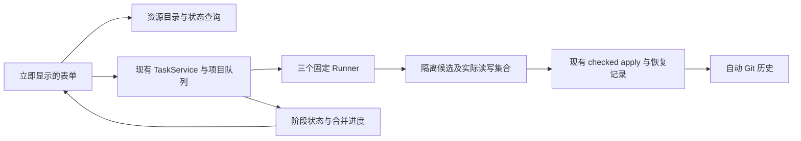

# Workflows 工程审查与重构建议

日期：2026-09-07。审查基线：`93d9090` 与本次开始时的工作区源码。仓库已有其他未提交修改，本次不归因其作者，不覆盖这些修改。

状态：修复已完成并通过完整检查；下文 F1–F12 与行号记录的是修复前基线，不能作为当前仍有缺陷的判断。用户已确认卡死入口为“处理当前 Git 变更 → 创建检查点”，且只能强制退出；产品方向为“保留 Git 历史，由应用自动处理检查点，普通操作不要求手动提交”，并进一步确认“在应用内查看和撤销即可，避免干扰外部 Git”。已实施合同见 Workflows 设计 §12；验证记录随本次修复更新。


## 第三轮：健康检查与生成内容入口（2026-09-08）

原因与 Update 的旧入口相同：页面编辑依赖完整 `prepare_workflow`，fieldset 在返回前禁用。Generate 的准备另外读取与实际生成无关的 Source 注册表/版本，增加磁盘工作，也让损坏的未选 Source 阻塞生成。

本轮实现：两个入口使用本地草稿；只读 catalog 提供配置、记忆选项及 Generate 的 Wiki 文件名，Health 不扫描正文，Generate 目录提前排除 Source 子树。点击 Start 才签发真实准备记录；外发/受限内容、覆盖和范围变化仍进入复核。移除 Generate 的 Source 版本基线，保留 ExportService 真正消费的 Markdown 与资源。没有新增任务系统，也没有把这两个工作流宣称为已迁移到 Update 意图 worker。

衔接检查修正：复核保留显式路线和自动新文件意图；StrictMode 首次 effect 重放不覆盖绑定草稿；不确定启动回复通过独立 pendingStarts 复用真实 token，成功后清除，下一次主动运行重新准备；迟到回复只更新任务事实。记忆输出路径不会把上次生成变成下次覆盖。

专项验证：175 项前端草稿/复核/控制器/store 测试通过；catalog 6 项、Generate 13 项、Health 21 项和 preparation 21 项后端专项通过。实际浏览器组件以 1.8 秒目录延迟验证加载期间切换成果类型、搜索与中文页选择，检查中文布局；未对真实知识库执行 AI 或写入。完整 `npm run check` 从头全部通过（17m31.5s）：1,440 项前端测试、1,350 项 Rust 单元测试、167 项 Workflow 集成测试；既有 ignored 测试未计入。日志：`/tmp/workflow-draft-check-complete.log`。旧版已排队 Generate 的额外 Source 基线可能触发现有 ReviewScope；正式 WebView 帧时间和真实 AI 并非本次验证证据。

## 第二轮：移除 Update 表单的执行依赖（2026-09-08）

第一轮解决主线程自锁并让表单提前出现，但后台 preparation 仍把全量 Source 解析、路线发现、准备记录与表单状态绑在一起。缓存和 loading 提示只是遮蔽这条依赖链，不能消除等待。

本轮计划已按以下顺序落实：独立本地表单 → 元数据目录与配置摘要 → 持久化执行意图 → 执行时绑定 → 保存/恢复复用已选范围 → 回归与完整门禁。新增 Update 入口不再使用 preparation ID、TTL、全路线探测或全表单等待。必要的检查放在消费对应事实的位置：执行前绑定来源；真正调用 BYOK 时核对实际配置；写入时保持候选、冲突、权限和历史恢复合同。没有新增通用编排框架、内容数据库或另一套任务系统。

针对性测试覆盖：表单独立于慢查询、Automatic 不被上次版本固化、显式空手选、过期响应、重复请求、导航离开；后台 UUID/终态恢复查重、排队新增来源、取消、配置变化、无变化完整 runner；真实 V2 手选生成→持久候选→重启恢复→确认写入，并保留未选损坏来源。复核同时修复了旧固定版本变化应进入 ReviewScope、V2 Source 只读 baseline 被误用候选可写路径规则拒绝的问题。

最终验证：`npm run check` 从头全部通过（17m05.7s），包含 1,424 项前端测试、1,343 项 Rust 单元测试和 167 项 Workflow 集成测试；未启用的 ignored/真实 AI 验收不计入通过。使用本机已有 bundled Python 提供 `python` 命令。完整日志：`/tmp/update-intent-check-complete.log`。浏览器用实际 UpdateWikiForm 与隔离的慢目录响应验证中文布局、加载时可编辑、空手选禁用、选择后启动状态；没有对真实知识库执行 AI 或写入。完整门禁曾发现旧 Agent 版本更新的校验回归，已恢复执行边界的 fresh probe 并从头重跑；不能用短时展示缓存替代执行时的版本校验。

兼容边界：旧版来源索引没有独立版本元数据，手动目录仍需读正文算版本；默认表单不依赖它。旧任务与 Health/Generate 保持 preparation 兼容路径，不能把本轮改动描述为删除所有 preparation 实现。浏览器组件验证和服务测试不等于打包 WebView 帧时间或真实外部 AI 验收。

## 修复落实（2026-09-07）

- F1/F2：权限 permit 消除递归锁；Git、确认与相关文件命令移入异步 worker。普通 Wiki 更新不再出现手动提交全仓检查点的前置要求。
- F3/F4：表单立即显示，按工作流保留草稿，后台准备可退出；未变更的范围不重复前端 prepare；Update 准备不扫描全 Wiki/不读 Git，后端保留所选 Source 与权限复核。 首次进入 Workflows 才加载控制器，之后保留后台同步；构建实测首屏 JS 从 626,819 B 降至 610,320 B（预算 625,000 B 未变）。
- F5/F6：Update 改用私有 Git refs/临时 index/精确字节快照。慢启动检查在权限锁外，短入队与实际写入仍受当前权限约束。执行进程移出异步调度线程。
- F7：checkpoint 存在检查、changed paths 和 tracked path 查询不再派生完整仓库状态；读命令设置短超时。成功发布直接引用写入前持久保存的 planned tree，无需再次扫描/哈希输出。
- F8–F12：队列按项目隔离；候选摘要与内联 Diff 共用一次验证后的 descriptor，已存在的匹配确认无需重新恢复；完整阶段摘要修复 UI 合并；日志改为 JSONL 追加与小快照，保持旧任务兼容。
- 独立审查进一步修复元数据字节所有权、写读历史大小不对称、写入中断恢复、撤销中断状态四处边界。无项目 Git 且处于外部仓库子目录时，在任何初始化写入前明确拒绝，避免制造破坏父仓库识别的 unborn 嵌套仓库。

验证：最终 `npm run check` 全部通过（15m52.6s），使用已有 bundled Python 3.12 提供本机缺失的 `python` 命令。包含 1,415 个前端测试、1,333 个 Rust 单元测试、166 个 Workflow 集成测试，以及其他集成/构建/工具检查；既有 ignored 测试未宣称执行。GUI feature 下的确认组合另有 8 个回归全部通过（2.30s），覆盖原先自锁的初始化、检查点、兼容启用和修复。自动历史集成覆盖无 Git、脏工作树、已有暂存、中文路径、CRLF、外部编辑冲突、任务重启、部分发布与部分撤销恢复；历史 blob 超过 16 MiB 的读回测试也通过。没有把持久边界模拟测试说成真实进程 kill 验收，也未对真实知识库执行更新或宣称完成打包 WebView 帧时间验收。最终检查日志保留于 `/tmp/workflow-final-gate.log`，确认回归日志为 `/tmp/workflow-confirmation-gui-final.log`。

保留边界：Agent repair 与 Generate Content 覆盖已有制品仍沿用各自的 Git 检查点合同；本次独立历史和撤销针对 Update Wiki。取消准备立即释放 UI 意图，但不强杀已经运行的短只读准备请求。实际 WebView 帧时间不能由服务/组件测试代替。

## 结论

1. 创建检查点的确认链存在可由当前源码证明的同线程重复加锁：已经持有项目权限锁，又通过通用权限查询获取同一把锁。它在真正创建 Git 检查点之前就会永久阻塞。这个命令同时运行在 Tauri 主线程，因此整个应用失去响应。
2. 点击 Update Wiki 后，前端等待完整准备完成才打开表单。准备混合了全库发现、文件哈希、Git 状态、路线探测；开始运行时又重复执行。当前 overview 已经轻量化，但准备流程仍承担了过多工作。
3. 根本设计问题是把“用户选择任务”“获取界面信息”“执行时固定输入”“写入前保护文件”串成了一条反复全量验证的链。全仓 Git clean 被当作文件恢复能力的替代指标，使普通编辑也成为工作流障碍。
4. 推荐保留已有任务、隔离候选、checked apply 和恢复能力，调整职责及验证时机。三个固定工作流没有引入通用编排 DSL、更多控制器层或内容数据库的必要。

## 证据范围

审查覆盖前端卡片/准备/确认/右栏/运行历史、IPC、项目权限、Git、runner、队列、任务事件/日志、候选复核/发布，以及相关测试。两个独立审查视角分别核对前端和后端；主审查整合并核对关键路径。

当前已经有效的改进包括：异步 overview/preparation 命令、独立历史查询、overview 的 owner 索引、运行事件合并、最多 16 项详情缓存、范围选项分页、精确结果导航，以及 Local Health 不依赖 Git/Agent。不能再把旧版“打开 overview 就全库扫描”当成当前根因。

证据分为当前源码确定的调用关系、合成临时项目的分项实测、待真实打包应用验证的体验推断。没有在真实知识库运行更新、创建检查点或调用外部 AI；没有把分项测试当成完整 GUI 性能验收。

## 发现

### F1 · P1 · 检查点确认在创建 Git 提交之前自锁

调用链：

```text
confirm_pending_action                         file_commands.rs:147
  with_current_project_authority_mutation      app_state.rs:978
    transition_lane.lock()                    app_state.rs:995  ← 持有项目锁
    execute_claimed_project_authority_action
      CheckpointAssessedGit                   file_commands.rs:671
        revalidate_assessed_context           file_commands.rs:759
          resolve_workflow_access             file_commands.rs:783
            with_workflow_access_mode
              transition_lane.lock()          app_state.rs:1314 ← 再申请同一把锁
```

外层 permit 持有 guard 的引用，调用期间没有释放；内层使用 permit 的同一 canonical root。[ProjectTrustTransitionLanes](../../src-tauri/src/app_state.rs#L119) 按 canonical identity 返回同一个 `Arc<Mutex<()>>`。`std::sync::Mutex` 不支持这种重入，后面的 `verify_checkpoint_state` 和 `create_checkpoint` 无法到达。Git 子进程超时也无法解开这把权限锁。

`InitializeAssessedGit` 使用同一个 helper，同样受影响。独立核对还发现同类模式出现在部分兼容启用/信任及 directory-only repair 分支：持有 authority permit 时调用会再次获取 transition lock 的 `grant_compatible_project_trust` 或 `refresh_native_authority_after_repair`。这是权限 API 的组合缺陷，应统一修正锁所有权。

修复原则：一个顶层操作只获取一次权限/写入许可；内部服务接收并使用该许可，调用明确的锁内验证方法。保留权限验证，消除重入。仅添加 `async` 或把 `Mutex` 换成可重入锁，均没有解决权限职责混乱。

**动态旁证：** 使用 `cargo test --lib --no-run` 成功编译当前 GUI 源码（27.87s），在独立进程执行已有 `commands::file_commands::tests::compatible_enablement_can_leave_git_initialization_disabled`。10s 内没有返回，macOS `sample` 的该线程 866/866 次采样均停在以下调用栈。测试进程随后被终止，临时知识库已清理。这里动态复现的是兼容启用的同类分支；Git 确认分支由上面的当前源码调用链证明，没有在真实知识库点击确认。

```text
compatible_enablement_can_leave_git_initialization_disabled  file_commands.rs:910
  with_current_project_authority_mutation                    app_state.rs:1016
    execute_claimed_project_authority_action                 file_commands.rs:521
      grant_compatible_project_trust                         app_state.rs:1545
        Mutex::lock
          __psynch_mutexwait
```

### F2 · P1 · Git 补救操作仍同步执行，慢操作没有任务生命周期

[git_commands.rs](../../src-tauri/src/commands/git_commands.rs#L91) 中初始化/检查点预览是同步命令；[confirm_pending_action](../../src-tauri/src/commands/file_commands.rs#L147) 也同步执行真实文件/Git操作。Tauri 非 async 命令默认在主线程执行，前端的 `invoke()` 返回 Promise 不改变这一点；这一行为也与本机 Tauri 2.9.5 / macros 2.5.2 的 wrapper 实现一致。[Tauri 官方说明](https://v2.tauri.app/develop/calling-rust/#async-commands)

前端 [ProjectConfirmationController](../../src/components/app/ProjectConfirmationController.tsx#L63) 一直等待完整操作，[ConfirmationDialog](../../src/components/app/ConfirmationDialog.tsx#L158) 在此期间禁用确定和取消，没有进度或转后台入口。修复 F1 后，大库/慢磁盘仍会暴露这项问题。

建议自动检查点进入 Workflow 任务的可见阶段；旧的手动 Git 管理入口也使用现有后台执行设施。接收用户决定和执行长事务分开，确认请求尽快返回任务标识。提交临界阶段可以暂时不可取消，但不能把全部准备时间包含在内。

### F3 · P1 · 页面切换等待重准备，反馈缺失

[useWorkflowsController.ts:387](../../src/features/workflows/useWorkflowsController.ts#L387) 先等待 `prepareWorkflow`，到 400 行才 `setPreparation`。卡片 [WorkflowRow.tsx:57](../../src/features/workflows/WorkflowRow.tsx#L57) 的 pending 只禁用按钮，不立即选中目标表单，也没有“准备中”的可见状态。

这能直接解释“切换到 Wiki 更新要等一会”。当前 `prepare_workflow` 已在 HeavyIo worker 上，不能把这项感知延迟直接描述为 React 或 GUI 主线程算力耗尽。

建议点击立即打开本地表单，恢复上次选项；范围、环境和准备状态异步补齐。用户可以立即离开、换任务或修改选项。只有开始按钮等待必要事实，不让整个页面等待完整执行许可。

### F4 · P1 · 一次启动反复扫描，选定范围仍绑定全库

典型顺序包括：首次打开时 prepare → 点击开始后前端再 prepare → 后端 `validate_for_start` 重建 snapshot → runner 再核验 baseline。runner 后续还有 Wiki snapshot 和候选工作区准备。

证据：[workflowExecution.ts:30](../../src/features/workflows/workflowExecution.ts#L30)、[preparation.rs:298](../../src-tauri/src/services/workflow_service/preparation.rs#L298)、[validate_for_start](../../src-tauri/src/services/workflow_service/preparation.rs#L627)、[baseline_files](../../src-tauri/src/services/workflow_service/preparation.rs#L1688)、[update_wiki.rs:125](../../src-tauri/src/services/workflow_service/runners/update_wiki.rs#L125)。

Update 准备列举并解析全部 Source、遍历全部 Markdown，基线对整库可读 Markdown 做哈希。默认路线目录还可能探测多个 Agent 并等待所有探测线程返回；请求内复用不能抵消下次请求重做的成本。显式路线可减少探测，但第一次展示不应该等全部候选路线的实时健康信息。

结果：只更新一个 Source 的准备成本仍随整个库增长；无关文件修改也可能使排队任务要求重新复核。建议区分“用户选定意图”“可更新的资源目录”“执行实际读取集合”“候选实际写入集合”；精确内容快照在任务执行时捕获一次，写入前验证真正受影响的目标。

### F5 · P1 · 全仓 clean 与手动提交成为普通工作的门槛

[preparation.rs:1524](../../src-tauri/src/services/workflow_service/preparation.rs#L1524) 把 dirty Git 作为写入阻塞项；[update_wiki.rs:198](../../src-tauri/src/services/workflow_service/runners/update_wiki.rs#L198) 要求 clean-HEAD 检查点，只有精确枚举的应用运行文件得到豁免；手动补救 [create_checkpoint](../../src-tauri/src/services/git_service.rs#L502) 则 `git add --all`。

因此一份无关笔记或手动编辑就可能挡住 Wiki 更新，并迫使用户理解 Git。用户已经否定这种体验，要求应用自动处理。

真正需要保存的是本次操作会影响的文件的旧内容，并判断生成期间这些目标是否又被用户修改。整个仓库干净既不是充分的冲突证明，也不是保留旧内容的必要条件。应取消全仓 clean 前置、全仓 HEAD 不变作为普遍门槛，以及普通更新流程中的“处理当前 Git 变更”步骤。

### F6 · P1 · 权限锁覆盖慢读取，后台任务也可能拖住同步保存

[app_state.rs:1047](../../src-tauri/src/app_state.rs#L1047) 持项目 transition lock 执行整个 task access 闭包；启动闭包包含完整准备重验和强制 Agent 探测。同时，同步 Markdown/JSON 保存也申请同一把锁。

即使排除 F1，后台慢准备仍能让其他同步 IPC 在主线程等待锁。应该将文件发现、哈希计算、Agent 探测、候选生成放到锁外；权限许可的创建和最终发布校验使用明确、短小的临界区。权限撤销使用已有 revision/epoch 机制在启动外部调用和发布边界核验，不能靠从头持锁到尾获得安全感。

### F7 · P2 · Git 查询包装成本明显，验证粒度与命令目的不匹配

[repository_status](../../src-tauri/src/services/git_service.rs#L435) 顺序运行 version、top-level、branch、HEAD、status 五类命令；[run_git_process](../../src-tauri/src/services/git_service.rs#L1317) 每次先另外运行 config 检查，再启动目标 Git。每个子进程还有生命周期管理，捕获循环以 10ms 轮询。一个上层状态查询远不止一个 Git 进程。

dirty 状态的 [resolve_workflow_access](../../src-tauri/src/app_state.rs#L1344) 先取 repository_status，再调用 changed_paths，而 changed_paths 内部又取 repository_status。`checkpoint_exists` 等只想回答单一问题的函数也先完整读取仓库状态。

建议让 Git 查询返回本次所需的合并事实，应用安装/可执行文件信息及展示状态按明确失效条件缓存；执行策略在每次 Git 操作边界统一处理，不在每个微小 helper 中重复全套仓库检查。涉及仓库提供的执行配置仍须验证，不能为性能直接允许任意 hooks/filters。

默认 Git 超时为每条命令五分钟（[git_service.rs:1169](../../src-tauri/src/services/git_service.rs#L1169)），不适合普通状态查询的交互预算。读查询与真正写入应有不同期限，整个操作有总 deadline，并接入任务取消。

### F8 · P2 · worker 隔离、队列和日志尚未形成清楚的成本边界

三项独立问题：

- [lib.rs:194](../../src-tauri/src/lib.rs#L194) 用 async task 调度 runner，但 Update runner 在第一次 await 前仍同步执行权限/Git、全库哈希和工作区复制。这占用 async worker，绕过命令层 HeavyIo 的准入；尚未实测 runtime 饥饿，不能把它直接称为 GUI 死锁。
- [coordinator.rs:71](../../src-tauri/src/services/workflow_service/coordinator.rs#L71) 使用全局队列锁；[owner_runs](../../src-tauri/src/services/workflow_service/coordinator.rs#L1061) 先请求全部项目完整历史，再过滤 owner。[TaskService](../../src-tauri/src/tasks/task_service.rs#L1832) 会构造全部 runs 并排序。概览索引的优化没有覆盖调度器，调度成本仍受总历史量影响。
- [append_log](../../src-tauri/src/tasks/task_service.rs#L3290) 每条日志都持久化完整任务；[持久化快照](../../src-tauri/src/tasks/task_service.rs#L4473) 复制全部日志和活动。持久任务累计 n 条相似长度日志会产生二次量级的重复序列化/写入；现有 progress 节流没有消除这条路径。

建议复用现有 worker 隔离所有同步阶段；队列仅维护每项目 active/queued IDs；日志追加写，任务快照只含小体积状态和日志位置。无需增加新的总控服务。

### F9 · P2 · “按需 Diff”仍反复生成全量内容

Update 详情恢复时，[restore_update_wiki_confirmation](../../src-tauri/src/services/workflow_service/runners/update_wiki.rs#L938) 加载候选并构造完整 Diff；随后 [workflow_review.rs:485](../../src-tauri/src/services/workflow_review.rs#L485) 再加载生成摘要，小候选还再加载生成完整 review。loader 会重复 Source/检查点验证。

按需与分页主要限制了返回 payload，尚未保证后台工作量也随所选文件缩小。建议候选完成时生成不可变 manifest、摘要与逐文件 Diff；查看只加载请求部分。输入/权限强验证保留在真正应用候选的边界，restore confirmation 无需为注册动作构造完整 Diff。

### F10 · P2 · 事件压缩丢阶段事实，界面可能同时显示多个“进行中”

[complete_workflow_stage](../../src-tauri/src/tasks/task_service.rs#L2419) 完成阶段后清空 currentStageId，摘要不携带刚完成的阶段；[workflowStore.ts:318](../../src/stores/workflowStore.ts#L318) 只覆盖当前阶段，又用 `??` 保留旧 currentStageId。运行事件合并和不对普通 running 更新重载详情，使先前阶段的 running 状态留下。

独立前端审查通过内存构建直接执行当前 store，观察到 `analyze_sources` 和 `generate_candidates` 同时为 running。建议阶段变更发送完整且很小的阶段状态向量；只合并可覆盖的高频进度数值，不丢弃语义状态转换。

### F11 · P2 · 多套守卫遗漏同一项目中的用户导航意图

[prepareKind](../../src/features/workflows/useWorkflowsController.ts#L394) 检查项目身份和另一 prepare 请求，却不检查用户是否已打开历史、返回概览或离开该页面。旧准备返回后会重新 setPreparation。项目隔离守卫不能替代“用户已经不想打开这张表单”的判断。

建议每个页面意图使用一个统一 token；返回、换卡片、离开页面都使其失效。后台任务事实仍全局保留；抛弃旧页面响应不等于取消已经开始的工作流。

### F12 · P2 · 历史筛选不随任务终态正确更新

[controller 终态处理](../../src/features/workflows/useWorkflowsController.ts#L310) 重新查 overview，history effect 仅依赖页面/身份；[history 合并](../../src/stores/workflowStore.ts#L158) 只更新已有行。查看“运行中”时已完成任务可能留下；查看“已完成”时新完成任务不会加入。

建议仅在历史页面可见且发生终态等语义变化时，使当前筛选失效并重新查询。普通进度继续不刷新历史。当前 README 宣称终态会刷新可见历史，与实现不一致。

## 分项实测

临时 Rust integration probe 调用当前公共服务；macOS、本地临时目录、100/1000 个约 2KB Markdown、真实本地 Git。构造仓库与改动均在临时目录。Rust 使用 debug test profile；每个状态/准备项目取 3 次，表中为中位数，verify/create 各 1 次。Agent 使用无可执行文件的 stub，SecretService 为内存实例，未调用 AI。

| 测量项 | 100 页 | 1000 页 |
| --- | ---: | ---: |
| 直接运行 Git status，包含进程启动 | 10.62 ms | 10.57 ms |
| GitService.repository_status | 136.90 ms | 135.55 ms |
| GitService.changed_paths | 164.56 ms | 161.20 ms |
| verify_checkpoint_state | 163.71 ms | 160.27 ms |
| create_checkpoint，单文件修改 | 254.34 ms | 253.46 ms |
| Update prepare，无 Source/Agent/权限探测成本 | 12.20 ms | 122.52 ms |

这验证了服务包装存在明显固定成本、Markdown 准备成本随文件量增长。最后一行刻意排除了实际权限/Git读取、真实 Source 和 Agent，不能当成正常准备的完整耗时。样本小、未测冷磁盘，不将这些数值标成 p95 或生产 SLA。测试通过，临时 probe 已移除；真实 GUI 帧时间和用户设备中的完整停顿仍须后续测量。

## 推荐架构

用户需要完成的流程可以保持为：**选择任务 → 确定范围 → 后台执行 → 查看结果；仅实际冲突/需要额外授权的结果请求处理。** Git 历史由应用维护。



图中的标签是职责划分，不要求一对一创建新类或新文件。继续使用现有 React shell、TaskService、CompileService、ExportService、GitService 和文件安全工具。

### 1. 界面查询：允许渐进就绪

- 卡片点击只改变本地选择和表单状态；资源列表与环境状态后台加载。
- 复用/扩展现有 Source、Wiki 索引，按文件变化更新目录信息；它可以是可重建的内存/JSON派生数据，无需内容数据库。
- 可执行文件/路线能力做按设置或目标变化失效的缓存。默认路线先可用，展开高级路线才查询其他选项。
- 查询缓存用于展示和选择；不作为落盘时文件内容仍未变化的证明。

### 2. 启动任务：接收意图，执行时固定真实输入

- 一次 start 提交种类、选定 Source/page IDs、路线和必要确认，尽快创建任务并返回 ID。准备、排队、取消和进度使用同一个任务生命周期。
- 每个项目保持已有串行写任务规则；活动队列与历史分开。先维持简单调度，不为追求理论并发再引入复杂依赖调度器。
- 到执行时解析所选版本并固定实际输入快照；默认“更新所选来源”可以采用执行时当前可用版本，若产品要求固定选中的旧版本则明确绑定。变化导致范围超出用户授权时才重新询问。
- 候选只读取批准的 Source 和需要的 Wiki 上下文，并记录实际读取的文件/版本；模型不会获得真实知识库的可写工作区。

### 3. 写入与 Git：自动保存旧值，保护精确写集合

建议协议：

```text
隔离生成候选
  → 计算写集合及每个目标的 before/after
  → 核验当前权限、路径与目标版本
  → 自动持久保存触及文件的旧值和恢复记录
  → 按现有 checked apply 协议发布
  → 自动记录结果历史
  → 异步刷新派生索引并展示结果
```

- 用户在任务开始前对目标文件的手动编辑可成为 before 版本，不必先手动提交。
- 生成期间真正被修改的目标进入冲突处理；无关文件变化不阻止这次更新。
- Git 历史只覆盖本次受影响文件，不能使用 `git add --all` 吞入无关文件或操作用户暂存区。
- 工程上优先评估临时 index + 应用拥有的 Git ref 来记录操作历史，使恢复不依赖用户当前 branch/HEAD。用户已确认应用内展示和撤销即可，不要求自动记录出现在当前分支的普通 `git log`。当前普通提交应保留，不重写既有历史。
- 因此不建议沿用户当前分支强制创建自动 commits。独立应用 ref 更符合已确认的需求；仍须验证实际实现保留用户暂存内容、处理外部 Git 竞争，以及显式应用内撤销对当前文件的冲突检查。
- 正常库的检查点完全自动化。真正无法写 Git 时，任务报告可操作的失败并保留候选；不能悄悄写入失去恢复保障的结果。
- Git commit 不是多文件原子事务。继续使用已有恢复记录、逐文件 checked write 和可恢复发布协议；崩溃恢复根据实际持久状态完成/回滚，不用“最后一次写成功”推断整个任务成功。

### 4. 锁与后台工作：权限只在边界收敛

慢发现、哈希、Git读取、AI和候选构建在 worker/异步阶段运行，不持项目权限锁。每个顶层发布操作持有一个明确 permit，内部不再申请同类锁；最终短临界区检查 authority epoch 与目标文件，再发布已准备好的结果。

现有 blocking worker 可继续使用，runner 同步阶段也纳入其中。取消截止于明确的发布边界，耗时索引刷新和常规历史查询不占不可取消临界区。

### 5. 事件与存储：小状态快照，按需读大内容

阶段改变与终态使用可靠的小状态快照；高频计数合并。运行详情、候选正文、Diff和日志分别按需读取，避免 summary/详情相互猜测状态。日志追加写，关键任务状态和恢复信息按语义边界持久化。

## 需要保留与可以删除的复杂度

| 保留 | 原因 |
| --- | --- |
| Source/原始材料保护、路径身份与布局边界 | 防止写错对象、破坏证据或越界 |
| 外部 AI 启动前及落盘前权限核验 | 权限可在任务期间变化 |
| 目标版本比较和实际冲突复核 | 用户可继续外部编辑 |
| 隔离候选、精确结果绑定、恢复记录 | 让取消/失败/崩溃有明确结果 |
| 项目/会话身份与任务事实独立 | 防止跨项目展示及丢失后台任务 |

可以消除：为打开表单捕获全库执行基线；同一启动中多次完整 prepare；全仓 clean 前置；普通操作手动 checkpoint 模态流程；持锁 helper 再调加锁 helper；展示详情时重建全候选 Diff；调度扫描所有历史；每条日志重写全部任务；分散且相互遗漏的页面意图守卫。

## 实施顺序与验收

建议按可独立交付的顺序实施，复用上述有效组件，逐步替换旧路径：

1. **消除永久卡死。** 修正 authority permit 的重入调用及同类分支；将同步 Git/确认 I/O 移入后台。补充真实确认链回归，不能只测试 GitService。
2. **让切换立即响应。** 表单先显示、数据后加载；统一页面意图取消；修复阶段投影和历史失效。消除不必要的前端重复 prepare。
3. **自动 Git 与精确范围。** 移除 clean-worktree 前置和全仓 checkpoint；将实际输入/写集合、自动旧值保存及已有 checked apply 串成单一协议。更新 Workflows/项目打开相关权威规范与文案。
4. **控制长期成本。** 队列使用项目活动索引；日志追加写；候选摘要/Diff只生成一次；runner 同步阶段纳入 worker。删除退役路径而不是永久保留两套机制。

建议验收目标（设计目标，尚未达标声明）：点击后下一次可绘制帧呈现选择/表单，p95 可见反馈小于 100ms；任务接收与重扫描分离；任何 Git 慢操作期间窗口可拖动、其他页面可打开；可取消阶段的取消反馈小于 1s。输入准备的吞吐须按真实数据另测，不能保证任意规模下固定耗时。

性能用 release Tauri 测点击到可见帧、IPC/worker排队/执行时间、Git进程数、文件读取次数、日志总写入量。覆盖首次/热切换、100/1000/10000页、慢或缺失Agent、大文件、持续日志；这些场景分开测，不能用空表单热切换替代实际准备。

正确性重点覆盖：创建检查点及初始化/信任的真实命令链、有未提交和已暂存修改、外部编辑目标/无关文件、外部Git提交、排队/取消/撤权、确认期间切项目、进程退出与恢复、Unicode路径，以及Git失败。只使用合成项目或样本副本。

本轮 4 个前端测试文件共 92 项通过；临时服务性能 probe 1 项通过；当前 GUI unit test 编译通过，F1 所述兼容启用测试则超时，并取得重复加锁堆栈证据。这一失败仍未修复。前端验证命令为 `npm test -- src/features/workflows/useWorkflowsController.test.tsx src/features/project/ProjectAuthorityDialog.test.tsx src/stores/workflowStore.test.ts src/services/taskEventDispatcher.test.ts`。

现有前端热切换测试没有点击真实 prepare，阶段事件测试缺少真实阶段向量；默认 `--no-default-features` Rust 测试不编译 GUI commands（[lib.rs:2](../../src-tauri/src/lib.rs#L2)）。因此大量通过的服务/状态测试没有覆盖 F1 这条真实入口，不能据此宣称 GUI 无卡顿。后续实现属于权限、Git、IPC及任务关键行为，按 AGENTS 运行完整 `npm run check`，并补充上述真实链路与打包应用验收。
