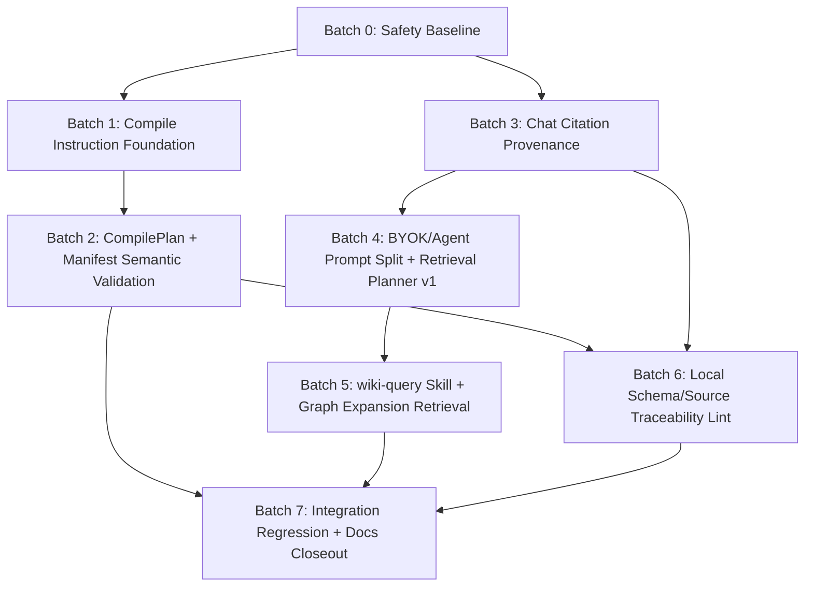

# P0/P1 Non-Import Implementation Batches Plan

> **For agentic workers:** REQUIRED SUB-SKILL: Use `superpowers:subagent-driven-development` (recommended) or `superpowers:executing-plans` to implement one batch at a time. This document is a plan only; do not implement multiple batches in one conversation unless the user explicitly asks.

**Goal:** Fix the current non-import P0/P1 trust-chain gaps in small, reviewable batches without introducing a database, changing normal Search into Q&A, moving backend responsibilities into React, or mixing import redesign into this round.

**Architecture:** Keep project content as Markdown/JSON/local files. Add stricter Rust DTOs and deterministic service validation before writes; keep BYOK and Agent as separate capability routes; make citations model-used evidence instead of retrieval diagnostics; improve retrieval with local index and graph signals before considering any vector cache.

**Tech Stack:** Tauri v2 Rust services and typed DTOs, React 19 + TypeScript UI contracts, local Markdown/YAML/frontmatter utilities, existing `SearchService`, `GraphService`, `ChatService`, `CompileService`, `LintService`, Skill templates under `src-tauri/templates/skills/`.

## Global Constraints

- Start every implementation conversation with `git status --short`; record all pre-existing dirty/untracked files in the conversation before editing.
- Current planning run observed an already dirty tree on 2026-07-07, including `src-tauri/src/commands/chat_commands.rs`, `src-tauri/src/models/chat.rs`, `src-tauri/src/services/chat_service.rs`, multiple frontend chat/UI files, `SPEC/progress.txt`, untracked audit docs, and `.app` sample files. Treat those as user or prior-agent work unless proven otherwise.
- Do not revert, overwrite, format, or stage unrelated existing changes.
- Keep user wiki content as Markdown + JSON + local files. Do not introduce a database as the user wiki source of truth.
- Do not put normal Search on an LLM/Agent path. Search remains keyword/filter/local; natural-language answers stay in Chat/Agent/BYOK.
- React UI must not own filesystem, Git, Agent process, or secret-storage logic. Use Tauri commands and Rust services.
- Keep `raw/sources/` and `wiki/sources/` protected; source replacement/deletion remains explicit-confirmation work.
- Do not silently install or run Agent install commands.
- Do not mix import pipeline redesign into these batches.
- Do not make vector DB/LanceDB part of the first solution. If ever added later, it must be an optional derived cache under `.app/`, not a content source.
- Before every batch completion run available checks from scratch: `npm run test`, `npm run lint`, console-log scan, import-path/type resolution via existing build/lint/test coverage, and targeted Rust tests for changed services.
- After each feature or meaningful fix, run the two-review workflow from `AGENTS.md`; if subagents are unavailable, perform shared-context and fresh-context manual reviews and say so.
- Append `SPEC/progress.txt` only in implementation batches that land meaningful code/doc milestones. This planning-only batch intentionally creates only this plan file.

## Recommended Batch Order



Why this order:

- Batch 0 protects the already-dirty worktree and records the real test baseline before touching code.
- Batch 1 removes compile instruction drift before adding a plan DTO, so BYOK, Agent, and Skill routes share the same decision rules.
- Batch 2 then adds the auditable CompilePlan and semantic no-write gates.
- Batch 3 fixes citation trust before retrieval becomes more complex.
- Batch 4 splits BYOK/Agent prompts and adds planner v1 without graph expansion, keeping blast radius manageable.
- Batch 5 uses the citation and planner foundations to add `wiki-query` and graph expansion.
- Batch 6 localizes deterministic lint after compile/chat metadata semantics are stabilized.
- Batch 7 validates cross-flow behavior and closes docs.

## External Evidence To Preserve

Use the external evidence already cited in `docs/audits/2026-07-07-non-import-code-audit-and-plan.md`; when changing prompts or Skills, re-open original sources if wording matters.

- [Karpathy LLM Wiki gist](https://gist.github.com/karpathy/442a6bf555914893e9891c11519de94f): raw sources are immutable; the LLM maintains wiki pages; ingest may touch many wiki pages; query reads index first and answers with citations; lint checks contradictions/staleness/orphans.
- [nashsu/llm_wiki README](https://raw.githubusercontent.com/nashsu/llm_wiki/main/README.md): two-step ingest, source traceability, graph/source-overlap retrieval, budget control, local HTTP API/MCP direction, optional vector search only as an enhancement.
- [Astro-Han karpathy-llm-wiki Skill](https://raw.githubusercontent.com/Astro-Han/karpathy-llm-wiki/main/SKILL.md): always fetch/compile, explicit merge/create/cross-topic decision rules, immutable raw sources.
- [nashsu llm_wiki_skill](https://raw.githubusercontent.com/nashsu/llm_wiki_skill/main/SKILL.md): read-only local API shape and `127.0.0.1` boundary.
- [alirezarezvani llm-wiki Skill](https://raw.githubusercontent.com/alirezarezvani/claude-skills/main/engineering/llm-wiki/skills/llm-wiki/SKILL.md): cross-tool schema parity via `CLAUDE.md`/`AGENTS.md`, index-first query, citations, stdlib/local-search fallback.

---

## Batch 0: Safety Baseline And Current Failures

**Goal:** Record current repository state, tests, and known failures before feature work.

**Covers Audit Items:** All P0/P1 indirectly; this is the safety prerequisite.

**Why This Batch:** The worktree is already dirty. Later batches must not confuse existing changes with their own work or spend time chasing pre-existing failures without naming them.

**Depends On:** None.

**Files Involved:**

- Read: `AGENTS.md`
- Read: `docs/audits/2026-07-07-non-import-code-audit-and-plan.md`
- Read: `docs/audits/2026-07-07-non-import-code-audit-readable-cn.md`
- Read: `package.json`
- Read: `src-tauri/Cargo.toml`
- Read only as needed: service/model files named by later batches
- Optional append only if a real milestone is reached: `SPEC/progress.txt`

**Implementation Steps:**

- [ ] Run `git status --short` and paste the exact output into the conversation.
- [ ] Classify dirty files as likely prior/user work; do not revert or reformat them.
- [ ] Run `npm run test`.
- [ ] Run `npm run lint`.
- [ ] Run targeted Rust tests only if the project has a working Cargo test path, e.g. `cargo test --manifest-path src-tauri/Cargo.toml compile_service chat_service lint_service search_service graph_service`.
- [ ] Scan for unintended `console.log` with PowerShell if `rg` is unavailable: `Get-ChildItem -Path src -Include *.ts,*.tsx -Recurse | Select-String -Pattern 'console\.log'`.
- [ ] Record whether import paths resolve via `npm run lint`/TypeScript or, if needed, `npm run build`.
- [ ] Decide whether existing failures are blockers for all later batches. If yes, create a separate fix plan; do not silently fix them inside Batch 0.

**DTO / Function / Prompt / Skill Changes:**

- None.

**Test Checklist:**

- `npm run test`
- `npm run lint`
- Optional targeted `cargo test --manifest-path src-tauri/Cargo.toml`
- Console-log scan
- Import/type resolution through available scripts

**Acceptance Criteria:**

- The conversation contains exact `git status --short` output.
- Test/lint results are recorded with pass/fail and first failing test or lint rule.
- No business code changed.
- No import code touched.

**Risks:**

- Existing failures may be unrelated to later work but still block required checks.
- Dirty files may include user changes in the same files a later batch needs.

**Rollback:**

- No code changes; nothing to roll back.

**Explicitly Not Included:**

- No code fixes.
- No docs rewrite beyond optional progress logging if the user asks.
- No import work.

---

## Batch 1: Compile Instruction Foundation

**Goal:** Make compile instructions consistent across `wiki-ingest` Skill, BYOK compile prompt, and Agent compile prompt before adding new compile DTOs.

**Covers Audit Items:** P1-1, P1-2.

**Why This Batch:** `CompilePlan` validation is only useful if every route receives the same merge/create/conflict/cascade rubric. This batch reduces prompt drift without changing the compile execution flow.

**Depends On:** Batch 0.

**Files Involved:**

- Modify: `src-tauri/templates/skills/wiki-ingest/SKILL.md`
- Modify or create: `src-tauri/src/services/compile_instructions.rs`
- Modify: `src-tauri/src/services/mod.rs`
- Modify: `src-tauri/src/services/compile_service.rs`
- Test: existing `#[cfg(test)]` module in `compile_service.rs` or new focused tests near `compile_instructions.rs`

**Implementation Steps:**

- [ ] Record `git status --short`.
- [ ] Read `src-tauri/templates/skills/wiki-ingest/SKILL.md` and current `CompileService::provider_prompt`.
- [ ] Add a `Decision Rules` section to `wiki-ingest/SKILL.md` covering:
  - create when a genuinely new concept/entity/synthesis/comparison page is needed;
  - update when new evidence changes an existing page;
  - merge when the new source has the same core thesis as an existing derived page;
  - see-also/cross-link when content spans related but distinct topics;
  - conflict annotation when sources disagree;
  - cascade scan/update order after material changes.
- [ ] Extract shared compile clauses into a Rust instruction builder that can render a common core for BYOK and Agent prompts.
- [ ] Keep route-specific wrappers separate: BYOK asks for structured JSON only; Agent can mention workspace behavior, but both include identical decision and source-traceability clauses.
- [ ] Add prompt snapshot/contract tests that fail if any route or Skill loses critical clauses.
- [ ] Keep existing manifest-only compile behavior unchanged in this batch.

**DTO / Function / Prompt / Skill Changes:**

Proposed functions:

```rust
pub struct CompileInstructionSet {
    pub source_protection: &'static str,
    pub derived_page_policy: &'static str,
    pub source_traceability: &'static str,
    pub decision_rules: &'static str,
    pub structural_files: &'static str,
    pub no_delete_policy: &'static str,
}

pub enum CompilePromptRoute {
    Byok,
    Agent,
}

pub fn shared_compile_instruction_set() -> CompileInstructionSet;
pub fn render_compile_core_instructions() -> String;
pub fn render_compile_prompt_header(route: CompilePromptRoute, language: &str) -> String;
```

Prompt requirements:

- BYOK prompt must not imply filesystem/tool access beyond provided prompt content.
- Agent prompt may mention compile workspace, but not raw project root writes.
- Both prompts must include: never touch `wiki/sources/`, no one-source-one-page summaries, derived pages synthesize across sources, every derived page has frontmatter `sources` and human-readable `> Sources:`, maintain `wiki/index.md`, `wiki/overview.md`, `wiki/log.md`, no delete.

Skill changes:

- `wiki-ingest/SKILL.md` becomes the human-readable canonical Skill template.
- Rust tests read the Skill template and assert its critical clauses match the shared builder semantics.

**Test Checklist:**

- Prompt contract tests for BYOK compile prompt.
- Prompt contract tests for Agent compile prompt.
- Template contract test reading `src-tauri/templates/skills/wiki-ingest/SKILL.md`.
- Existing compile service tests.
- Full `npm run test`, `npm run lint`.

**Acceptance Criteria:**

- `wiki-ingest` defines create/update/merge/see-also/conflict/cascade rules.
- BYOK and Agent compile prompts include the same core decision rules.
- A test fails if `wiki/sources` protection, source traceability, cascade, or merge/create language is removed from any route.
- No compile execution behavior changes.

**Risks:**

- Overly verbose prompts may reduce model compliance. Keep shared clauses dense and test for meaning-bearing phrases, not entire giant snapshots.
- Skill text and builder text can still drift if tests only check one keyword. Use multiple critical clauses.

**Rollback:**

- Revert only `compile_instructions`/prompt-template changes from this batch.
- Since execution flow is unchanged, rollback should not require data migration.

**Explicitly Not Included:**

- No `CompilePlan` DTOs.
- No manifest semantic validation changes.
- No chat/retrieval/lint changes.
- No import changes.

---

## Batch 2: CompilePlan + Manifest Semantic Validation

**Goal:** Add an auditable plan stage before manifest apply, then enforce semantic manifest validation in Rust before any project write.

**Covers Audit Items:** P0-1 and the compile-side part of P1-3.

**Why This Batch:** Compile is the highest-risk write path. A validated plan lets the app reject bad decisions before file content is generated or applied.

**Depends On:** Batch 0, Batch 1.

**Files Involved:**

- Modify: `src-tauri/src/models/compile.rs`
- Modify: `src-tauri/src/services/compile_service.rs`
- Modify: `src-tauri/src/commands/compile_commands.rs`
- Modify if needed: `src-tauri/src/services/agent_service.rs`
- Modify if needed: `src-tauri/src/services/llm_service.rs`
- Modify: `src-tauri/src/utils/markdown_utils.rs`
- Test: compile model/service/command tests adjacent to existing modules

**Implementation Steps:**

- [ ] Record `git status --short`.
- [ ] Add `CompilePlan`, `CompilePlanItem`, `CompileAction`, and `CompilePageType` DTOs with serde round-trip tests.
- [ ] Add `CompileService::parse_plan(raw: &str) -> Result<CompilePlan, BackendError>`.
- [ ] Add `CompileService::validate_plan(context, plan, existing_pages, known_sources) -> Result<(), BackendError>`.
- [ ] Change BYOK compile prompt flow to request plan JSON first, validate it, then request manifest/content using the accepted plan.
- [ ] Change Agent compile flow to require plan output before manifest extraction. If the Agent writes into a candidate workspace, still extract/validate plan and manifest before applying to the real project.
- [ ] Strengthen `validate_manifest` to parse each candidate page frontmatter and body.
- [ ] Ensure plan or manifest failure is a no-write failure: no project files are changed, graph/search refresh is not triggered, and task logs show validation details.
- [ ] Add tests for plan pass/manifest fail and confirm no project file write.
- [ ] Keep no-delete policy unless a future user-approved destructive batch changes it.

**DTO / Function / Prompt / Skill Changes:**

Proposed DTOs:

```rust
#[derive(Debug, Clone, Serialize, Deserialize, PartialEq, Eq)]
#[serde(rename_all = "camelCase")]
pub struct CompilePlan {
    pub summary: String,
    pub items: Vec<CompilePlanItem>,
    #[serde(default)]
    pub global_risk_flags: Vec<String>,
}

#[derive(Debug, Clone, Serialize, Deserialize, PartialEq, Eq)]
#[serde(rename_all = "camelCase")]
pub struct CompilePlanItem {
    pub action: CompileAction,
    pub target_path: String,
    pub page_type: CompilePageType,
    #[serde(default)]
    pub source_ids: Vec<String>,
    #[serde(default)]
    pub affected_existing_pages: Vec<String>,
    pub reason: String,
    #[serde(default)]
    pub risk_flags: Vec<String>,
}

#[derive(Debug, Clone, Copy, Serialize, Deserialize, PartialEq, Eq)]
#[serde(rename_all = "snake_case")]
pub enum CompileAction {
    Create,
    Update,
    Merge,
}

#[derive(Debug, Clone, Copy, Serialize, Deserialize, PartialEq, Eq)]
#[serde(rename_all = "snake_case")]
pub enum CompilePageType {
    Entity,
    Concept,
    Synthesis,
    Comparison,
    Query,
    Overview,
    Index,
    Log,
}
```

Proposed functions:

```rust
pub fn parse_plan(raw: &str) -> Result<CompilePlan, BackendError>;
pub fn validate_plan(
    context: &ProjectContext,
    plan: &CompilePlan,
    existing_pages: &[String],
    known_sources: &HashSet<String>,
) -> Result<(), BackendError>;

pub fn validate_manifest_semantics(
    context: &ProjectContext,
    manifest: &CompileManifest,
    accepted_plan: Option<&CompilePlan>,
    known_sources: &HashSet<String>,
) -> Result<(), BackendError>;
```

Validation rules:

- Reject empty plan.
- Reject `target_path` outside `wiki/`.
- Reject any plan or manifest path under `wiki/sources/`.
- Reject `source_ids` empty for derived page actions.
- Reject `merge` without an existing target page in `affected_existing_pages`.
- Reject structural file updates without `reason`.
- Reject create/update that only names `wiki/index.md`, `wiki/overview.md`, and `wiki/log.md`.
- Reject derived candidate page without YAML frontmatter.
- Reject derived candidate page without `type`.
- Reject derived candidate page with missing or empty `sources`.
- Reject source refs that do not exist in allowed source sets (`wiki/sources/**.md` or legacy confirmed `raw/extracted/**.md`).
- Require a human-readable source section such as `> Sources:` for derived pages.
- Detect obvious source mirror risk: derived page path/title based on a source filename and body dominated by a single source without synthesis.

Prompt changes:

- BYOK plan prompt returns only `CompilePlan` JSON.
- BYOK manifest prompt receives the accepted plan and returns only `CompileManifest` JSON.
- Agent prompt says plan is required before candidate writes are accepted.

**Test Checklist:**

- DTO serde tests in `models/compile.rs`.
- `parse_plan` accepts fenced and raw JSON.
- `validate_plan` rejects:
  - no-source create/update;
  - merge without existing target;
  - `wiki/sources/**`;
  - only structural pages.
- `validate_manifest_semantics` rejects:
  - derived page without frontmatter;
  - missing/empty `sources`;
  - missing `type`;
  - missing `> Sources:`;
  - bad source refs;
  - source mirror path/content.
- Fake compile test where plan passes but manifest fails and existing project files remain unchanged.
- Existing conflict tests still pass.
- Full required checks.

**Acceptance Criteria:**

- Compile cannot apply files unless plan and manifest validation both pass.
- A generated derived page without `sources` is rejected before apply.
- A generated page under `wiki/sources/` is rejected.
- A merge plan item must name an existing target page.
- A plan item with no source IDs fails validation.
- Compile cannot pass with only `wiki/index.md`, `wiki/overview.md`, and `wiki/log.md`.

**Risks:**

- Two-step BYOK compile increases latency and token cost.
- Existing providers may emit malformed plan JSON more often at first.
- Source mirror detection can false-positive; keep it conservative and explainable.

**Rollback:**

- Revert CompilePlan flow and semantic validator changes from this batch.
- Keep any additive DTOs harmless if persisted data was not written; otherwise remove references before rollback.
- Because failed validation is no-write, user wiki data should not need migration.

**Explicitly Not Included:**

- No graph expansion.
- No chat citation parser.
- No local lint schema rollout beyond helper reuse.
- No import changes.
- No destructive compile/delete workflow.

---

## Batch 3: Chat Citation Provenance

**Goal:** Change assistant citations from pre-model retrieval hits to model-used evidence parsed from the generated answer.

**Covers Audit Items:** P0-2.

**Why This Batch:** Citation trust must be fixed before retrieval becomes richer. Otherwise graph-expanded pages and diagnostics would be even easier to confuse with evidence.

**Depends On:** Batch 0.

**Files Involved:**

- Modify: `src-tauri/src/models/chat.rs`
- Modify: `src-tauri/src/services/chat_service.rs`
- Modify: `src-tauri/src/commands/chat_commands.rs`
- Modify: `src/types/chat.ts`
- Modify if needed: `src/stores/chatStore.ts`
- Modify if needed: `src/features/chat/ChatView.tsx`
- Modify if needed: `src/features/chat/PageChatPanel.tsx`
- Test: chat model/service/command tests and existing frontend chat tests

**Implementation Steps:**

- [ ] Record `git status --short`, with special care because chat files are already dirty in the current tree.
- [ ] Add `ChatSourceRef` to represent numbered context sources.
- [ ] Keep `ChatRetrievalHit` as diagnostics/input, not final citation.
- [ ] Extend retrieval context to return `source_refs`, `retrieval_hits`, and route-specific prompt content.
- [ ] Number context sources as `[S1]`, `[S2]`, etc. Preserve pinned/current page status on source refs, but do not auto-cite it.
- [ ] Update prompts to require explicit `[S1]` citation markers and `[unverified]` for unsupported claims.
- [ ] Add `ChatService::extract_used_citations(answer_text, available_sources)` for BYOK/numbered Agent citations.
- [ ] Add a conservative Agent path citation parser only if Agent can cite extra paths it reads; otherwise require Agent to cite provided source IDs in this batch and defer extra-path citations to Batch 4.
- [ ] In `run_chat_send`, parse citations after model output and persist only parsed citations.
- [ ] Add `retrievalHits` or `retrievalDiagnostics` to assistant message/task result if the UI needs to show what was retrieved separately.
- [ ] Migrate saved answer generation so `wiki/queries/*.md` frontmatter `sources` uses parsed citations only.
- [ ] Ensure old persisted chat sessions without new fields deserialize cleanly.

**DTO / Function / Prompt / Skill Changes:**

Proposed DTO additions:

```rust
#[derive(Debug, Clone, Serialize, Deserialize, PartialEq)]
#[serde(rename_all = "camelCase")]
pub struct ChatSourceRef {
    pub id: String,
    pub page_path: String,
    pub title: String,
    #[serde(skip_serializing_if = "Option::is_none")]
    pub excerpt: Option<String>,
    #[serde(default, skip_serializing_if = "is_false")]
    pub is_pinned: bool,
}

#[derive(Debug, Clone, Serialize, Deserialize, PartialEq)]
#[serde(rename_all = "camelCase")]
pub struct ChatRetrievalDiagnostics {
    pub route: Option<ChatRoute>,
    pub selected_pages: Vec<String>,
    pub omitted_pages: Vec<String>,
    pub budget_chars: Option<usize>,
}
```

Existing `ChatCitation` can remain for UI compatibility but semantics change to model-used evidence. Add a source ID field if useful:

```rust
pub struct ChatCitation {
    pub source_id: Option<String>,
    pub page_path: String,
    pub title: String,
    pub snippet: Option<String>,
    pub score: i64,
    pub is_pinned: bool,
}
```

Proposed functions:

```rust
pub fn source_refs_from_hits(hits: &[ChatRetrievalHit]) -> Vec<ChatSourceRef>;

pub fn extract_used_citations(
    answer_text: &str,
    available_sources: &[ChatSourceRef],
) -> Vec<ChatCitation>;
```

Parser rules:

- `[S1]` and `[S1, S2]` are accepted.
- Duplicate markers produce one citation.
- Unknown IDs are ignored and optionally surfaced in diagnostics.
- No markers means no citations.
- `[unverified]` is not a citation.
- Path-style Agent citations are accepted only if they resolve to allowed `wiki/**.md` pages and are present in available/extra read sources.

Prompt rules:

- BYOK: "You have no filesystem or tool access. Use only numbered sources below. Cite claims with `[S1]` markers. If unsupported, mark `[unverified]`."
- Agent: "Use numbered sources first. If you read more wiki pages, cite them by exact project-relative path or add them to an explicit Extra Sources section." Full extra-source support may be completed in Batch 4.

**Test Checklist:**

- Parser tests:
  - single marker;
  - duplicate markers;
  - multiple markers;
  - invalid IDs;
  - no citations;
  - `[unverified]`;
  - optional path-style Agent citations.
- Command-level fake BYOK test proves retrieval hits are not blindly persisted.
- Save-to-wiki test proves frontmatter `sources` matches parsed citations.
- Backward-compat deserialization for old chat JSON.
- Frontend type/store tests updated for new fields.
- Full required checks.

**Acceptance Criteria:**

- If answer cites `[S2]` only, assistant `citations` contains only S2.
- If answer cites no sources, UI and saved query page show no citations or explicit unverified state.
- Pinned page is not a citation unless cited.
- Retrieval hits are stored or surfaced only as diagnostics, never as `citations`.
- `wiki/queries/*.md` frontmatter `sources` matches parsed model-used citations.

**Risks:**

- Models may forget citation markers. The UI must honestly show no citations rather than backfill hits.
- Frontend may currently assume citations always exist when retrieval hits exist.
- Dirty chat files in the current worktree require careful reading before edits.

**Rollback:**

- Keep old persisted session compatibility.
- Revert parser/prompt changes and restore old citation assignment if needed.
- No user wiki migration is needed beyond saved query pages created during the batch; those can be reviewed individually.

**Explicitly Not Included:**

- No graph expansion.
- No retrieval planner budget overhaul.
- No complete read-only API.
- No compile changes.
- No import changes.

---

## Batch 4: BYOK / Agent Prompt Split And Retrieval Planner v1

**Goal:** Separate BYOK and Agent Chat prompts and add a budgeted retrieval planner v1 with index-first behavior, without graph expansion yet.

**Covers Audit Items:** P0-3.

**Why This Batch:** BYOK cannot read local files; Agent can. A planner with route-specific prompts is needed before graph expansion or `wiki-query` becomes useful.

**Depends On:** Batch 0, Batch 3.

**Files Involved:**

- Modify: `src-tauri/src/models/chat.rs`
- Modify: `src-tauri/src/models/llm.rs`
- Modify: `src-tauri/src/services/chat_service.rs`
- Modify: `src-tauri/src/services/search_service.rs`
- Modify: `src-tauri/src/commands/chat_commands.rs`
- Modify if needed: `src-tauri/src/services/agent_service.rs`
- Test: chat/search service tests, prompt contract tests, command route tests

**Implementation Steps:**

- [ ] Record `git status --short`.
- [ ] Add retrieval planner DTOs that record selected pages, pinned page, index inclusion, omitted pages, and budget decisions.
- [ ] Use `LlmProviderConfig.context_window` for BYOK budget when available; fall back to conservative char budgets.
- [ ] Include `wiki/index.md` or a bounded index excerpt first when it exists.
- [ ] Select pinned page, then top keyword hits, then fit excerpts/full bodies under budget.
- [ ] Trim conversation history by budget rather than only `HISTORY_TURNS`.
- [ ] Split prompt assembly into `assemble_byok_prompt` and `assemble_agent_prompt`.
- [ ] BYOK prompt must clearly state no filesystem/tool access.
- [ ] Agent prompt must instruct index-first behavior and controlled read-more behavior.
- [ ] Store retrieval diagnostics with the assistant message/task result.
- [ ] Add regression test proving global Search still calls only local `SearchService::search` and does not call LLM/Agent.

**DTO / Function / Prompt / Skill Changes:**

Proposed DTOs:

```rust
#[derive(Debug, Clone, Serialize, Deserialize, PartialEq)]
#[serde(rename_all = "camelCase")]
pub struct ChatRetrievalPlan {
    pub question: String,
    pub route: ChatRoute,
    pub budget_chars: usize,
    pub history_budget_chars: usize,
    pub source_budget_chars: usize,
    pub index_page: Option<ChatPlannedSource>,
    pub pinned_page: Option<ChatPlannedSource>,
    pub selected_sources: Vec<ChatPlannedSource>,
    pub omitted_sources: Vec<ChatOmittedSource>,
}

#[derive(Debug, Clone, Serialize, Deserialize, PartialEq)]
#[serde(rename_all = "camelCase")]
pub struct ChatPlannedSource {
    pub source_id: String,
    pub path: String,
    pub title: String,
    pub reason: ChatSourceSelectionReason,
    pub included_chars: usize,
    pub truncated: bool,
}

#[derive(Debug, Clone, Copy, Serialize, Deserialize, PartialEq, Eq)]
#[serde(rename_all = "snake_case")]
pub enum ChatSourceSelectionReason {
    Index,
    Pinned,
    KeywordHit,
}

#[derive(Debug, Clone, Serialize, Deserialize, PartialEq)]
#[serde(rename_all = "camelCase")]
pub struct ChatOmittedSource {
    pub path: String,
    pub title: String,
    pub reason: String,
}
```

Proposed functions:

```rust
pub fn plan_retrieval_v1(
    context: &ProjectContext,
    search_service: &SearchService,
    query: &str,
    session: &ChatSession,
    route: ChatRoute,
    provider_context_window: Option<usize>,
    pinned_page_path: Option<&str>,
) -> Result<ChatRetrievalPlan, BackendError>;

pub fn assemble_byok_prompt(plan: &ChatRetrievalPlan, language: &str) -> String;
pub fn assemble_agent_prompt(plan: &ChatRetrievalPlan, language: &str) -> String;
```

Budget guidance:

- Start with char-based approximation.
- Reserve budget for system instructions, latest question, and citation rules.
- BYOK default allocation: 60% sources, 25% history, 10% purpose/index, 5% safety margin.
- Agent prompt can include less full body content but must include index and selected page IDs for citation consistency.

**Test Checklist:**

- BYOK prompt snapshot: no filesystem/tool access, numbered sources, `[S#]` citation rules.
- Agent prompt snapshot: index-first, read-more allowed, read-only, citation rules.
- Planner tests:
  - pinned page included first after index;
  - index page included when present;
  - budget truncates and records omitted pages;
  - history trimmed by budget;
  - CJK content not split incorrectly by byte count.
- Search regression test: normal Search remains local keyword/filter only.
- Full required checks.

**Acceptance Criteria:**

- BYOK prompt states it cannot read files or use tools.
- Agent prompt instructs reading `wiki/index.md` first and only reading more pages as needed.
- Retrieval respects budget and documents omitted pages.
- Conversation history is budget-trimmed.
- Existing citation parser from Batch 3 remains the only source of persisted citations.

**Risks:**

- Budget estimation by chars is approximate.
- Prompt snapshot tests can be brittle; prefer contract snippets plus a small golden fixture.

**Rollback:**

- Restore previous prompt assembly and fixed limits if needed.
- Keep Batch 3 citation provenance intact if possible; do not revert citations just because planner v1 fails.

**Explicitly Not Included:**

- No graph neighbor expansion.
- No `wiki-query` Skill.
- No local API/MCP.
- No vector DB.
- No import changes.

---

## Batch 5: wiki-query Skill + Graph Expansion Retrieval

**Goal:** Add an internal `wiki-query` Skill template and extend retrieval planner with graph neighbor/source-overlap expansion after citation provenance is reliable.

**Covers Audit Items:** P1-4, P1-5.

**Why This Batch:** Query Skills and graph expansion are useful only after citations are honest and route prompts are split. This batch stays internal; it does not expose a full API first.

**Depends On:** Batch 0, Batch 3, Batch 4.

**Files Involved:**

- Create: `src-tauri/templates/skills/wiki-query/SKILL.md`
- Modify: `src-tauri/src/services/chat_service.rs`
- Modify: `src-tauri/src/services/search_service.rs`
- Modify: `src-tauri/src/services/graph_service.rs`
- Modify: `src-tauri/src/models/chat.rs`
- Modify: `src-tauri/src/models/graph.rs` only if source-overlap signals need to be represented
- Test: chat/search/graph service tests and Skill template contract test

**Implementation Steps:**

- [ ] Record `git status --short`.
- [ ] Create `wiki-query/SKILL.md` with read-only, index-first, numbered citation, no-write, and no-source-mutation rules.
- [ ] Add tests ensuring template installation/copy behavior includes `wiki-query` only where needed.
- [ ] Extend planner reasons with `GraphNeighbor` and `SourceOverlap`.
- [ ] Reuse `SearchService::scan_wiki`/`WikiIndex` and `GraphService::build_from_pages` to compute neighbors; do not create a second graph model.
- [ ] Add source-overlap expansion by comparing frontmatter `sources` arrays among seed pages and candidate pages.
- [ ] Limit expansion to a small bounded set, e.g. one hop and top N by edge/source-overlap score.
- [ ] Record expanded pages in diagnostics distinct from keyword hits.
- [ ] Keep graph expansion disabled if no seed hits exist, unless pinned/index context gives a seed.
- [ ] Add prompt tests to ensure expanded pages are still numbered and citeable.
- [ ] Design read-only localhost API as a later substage in this batch's notes, but do not implement it unless the user explicitly asks.

**DTO / Function / Prompt / Skill Changes:**

Skill file requirements:

- Name: `wiki-query`.
- Purpose: answer questions against the local Markdown wiki.
- Rules:
  - read-only;
  - read `wiki/index.md` first;
  - use provided numbered sources first;
  - cite actual evidence with `[S#]` or exact project-relative path when read-more is allowed;
  - do not edit `wiki/`, `raw/`, `.app/`, `exports/`, or secrets;
  - normal Search remains keyword-only and separate.

Planner extensions:

```rust
pub enum ChatSourceSelectionReason {
    Index,
    Pinned,
    KeywordHit,
    GraphNeighbor,
    SourceOverlap,
}
```

Proposed helper functions:

```rust
pub fn graph_expand_candidates(
    pages: &[WikiPageMeta],
    seed_paths: &[String],
    max_neighbors: usize,
) -> Vec<GraphExpansionCandidate>;

pub fn source_overlap_candidates(
    pages: &[WikiPageMeta],
    seed_paths: &[String],
    max_candidates: usize,
) -> Vec<SourceOverlapCandidate>;
```

Read-only API later substage, not first implementation:

- `GET /api/v1/health`
- `GET /api/v1/projects`
- `POST /api/v1/projects/{id}/search`
- `GET /api/v1/projects/{id}/files/content?path=...`
- `GET /api/v1/projects/{id}/graph`
- `GET /api/v1/projects/{id}/lint-summary`
- Bind only to `127.0.0.1`; token via OS credential storage; no write endpoints.

**Test Checklist:**

- Skill template contract test for read-only/index-first/citation clauses.
- Graph expansion test:
  - seed keyword hit includes linked neighbor;
  - one-hop bound is respected;
  - no duplicate selected pages.
- Source-overlap test:
  - pages sharing `sources` are candidates;
  - `wiki/sources/**` are not promoted as derived answer pages unless intentionally allowed as source evidence.
- Budget test: graph-expanded pages are omitted when budget is exhausted and logged in diagnostics.
- Prompt test: expanded pages receive source IDs and can be cited.
- Full required checks.

**Acceptance Criteria:**

- `src-tauri/templates/skills/wiki-query/SKILL.md` exists and is read-only.
- Retrieval planner can include graph neighbors and source-overlap pages under budget.
- Expanded pages are visible in diagnostics and never silently become citations.
- No localhost API/MCP/write endpoint is implemented by default.
- No vector DB introduced.

**Risks:**

- Graph expansion can add noise. Keep expansion small and diagnostic-rich.
- Existing graph edges do not record signal types. Source-overlap can be planner-local for now to avoid changing the graph UI contract.

**Rollback:**

- Remove `wiki-query` template and planner expansion helpers.
- Leave Batch 4 planner v1 intact.
- No persisted wiki migration required.

**Explicitly Not Included:**

- No full MCP server.
- No read-write API.
- No vector/LanceDB.
- No import rescan/source-watch work.

---

## Batch 6: Local Schema/Source Traceability Lint

**Goal:** Move deterministic page schema and source traceability checks into local lint; keep Agent deep lint for heuristic quality judgments.

**Covers Audit Items:** Remaining P1-3.

**Why This Batch:** Missing `type`, empty `sources`, invalid source refs, and missing source sections are file semantics the Rust backend can check deterministically. Agent lint should not own these basic health signals.

**Depends On:** Batch 0, Batch 2, Batch 3.

**Files Involved:**

- Modify: `src-tauri/src/models/lint.rs`
- Modify: `src-tauri/src/services/lint_service.rs`
- Modify: `src-tauri/src/utils/markdown_utils.rs`
- Modify: `src-tauri/templates/skills/wiki-lint/SKILL.md`
- Modify if needed: `src-tauri/src/models/wiki.rs`
- Test: lint model/service tests and markdown utility tests

**Implementation Steps:**

- [ ] Record `git status --short`.
- [ ] Add local lint issue types if existing `MissingResource`/`SchemaMismatch` are not enough for deterministic schema/source failures.
- [ ] Parse frontmatter into typed local checks using existing markdown utilities.
- [ ] Validate page `type` against known `WikiPageType` and directory expectations.
- [ ] Require non-structural derived pages outside `wiki/sources/**` and `wiki/queries/**` to have non-empty `sources`.
- [ ] Validate source references exist in allowed source locations.
- [ ] Require a human-readable `> Sources:` or equivalent source section for derived pages.
- [ ] Add simple structural-page checks: `wiki/index.md` should mention touched/known derived pages; `wiki/overview.md` should not be empty after compile.
- [ ] Feed local lint baseline into deep lint prompt so Agent does not duplicate deterministic findings.
- [ ] Update `wiki-lint/SKILL.md` severity rubric:
  - `error` for deterministic broken navigation/index/source-traceability failures;
  - `warning` for likely merge/schema/citation quality issues;
  - `info` for suggestions/gaps without direct breakage.
- [ ] Normalize Agent issues locally: reject or downgrade issues with unknown paths, missing evidence for high severity, or duplicated deterministic IDs.

**DTO / Function / Prompt / Skill Changes:**

Possible `LintIssueType` additions:

```rust
SchemaMismatch,
MissingSource,
MissingSourceSection,
InvalidPageType,
```

If reusing existing Agent issue names locally, update comments in `models/lint.rs` so issue types are no longer split as "local only" vs "Agent only"; instead use `LintIssueSource` to identify origin.

Proposed functions:

```rust
pub fn run_schema_source_checks(
    context: &ProjectContext,
    pages: &[WikiPageMeta],
) -> Vec<LintIssue>;

pub fn validate_page_type_for_path(path: &str, page_type: WikiPageType) -> Option<LintIssue>;

pub fn has_human_readable_sources_section(body: &str) -> bool;

pub fn normalize_agent_issue(
    issue: LintAgentIssue,
    known_paths: &HashSet<String>,
    deterministic_issue_ids: &HashSet<String>,
) -> Option<LintIssue>;
```

Deep lint prompt changes:

- Include "Local deterministic findings already detected" section.
- Tell Agent not to repeat local findings.
- Keep Agent focus on duplicate topic, weak cross-reference, outdated content, contradiction, and nuanced missing-source claims.

**Test Checklist:**

- Local lint catches derived page with no frontmatter `sources`.
- Local lint catches empty `sources`.
- Local lint catches missing human-readable `> Sources:` section.
- Local lint catches invalid `type` for path or unknown type.
- Local lint catches non-existent source reference.
- `wiki/sources/**` and structural files are exempt from derived-page source requirements as appropriate.
- Agent issue normalization rejects unknown paths and downgrades/rejects evidence-free errors.
- Deep lint prompt includes local baseline and severity rubric.
- Existing safe/high-risk lint fix tests still pass.
- Full required checks.

**Acceptance Criteria:**

- A derived page with missing/empty `sources` is reported locally without Agent.
- Wrong or unknown page `type` is reported locally.
- Missing source path is reported locally.
- Agent deep lint remains heuristic and does not duplicate deterministic findings.
- `wiki-lint` Skill defines concrete error/warning/info criteria.

**Risks:**

- User-authored `schema.md` may be loose or inconsistent. Start with built-in invariants and avoid pretending to fully parse arbitrary schema prose.
- Promoting new rules to `error` may surprise users. Use warning where recoverability is ambiguous.

**Rollback:**

- Revert new local rules and Skill rubric changes.
- Persisted lint reports are historical JSON; no wiki data migration needed.

**Explicitly Not Included:**

- No automatic semantic lint auto-fixes in first pass.
- No import/source replacement checks.
- No graph expansion.
- No vector DB.

---

## Batch 7: Integration Regression And Documentation Closeout

**Goal:** Verify compile, chat, retrieval, graph, and lint trust-chain behavior end to end; update docs and progress logs after implementation batches land.

**Covers Audit Items:** Cross-cutting closeout for P0-1, P0-2, P0-3, P1-1 through P1-5.

**Why This Batch:** The earlier batches intentionally stay small. This final pass catches contract drift between services, prompts, Skills, UI types, and persisted data.

**Depends On:** Batch 2, Batch 5, Batch 6. Batch 3 and Batch 4 are implicit prerequisites through Batch 5.

**Files Involved:**

- Modify: `SPEC/progress.txt`
- Modify as needed: `SPEC/SPEC.md`
- Modify as needed: `SPEC/APP_flow.md`
- Modify as needed: `SPEC/BACKEND_STRUCTURE.md`
- Modify as needed: `SPEC/TECH_STACK.md`
- Modify as needed: `docs/audits/2026-07-07-non-import-code-audit-and-plan.md` only if user asks to update audit status
- Modify as needed: `docs/plans/*` follow-up notes
- Test files touched by previous batches

**Implementation Steps:**

- [ ] Record `git status --short`.
- [ ] Confirm no import files were modified in this P0/P1 non-import round unless user separately approved it.
- [ ] Run compile route integration tests:
  - BYOK plan then manifest;
  - Agent plan then manifest/candidate workspace;
  - manifest semantic rejection no-write.
- [ ] Run chat integration tests:
  - BYOK citation parser;
  - Agent prompt path;
  - save-to-query citations.
- [ ] Run retrieval integration tests:
  - index-first;
  - budget omissions;
  - graph expansion;
  - source-overlap expansion.
- [ ] Run lint integration tests:
  - deterministic schema/source checks;
  - deep lint prompt baseline;
  - severity normalization.
- [ ] Update docs to describe new behavior at product/architecture level, not as code changelog.
- [ ] Append newest-on-top entry to `SPEC/progress.txt` in required format.
- [ ] Add `SPEC/gotchas.txt` only if a subtle recurring error was actually encountered.
- [ ] Run all required checks from scratch.
- [ ] Launch two review subagents if available:
  - Subagent A shared context: design intent, logic, docs consistency.
  - Subagent B fresh context: blind spots, missing tests, unclear behavior.
- [ ] If subagents are unavailable, perform two manual review passes and document findings.
- [ ] Fix valid review issues and rerun all checks.

**DTO / Function / Prompt / Skill Changes:**

- No new DTOs expected. This batch should only reconcile docs/tests unless review finds a contract gap.
- If docs reveal an API mismatch, create a new focused follow-up batch rather than sneaking broad fixes into closeout.

**Test Checklist:**

- `npm run test`
- `npm run lint`
- `cargo test --manifest-path src-tauri/Cargo.toml compile_service chat_service lint_service search_service graph_service` if available
- Console-log scan
- Import/type resolution through existing scripts
- Manual or automated end-to-end fixture checks for compile/chat/retrieval/lint

**Acceptance Criteria:**

- Docs accurately describe CompilePlan, model-used citations, route-specific prompts, planner diagnostics, graph expansion, and local lint layering.
- Full required checks pass or exact pre-existing blockers are documented from Batch 0.
- Two reviews have been completed and valid issues fixed.
- `SPEC/progress.txt` has a newest-on-top milestone entry.
- No import redesign was mixed in.

**Risks:**

- Integration may reveal earlier batch boundaries were too narrow. Prefer a new follow-up plan over a giant closeout patch.
- Docs can overpromise; write only behavior that tests verify.

**Rollback:**

- Revert docs/tests from this batch only if wrong.
- Do not revert unrelated implementation batches unless their own rollback plans are invoked.

**Explicitly Not Included:**

- No new feature implementation unless it fixes a review-discovered contract break.
- No API/MCP expansion.
- No import work.
- No vector DB.

---

## Copy-Paste Execution Prompt Templates

Use one template per future conversation. Replace `{BATCH_N}` and keep scope narrow.

### Batch 0 Prompt

```text
任务：执行 docs/plans/2026-07-07-p0-p1-non-import-implementation-batches.md 的 Batch 0，只做安全基线与当前失败测试/脏工作树确认，不修业务代码。

必须先读：
- AGENTS.md
- docs/plans/2026-07-07-p0-p1-non-import-implementation-batches.md
- docs/audits/2026-07-07-non-import-code-audit-and-plan.md

要求：
- 先运行并记录 git status --short。
- 运行 npm run test、npm run lint、console.log 扫描；可用时运行 targeted cargo test。
- 不要改业务文件，不要修代码。
- 如果发现已有失败测试，只记录 first failure 和是否会阻塞后续 batches。
- 最终回复列出基线、失败项、后续 batch 是否可继续。
```

### Batch 1 Prompt

```text
任务：只执行 docs/plans/2026-07-07-p0-p1-non-import-implementation-batches.md 的 Batch 1：Compile instruction foundation，覆盖 P1-1/P1-2。

必须先读：
- AGENTS.md
- docs/plans/2026-07-07-p0-p1-non-import-implementation-batches.md
- docs/audits/2026-07-07-non-import-code-audit-and-plan.md
- src-tauri/templates/skills/wiki-ingest/SKILL.md
- src-tauri/src/services/compile_service.rs

要求：
- 先记录 git status --short，并保护已有脏文件。
- 只做 shared compile instruction builder / wiki-ingest Decision Rules / prompt contract tests。
- 不添加 CompilePlan，不改 manifest validation，不改 Chat/Lint/Import。
- 跑 npm run test、npm run lint、console.log 扫描和相关 Rust tests。
- 做两轮 review；修有效问题后再交付。
```

### Batch 2 Prompt

```text
任务：只执行 docs/plans/2026-07-07-p0-p1-non-import-implementation-batches.md 的 Batch 2：CompilePlan + manifest semantic validation，覆盖 P0-1 和 P1-3 的 compile-side source/schema 校验。

必须先读：
- AGENTS.md
- docs/plans/2026-07-07-p0-p1-non-import-implementation-batches.md
- docs/audits/2026-07-07-non-import-code-audit-and-plan.md
- src-tauri/src/models/compile.rs
- src-tauri/src/services/compile_service.rs
- src-tauri/src/commands/compile_commands.rs
- src-tauri/src/utils/markdown_utils.rs

要求：
- 先记录 git status --short。
- 实现 CompilePlan / CompilePlanItem / CompileAction / CompilePageType。
- 实现 parse_plan、validate_plan、增强 validate_manifest 语义校验。
- 计划或 manifest 失败必须 no-write。
- 不改 Chat citation，不做 graph expansion，不碰 Import。
- 跑完整检查和两轮 review。
```

### Batch 3 Prompt

```text
任务：只执行 docs/plans/2026-07-07-p0-p1-non-import-implementation-batches.md 的 Batch 3：Chat citation provenance，覆盖 P0-2。

必须先读：
- AGENTS.md
- docs/plans/2026-07-07-p0-p1-non-import-implementation-batches.md
- docs/audits/2026-07-07-non-import-code-audit-and-plan.md
- src-tauri/src/models/chat.rs
- src-tauri/src/services/chat_service.rs
- src-tauri/src/commands/chat_commands.rs
- src/types/chat.ts
- relevant chat store/view tests

要求：
- 先记录 git status --short；当前 chat files 可能已有未提交改动，必须先读再改。
- 把 citations 改为模型实际引用解析结果；retrieval hits 只能是 diagnostics。
- 实现 ChatSourceRef、source numbering、citation parser、saved query sources 改造。
- 不做 retrieval planner v1，不做 graph expansion，不改 compile/import。
- 跑完整检查和两轮 review。
```

### Batch 4 Prompt

```text
任务：只执行 docs/plans/2026-07-07-p0-p1-non-import-implementation-batches.md 的 Batch 4：BYOK / Agent prompt split and retrieval planner v1，覆盖 P0-3。

必须先读：
- AGENTS.md
- docs/plans/2026-07-07-p0-p1-non-import-implementation-batches.md
- docs/audits/2026-07-07-non-import-code-audit-and-plan.md
- src-tauri/src/services/chat_service.rs
- src-tauri/src/services/search_service.rs
- src-tauri/src/models/chat.rs
- src-tauri/src/models/llm.rs
- src-tauri/src/commands/chat_commands.rs

要求：
- 先记录 git status --short。
- 拆 assemble_byok_prompt / assemble_agent_prompt。
- 增加 budgeted retrieval planner v1、index-first、history budget。
- BYOK 明确无文件系统能力，Agent 明确 read-more/index-first。
- 不做 graph expansion，不新增 wiki-query Skill，不碰 Import/vector DB。
- 跑完整检查和两轮 review。
```

### Batch 5 Prompt

```text
任务：只执行 docs/plans/2026-07-07-p0-p1-non-import-implementation-batches.md 的 Batch 5：wiki-query Skill + graph expansion retrieval，覆盖 P1-4/P1-5。

必须先读：
- AGENTS.md
- docs/plans/2026-07-07-p0-p1-non-import-implementation-batches.md
- docs/audits/2026-07-07-non-import-code-audit-and-plan.md
- src-tauri/src/services/chat_service.rs
- src-tauri/src/services/search_service.rs
- src-tauri/src/services/graph_service.rs
- src-tauri/src/models/graph.rs
- src-tauri/templates/skills/wiki-ingest/SKILL.md
- src-tauri/templates/skills/wiki-lint/SKILL.md

要求：
- 先记录 git status --short。
- 新增 src-tauri/templates/skills/wiki-query/SKILL.md。
- 在 citation provenance 和 retrieval planner v1 已完成前提下，加 graph neighbor/source-overlap expansion。
- 只做内部 Skill 和 retrieval，不先做完整 MCP/read-only localhost API。
- 不引入 vector DB/LanceDB，不碰 Import。
- 跑完整检查和两轮 review。
```

### Batch 6 Prompt

```text
任务：只执行 docs/plans/2026-07-07-p0-p1-non-import-implementation-batches.md 的 Batch 6：Local schema/source traceability lint，覆盖 P1-3 剩余部分。

必须先读：
- AGENTS.md
- docs/plans/2026-07-07-p0-p1-non-import-implementation-batches.md
- docs/audits/2026-07-07-non-import-code-audit-and-plan.md
- src-tauri/src/models/lint.rs
- src-tauri/src/services/lint_service.rs
- src-tauri/src/utils/markdown_utils.rs
- src-tauri/templates/skills/wiki-lint/SKILL.md

要求：
- 先记录 git status --short。
- 本地化 deterministic schema/source checks：type、sources、source path、source section、结构页基本规则。
- Agent deep lint 只保留 heuristic 判断，并加入 local baseline / severity normalization。
- 不实现 semantic lint auto-fix，不碰 Import/Chat/CompilePlan 以外范围。
- 跑完整检查和两轮 review。
```

### Batch 7 Prompt

```text
任务：只执行 docs/plans/2026-07-07-p0-p1-non-import-implementation-batches.md 的 Batch 7：集成回归与文档收口。

必须先读：
- AGENTS.md
- docs/plans/2026-07-07-p0-p1-non-import-implementation-batches.md
- docs/audits/2026-07-07-non-import-code-audit-and-plan.md
- SPEC/PRD.md
- SPEC/SPEC.md
- SPEC/TECH_STACK.md
- SPEC/BACKEND_STRUCTURE.md
- SPEC/APP_flow.md

要求：
- 先记录 git status --short。
- 不新增大功能，只做 integration regression、docs、SPEC/progress.txt 收口。
- 检查 citation、compile、retrieval、lint 的端到端路径。
- 跑 npm run test、npm run lint、console.log 扫描、targeted cargo tests。
- 做两轮 review，修有效问题后再交付。
- 不碰 Import/vector DB/API/MCP 扩展。
```

---

## Global Test Matrix

| Area | Batch | Required Tests | Key Assertions |
|---|---:|---|---|
| Safety baseline | 0 | `git status --short`, `npm run test`, `npm run lint`, console-log scan | Current dirty files and failures are recorded before edits |
| Compile instruction drift | 1 | Prompt contract tests, Skill template contract tests | BYOK/Agent/Skill share source protection, traceability, cascade, merge/create rules |
| Compile DTOs | 2 | Serde tests for `CompilePlan` and enums | camelCase/snake_case shape is stable for IPC/LLM JSON |
| Plan validation | 2 | Unit tests for `validate_plan` | no-source, bad path, missing merge target, structural-only plan rejected |
| Manifest semantic validation | 2 | Unit tests for frontmatter/body/source validation | missing `sources`, missing `type`, bad source ref, no `> Sources:`, `wiki/sources/**` rejected |
| Compile no-write | 2 | Temp project fake compile test | plan pass + manifest fail leaves project files unchanged |
| Citation parser | 3 | Parser unit tests | only model-used `[S#]` markers become citations |
| Chat command persistence | 3 | Fake BYOK/Agent command tests | retrieval hits are not persisted as citations |
| Saved query pages | 3 | Save answer tests | `wiki/queries/*.md` frontmatter `sources` equals parsed citations |
| Backward chat data | 3 | Serde tests | older `.app/chats/*.json` still loads |
| BYOK prompt | 4 | Prompt snapshot/contract | states no filesystem/tool access; requires `[S#]` |
| Agent prompt | 4 | Prompt snapshot/contract | index-first/read-more/read-only behavior |
| Retrieval planner v1 | 4 | Planner unit tests | index and pinned page included; budget omissions logged; history budgeted |
| Search boundary | 4 | Search command/service regression | normal Search remains local keyword/filter; no LLM/Agent call |
| wiki-query Skill | 5 | Template contract test | read-only, index-first, citation rules, no writes |
| Graph expansion | 5 | Planner expansion tests | one-hop neighbors added under budget; duplicates removed |
| Source overlap | 5 | Planner expansion tests | shared `sources` candidates selected and diagnosed |
| Local schema lint | 6 | Local lint fixture tests | missing/empty `sources`, bad `type`, missing `> Sources:`, missing source path caught locally |
| Deep lint baseline | 6 | Prompt contract tests | local deterministic issues included; Agent told not to duplicate |
| Agent issue normalization | 6 | Parser/normalizer tests | unknown paths rejected; evidence-free high severity downgraded/rejected |
| Integration closeout | 7 | Full suite + targeted Rust tests + manual fixture checks | compile/chat/retrieval/lint flows agree with docs and acceptance criteria |
| Required repo checks | Every implementation batch | `npm run test`, `npm run lint`, console-log scan, import/type resolution | All checks pass or exact pre-existing blockers from Batch 0 are cited |

