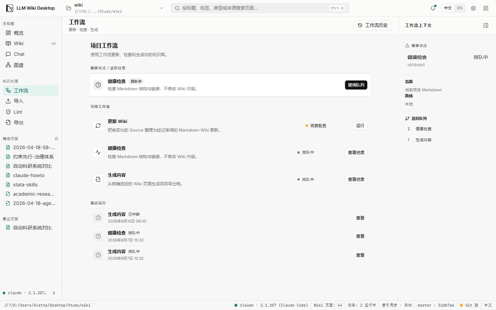
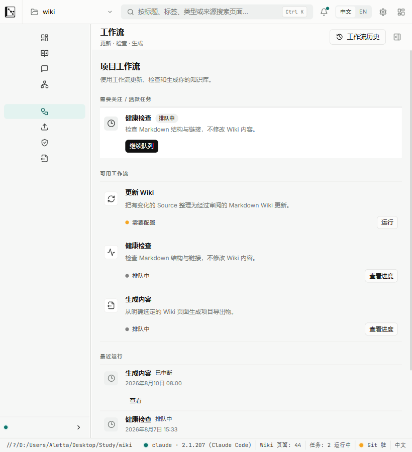

# Batch UI-1 Workflows viewport evidence

Date: 2026-08-10

Snapshot: final Batch UI-1 working tree after both review passes and the successful full `npm run check`; the Tauri debug binary was rebuilt from this snapshot before capture.

## Method

- Captured from the real Tauri v2 WebView2 surface connected to the local Vite frontend, not from a component test or static HTML.
- WebView2 device metrics set the content viewport to `1440 × 900` and `820 × 900` at DPR 1.
- The shipping Tauri window still has `minWidth: 1120`. Therefore 820 is explicitly stress-reflow evidence for Batch UI-1, not a claim that the current physical window can be resized to 820. Changing the global minimum belongs to UI-4 and was not attempted here.
- The earlier nominal 820 capture that cropped an 1120px window was replaced. The accepted 820 capture verifies `innerWidth = clientWidth = scrollWidth = 820` and dismisses the overlay context panel before capture.

## 1440 × 900

- `innerWidth/clientWidth/scrollWidth`: `1440/1440/1440`
- Shell: right context panel open; main work surface `970.5px` wide.
- Section order: Need attention / active task → Available workflows → Recent runs.
- Available workflow rows: fixed three; all row actions visible and inside the viewport (`right <= 1066.76px`).
- Recent runs rendered: 3 (bounded by the overview contract's maximum of 5).
- PNG: 116,663 bytes; SHA-256 `2E2D411A886345D8C81F3EAD037B2780616907AC39DFF0C0FE46AE138823BCB3`.

## 820 × 900 stress reflow

- `innerWidth/clientWidth/scrollWidth`: `820/820/820`; no document-level horizontal overflow.
- Shell: right context panel collapsed; main work surface `636.5px` wide.
- The same three overview sections remain ordered and readable.
- All three workflow actions remain visible and inside the viewport (`right <= 792.01px`); actions reflow beneath row metadata instead of clipping.
- Recent runs remain present below the fold and are reachable by vertical scrolling.
- PNG: 67,782 bytes; SHA-256 `CAB00A9C2B2315F90C7CB5C34236240B4A9DB9505B2FE78465355DABF462D54B`.

## Result

Batch UI-1 overview hierarchy, bounded recent history, single-primary action ownership, action discoverability, and component-level stress reflow are accepted at both evidence widths. The global 1120px minimum-window decision remains outside this batch.
