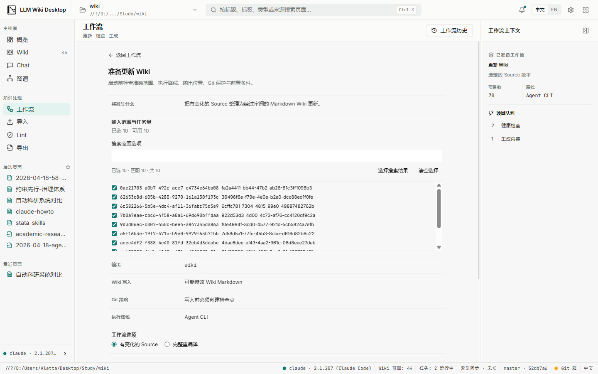
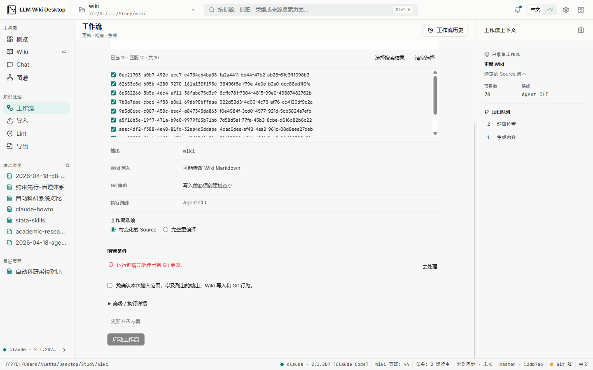
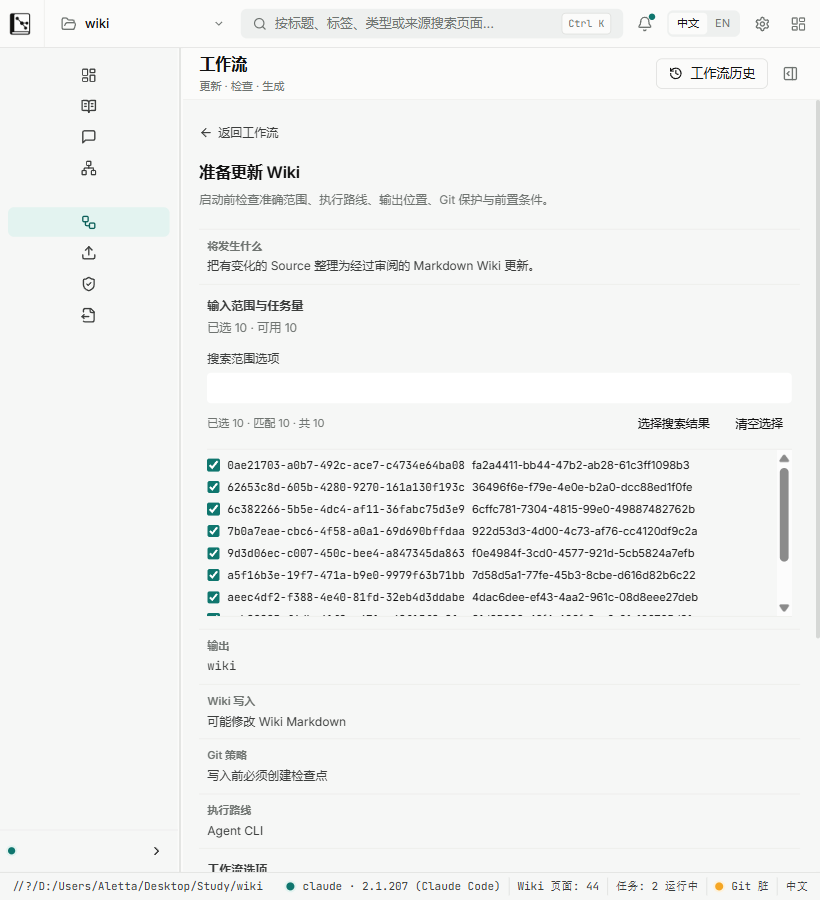
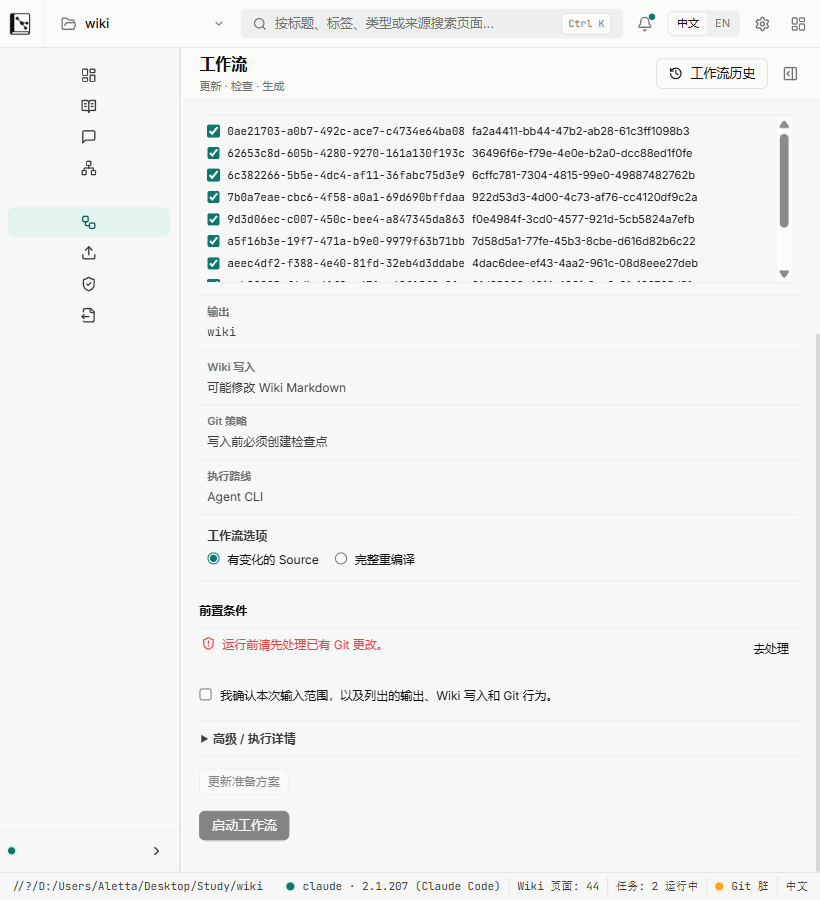

# Batch UI-2 non-Health Preparation viewport evidence

Date: 2026-08-10

Snapshot: final Batch UI-2 non-Health working tree after both reviewers returned CLEAN and the successful from-scratch `npm run check`.

## Method

- Captured from the real Tauri v2 WebView2 surface connected to the local Vite frontend, not from component tests or static HTML.
- Opened the real Update Wiki Preparation for the restored trusted project. The project was intentionally Git-dirty, so the captured primary action is truthfully blocked by its prerequisite.
- WebView2 device metrics set the content viewport to `1440 × 900` and `820 × 900` at DPR 1. The shipping `minWidth: 1120` remains unchanged; 820 is stress-reflow evidence only and changing global window behavior remains outside UI-2.
- The context panel remained docked at 1440 and was dismissed before the 820 capture, matching the existing responsive shell behavior.
- DOM measurements asserted eight ordered decision steps (`1` through `8`), collapsed execution details, document/main scroller width parity, and visibility of the primary action after scrolling to the bottom.

## 1440 × 900

- `innerWidth/clientWidth/scrollWidth`: `1440/1440/1440`.
- Main work surface `clientWidth/scrollWidth`: `967/967`; no local horizontal overflow.
- Main work surface `clientHeight/scrollHeight`: `772/1042`; the lower action area is reachable by the single intended vertical scroller.
- All eight steps are present in order. Technical details remain collapsed; the scope list is bounded by its own fixed-height viewport.
- At the bottom position the disabled-but-visible `启动工作流` action is fully inside the viewport.
- PNG SHA-256: top `BBA33288EE5412121C3619EE849DFCF803F6D3DBFFE754B380AC2C60945427FC`; bottom `B5C3080DC23004FA6DBC8023ACFDFC04EC19BEAA37C6A42D1F61F76DD4AFC3EC`.

## 820 × 900 stress reflow

- `innerWidth/clientWidth/scrollWidth`: `820/820/820`; no document-level horizontal overflow.
- Main work surface `clientWidth/scrollWidth`: `633/633`; scope controls, option labels, prerequisite action, confirmation, disclosure, and primary action remain within the work surface.
- Main work surface `clientHeight/scrollHeight`: `772/1107`; the lower action area remains reachable by vertical scrolling.
- The same eight steps remain ordered and the scope list stays bounded instead of expanding the DOM surface.
- At the bottom position the disabled-but-visible `启动工作流` action is fully inside the viewport.
- PNG SHA-256: top `9BC6A0743DE536E66C461C1D9D00D60BE1C26164A589444A4D355ED7A4477142`; bottom `D13DFDE3695B5B22567161CB63D03A2D2CCFD15A2CBC78E712D482DB8837C67B`.

## Result

The non-Health UI-2 Preparation surface satisfies the required eight-step decision hierarchy, bounded large-scope rendering, collapsed technical detail, truthful prerequisite blocking, and reachable primary action at both evidence widths without horizontal overflow. Health route copy and product availability remain outside this evidence and blocked by Decision Gate H.
