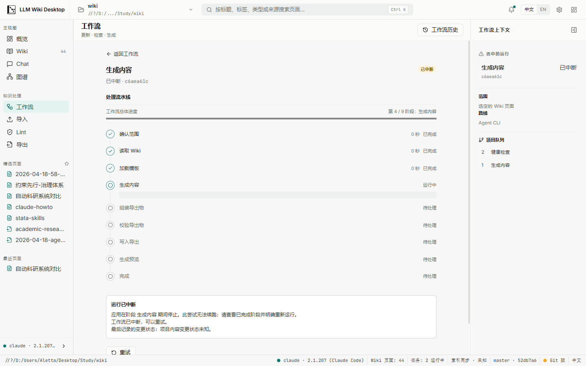
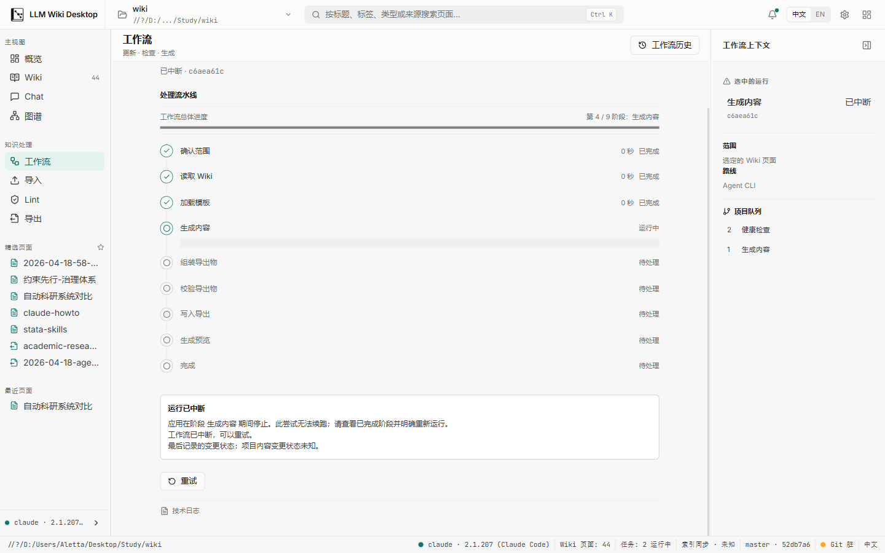
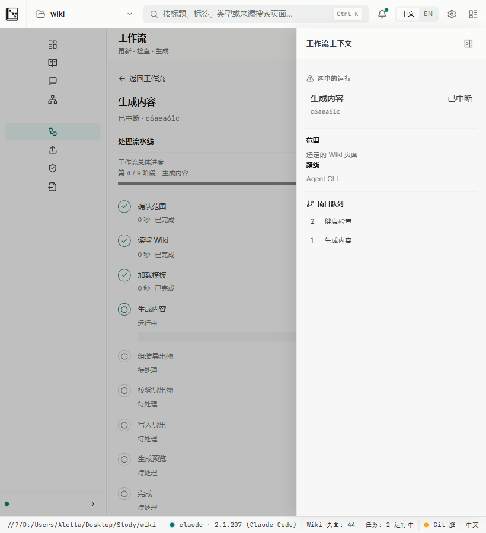
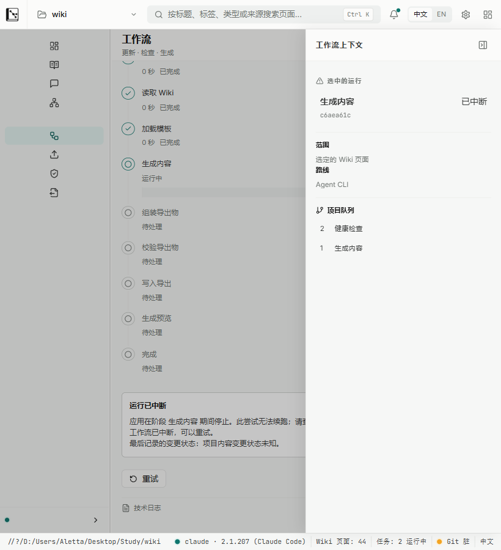

# Batch UI-3 task-detail viewport evidence

Date: 2026-08-10

Snapshot: Batch UI-3 implementation after the focused Workflows suite passed and the real-app visual pass closed the raw stage-id leak.

## Method

- Captured from the real Tauri v2 WebView2 surface connected to the local Vite frontend, not from component fixtures or static HTML.
- Opened an existing interrupted Generate Content run. No workflow was started and no project content was mutated for evidence collection.
- WebView2 device metrics set the content viewport to `1440 × 900` and `820 × 900` at DPR 1. The shipping `minWidth: 1120` remains unchanged; 820 is stress-reflow evidence only.
- The context panel is docked at 1440 and uses the existing overlay presentation at 820.
- DOM measurements asserted nine pipeline stages, exactly one expanded current stage, a distinct interrupted-run status with no failure region, collapsed technical logs, and document/work-surface width parity.

## 1440 × 900

- `innerWidth/clientWidth/scrollWidth`: `1440/1440/1440`.
- Work surface `clientWidth/scrollWidth`: `967/967`; no local horizontal overflow.
- Work surface `clientHeight/scrollHeight`: `772/856`; the interrupted-run facts and recovery action are reachable through the intended vertical scroller.
- Nine stages are present and only the current Generate Content stage is expanded. Completed stages show actual duration; future stages remain visually quiet.
- The interrupted summary uses the localized stage label, explicitly reports an unknown project-mutation state, recommends a concrete next step, and keeps technical logs collapsed. No failure region is rendered for this status.
- PNG SHA-256: top `3BD70FEA804C35322C4A4940CD3ACE3E55BDD11B2CF661AC341DF451F8C8CDB4`; bottom `3120CF0CE329A3055934B3F73BE0B7B34E299AE133032CCE3A8B85B2124CCD8F`.

## 820 × 900 stress reflow

- `innerWidth/clientWidth/scrollWidth`: `820/820/820`; no document-level horizontal overflow.
- Work surface `clientWidth/scrollWidth`: `633/633`; no local horizontal overflow.
- Work surface `clientHeight/scrollHeight`: `772/1026`; pipeline, interrupted-run facts, retry action, and collapsed logs remain reachable.
- The fact rows remain readable behind the existing context-panel overlay; long technical identifiers do not control the primary information hierarchy.
- PNG SHA-256: top `12A2EC135D53C265ABB56AAB071CA16B024923FEB97F6D504517F64502754C6E`; bottom `723A75D0CCE69F875F534B3731CF29AFE0E37A739F51717D03B2AB09A1666048`.

## Result

The real interrupted-run surface demonstrates the UI-3 pipeline, progress, cancelled-versus-failed separation, retry, log-subordination, localization, and stress-reflow requirements without horizontal overflow. Confirmation ordering, per-file two-way/three-way comparison, and the three discriminated result presenters are covered by regression tests instead of creating or applying a synthetic project mutation. Decision Gate H and Health route availability remain unchanged.
