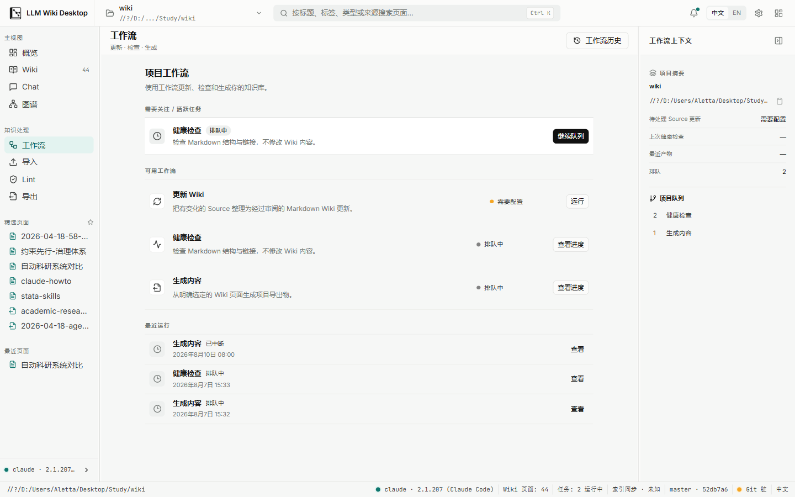
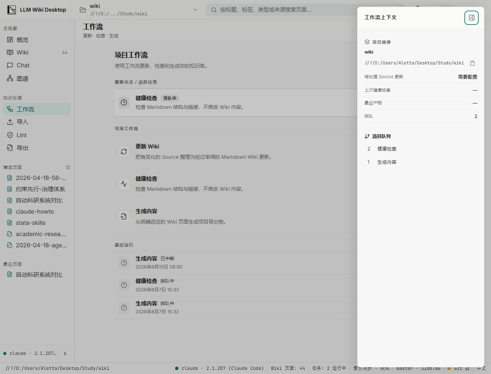
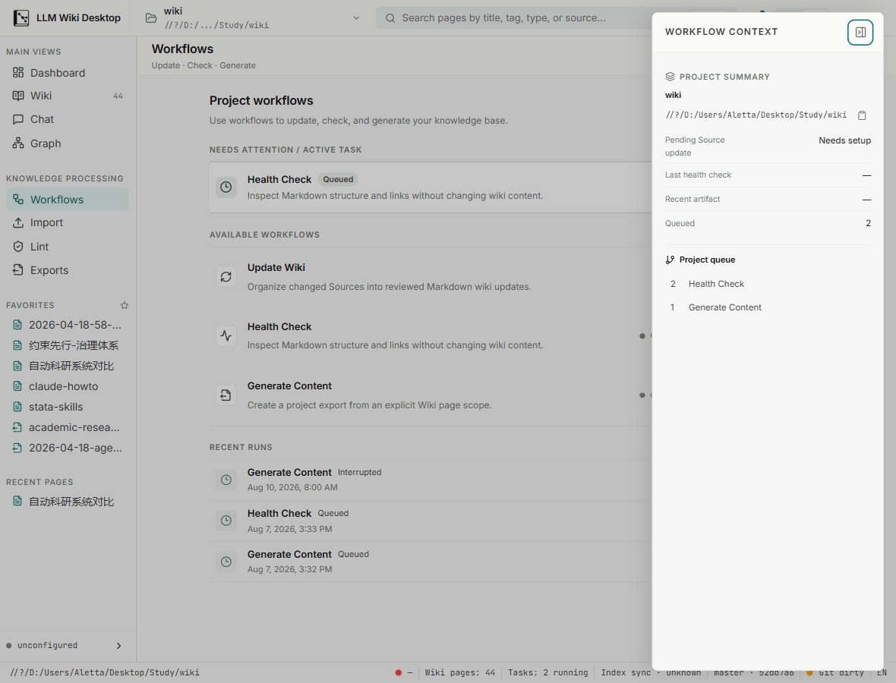
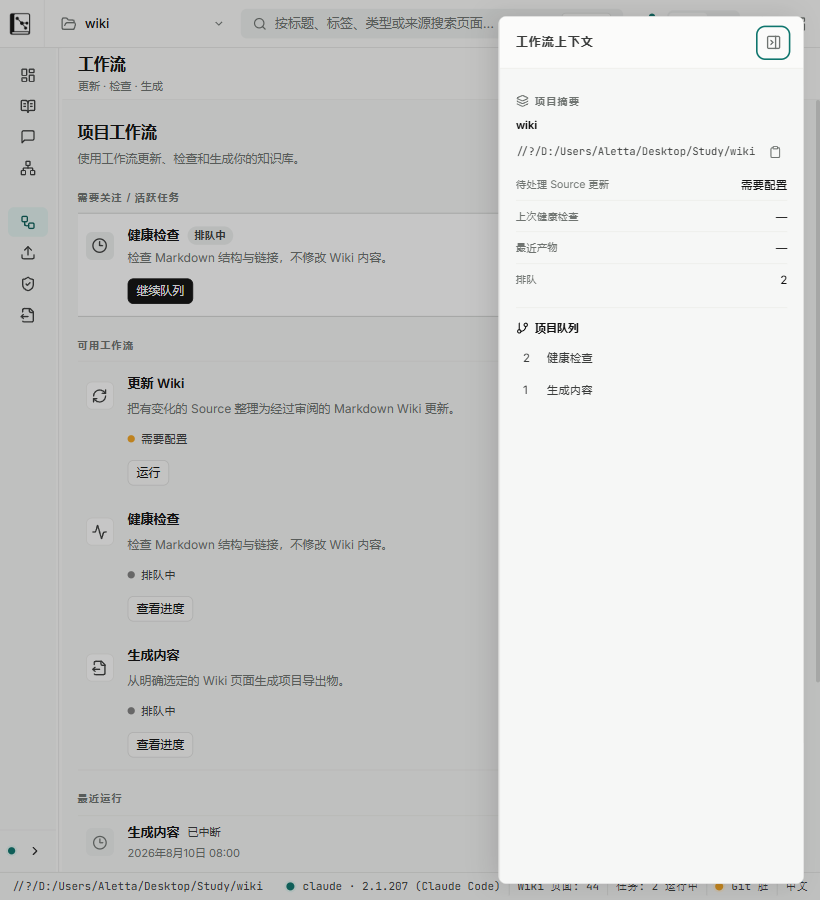
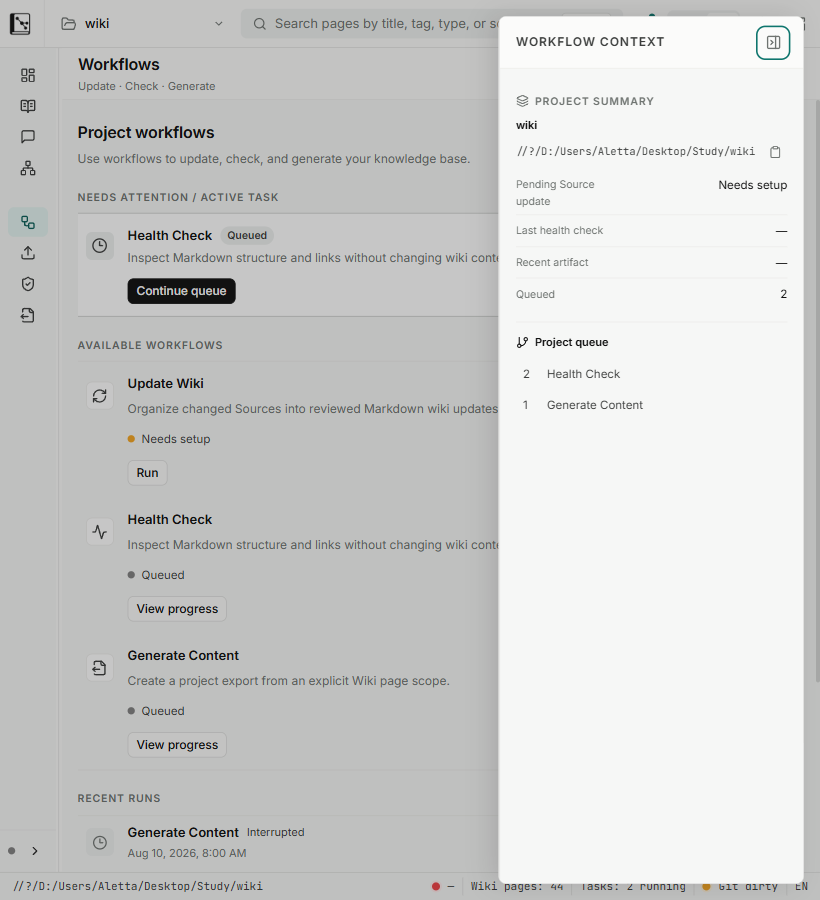
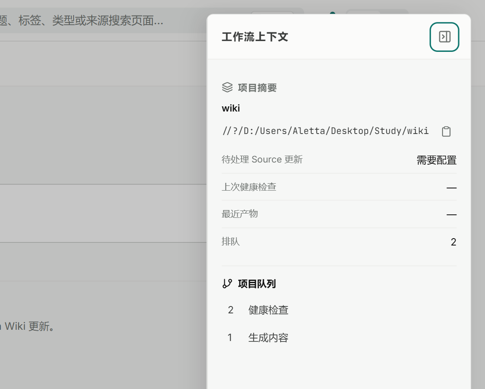

# Batch UI-4 right-panel viewport evidence

Date: 2026-08-10

Snapshot: Batch UI-4 viewport implementation after the focused Workflows suite and quick gate passed. The later review closure replaced overview fact values with the bounded backend `contextSummary` contract without changing the captured layout, breakpoint, modal, or reflow CSS; the final semantic state is covered by regression tests and the from-scratch full gate.

## Method

- Captured from the real Tauri v2 WebView2 surface connected to the local Vite frontend, not from component fixtures or static HTML.
- Opened the existing Workflows overview and its context panel. No workflow was started, continued, confirmed, reordered, or otherwise mutated.
- WebView2 device metrics set DPR 1 content viewports at `1440 × 900`, `1180 × 900`, `1179 × 900`, `1120 × 900`, and the stress-only `820 × 900`. A separate `1120 × 900` capture used a 200% page scale.
- The matrix covered Chinese and English. DOM measurements checked document, shell, Workflows surface, context panel, dialog labelling/focus containment, and the actual sidebar width.
- The first 820px measurement exposed the persisted inline sidebar width defeating the visual collapse. UI-4 then made the 820px token override authoritative; the final measurement is 56px.

## Docked desktop — 1440 × 900

- `innerWidth/clientWidth/scrollWidth`: `1440/1440/1440`; shell `clientWidth/scrollWidth`: `1440/1440`.
- Workflows surface `clientWidth/scrollWidth/clientHeight/scrollHeight`: `971/971/772/772`.
- Context panel is docked with no modal ancestor; its body remains the only panel-local vertical scroller.
- PNG SHA-256: `1CEA524DA717CBD04D6DB413D960E6D3CFC1E94D03B7BF6BF4D223DFBBFA9BB8`.

## Narrow breakpoint matrix — 1180 / 1179 / 1120

- At `1180`, `1179`, and `1120`, document, shell, and Workflows surface widths exactly matched their scroll widths: `1180/1180`, `1179/1179`, and `1120/1120` respectively.
- Every viewport used a dialog with `aria-modal="true"`, `aria-labelledby="right-context-panel-title"`, and focus inside the dialog after opening. The main pipeline kept its full narrow-layout width behind the overlay rather than being compressed by a fifth grid column.
- The panel measured `303/303` client/scroll width in Chinese and English; the viewport-clamped surface did not produce horizontal overflow.
- Chinese PNG SHA-256: 1180 `879DB01B5E94C2B16C9F6E0D9335382DBDE74B640C2CC9C56FDFD11D00691A5D`; 1179 `006113CE4050ACECB35F04D979A6BF73D0B3E59E20829C3AD766B7CE1CD3905A`; 1120 `94830D444B3D569074BD421CC327FC91B1DDECAA7D0A2AA14C7276C5CAC0007F`.
- English 1180 PNG SHA-256: `5C12C79F0F125EB6CBF80E300713A6325BECAAD496F2E3B73CF4D6B777F468A3`.

## 820 × 900 stress reflow

- `innerWidth/clientWidth/scrollWidth`: `820/820/820`; shell `clientWidth/scrollWidth`: `820/820`.
- Workflows surface `clientWidth/scrollWidth/clientHeight/scrollHeight`: `754/754/772/1024`. Its one intentional vertical scroller keeps all primary actions reachable without shell-level horizontal scrolling.
- The actual sidebar width is `56px`; labels collapse to the icon rail. Workflow row state/actions wrap underneath their copy, while the primary action remains visible in both languages.
- The modal measured `303/303` client/scroll width, retained its visible close button, and held focus after opening.
- PNG SHA-256: Chinese `CF06B3F9C7CBB87CC0633CF5C4E7BCBF64D2BAB0F1C083AAE0430BE1FD2AE85C`; English `054E18A8B5049631F72D2B2F1635CA1AB7F8F7BC758D3BF6BF80CC38F5945633`.

## 200% scale

- At a CSS viewport of `1120 × 900` and page scale 2, document and shell widths remained `1120/1120`; the Workflows surface remained `937/937` client/scroll width.
- The visible close button, full-path copy action, facts, and queue remain reachable through the panel's intended vertical scroller. No document-level horizontal scroller or competing nested horizontal scroller appeared.
- PNG SHA-256: `906FE28D1F101E20C5E0B3AA1F7D6007AE0CDFD79407E60185708BE7998BB7FD`.

## Result

The real-app pass confirms the inclusive 1180px mode switch, labelled modal semantics, focus entry, viewport clamp, 56px stress rail, translated wrapping, and absence of shell horizontal overflow. Escape, outside-click, Tab containment, identity-guarded trigger restoration, surface-title focus, bounded overview facts, raw-enum suppression, and reduced-motion behavior are additionally covered by regression/CSS contract tests. The final from-scratch `npm run check` passed. Decision Gate H and the Health route policy were not changed.
