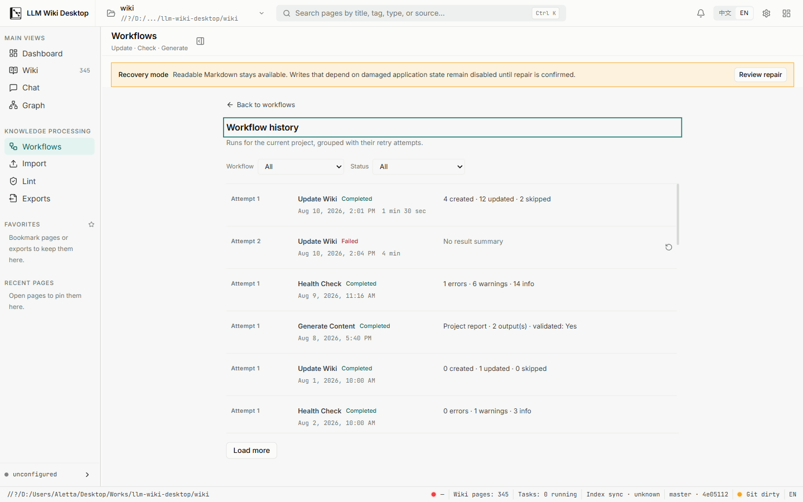
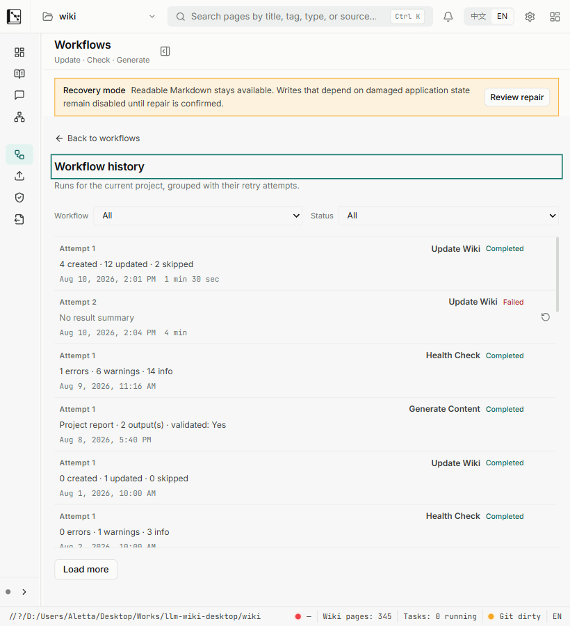

# Batch UI-5 History viewport evidence

Date: 2026-08-10

Snapshot: final Batch UI-5 implementation after both independent review passes and the focused Workflows regressions passed.

## Method

- Captured from the real Tauri v2 WebView2 surface connected to the local Vite frontend, not from a component render or static HTML.
- Opened the repository's existing legacy validation knowledge base read-only. Because it has no Workflow history and is already in recovery mode, representative bounded `WorkflowRunSummary` records for the current canonical identity were staged in memory through the live WebView only; no workflow was started, retried, confirmed, or persisted, and no project file was changed for the capture.
- WebView2 device metrics set DPR 1 content viewports at `1440 × 900` and the stress-only `820 × 900`.
- DOM measurements checked document/history/list width parity, the virtualized row bound, result summaries, retry-attempt presentation, and absence of the duplicate workspace-header History action.

## 1440 × 900

- `innerWidth/clientWidth/scrollWidth`: `1440/1440/1440`.
- History surface `clientWidth/scrollWidth`: `860/860`; its list is `808/808`, with no local horizontal overflow.
- The visible slice contains 14 mounted rows for a 448px viewport including overscan; the 10,000-attempt regression separately enforces the same bounded DOM contract.
- Update Wiki, Health Check, and Generate Content show compact typed outcomes. Attempt 1 and Attempt 2 remain individually recognizable and linked, the failed attempt exposes its row-owned retry action, and the workspace header contains zero duplicate History actions.
- PNG SHA-256: `90AEC3A75CBDD261B34CB42C1B4BA3BBAB51280D6A69FDCCE674ABE7D78B9015`.

## 820 × 900 stress reflow

- `innerWidth/clientWidth/scrollWidth`: `820/820/820`; no document-level horizontal overflow.
- History surface `clientWidth/scrollWidth`: `758/758`; its list is `722/722`.
- Filters expand without clipping. Each row reflows into attempt, workflow/status, outcome, and locale-formatted time/duration while preserving the independent retry button and intended vertical scroller.
- The recovery banner comes from the actual opened legacy project; the staged History summaries remained in-memory presentation evidence only.
- PNG SHA-256: `0827730291037BD26D18430311E0E702D310700A7CA98931D6E973ACFE21AFE5`.

## Result

The real-app pass confirms dense History layout, bounded virtualization, linked-but-individual attempts, compact outcomes, recovery affordance, responsive reflow, and removal of the duplicate header entry. Chinese date/empty/loading/error copy, server-filter/cursor recovery, identity rejection, same-minute retry-name uniqueness, and transient-versus-stale page recovery are covered by focused regressions. Decision Gate H and Health route availability remain unchanged.
