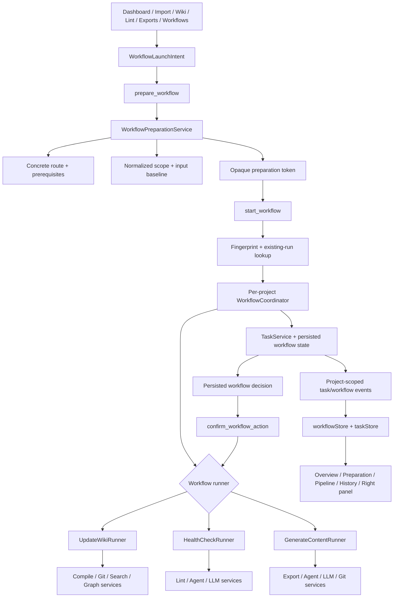

# Workflows Panel Implementation Plan

> **Status:** In progress — Batches 0–7 are committed; Batch 8 is pending its First-run / Project-open dependencies, independent review, and closure.
>
> **Progress signal:** The checklist count—253 unchecked boxes at the 2026-08-02 audit baseline—is not implementation status. Commit history plus `SPEC/progress.txt` are authoritative: Batches 0–7 are committed; Batch 8 remains uncommitted, its required review is not closed, and its First-run / Project-open dependencies are still pending.
>
> **Product and interaction authority:** [`../specs/2026-07-30-workflows-panel-redesign.md`](../specs/2026-07-30-workflows-panel-redesign.md)
>
> **Project access authority:** [`../specs/2026-07-30-first-run-project-open-workbench-design.md`](../specs/2026-07-30-first-run-project-open-workbench-design.md)
>
> **Living migration roadmap:** [`../../../SPEC/roadmap/agent.md`](../../../SPEC/roadmap/agent.md)
>
> **For agentic workers:** Execute the batches in dependency order. Use commit history plus `SPEC/progress.txt`, not checkbox state, to determine completed work. Every batch must append a milestone to `SPEC/progress.txt`; record only recurring or subtle failures in `SPEC/gotchas.txt`.

**Goal:** Replace the legacy Agent configuration-and-launch surface with a production-ready, project-scoped Workflows experience for **更新 Wiki / Update Wiki**, **健康检查 / Health Check**, and **生成内容 / Generate Content**. The result must provide one preparation model, one observable task model, one per-project serial queue, one confirmation/recovery path, and one history model across every launch entry.

**Architecture:** Add a typed Workflows orchestration layer above the existing `CompileService`, `LintService`, `ExportService`, `AgentService`, `LlmService`, `GitService`, and generic `TaskService`. Keep one persisted task record per run and attach optional workflow execution metadata to that record. React consumes bounded workflow read DTOs through typed Tauri IPC; it never decides filesystem, Git, route fallback, conflict, queue, or confirmation behavior. The legacy Agent page stays reachable internally until the backend contracts and all three runners are green, then one cutover batch replaces it.

**Tech stack:** React 19, TypeScript, Zustand, react-i18next, Tailwind CSS v4 plus `src/styles.css`, Lucide React, Tauri v2, Rust services, Markdown + JSON project storage, Git checkpoints, Vitest, Testing Library, Rust unit/integration tests.

---

## 1. Non-negotiable product contract

Implementation must preserve all confirmed decisions below:

- User-facing navigation is `工作流 / Workflows`; the sidebar group is `知识处理 / Knowledge Processing`; the icon is Lucide `Workflow`; the Workflows nav item has no badge.
- The existing Agent name/version sidebar foot remains.
- Agent CLI, BYOK, Provider, model, and Skill are execution details. Configuration remains in the existing Settings experience.
- First release has exactly three built-in workflows: Update Wiki, Health Check, and Generate Content.
- Do not add Source batch organization, user-authored workflows, scheduled triggers, arbitrary prompts, custom run instructions, custom Skills, or imported/user-authored output templates.
- Settings, Lint result/repair, and Exports result/preview layouts remain unchanged. Workflows owns preparation and execution observation; Lint and Exports retain their domain results.
- Workflow rows are compact and stable in order. At most one row is recommended. Recommendations never reorder or auto-run work.
- Every workflow opens a full main-area preparation view. Do not restore `RunAgentDialog`.
- The first run confirms scope. A later quick rerun is allowed only when the stored structured settings, prerequisites, scope, and input baseline remain valid.
- The effective route is resolved before execution. A failed or unavailable route never silently falls back to another Agent, Provider, or model.
- All runs, queues, confirmations, task selection, and history are isolated by project. One project runs one workflow at a time.
- Workflows never manufactures a project context. With no open knowledge base, it returns an `open_or_create_project` prerequisite instead of creating a task.
- External Agent, Provider, model, and Skill execution requires a trusted project. Any content mutation additionally requires a writable project; a read-only or restricted project remains inspectable but cannot start that run.
- A workflow that promises a Git checkpoint may start only when the backend has revalidated that the active project supports the required checkpoint policy. Existing dirty Git state is never auto-cleaned, reset, committed, or stashed.
- Identical project + workflow + normalized input + baseline + execution options return the existing active/queued run instead of creating a duplicate.
- User-facing states are queued, running, waiting for confirmation, completed, failed, cancelled, and interrupted.
- Raw logs are secondary, read-only, copyable, and collapsed by default.
- Health Check itself is read-only. Repairs remain downstream Lint actions.
- Update Wiki and safe repairs apply low-risk, conflict-free changes automatically only after the required Git checkpoint succeeds.
- Generate Content does not need a checkpoint for a new artifact. Overwriting an existing artifact requires a checkpoint and confirmation.
- Delete, overwrite, broad rewrite, and conflict changes wait asynchronously for explicit confirmation.
- Users may keep editing while a workflow runs. Before applying, the backend rechecks the captured baseline and uses a three-way conflict path.
- Only waiting for confirmation, completed, and failed produce system notifications.
- Retry creates a linked new attempt. Interrupted work does not claim unsupported mid-process resume.
- Queued runs survive restart but require explicit queue continuation.
- Import completion never automatically compiles the Wiki.

---

## 2. Current implementation audit

| Area | Current implementation | Required migration |
|---|---|---|
| Primary page | `src/features/agent/AgentView.tsx` shows CLI rows, BYOK cards, four launch cards, tasks, and logs | Replace with a Workflows overview, preparation, task detail, and history surface |
| Launch UI | `RunAgentDialog.tsx` exposes arbitrary Skill and route choices in a modal | Replace with workflow-specific, full-area structured preparation |
| Controller | `useAgentWorkflow.ts` directly maps Skills to compile, lint, chat, and export actions | Replace with `useWorkflowsController` and one typed workflow launch intent |
| Navigation | `AppView = "agent"`, `Bot`, `nav.agent`, sidebar group `shell.workflow` | Cut over to `"workflows"`, Lucide `Workflow`, and Knowledge Processing copy |
| Task states | `queued`, `running`, `waiting_for_confirmation`, `cancelling`, `cancelled`, `succeeded`, `failed` | Add backend `interrupted`; map internal `succeeded` to user-facing completed and keep cancelling as transitional detail |
| Task visibility | `TaskService::set_project_root` returns all in-memory tasks, including other projects | Expose only the active project's tasks/runs to React; background work may continue but must remain invisible outside its project |
| Recovery | queued/running/cancelling/waiting tasks currently recover as failed | Preserve queued with `continuationRequired`; map terminated running/cancelling to interrupted; persist and restore waiting confirmations |
| Queue | compile, lint, and export independently spawn tasks | Add one per-project workflow coordinator and serial queue |
| Dedupe | deep Lint has a task-type-only guard; compile/export do not share a fingerprint | Canonical workflow fingerprint across all three runners |
| Progress | generic percentage, logs, and safe Agent activity | Persist workflow-specific stage timeline, current object, bounded counts, duration, and decision nodes |
| Route | existing callers pass legacy `auto`; services may resolve Agent then BYOK | Preparation must resolve a concrete route once; execution receives only that route and never falls back |
| Update Wiki | compile has workspace, checkpoint, baseline, manifest, and conflict logic | Reuse it behind a nine-stage runner; add changed/default vs full scope and workflow metadata |
| Health Check | local Lint is synchronous; deep Lint is a separate task | Compose both into one read-only eight-stage workflow and one merged report |
| Generate Content | Exports owns dialog, task launch, records, and preview | Reuse generation services behind a nine-stage runner while leaving result management in Exports |
| Confirmation | `ConfirmationRegistry` is in-memory; some task results carry `PendingAction` | Persist workflow decision state with the task and safely rehydrate after restart |
| Shared entries | Dashboard, Import, Wiki, Lint, and Exports use separate callbacks/dialogs | Replace with one project-bound `WorkflowLaunchIntent` and preparation route |
| Right panel | `AgentRightPanel` duplicates settings and Skill status | Replace with contextual workflow/run information; Settings remains the only configuration surface |

The implementation must not mechanically rename backend Agent concepts. `AgentService`, Agent kinds, provider types, and Settings Agent configuration remain valid technical concepts.

---

## 3. Target architecture



### 3.1 Source of truth and storage

Do not introduce a database.

- When project app state is writable, existing task persistence remains under `ProjectLayout.taskStateRoot` (native mapping: `.app/tasks/<taskId>.json`). Permitted restricted/read-only inventory or Local Quick Check runs, plus trusted read-only Complete Check runs, are memory-only, carry the same typed task/result envelope, and never try to create `.app/`.
- Increment the private persisted task-entry schema and add an optional `workflow` block. Legacy files without this block continue to deserialize.
- Store only structured, non-secret workflow metadata:
  - workflow kind and schema version;
  - normalized scope and structured options;
  - concrete route identity without credentials;
  - input baseline summary and canonical fingerprint;
  - stage definitions, timestamps, current object, and count progress;
  - queue position and `continuationRequired`;
  - `attemptOf` / retry grouping;
  - pending decision descriptor and safe candidate references;
  - completion/failure result summary.
- Keep API keys, cookies, prompt bodies, source excerpts, model output, absolute temporary paths, and raw command arguments out of task JSON.
- Store reusable last-run structured preferences beneath `ProjectLayout.workflowStateRoot` (native mapping: `.app/workflows/preferences.json`) only when that path is writable. Restricted/read-only runs keep preferences and results in memory and label them non-persistent. The file may contain scope modes, Health Check mode, artifact type, and last route identity; it must not contain arbitrary instructions or secrets.
- Temporary candidate workspaces remain backend-owned. Persist only a validated project-relative or task-owned identifier required to find them again.

### 3.2 State ownership

- `TaskService` remains the generic lifecycle, cancellation, log, activity, event, and atomic persistence owner.
- `WorkflowCoordinator` owns workflow queueing, fingerprint dedupe, project serialization, retry linkage, continuation, and dispatch.
- Each runner owns its typed stages and calls existing domain services.
- `WorkflowPreparationService` owns prerequisites, default scope, route resolution, baseline capture, output summary, and preparation tokens.
- `ConfirmationRegistry` remains the generic execution guard while the persisted workflow state supplies a restart-safe reconstruction descriptor.
- `workflowStore` owns only active-project presentation DTOs and selection.
- `taskStore` continues to own generic current-project task cards/logs. It must ignore events for a non-active project.
- `navigationStore` owns a project-bound launch intent, not workflow execution state.

### 3.3 Route resolution

Settings UI remains structurally unchanged in this migration.

1. Preparation reads the existing `agentDefault`, enabled provider configuration, and capability status.
2. If those settings identify one valid route, preparation returns a concrete Agent or BYOK route.
3. If the current configuration is missing or ambiguous, preparation returns a prerequisite or requires an explicit one-run choice in Advanced Settings.
4. `start_workflow` accepts the concrete prepared route, never legacy `auto`.
5. The runner invokes exactly that Agent or Provider. Failure is reported on that route; it never attempts another engine.
6. Concrete routes carry the selected non-secret model identity when applicable plus a backend-derived opaque `routeRevision`; frontend overrides submit only `WorkflowRouteSelection` and cannot invent either value.
7. Returning from Settings reruns preparation and restores the user's structured scope, but never starts automatically.

Legacy `auto` remains temporarily supported by existing Chat/Compile/Lint/Export commands until their callers migrate. It is forbidden in new Workflows IPC contracts.

### 3.4 Canonical fingerprint

Compute the fingerprint in Rust, never in React:

```text
sha256(
  workflowSchemaVersion
  + canonicalIdentityKey
  + identityRevision
  + workflowKind
  + canonicalJson(normalizedScope)
  + canonicalJson(executionAffectingOptions)
  + concreteRouteIdentity
  + baselineFingerprint
)
```

Exclude timestamps, queue position, presentation labels, notification preferences, and secret values. Include output target and existing target hash for Generate Content. A matching queued, running, or waiting run returns `existing`; completed/failed/cancelled/interrupted history never blocks a new attempt.

`canonicalIdentityKey` and `identityRevision` are backend-derived opaque values bound to the canonical folder identity. Runtime `projectId` is only a current-process handle and never participates in persistent dedupe, recovery or queue ownership. A root opened through a symlink/junction and its real canonical path therefore share one queue/fingerprint; a materially replaced folder receives a new identity revision.

### 3.5 User-facing status mapping

| Backend task state | Workflows display state | Notes |
|---|---|---|
| `Queued` | queued | May also carry `continuationRequired` after restart |
| `Running` | running | Shows current stage and current object |
| `Cancelling` | running | Secondary label “正在取消”; not a separate primary state |
| `WaitingForConfirmation` | waiting for confirmation | Shows an inline decision node |
| `Succeeded` | completed | Preserve wire compatibility with existing task consumers |
| `Failed` | failed | Only genuine execution failures |
| `Cancelled` | cancelled | Never presented as failure |
| `Interrupted` | interrupted | Process/app termination; explicit rerun, no fake resume |

### 3.6 Typed workflow contracts

The exact names may be adjusted to match Rust conventions, but wire casing and meaning must remain stable.

```ts
export type WorkflowKind =
  | "update_wiki"
  | "health_check"
  | "generate_content";

export type WorkflowRoute =
  | { kind: "local"; routeRevision: string }
  | {
      kind: "agent";
      agent: AgentKind;
      model: string | null;
      routeRevision: string;
    }
  | {
      kind: "byok";
      provider: LlmProviderKind;
      model: string;
      routeRevision: string;
    };

export type WorkflowRouteSelection =
  | { kind: "agent"; agent: AgentKind }
  | { kind: "byok"; provider: LlmProviderKind };

export type WorkflowScope =
  | {
      kind: "update_wiki";
      mode: "changed_sources" | "full_recompile";
      sourceVersions: SourceVersionRef[];
    }
  | {
      kind: "health_check";
      mode: "local_quick" | "complete";
    }
  | {
      kind: "generate_content";
      artifactType:
        | "beautiful_read"
        | "knowledge_card"
        | "concept_map"
        | "project_report";
      pagePaths: string[];
      outputPath: string | null;
    };

export interface WorkflowStage {
  id: string;
  ordinal: number;
  status: "pending" | "running" | "completed" | "failed" | "waiting" | "skipped";
  labelKey: string;
  startedAt: string | null;
  completedAt: string | null;
  currentItem: string | null;
  progress: { current: number; total: number | null } | null;
  decision: WorkflowPendingAction | null;
}

export type WorkflowCandidateReference =
  | { kind: "task_owned"; candidateId: string }
  | { kind: "project_relative"; path: string };

export interface WorkflowPendingAction {
  id: string;
  actionType: PendingActionType;
  riskLevel: RiskLevel;
  affectedPaths: string[];
  candidate: WorkflowCandidateReference | null;
  expiresAt: string | null;
  checkpointHash: string | null;
}

export interface WorkflowErrorSummary {
  code: string;
  messageKey: string;
  recoverable: boolean;
  userActionRequired: boolean;
  suggestedAction: WorkflowPrerequisiteAction | null;
}

export interface WorkflowRun {
  taskId: string;
  projectId: string;
  canonicalIdentityKey: string;
  identityRevision: string;
  kind: WorkflowKind;
  displayStatus:
    | "queued"
    | "running"
    | "waiting_for_confirmation"
    | "completed"
    | "failed"
    | "cancelled"
    | "interrupted";
  scope: WorkflowScope;
  route: WorkflowRoute | null;
  fingerprint: string;
  baselineFingerprint: string;
  stages: WorkflowStage[];
  currentStageId: string | null;
  queuePosition: number | null;
  continuationRequired: boolean;
  attemptOf: string | null;
  pendingAction: WorkflowPendingAction | null;
  result: WorkflowResult | null;
  error: WorkflowErrorSummary | null;
  startedAt: string;
  updatedAt: string;
  completedAt: string | null;
}
```

Required commands:

```text
get_workflows_overview
prepare_workflow
start_workflow
list_workflow_runs
get_workflow_run
cancel_workflow_run
undo_cancel_queued_workflow
reorder_queued_workflow
continue_queued_workflows
retry_workflow
confirm_workflow_action
discard_workflow_result
```

Every command takes `projectId + projectRootPath`; run-by-ID commands also verify that the task belongs to that resolved project.

---

## 4. Batch dependency map

```text
Batch 0  Contract freeze and RED baselines
   ↓
Batch 1  Persisted project-scoped task/queue foundation
   ↓
Batch 2  Overview, preparation, prerequisites, route, quick-rerun model
   ↓
   ├── Batch 3  Update Wiki runner
   ├── Batch 4  Health Check runner
   └── Batch 5  Generate Content runner
             ↓
Batch 6  Workflows React surface and right panel
   ↓
Batch 7  Shared entry points, confirmation, notifications, recovery UX
   ↓
Batch 8  Legacy cutover, accessibility/visual QA, full verification
```

Batches 3–5 may be developed in parallel only after Batch 2 has frozen the runner trait and stage sink. They must stay in separate runner modules and may not each modify queue semantics.

---

## Batch 0 — Freeze contracts and regression baselines

**Purpose:** Establish new typed boundaries and failing behavioral tests without changing the visible Agent page.

**Primary files**

- Create: `src-tauri/src/models/workflow.rs`
- Create: `src/types/workflow.ts`
- Create: `src/services/workflowApi.ts`
- Create: `src/services/workflowApi.test.ts`
- Create: `src-tauri/tests/workflow_contracts.rs`
- Create: `src/test/workflows-architecture.test.ts`
- Modify: `src-tauri/src/models/mod.rs`
- Modify: `src/types/task.ts`
- Modify: `src-tauri/src/models/task.rs`

### Tasks

- [ ] Define Rust and TypeScript enums/unions for workflow kind, route, scope, stage, baseline summary, project access summary, prerequisite, preparation, run, result, retry link, and start outcome.
- [ ] Add `TaskStatus::Interrupted` to Rust and `"interrupted"` to TypeScript while preserving every existing serialized state.
- [ ] Add a pure display-status mapper; do not rename backend `Succeeded`.
- [ ] Define `workflowApi` with exact command names and one typed `request` object per call. Do not expose `invoke(name, payload)` as a generic escape hatch.
- [ ] Add serde tests for snake_case enums, camelCase fields, tagged scope/route unions, optional migration fields, and absence of secret-bearing fields.
- [ ] Add TypeScript fixtures proving Rust-shaped JSON parses into the expected discriminated unions.
- [ ] Add architecture tests that prevent new Workflows code from importing filesystem APIs, constructing arbitrary command strings, accepting arbitrary prompts, or reading Provider secrets.
- [ ] Freeze the legacy baseline tests for `AgentView`, `RunAgentDialog`, `WorkspaceController`, navigation, task drawer, compile, lint, and export before later deletion.
- [ ] Record the intended storage schema version and legacy default behavior in the Rust contract tests.

### Focused verification

```text
npm run test -- src/services/workflowApi.test.ts src/test/workflows-architecture.test.ts
npm run test -- src/features/agent/agent.test.tsx src/features/agent/useAgentWorkflow.test.tsx src/components/app/WorkspaceController.test.tsx src/components/app/WorkspaceRouter.test.tsx src/stores/navigationStore.test.ts src/components/app/TaskLogDrawer.test.tsx src/hooks/useTaskLauncher.test.tsx
cargo test --manifest-path src-tauri/Cargo.toml --no-default-features --test workflow_contracts
npm run check:quick
```

### Exit criteria

- [ ] New contracts compile on both sides.
- [ ] No visible navigation or page behavior changes.
- [ ] Old persisted task fixtures still deserialize.
- [ ] The architecture test fails if a new workflow accepts arbitrary prompt/shell input.

### Suggested commit

```text
test(workflows): freeze typed workflow contracts
```

---

## Batch 1 — Build the persisted project-scoped queue and recovery foundation

**Purpose:** Make queueing, dedupe, project isolation, persistence, cancellation, retry linkage, and crash semantics correct before a new page depends on them.

**Primary files**

- Create: `src-tauri/src/services/workflow_service/mod.rs`
- Create: `src-tauri/src/services/workflow_service/coordinator.rs`
- Create: `src-tauri/src/services/workflow_service/fingerprint.rs`
- Create: `src-tauri/src/services/workflow_service/persistence.rs`
- Create: `src-tauri/src/services/workflow_service/stage_sink.rs`
- Create: `src-tauri/tests/workflow_queue.rs`
- Create: `src-tauri/tests/workflow_recovery.rs`
- Modify: `src-tauri/src/tasks/task_model.rs`
- Modify: `src-tauri/src/tasks/task_service.rs`
- Modify: `src-tauri/src/tasks/task_events.rs`
- Modify: `src-tauri/src/models/task.rs`
- Modify: `src-tauri/src/services/mod.rs`
- Modify: `src-tauri/src/app_state.rs`
- Modify: `src-tauri/src/commands/task_commands.rs`
- Modify: `src-tauri/src/lib.rs`
- Modify: `src/stores/taskStore.ts`
- Modify: `src/hooks/useTaskEvents.ts`
- Modify tests beside every touched file

### Tasks

- [ ] Version `PersistedTaskEntry` and add an optional persisted workflow execution block. Missing version/workflow fields must default safely.
- [ ] Add `TaskService::create_workflow_task` instead of teaching every runner to mutate private task state.
- [ ] Add atomic methods for:
  - workflow metadata initialization;
  - stage start/progress/complete/fail/wait;
  - queue position and continuation flags;
  - pending decision attach/clear;
  - result and attempt linkage;
  - interrupted recovery.
- [ ] Ensure each workflow metadata mutation writes one atomic task snapshot and emits a project-scoped workflow event.
- [ ] Implement canonical JSON normalization and Rust-only SHA-256 fingerprinting.
- [ ] Add a per-canonical-identity coordinator:
  - one running workflow per `canonicalIdentityKey + identityRevision`;
  - FIFO among distinct fingerprints;
  - workflows from separate projects may run independently subject to existing global limits;
  - non-workflow Import/Chat tasks do not enter this serial queue.
- [ ] Return an existing queued/running/waiting run on matching fingerprint.
- [ ] Make queue cancellation immediate. Persist enough state to support a short server-authoritative undo window without deleting the history record.
- [ ] Make retry create a new task with `attemptOf`; never mutate the original failed/interrupted attempt back to queued.
- [ ] Project-scope task reads:
  - add/replace the frontend-facing task list command with explicit project context;
  - stop returning every in-memory task from `set_active_project`;
  - keep other-project workers alive in the backend;
  - ignore non-active-project task/workflow events in React;
  - reload the correct project snapshot when switching back.
- [ ] Recovery rules:
  - queued → queued + `continuationRequired = true`;
  - running/cancelling → interrupted with last stage, baseline, route, logs, and explicit rerun action;
  - waiting → waiting if its persisted decision descriptor validates;
  - terminal states stay terminal;
  - never label a recovered interruption as failed.
- [ ] Add explicit `continue_queued_workflows`; opening the app or project must not start recovered queued work automatically.
- [ ] Preserve cancellation and persistence behavior for Import, Chat, Source AI organize, graph, and other non-workflow tasks.

### Required tests

- [ ] Two starts with identical fingerprints return one task ID.
- [ ] A changed range, output type, route, or baseline produces a new task.
- [ ] A project never has two running workflows.
- [ ] Project A and B can each have one running workflow without appearing in each other's list.
- [ ] Opening the same root through an allowed symlink/junction and through its real path yields the same canonical identity, queue owner, and fingerprint.
- [ ] Switching projects does not cancel background work and does not leak its events or selected task.
- [ ] Restarted queued tasks do not execute until `continue_queued_workflows`.
- [ ] Restarted running tasks become interrupted.
- [ ] Waiting confirmation survives restart only when its reconstruction data remains valid.
- [ ] Cancel/undo is idempotent and cannot revive a running or terminal task.
- [ ] Retry links attempts and preserves the original record.
- [ ] CJK project roots, Windows drive paths, POSIX paths, and case-only path differences are covered.

### Verification

```text
cargo test --manifest-path src-tauri/Cargo.toml --no-default-features --test workflow_queue --test workflow_recovery
npm run test -- src/stores/taskStore.test.ts src/hooks/useTaskEvents.test.tsx
npm run check
```

Run the full gate because this batch changes persistence, concurrency, cancellation, and recovery.

### Suggested commits

```text
feat(workflows): add persisted workflow task state
feat(workflows): serialize queues by project
fix(tasks): isolate recovery and events by active project
```

---

## Batch 2 — Implement overview, preparation, prerequisites, and route resolution

**Purpose:** Produce a complete, testable read/start contract before implementing workflow-specific runners or UI.

**Primary files**

- Create: `src-tauri/src/services/workflow_service/preparation.rs`
- Create: `src-tauri/src/services/workflow_service/preferences.rs`
- Create: `src-tauri/src/services/workflow_service/overview.rs`
- Create: `src-tauri/src/commands/workflow_commands.rs`
- Create: `src-tauri/tests/workflow_preparation.rs`
- Create: `src-tauri/tests/workflow_routes.rs`
- Modify: `src-tauri/src/commands/mod.rs`
- Modify: `src-tauri/src/lib.rs`
- Modify: `src-tauri/src/services/workflow_service/mod.rs`
- Modify: `src/services/workflowApi.ts`
- Modify contract tests

### Tasks

- [ ] Implement `get_workflows_overview` with exactly three rows in fixed order.
- [ ] Compute row state from active-project facts only:
  - active/waiting/failed run;
  - last completion;
  - prerequisite summary;
  - recommended next action.
- [ ] Keep recommendation deterministic:
  - no Sources → Update Wiki points to Import prerequisite;
  - changed Sources → recommend Update Wiki;
  - readable Source/Wiki Markdown exists but no current health result → recommend Health Check;
  - otherwise no forced recommendation unless a domain result clearly suggests one.
- [ ] Implement typed prerequisites with action destinations, not disabled rows.
- [ ] Implement `prepare_workflow`:
  - require an active project context and capture its canonical identity, trust state, layout, access mode, writability, and Git capability;
  - capture a stable project baseline;
  - normalize scope and structured options;
  - resolve output summary and Git policy;
  - resolve a concrete route when the selected mode requires external execution, use an explicit local route for deterministic-only work, or return a prerequisite/choice;
  - issue an opaque preparation ID plus revision;
  - never write project content.
- [ ] Model project-access prerequisites explicitly:
  - no project → open or create a knowledge base;
  - restricted project → trust the knowledge base before any external AI/Agent/Skill execution;
  - read-only project → keep read-only workflows available and explain why mutation is blocked;
  - required Git checkpoint unavailable or the repository is already dirty → return an explicit prerequisite/confirmation path without mutating Git state.
- [ ] Validate preparation IDs on start against canonical project identity, trust/access/writability/Git policy, scope revision, prerequisite state, and baseline. Expired/stale preparation returns a structured “prepare again” result.
- [ ] Preserve the user's populated scope when returning from Settings.
- [ ] Implement first-run and quick-rerun rules:
  - first run always returns preparation requiring explicit scope confirmation;
  - later run may mark `quickRerunEligible`;
  - baseline, prerequisites, applicable scope, output target, or route changes revoke eligibility;
  - quick rerun still requires a user action.
- [ ] Persist only structured last-run preferences beneath writable `ProjectLayout.workflowStateRoot` (native mapping: `.app/workflows/preferences.json`); otherwise keep the permitted read-only run ephemeral.
- [ ] Update Wiki defaults to changed/unconsumed Sources. Full recompile is an advanced explicit mode.
- [ ] Health Check first run defaults:
  - trusted project + concrete AI route available → complete;
  - trust unavailable or no concrete AI route → local quick;
  - later runs remember the project's last mode.
- [ ] Generate Content preparation exposes only built-in artifact types and valid page/project scopes.
- [ ] Resolve route from current Settings/capabilities:
  - valid configured default → concrete route;
  - missing/ambiguous → structured prerequisite or explicit advanced choice;
  - never emit `auto` in `WorkflowPreparation`;
  - never probe a fallback after start.
- [ ] `start_workflow` re-resolves the active project by canonical identity, revalidates trust/access/writability/Git policy and the baseline, then recomputes the fingerprint server-side and returns `{ kind: "created" | "existing", run }`.

### Required tests

- [ ] Overview always contains exactly the three fixed rows and never reorders them.
- [ ] Empty/incomplete projects keep rows visible and return the correct prerequisite action.
- [ ] No-project, Git-unavailable, and pre-existing dirty-Git states return truthful prerequisites and create no invalid task. Untrusted restricted/read-only projects with readable Markdown may create a valid ephemeral Local Quick Check; trusted read-only projects with a concrete AI route may also create an ephemeral Complete Check. Every mutation stays blocked until its trust/write/Git prerequisites are met.
- [ ] Changing project trust, access, writability, Git state, or canonical identity after preparation invalidates start.
- [ ] Settings return preserves scope but does not auto-run.
- [ ] First-run confirmation and later quick-rerun validity are enforced server-side.
- [ ] Stale baseline invalidates a preparation token.
- [ ] Route ambiguity requires a choice; unavailable route does not fall back.
- [ ] No preparation DTO contains keys, prompt text, arbitrary instructions, or hidden absolute paths.
- [ ] Preferences file round-trips Unicode paths and rejects unknown workflow kinds safely.

### Verification

```text
cargo test --manifest-path src-tauri/Cargo.toml --no-default-features --test workflow_preparation --test workflow_routes
npm run test -- src/services/workflowApi.test.ts
npm run check:quick
```

### Suggested commits

```text
feat(workflows): add project overview and preparation
feat(workflows): resolve concrete execution routes
```

---

## Batch 3 — Adapt Update Wiki into a nine-stage workflow runner

**Purpose:** Reuse the proven compile workspace/checkpoint/conflict machinery while making its scope, stage, safety, result, and retry semantics observable.

**Primary files**

- Create: `src-tauri/src/services/workflow_service/runners/mod.rs`
- Create: `src-tauri/src/services/workflow_service/runners/update_wiki.rs`
- Create: `src-tauri/tests/workflow_update_wiki.rs`
- Modify: `src-tauri/src/commands/compile_commands.rs`
- Modify: `src-tauri/src/services/compile_service.rs`
- Modify: `src-tauri/src/models/compile.rs`
- Modify: `src-tauri/src/services/workflow_service/mod.rs`
- Modify compile/task tests

### Required stages

1. 分析来源变化
2. 创建 Git 检查点
3. 规划 Wiki 更新
4. 生成页面候选
5. 校验链接与结构
6. 检查冲突与风险
7. 应用文件变更
8. 刷新索引与图谱
9. 完成并记录结果

### Tasks

- [ ] Extract the reusable compile body from `start_wiki_compile` into a service-level runner callable without creating a nested task.
- [ ] Keep the legacy compile command temporarily as an adapter that uses the extracted body; do not maintain two implementations.
- [ ] Implement `changed_sources` by reading current Source Registry versions and excluding already-consumed versions.
- [ ] Implement `full_recompile` as an explicit mode that may include consumed versions and is classified as broad rewrite when appropriate.
- [ ] Capture baseline hashes for layout-resolved purpose/schema context, selected Source versions, relevant Wiki roots/files, and output targets before model work begins.
- [ ] Create the required Git checkpoint before any formal Wiki write. Checkpoint failure must fail the run before mutation.
- [ ] Emit stage transitions and safe current-object progress through `WorkflowStageSink`.
- [ ] Keep generation inside the existing task workspace; never write any layout-defined Source root.
- [ ] Classify the manifest:
  - low-risk, conflict-free create/update → auto-apply after checkpoint;
  - delete, overwrite, broad rewrite, or baseline conflict → persisted waiting decision.
- [ ] Recheck baseline immediately before apply.
- [ ] Use existing three-way conflict details and per-file Diff. Never overwrite a file changed after the captured baseline.
- [ ] Disable cancellation during the atomic apply/rollback boundary; re-enable after a stable state is reached.
- [ ] Refresh search/index/graph stale state only after successful apply.
- [ ] Persist result counts for created, updated, skipped, deleted, and conflicted paths plus checkpoint, final commit, route, duration, and affected paths.
- [ ] Provide result actions: view updated content, run again, and suggest Health Check without auto-start.

### Required tests

- [ ] Changed-source default passes only unconsumed `sourceId + versionId` pairs.
- [ ] Full recompile is never entered implicitly.
- [ ] Required checkpoint failure produces zero formal Wiki writes.
- [ ] Low-risk changes auto-apply only after checkpoint.
- [ ] Delete/overwrite/broad rewrite/conflict enters waiting.
- [ ] Editing a Wiki file during generation produces a three-way conflict instead of overwrite.
- [ ] Cancelling before apply discards candidates; cancelling is disabled during atomic apply.
- [ ] CJK filenames, renamed pages, case-only collisions, wikilinks, resources, and external Markdown edits are covered.
- [ ] Exactly the nine stages appear in order; skipped stages remain explicit when no changes exist.
- [ ] Duplicate fingerprints open the existing run.

### Verification

```text
cargo test --manifest-path src-tauri/Cargo.toml --no-default-features --test workflow_update_wiki
npm run check
```

Run the full gate because this batch changes Git-protected Wiki writes.

### Suggested commits

```text
refactor(compile): expose reusable compile runner
feat(workflows): add observable update wiki pipeline
```

---

## Batch 4 — Compose Health Check as one read-only workflow

**Purpose:** Combine deterministic local checks and optional deep checks into one eight-stage run while leaving findings and repair ownership in Lint.

**Primary files**

- Create: `src-tauri/src/services/workflow_service/runners/health_check.rs`
- Create: `src-tauri/tests/workflow_health_check.rs`
- Modify: `src-tauri/src/commands/lint_commands.rs`
- Modify: `src-tauri/src/services/lint_service.rs`
- Modify: `src-tauri/src/models/lint.rs`
- Modify: `src/types/lint.ts`
- Modify Lint history tests

### Required stages

1. 读取当前可读 Source / Wiki Markdown 状态
2. 检查 Markdown 与 frontmatter
3. 检查链接、孤立页面和索引漂移
4. 执行 AI 深度检查（如启用）
5. 合并并去重检查结果
6. 按严重程度分类
7. 生成检查报告
8. 完成

### Tasks

- [ ] Extract local/deep Lint execution bodies so the workflow runner does not create nested Lint tasks.
- [ ] Keep existing Lint commands as adapters to the shared service logic during migration.
- [ ] Implement `local_quick` with deterministic checks only and mark the AI stage skipped.
- [ ] Implement `complete` as local checks followed by the prepared concrete AI route.
- [ ] If complete mode's prepared route becomes unavailable, fail that stage with Settings/retry guidance; never downgrade to local quick silently.
- [ ] Capture a stable baseline across the layout-allowed readable Source/Wiki Markdown around prompt construction and report persistence.
- [ ] Mark layout-dependent rules whose logical roots are absent as not applicable rather than failed; for example, skip Wiki index drift for Source-only compatible projects while retaining applicable Source checks.
- [ ] Merge local and deep findings by deterministic identity/evidence rules; do not hide source or severity.
- [ ] Persist one merged workflow-linked report when project app state is writable; restricted/read-only Local Quick and trusted read-only Complete checks return the same typed report in memory and label it non-persistent for the existing Lint page.
- [ ] Keep Health Check read-only:
  - no checkpoint;
  - no apply/fix command;
  - no formal Wiki writes;
  - completion action navigates to Lint.
- [ ] Preserve Lint's existing explicit repair flows. Safe fixes still require their own checkpoint when the user later invokes them.
- [ ] Record coverage, scanned pages, local/deep mode, findings by severity/type, route, duration, report ID, and task ID.

### Required tests

- [ ] First run mode default follows AI availability; subsequent mode follows project preference.
- [ ] Local quick never calls Agent/LLM and never creates a checkpoint.
- [ ] Complete always runs local checks before deep checks.
- [ ] Duplicate findings merge without losing stronger severity or evidence.
- [ ] Relevant Source/Wiki Markdown changes during deep analysis invalidate persistence and produce a recoverable result.
- [ ] Health Check cannot apply a fix through any Workflows command.
- [ ] Completion opens a report the existing Lint store can read.
- [ ] The eight stages are complete, ordered, and accessible as structured data.

### Verification

```text
cargo test --manifest-path src-tauri/Cargo.toml --no-default-features --test workflow_health_check
npm run test -- src/stores/lintStore.test.ts src/features/lint/lintView.test.tsx
npm run check
```

### Suggested commits

```text
refactor(lint): expose reusable health-check operations
feat(workflows): add read-only health check pipeline
```

---

## Batch 5 — Adapt Generate Content into a nine-stage workflow

**Purpose:** Unify built-in generation preparation and progress while preserving the existing Exports list and preview as the result owner.

**Primary files**

- Create: `src-tauri/src/services/workflow_service/runners/generate_content.rs`
- Create: `src-tauri/tests/workflow_generate_content.rs`
- Modify: `src-tauri/src/commands/export_commands.rs`
- Modify: `src-tauri/src/services/export_service.rs`
- Modify: `src-tauri/src/models/export.rs`
- Modify: `src/types/export.ts`
- Modify export tests

### Required stages

1. 确认内容范围
2. 读取 Wiki 稳定版本
3. 加载输出模板
4. 生成内容与视觉结构
5. 组装资源和页面
6. 校验链接、资源与格式
7. 写入 Exports
8. 生成预览
9. 完成

### Tasks

- [ ] Extract the export generation body so Workflows and legacy export commands share one implementation.
- [ ] Support exactly the built-in artifact types:
  - beautiful read;
  - knowledge card;
  - concept map;
  - project report.
- [ ] Enforce valid scope:
  - single-page types require selected Wiki page paths;
  - project report uses whole project with structured exclusions only where already supported;
  - no arbitrary template/prompt/custom instruction fields.
- [ ] Capture selected page hashes, resource references, output target, and existing output hash in the baseline.
- [ ] Resolve an output path from `ProjectContext.layout` during preparation and validate containment under the layout-defined export root (native projects map to `exports/html/`).
- [ ] New target:
  - no Git checkpoint required;
  - validate and atomically create the artifact;
  - append/update the Exports record.
- [ ] Existing target:
  - create checkpoint before overwrite;
  - enter waiting confirmation with exact target, hash, Diff/preview summary, and checkpoint;
  - recheck current target hash before apply.
- [ ] Preserve restricted-content acknowledgement as a separate explicit prerequisite; do not conflate it with overwrite confirmation or remote-provider disclosure.
- [ ] Emit safe stage/current-artifact progress without persisting model output in logs.
- [ ] Generate/validate preview metadata and return an Exports record ID.
- [ ] Completion actions navigate to the unchanged Exports page/preview and offer linked retry.

### Required tests

- [ ] Every artifact type rejects invalid scope.
- [ ] Output traversal, absolute paths, an internal symlink resolving outside canonical root, CJK names, and case collisions fail closed.
- [ ] New artifact creates no checkpoint.
- [ ] Existing artifact cannot overwrite without checkpoint and confirmation.
- [ ] A target edited during generation enters conflict/waiting.
- [ ] Restricted content and remote route disclosures remain independent.
- [ ] Cancelled generation leaves no unconfirmed artifact in the layout-defined export root.
- [ ] Exports record and preview remain readable by the current Exports UI.
- [ ] Exactly nine stages are emitted in order.

### Verification

```text
cargo test --manifest-path src-tauri/Cargo.toml --no-default-features --test workflow_generate_content
npm run test -- src/stores/exportStore.test.ts src/features/exports/exportsView.test.tsx
npm run check
```

### Suggested commits

```text
refactor(exports): expose reusable generation runner
feat(workflows): add generate content pipeline
```

---

## Batch 6 — Build the Workflows React surface

**Purpose:** Introduce the complete Workflows UI against the now-stable backend without yet deleting the legacy launch paths.

**Primary files**

- Create: `src/features/workflows/WorkflowsView.tsx`
- Create: `src/features/workflows/WorkflowsOverview.tsx`
- Create: `src/features/workflows/WorkflowRow.tsx`
- Create: `src/features/workflows/WorkflowPreparationView.tsx`
- Create: `src/features/workflows/WorkflowTaskDetail.tsx`
- Create: `src/features/workflows/WorkflowPipeline.tsx`
- Create: `src/features/workflows/WorkflowHistoryView.tsx`
- Create: `src/features/workflows/WorkflowsRightPanel.tsx`
- Create: `src/features/workflows/workflowPresentation.ts`
- Create: `src/features/workflows/useWorkflowsController.ts`
- Create: `src/features/workflows/README.md`
- Create: tests beside each stateful/presentation module
- Create or modify: `src/stores/workflowStore.ts`
- Modify: `src/components/app/WorkspaceRouter.tsx`
- Modify: `src/components/app/WorkspaceController.tsx`
- Modify: `src/components/app/RightContextPanel.tsx`
- Modify: `src/components/app/shellNavigation.ts`
- Modify: `src/components/app/LeftSidebar.tsx`
- Modify: `src/stores/navigationStore.ts`
- Modify: `src/styles.css`
- Modify: `src/i18n/locales/zh-CN.json`
- Modify: `src/i18n/locales/en.json`

### 6.1 Navigation and shell

- [ ] Add `AppView = "workflows"` and migrate active navigation tests.
- [ ] Use `Workflow` from Lucide, `nav.workflows`, and `shell.knowledgeProcessing`.
- [ ] Do not render a Workflows badge or task counter.
- [ ] Preserve Import, Lint, Exports, the shell dimensions, favorites/recent sections, and Agent status foot.
- [ ] Add a Workflows-specific 52px header model:
  - title `工作流`;
  - subtitle `更新 · 检查 · 生成`;
  - action `运行记录`;
  - no detect/install/run-Agent actions.

### 6.2 Store and controller

- [ ] Store only the active project's overview, runs, selection, preparation, history cursor/filter, and request epochs.
- [ ] Reset presentation on project switch without cancelling backend work.
- [ ] Reject stale responses/events using `projectId + backendCanonicalRootPath + identityRevision + epoch`; never use the file picker's unresolved display path as identity.
- [ ] Keep selection precedence:
  - active/waiting/failed run;
  - explicitly selected run/workflow;
  - otherwise project summary.
- [ ] Do not duplicate task logs or domain result records inside `workflowStore`.

### 6.3 Overview

- [ ] Render exactly three compact rows in fixed order.
- [ ] Each row shows outcome, current project-specific state, last result/active status, and one action.
- [ ] Show at most one quiet recommendation treatment.
- [ ] Keep rows clickable when prerequisites are missing; action opens preparation with guidance.
- [ ] Introductory copy is `使用工作流更新、检查和生成你的知识库。`; no tutorial modal and no card wall.

### 6.4 Preparation

- [ ] Occupy the full central work area and provide:
  - what happens;
  - scope and count;
  - output;
  - Wiki write behavior;
  - Git checkpoint policy;
  - effective route summary;
  - workflow-specific structured options;
  - primary `开始运行`.
- [ ] Put route override and data boundaries under collapsed Advanced/Execution Details.
- [ ] Missing prerequisite actions navigate to open/create project, trust project, Import, Wiki update, or Settings as appropriate and preserve launch intent without auto-running on return.
- [ ] First-run scope confirmation and quick-rerun eligibility come from backend fields; React does not infer them.
- [ ] Do not display precise cost or invented duration estimates. Show last comparable duration only when supplied.

### 6.5 Task detail and pipeline

- [ ] Put overall primary status before stage detail.
- [ ] Render a vertical timeline:
  - current stage expanded;
  - completed collapsed with duration;
  - future muted;
  - failed expanded with cause/action;
  - waiting decision inserted as a node;
  - raw logs collapsed after structured state.
- [ ] Show count/percentage only when total is trustworthy; otherwise show stage/current item.
- [ ] Map `Succeeded` to completed copy and `Cancelling` to running + cancelling detail.
- [ ] Expose cancel/retry/continue/discard actions only when valid for the backend state.
- [ ] Make logs read-only and copyable. Do not add terminal input.

### 6.6 History and right panel

- [ ] History lists the active project only and filters by workflow/state.
- [ ] Group linked attempts without erasing individual records.
- [ ] Right panel modes:
  - no selection → pending Source count, last health result, recent artifact;
  - workflow → prerequisites, scope, route, Git policy, output;
  - run → stage, queue position, route, Git state, affected files, actions;
  - waiting → impact/checkpoint/Diff/action;
  - completed → result and domain-page action.
- [ ] Agent/Provider summaries are read-only with a Settings link; never duplicate configuration controls.

### 6.7 Visual, accessibility, and localization rules

- [ ] Use only existing tokens and established density: 13px body, 12px secondary, 11px muted/mono, 10.5px micro-label.
- [ ] Use rows, panes, toolbars, lists, and timeline—not marketing cards.
- [ ] Preserve focus-visible, semantic buttons, keyboard traversal, named progress, status icon+label+tone, and reduced motion.
- [ ] Test long Chinese/English labels and CJK paths.
- [ ] At narrow desktop widths, use the existing right-panel overlay behavior.
- [ ] Do not modify `UI-Frontend-design/`.
- [ ] Do not run the Impeccable detector yet; run it once after Batch 7 finishes all UI entry states.

### Required frontend tests

- [ ] Fixed row order and single recommendation.
- [ ] Active/waiting/failed run precedence.
- [ ] Empty project and every prerequisite action.
- [ ] Preparation for all workflow scopes.
- [ ] Quick-rerun valid/invalid behavior.
- [ ] Route unavailable and Settings return.
- [ ] Every display status and pipeline stage state.
- [ ] Queue position, cancellation, retry, interrupted, continuation, and waiting decision.
- [ ] History filtering and attempt grouping.
- [ ] Right-panel selection modes.
- [ ] Keyboard/focus/ARIA assertions and Chinese/English fixtures.

### Verification

```text
npm run test -- src/features/workflows src/stores/workflowStore.test.ts src/components/app/WorkspaceRouter.test.tsx src/components/app/WorkspaceController.test.tsx
npm run check
```

### Suggested commits

```text
feat(workflows): add overview and preparation views
feat(workflows): add observable task pipeline and history
feat(workflows): add contextual right panel
```

---

## Batch 7 — Unify all launch entries and complete safety/recovery UX

**Purpose:** Route every product entry through one preparation/task system, wire non-modal confirmation and result ownership, and finish notifications/disclosure.

**Primary files**

- Modify: `src/stores/navigationStore.ts`
- Modify: `src/components/app/WorkspaceController.tsx`
- Modify: `src/components/app/ProjectConfirmationController.tsx`
- Modify: `src/components/app/TaskLogDrawer.tsx`
- Modify: `src/features/dashboard/DashboardView.tsx`
- Modify: `src/features/import/ImportCompletionSummary.tsx`
- Modify: `src/features/import/useImportWorkflow.ts`
- Modify: `src/features/wiki/WikiView.tsx`
- Modify: relevant Wiki toolbar/right-panel components
- Modify: `src/features/lint/LintView.tsx`
- Modify: `src/features/exports/ExportsView.tsx`
- Modify: `src/features/exports/ExportDialog.tsx` only to retire duplicate launch ownership
- Modify: notification wiring and settings persistence
- Add cross-entry integration tests

### 7.1 One launch intent

- [ ] Replace `agentRunPreset` / `requestAgentRun` with:

```ts
interface WorkflowLaunchIntent {
  projectId: string;
  projectRootPath: string;
  kind: WorkflowKind;
  origin: "workflows" | "dashboard" | "import" | "wiki" | "lint" | "exports";
  scopePreset: WorkflowScopePreset | null;
}
```

- [ ] Reject or clear an intent when project identity changes.
- [ ] Every intent navigates to Workflows preparation; none starts a task directly.
- [ ] Import completion → Update Wiki with committed Source versions prefilled.
- [ ] Dashboard → corresponding workflow preparation.
- [ ] Wiki article → Generate Content with current page prefilled.
- [ ] Lint → Health Check preparation; repair actions stay in Lint.
- [ ] Exports new/regenerate → Generate Content preparation with record scope prefilled.
- [ ] Workflows rows → their preparation.

### 7.2 Waiting confirmation

- [ ] Use task-detail/right-panel decision nodes, not a blocking modal, for workflow decisions.
- [ ] Show reason, created/modified/overwritten/deleted counts, exact paths, user-edit detection, checkpoint ID, and expandable per-file Diff.
- [ ] Use specific primary copy such as `应用 8 个文件变更`.
- [ ] `confirm_workflow_action` must load the persisted backend decision, revalidate project/baseline/checkpoint, and never accept a frontend-supplied continuation payload.
- [ ] Waiting cancel copy is `放弃本次结果`; discard removes candidate artifacts but preserves history.
- [ ] Restore waiting decisions after restart and make stale/invalid candidates fail closed with a rerun path.

### 7.3 Cancellation and retry

- [ ] Queued cancel is immediate with a short Undo action.
- [ ] Running cancel asks once and explains that candidates are discarded.
- [ ] Cancellation is disabled during atomic apply/rollback.
- [ ] Retry choices:
  - same settings → new linked attempt;
  - adjust settings → populated preparation;
  - Settings → return to populated preparation.
- [ ] Interrupted shows completed stages, last safe state, mutation state, and explicit rerun. Do not say “resume” unless the engine truly supports it.
- [ ] Recovered queued work shows one project-level continuation action; no automatic continuation.

### 7.4 Notification and remote-provider disclosure

- [ ] Send system notifications only for waiting confirmation, completed, and failed.
- [ ] Include project name, workflow, and safe outcome summary; omit sensitive paths, source text, model output, and secrets.
- [ ] Notification click behavior navigates to the correct project and run/result when allowed by existing settings.
- [ ] Before the first remote Provider execution, present one explicit disclosure of the selected data scope.
- [ ] Persist a versioned acknowledgement in global app settings, not project files containing content. A new disclosure version may ask again.
- [ ] Ollama/local routes do not trigger remote disclosure.
- [ ] Acknowledgement never starts automatically; the user still presses Start.

### 7.5 Result ownership

- [ ] Update Wiki result opens affected Wiki content/diff.
- [ ] Health Check result opens the existing Lint page/report.
- [ ] Generate Content result opens the existing Exports record/preview.
- [ ] Result recommendations prepare the next workflow but never start it.
- [ ] Existing Lint and Exports list/preview layouts remain unchanged.

### Required integration tests

- [ ] All six origins create equivalent normalized preparation/start requests.
- [ ] Import completion never auto-starts Update Wiki.
- [ ] Wiki current-page preset survives Settings round trip.
- [ ] Exports regenerate cannot bypass overwrite checkpoint/confirmation.
- [ ] Lint repair remains outside Health Check.
- [ ] A waiting run is usable after restart.
- [ ] Every cancel/retry branch preserves history and project isolation.
- [ ] Notifications fire only for the three allowed events.
- [ ] Remote disclosure fires once, excludes local routes, and blocks remote start until acknowledged.

### Verification

```text
npm run test -- src/features/workflows src/components/app src/features/dashboard src/features/wiki src/features/lint src/features/exports src/features/import/ImportCompletionSummary.test.tsx
cargo test --manifest-path src-tauri/Cargo.toml --no-default-features --test workflow_queue --test workflow_recovery --test workflow_update_wiki --test workflow_health_check --test workflow_generate_content
npm run check
```

### Suggested commits

```text
refactor(workflows): unify cross-surface launch intents
feat(workflows): persist confirmations and recovery actions
feat(workflows): add scoped notifications and route disclosure
```

---

## Batch 8 — Cut over, retire legacy UI, and complete release verification

**Purpose:** Remove the superseded Agent surface only after every replacement path is green, then perform final code, visual, accessibility, safety, and documentation closure.

**Primary files**

- Delete after dependency search:
  - `src/features/agent/AgentView.tsx`
  - `src/features/agent/AgentRightPanel.tsx`
  - `src/features/agent/RunAgentDialog.tsx`
  - `src/features/agent/useAgentWorkflow.ts`
  - superseded tests
- Modify:
  - `src/components/app/WorkspaceController.tsx`
  - `src/components/app/WorkspaceRouter.tsx`
  - `src/components/app/RightContextPanel.tsx`
  - `src/components/app/shellNavigation.ts`
  - `src/stores/navigationStore.ts`
  - `src/hooks/useTaskLauncher.ts`
  - `src/styles.css`
  - both locale files
  - architecture tests
  - relevant README/roadmap/progress documents

### 8.1 Safe legacy retirement

**Current working-tree facts, not completion evidence:** the four legacy Agent production files and their superseded tests are deleted, the `agent` AppView alias is removed, and the surviving `useTaskLauncher` remains required by Import callers. These changes are not considered complete until Batch 8 is independently committed, reviewed, and verified.

- [ ] Search all imports and runtime entry points before deleting each legacy file.
- [ ] Remove the `agent` AppView alias after all callers use `workflows`.
- [ ] Remove legacy CLI/BYOK card, ingest-card, Run Agent dialog, and Agent page CSS only when no surviving component uses those selectors.
- [ ] Remove obsolete `agent.*` i18n keys only after checking Settings, Chat, Lint, Exports, Source AI organize, and technical Agent labels.
- [ ] Keep `AgentSettings`, `AgentService`, Agent types, capability detection, and sidebar Agent foot.
- [ ] Do not rename backend services merely for visual consistency.
- [ ] Remove or narrow `useTaskLauncher` only after Import/Chat/other callers are verified.
- [ ] Ensure no global cross-project task list or generic arbitrary workflow launcher remains exposed.

### 8.2 Acceptance and visual QA

The Impeccable detector was already run exactly once. Preserve the evidence-integrity protocol and the four SHA-256 anchors in [`2026-08-02-first-run-authority-and-workflows-batch8-closure.md` §3](2026-08-02-first-run-authority-and-workflows-batch8-closure.md#3-impeccable-detector-证据完整性协议硬约束); do not run the detector again.

- [ ] Exercise at minimum:
  - no open project;
  - empty project;
  - restricted compatible project;
  - trusted read-only project;
  - project without Git when a checkpoint is required;
  - project with pre-existing dirty Git state;
  - Sources but no Wiki;
  - healthy Wiki;
  - queued second workflow;
  - waiting confirmation;
  - failed route;
  - cancelled;
  - interrupted after restart;
  - valid/invalid quick rerun;
  - remote first-use disclosure;
  - CJK paths and long English labels;
  - narrow right-panel overlay.
- [ ] Verify within five seconds the active task or recommended next action is identifiable.
- [ ] Verify starting a built-in workflow takes no more than three primary actions.
- [ ] Verify stage/progress/intervention can be understood without opening raw logs.
- [ ] Verify Agent/Provider/Skill details do not dominate.
- [ ] Verify every write result shows affected files, Git state, and recovery path.
- [ ] Verify prepare/start both enforce canonical project identity, trust, access, writability, and checkpoint policy so a stale UI token cannot bypass backend guards.
- [ ] Verify keyboard-only use, focus order, screen-reader labels, status text, progress semantics, reduced motion, and 200% zoom.
- [ ] Inspect light, dark, and supported theme presets.
Historical evidence only: the Impeccable detector was run exactly once with the command below. The command is retained for provenance and must not be executed again:

```text
node C:\Users\Aletta\.codex\skills\impeccable\scripts\detect.mjs --json src/features/workflows src/components/app/LeftSidebar.tsx src/components/app/RightContextPanel.tsx src/styles.css
```

Valid findings from that run were applied to the current Batch 8 working tree. Any later covered-path delta must follow the hash comparison and equivalent manual review required by the closure plan rather than running a second detector.

### 8.3 Final automated verification

- [ ] Run all focused frontend Workflows and shared-entry tests.
- [ ] Run all workflow Rust integration tests.
- [ ] Run existing compile, lint, export, task, Import, Chat, Settings, and shell regressions.
- [ ] Run `cargo fmt --check`.
- [ ] Run `npm run check` from the beginning.
- [ ] If any fix follows a full-gate failure, rerun `npm run check` from the beginning.

### 8.4 Required code review

Because this is a cross-layer, persistence, Git-safety, concurrency, and file-mutation feature:

- [ ] Reviewer A with shared context reviews design intent, workflow logic, domain ownership, and consistency with the confirmed spec.
- [ ] Reviewer B with fresh context reviews persistence migration, queue races, stale-project events, cancellation, restart recovery, confirmation replay, path safety, secrets, and missing tests.
- [ ] Apply valid findings.
- [ ] Rerun the required focused tests and full `npm run check`.

### 8.5 Documentation closure

- [ ] Update `SPEC/roadmap/agent.md` from planned to implemented evidence.
- [ ] Update `SPEC/SPEC.md`, `SPEC/APP_flow.md`, `SPEC/BACKEND_STRUCTURE.md`, and `SPEC/TECH_STACK.md` only if final wire names differ from this plan.
- [ ] Update `src/features/workflows/README.md` with ownership and non-goals.
- [ ] Mark `src/features/agent/README.md` historical or remove it when no legacy UI remains.
- [ ] Add the final milestone to `SPEC/progress.txt`.
- [ ] Add `SPEC/gotchas.txt` entries only for recurring/subtle implementation traps.

### Suggested commits

```text
refactor(workflows): retire legacy agent launcher
test(workflows): cover end-to-end workflow lifecycle
docs(workflows): record implementation evidence
```

---

## 5. Batch delivery gates

| Batch | User-visible change | Minimum gate | Full gate required | Safe rollback point |
|---|---|---|---|---|
| 0 | None | Contract tests + `check:quick` | No | Remove additive contracts |
| 1 | None | Queue/recovery tests | Yes | Legacy page still active |
| 2 | None | Preparation/route tests + `check:quick` | No | Commands remain unused by UI |
| 3 | None until cutover | Update Wiki integration tests | Yes | Legacy compile adapter remains |
| 4 | None until cutover | Health Check integration tests | Yes | Legacy Lint commands remain |
| 5 | None until cutover | Generate Content integration tests | Yes | Legacy Export commands remain |
| 6 | Workflows route available | Frontend Workflows tests | Yes | Legacy launch paths still present |
| 7 | Shared entries use Workflows | Cross-entry and recovery tests | Yes | Revert entry wiring, preserve backend |
| 8 | Legacy Agent UI removed | Detector + two reviews + full suite | Yes | Previous batch is final rollback point |

Do not combine Batches 0–2 into one unreviewable commit. Do not expose the new route before Batches 3–5 can all produce valid results. Do not delete legacy code before Batch 7 integration tests pass.

---

## 6. Definition of done

The migration is complete only when all conditions are true:

- The sidebar and page use Workflows/Knowledge Processing naming and the `Workflow` icon.
- The Workflows page contains only the three confirmed built-ins and no configuration card wall.
- Every launch origin enters the same preparation and project-scoped task system.
- A project has one serial workflow queue, deterministic dedupe, persisted history, and no cross-project leakage.
- Queued, running, waiting, completed, failed, cancelled, and interrupted states are truthful and recoverable.
- All three exact structured pipelines are visible without reading logs.
- Route selection is concrete before start and has no silent fallback.
- Update Wiki, Health Check, and Generate Content obey their distinct Git/write rules.
- Waiting confirmations, queued continuation, retry linkage, cancellation, and crash recovery survive restart as specified.
- Settings, Lint results/repairs, and Exports results/previews retain their established ownership.
- Chinese and English, CJK paths, keyboard navigation, screen readers, reduced motion, themes, and narrow desktop layouts pass.
- The Impeccable detector has run once after final UI edits and valid findings are fixed.
- Two required code reviews are closed.
- Final `npm run check` passes from the beginning after the last fix.
- `SPEC/progress.txt` records completion and implementation evidence.
