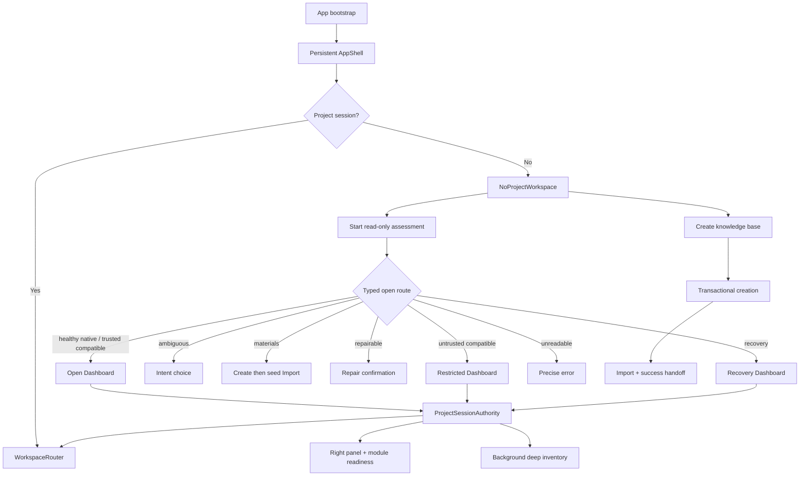

# First-run / Project-open Workbench 完整实施计划

## Current execution plan — 2026-08-03, round 15

### Current position

The contained-link read policy, immediate P1 mutation bypasses, layout-aware project counts, and the Windows linked-ancestor regressions have been implemented and passed the final full quality gate. This is **not** a release completion claim: path-based validation still cannot provide the required cross-process atomic no-follow guarantee.

| Priority | Work item | State | Exit evidence |
| --- | --- | --- | --- |
| P1 | Force every page/Chat/Lint/Compile mutation through the configured writable wiki root; force cache/log/session-deletion and Workflow cleanup mutations through strict project write resolution. | Implemented and full-gate verified. | Linked `wiki` aliases and physical paths outside `wiki_write_root` fail before mutation; source fixture bytes remain unchanged. |
| P1 | Keep contained-link discovery read-only and reject external, root-loop and sensitive link targets. | Implemented; regression fixtures exist. | Windows junction and Unix symlink matrix reports only canonical contained Markdown once. |
| P1 | Replace path-based check-then-write with handle/descriptor-anchored atomic no-follow mutation. | Not started; release blocker. | A hostile concurrent link/file swap cannot redirect an atomic write, delete, rename or rollback. |
| P2 | Make summary and cancellable inventory consume `ProjectLayout` roles rather than hard-coded native roots. | Implemented and full-gate verified. | Compatible root/pages/sources fixture has index-consistent page/source/task counts; role excludes, cancellation/progress and no-follow walking remain intact. |
| P2 | Finish assessment/link parity tests and expose excluded external links as a tree warning. | Partially implemented. | Windows `raw -> .app` assessment regression is passing; external-link tree warning and the cross-platform matrix remain open. |
| P2 | Execute the authoritative §14 acceptance matrix across supported platforms. | Not started. | Recorded 17/17 scenarios with screenshots/state evidence, checkpoint evidence and platform applicability. |

### Sequenced execution

1. Completed: run `cargo fmt --check`, focused linked-chat-state regression and a clean `npm run check` after this round's patches. The final full gate passed in 307.8 seconds (Vitest 117/856; Rust 917/0). Treat any future Windows loader/runtime failure as a failed gate unless a clean rerun supplies a successful result.
2. Completed: add negative regressions for linked page/Chat/Lint/cache/Workflow mutation routes, Chat session deletion through `.app/chats -> raw/sources`, and assessment `raw -> .app` sensitive-root bypass.
3. Completed: refactor project summary/inventory around layout role descriptors without replacing the cancellable walk. Exclusion, canonical de-duplication and progress accounting remain in the inventory path.
4. Select and validate a cross-platform handle-based no-follow filesystem approach before adding dependencies. Include a written threat model, Windows junction coverage, Unix symlink coverage and rollback behavior. This is the release-critical batch.
5. Complete the UI treatment for excluded external links and then execute the acceptance matrix. Do not allow the tree warning to reveal/read external target contents.

### Guardrails

- Never initialize or reorganize an ordinary materials folder in place.
- Never replace/delete `raw/sources` without explicit confirmation and a Git checkpoint.
- Never claim that canonical path validation alone closes TOCTOU.
- Preserve existing unrelated worktree changes; stage only the intended batch when a later commit is requested.
- Update this plan and the paired audit with exact command results, including failed/blocked runs; do not upgrade a partial or historical gate to a passing release gate.

> 生成日期：2026-08-03  
> 状态：实施中；2026-08-03 已完成 P0、Batch C/D/F 的主路径及 native recent relocation，Batch E/I 部分完成，Batch G/H/J 尚未关闭  
> 目标：关闭首次启动、新建知识库、打开已有知识库、信任/只读/恢复、深度扫描与启动恢复的全部权威验收场景  
> 唯一产品与交互权威：[`../specs/2026-07-30-first-run-project-open-workbench-design.md`](../specs/2026-07-30-first-run-project-open-workbench-design.md)  
> Import 权威：[`../specs/2026-07-24-import-source-media-flow-design.md`](../specs/2026-07-24-import-source-media-flow-design.md)  
> Workflows 权威：[`../specs/2026-07-30-workflows-panel-redesign.md`](../specs/2026-07-30-workflows-panel-redesign.md)  
> 审计基线：[`../../audits/2026-08-03-first-run-project-open-workbench-implementation-audit.md`](../../audits/2026-08-03-first-run-project-open-workbench-implementation-audit.md)

---

## 0.0 Implementation review update: 2026-08-03 round 14

Batch H now has a constrained descendant-link path in real Markdown discovery. ProjectLayout::list_markdown_files follows only canonical physical paths after a link is admitted, and also uses those paths to de-duplicate directories and files. A link cycle therefore stops, aliases do not duplicate an index entry, and targets outside the project root or below .app, .git, .obsidian, raw, exports, skills, node_modules, or target are not followed or indexed. A descendant link back to the project root is also rejected. This relaxation is read-only; write paths still use path_safety's strict no-link/reparse policy.

Windows coverage uses a junction (mklink /J) that does not require Developer Mode or symlink privilege, and the fixture must be created rather than silently skipped. Quick readability assessment and the cancellable Markdown inventory now reuse the same canonical-containment, sensitive-target, loop, and de-duplication policy; sources and task state remain strict no-follow. Verification includes contained/external junction assessment and inventory regressions, 10/10 layout tests, cargo fmt --check, and npm run check:quick (lint, non-GUI Rust core, TypeScript/Vite production build, console scan). Batch H remains open: external-link tree presentation is still absent, and cross-process atomic no-follow writes remain a release blocker.

## 0.0 实施复核更新（2026-08-03 第十三轮）

此前受 sandbox 限制而无法建立的前端运行证据现已补齐：当前改动下，受影响的 `projectStore`、`AppShell`、`App` 三组 Vitest 为 58/58，完整 Vitest 为 117 文件、856/856 用例，`npm run check:quick` 通过。修复包括：后台 inventory 的 fire-and-forget IPC 对最小 shim 安全、测试按 command 而不是脆弱的调用序列 Mock、每个 App 测试先关闭 Settings/清除 focus、以及将 legacy “Back to launch” 文案改为 “Back to workspace / 返回工作区”。这些是测试可重复性与产品词汇修正，不改变先前确定的打开/授权路径。

本轮完整 `npm run check` 已从头通过（full mode，4 分 56 秒）：Import/Source evidence、Vitest、capability tools、lint、Vite build、console scan、GUI Rust `cargo check` 与 no-default-features Rust 全量测试均成功；Rust suite 共运行 906 个测试，0 失败。首轮在 `capability_release` 链接阶段出现的 `link.exe` unexpected error 经单独完整复跑和第二次 full gate 均未复现，故只作为瞬态链接故障记录，不再阻塞最终门禁。

计划状态随之调整：Batch F 的 identity-verified native relocation 可标为主路径完成；Batch J 从“前端 Vitest 无法启动”改为“前端单元/集成验证与完整 gate 已通过，但 17 场景 E2E、跨进程 no-follow 与 legacy source retirement 未关闭”。后续优先级不变：先以 descriptor/handle 级 I/O 消除两条高风险 app-owned 写入的外部进程 TOCTOU，再补全可安全再生范围以外的 Recovery 决策与权威 E2E 矩阵。

## 0.0 实施复核更新（2026-08-03 第十二轮）

Batch F 的 recent relocation 子项已按 fail-closed native identity 路径完成，而不是恢复第十轮的“可打开即替换”方案。新建 native project 在 `.app/project.json` 保存 UUID，后续 native open 复用此 ID；用户对 missing recent 明确选择目录后，前端先做只读 assessment，后端仅接受 readable `native_current`，并读取该文件要求 ID 与旧 recent 完全一致。任何格式、读取、ID、旧条目或目标路径冲突都会失败，recent 文件不变；compatible / legacy vault 因没有 move-stable identity，仍是手动打开与移除流程。

验证成功时，`ProjectRegistry` 只允许精确匹配原 root 的已信任 native entry 重绑到已验证的新 root；它保持 registry 写锁，先让 `recent-projects.json` 在同进程 mutex 与 config-dir OS-backed file lock 下以 atomic replace 用同一 UUID 更新单一条目，只有成功才改内存 authority。锁内还会复读 candidate durable UUID，并确认旧 root 为明确 `NotFound`；任一错误均使 registry/recent 保持旧状态。候选项目目录在 relocation 阶段只读。Windows `\\?\` canonical path prefix、UNC 与大小写在 registry/recent root comparison 中归一化，而 macOS/Linux 保留大小写。界面只对 missing item 提供 Locate；失败后关闭临时 assessment、保留当前项目，并按 identity、source-available、recent-changed 或 cross-process lock 给出可恢复错误。

本轮验证通过：Rust 两个 relocation 定向测试、`cargo check`、`cargo fmt`、TypeScript `tsc -b`、lint 与 locale JSON parse。Vite/Vitest 仍由 sandbox 的 `spawn EPERM` / Tailwind native-module 环境故障阻断，不能把 full/quick gate 记为完成。Batch F 的全 route E2E、Batch G/H/J 与最终门禁仍未关闭。

## 0.0 实施复核更新（2026-08-03 第十一轮）

recent/project management 的安全子项现为“移除 + 重新评估”，而不是未验证的“重新定位”。后端以 `projectId + rootPath` 精确删除全局 recent entry，正常和 missing 条目都可移除；同一进程内的 remember/remove read-modify-write 周期由共享锁串行，定向 Rust 回归覆盖并发记忆/移除后两项更新均被保留。重新评估只复用原 root 的只读 assessment：若要进入材料或歧义决策，状态层在退出当前项目时保留完成 assessment，避免 no-project workspace 丢失可操作的选择；失败则保留当前项目。

已撤回“用户选择的新目录可打开便删除旧 recent”的实现，因为当前 session `projectId` 和路径绑定的 `canonicalIdentityKey` 都不是移动后可比较的身份。缺失目录不提供误导性的 Locate/relocate 操作；用户可以显式打开新位置，再按需移除旧记录。重新定位保留为 Batch F 的未关闭子项：先持久化 native move-stable ID，并在后端单次、身份验证的 compare-and-update command 中更新 recent；没有此身份的 compatible vault 不得自动合并或替换记录。

项目切换器同时移除了不完整的 `role=menu/menuitem` 宣称，使用普通按钮语义，确保所有操作包括“返回无项目状态”仍可通过标准 Tab 顺序到达。默认 Rust check、TypeScript check、lint 和 Rust 回归为本轮有效证据；`npm run check:quick` 的 lint/Rust core lane 通过，但 Vite build 受 Tailwind native-module load 与独立的 `spawn EPERM` 阻断，整体 quick gate 不计通过。

## 0.0 实施复核更新（2026-08-03 第十轮，已由第十一轮修正）

第十轮最初将“新目录成功打开后移除旧条目”作为重新定位候选。第十一轮审查证明它无法验证同一知识库身份，已撤回；本节不再构成重新定位完成证据。安全移除本身仍已完成，且不会删除、初始化、扫描或改写项目文件夹。

测试基础设施结论也更明确：无 Tailwind 的专用 Vitest 配置仍在 Vite/Rolldown 配置加载阶段触发 `spawn EPERM`，所以当前沙箱无法提供任何 Vite/Vitest 运行时证据；不要把该问题归因于 Tailwind 或业务代码。默认 Rust check、TypeScript check 和 Rust 回归仍可作为本轮的有效证据。

跨进程 atomic no-follow 仍需要一个跨平台 capability filesystem 层，使用 directory handle、relative open/rename 与 no-follow traversal 替换两条高风险 project write。当前 Cargo registry 获取该依赖在已授权环境中超时，且本机没有缓存，故不得把现有 pre/post validation + app-cooperating process lock 标为完成。恢复 registry 后先以小范围 adapter 覆盖 compatible guidance 与 graph-cache repair，再加入外部目录替换的 Windows/Unix 进程级回归。

## 0.0 实施复核更新（2026-08-03 第九轮）

Batch F 的 remembered ambiguous decision 子项已完成：`ProjectOpenDecisionStore` 新增按 canonical identity 与 revision 精确删除的 `forget`，`ProjectAssessmentService` 与 `clear_ambiguous_project_intent` command 只更新全局应用决策文件并返回刷新后的 typed assessment。Project switcher 的 recent 项现在提供“重新选择”入口；它先 assessment、只在当前仍为歧义 Markdown 时清除记忆，然后保留 decision surface 让用户作出新的显式选择。此入口不初始化、移动或改写被选资料目录。

第九轮验证：目标 Rust 回归、默认 `cargo check`、`cargo fmt --check`、TypeScript `tsc -b` 及两份 locale 的 Node JSON parse 通过。`npm run check:quick` 的 lint 与无 GUI Rust core lane 通过；Vite build 因 Tailwind Windows 原生模块加载与 `spawn EPERM` 被 sandbox 阻断。完整前端 Vitest/E2E 和默认 GUI Rust test binary 仍不能在当前 sandbox 运行；跨进程 atomic no-follow 仍是独立发布阻塞。

## 0.0 实施复核更新（2026-08-03 第八轮）

Batch I 的外部 AI authorization 已从 Workflows 扩展至 Chat、Source AI、deep Lint 与 HTML Export，并覆盖对应的任务执行开头复验。独立的 project-write gate 还禁止 restricted/recovery/read-only/无 app-state persistence 项目通过 Chat 或这些 AI 流程创建 `.app`、wiki 或 export 状态。26 项无 GUI AppState authority 回归通过，并确保空原生项目保留一般 workflow state、但不能执行或写入；仍需在 Batch J 的 GUI/E2E lane 证明各前端入口的错误呈现和恢复路径。

## 0.0 实施复核更新（2026-08-03 第七轮）

对 shared-config 下的多个 LLM Wiki 应用进程，compatible guidance 与 graph-cache repair 现通过 OS 文件锁串行；锁后立即重新验证 canonical project root，并继续使用各自的 no-link/reparse、hash 和 Git 快照检查。子进程持锁回归与独立 store 实例并发回归均已通过。

这将 Batch G/H 中“应用实例间竞争”的子项标记完成，**不**把它升级为完整的跨进程 atomic no-follow：不遵守锁的任意外部进程仍可替换路径，必须等 descriptor-relative 或 OS-handle 写入策略才能关闭该发布阻塞。

## 0.0 实施复核更新（2026-08-03 第六轮）

Batch G 的 repair 从“完全缺失”推进到一个可交付的安全候选：`graph-cache.json` 现在按 `GraphData` schema 识别，prepare 只读地生成带 identity/revision、Git HEAD/dirty paths、缓存 hash、精确 backup 和保护路径的短时计划；确认 apply 复验全部快照、先创建 Git checkpoint、保存损坏原字节，再原子写入空派生缓存。预览后目标变化会失败，不会覆盖新的外部改动。

Recovery banner → authority dialog → ConfirmationDialog 已能启动该操作；未具备安全候选的损坏 `.app` 状态只保留可读 Recovery，不会把 settings、bookmarks、agent/import state 猜测性重写。新创建项目同时升级为完整空 `GraphData` schema，避免新项目被本次严格检测误判。

验证：默认 Rust check、Rust 格式检查、TypeScript build 和 7 项无 GUI图谱缓存回归通过（包括真实 Git checkpoint 后的 repair 顺序）。GUI test harness 在 sandbox 中编译后被 Windows `STATUS_ENTRYPOINT_NOT_FOUND` 阻止启动，Vitest/Vite 仍受 Tailwind 原生模块限制；因此 command/UI 运行态验证继续留在 Batch J。跨进程原子 no-follow 也未关闭。

## 0.0 实施复核更新（2026-08-03 第五轮）

compatible guidance 现在通过逐段 no-link/reparse 目录创建、同进程写入串行化及贴近每个读写/rename 的路径重验来降低 TOCTOU 风险。失败清理只删除本进程可归属、并且在清理时仍可验证位于 canonical root 内的文件或空目录，避免竞争下误删外部路径。

定向 Rust 回归为 4/4（含同进程并发启用）；默认 Rust check 与格式检查通过。此项只能将 Batch G/H 的“应用内竞态”子项标为完成，**不得**将其描述为跨进程原子 no-follow：外部进程替换路径的剩余窗口需要 descriptor-relative / OS-handle 级写入策略，仍属于发布阻塞。

## 0.0 实施复核更新（2026-08-03 第四轮）

已完成 Batch H 中的后台盘点子项：打开项目立即返回 `scanning` 摘要；React store 在项目接受该摘要后启动 `start_project_inventory`；后台 Task 使用只读、不落盘的 project scope，支持取消、进度、日志和 `project://refreshed` 回写。盘点不会跟随子级 symlink/reparse point，取消时保留并标记 `partial` 统计。

实施文件：`src-tauri/src/services/project_service.rs`、`src-tauri/src/commands/project_commands.rs`、`src-tauri/src/tasks/task_service.rs`、`src-tauri/src/commands/task_commands.rs`、`src/hooks/useTaskEvents.ts`、`src/stores/projectStore.ts`、`src/components/app/BottomStatusBar.tsx` 与项目/任务类型和双语文案。

验证已完成：TypeScript build、默认 Rust check、Rust 格式检查、盘点定向 Rust 测试。完整 Rust 库测试因 60 秒环境上限中止，完整前端 Vitest/Vite 因 sandbox 原生 Tailwind 模块限制不可运行；二者仍是 Batch J 的验收缺口。

## 0.0 实施复核更新（2026-08-03 第三轮）

本轮补充的已验证修复：

1. `layout` discovery 已接入 assessment 的 deadline/cancellation budget；取消在进入目录和每个 bounded Markdown 探测前生效。
2. 预先存在的空目标创建也改为 staging + 原子安装；初检后目标被并发写入时，恢复原目标且失败，不会覆盖陌生文件。
3. quick assessment 已报告 portable case-only、NFC/NFD、Windows trailing-dot/space collision；任何此类 warning 会降级为 `Repairable`，阻止 trust/write/external AI。

仍不关闭 Batch H：collision scan 有上限且没有 background inventory/partial readiness；root link 已 canonicalize 后放行，但 compatible-write TOCTOU hardening 和跨平台 fixture 仍未完成。第三轮后的全量 Rust gate 结果应以本计划末尾的验证记录为准。

## 0.0 实施复核更新（2026-08-03 第二轮）

本轮已完成并验证以下补充项：

1. 新建模态框内显示创建失败；后端对“已创建但自动打开失败”返回可恢复错误和确切根目录。
2. 无项目 Settings 提供全局语言与主题，并经 Tauri 后端持久化；任何 Provider、密钥或项目范围配置仍不在首屏暴露。
3. Windows metadata quick scan 正确给出可写候选；实际写入继续做服务端验证。
4. Recovery 从“仅横幅提示”收紧为 operation access 的不可执行状态，同时保持可读 Markdown 与 source-empty 的 workflow 前置条件语义分离。
5. 新建对话框记住最近一次用户选择的父目录。

以下审查发现仍为未关闭项，必须在发布前按既有 Batch 处理：

- **Batch G/H：** repair plan/apply/confirm/recovery 和可取消、可观测、后台 deep inventory 尚未实现。
- **路径与并发：** compatibility enablement 仍需 no-follow/verified mutation lock；case-only 与 NFC/NFD collision 的 quick report 已有，但跨平台 fixture 与 full inventory coverage 仍缺。
- **评估性能：** layout discovery 已纳入 deadline/cancel；打开后的同步递归扫描仍未拆分到后台。
- **产品闭环：** Documents/LLM Wiki 初始默认位置、ambiguous decision 清除/重新选择、完整 restricted/read-only/recovery actions、17 场景 E2E 和 legacy source 退役仍待完成。
- **验证：** 第三轮后的完整 Rust 库测试为 882 passed、0 failed、2 ignored；Rust 默认 check 与 TypeScript build 已在本轮通过。当前沙箱无法启动 Vite/Tailwind Vitest lane，因此完整 `npm run check` 不可宣称通过。

## 0. 计划定位

### 0.1 实施进度（2026-08-03）

| Batch | 状态 | 已有证据 / 剩余项 |
|---|---|---|
| A / B | ✅ | Contract baseline 已审计；ordinary-material in-place initialization 与 archive/move 路径已切断。 |
| C | ✅ 主路径 | create/open/refresh 均返回 backend-derived session authority；仍需最终全量操作授权审计。 |
| D | ✅ 主路径 | AppShell 常驻、no-project workspace、两入口、dependency states、right/bottom shell 已实现；no-project full Settings 仍缺。 |
| E | 🟡 | staging create、含既有空目标的安全安装、recovery metadata、validation、Import handoff、Documents/LLM Wiki 默认和 last-parent 已实现；failure injection 全集仍缺。 |
| F | ✅ 主路径 | typed routes、ambiguous identity decision、materials discovery handoff、startup/notification assessment routing，以及 recent 中的清除、重新评估、移除已实现；native recent relocation 已通过 durable identity 与后端原子 compare-and-update 关闭，compatible / legacy vault 继续维持显式打开与手动移除。 |
| G / H | 🟡 | background deep inventory 已具备 scanning/ready/partial、可取消、任务可见和只读 no-follow 语义；graph-cache repair 具备 preview/confirm/checkpoint/backup/hash-revalidate/apply 闭环，其他损坏 app JSON 保持只读 Recovery；compatible guidance 已覆盖同进程串行化与逐步重验，但跨进程原子 no-follow 仍缺。 |
| I | 🟡 | authority dimensions、recovery banner、latest-only typed startup，以及 Chat、Source AI、deep Lint、HTML Export 的外部 AI / project-write backend gate 已实现；前端运行态错误呈现仍缺 E2E 证据。 |
| J | 🟡 | 前端 Vitest（117 文件、856 用例）与 full gate 已通过；legacy source retirement checkpoint、权威 17 场景 E2E 与跨进程 no-follow 仍待关闭。 |

本计划承接 `2026-08-02-first-run-authority-and-workflows-batch8-closure.md` 中明确列为范围外的完整 First-run / Project-open 产品迁移。Batch 8 已完成 assessment/trust/workflow access 主干，本计划不重复实现这些底座，而是把它们升级为正式用户流程和唯一授权事实。

本计划完成后，以下旧行为必须永久退休：

- 独立 `ProjectStartView` launch page
- 无项目时卸载 `AppShell`
- 首屏 Agent/BYOK inventory、模板画廊、Hero、最近项目卡片网格
- 三个 quick actions
- `open_folder_as_project`
- 普通资料目录原地初始化和文件移动
- 新建项目落到 Dashboard
- 启动时静默跳过丢失的最新项目
- 打开后丢弃 format/trust/filesystem/health/capabilities
- Recovery 仅作为枚举、没有工作台与授权限制

---

## 1. 目标与非目标

### 1.1 目标

1. 无项目时仍保持完整 Codex 风格桌面 Shell，中心只有“新建知识库”和“打开已有知识库”。
2. 新建项目安全、事务化，成功后进入 Import，不自动弹系统文件选择器。
3. 所有打开流程先经过可取消、只读、类型化 assessment。
4. Native、compatible、ambiguous、materials、repairable、recovery、unreadable 都有唯一且可完成的路由。
5. 普通资料目录始终保持原样，只能作为新知识库的 Import 输入候选。
6. format、trust、filesystem、health、layout、Git、capabilities 在打开后持续成为 session authority。
7. Restricted、read-only、recovery 和 partial scan 均有明确 UI、模块依赖和后端授权。
8. repair 写入前显示精确计划、保护路径、备份/checkpoint；失败可恢复。
9. deep inventory scan 在后台运行、可取消、可观察，部分结果不伪装为空结果。
10. 重启只尝试最新项目；失败保留无项目 Shell 和明确错误。
11. 通过权威规范 §14 的全部 17 个验收场景。

### 1.2 非目标

- 不重写 Import 的“发现 → 处理 → 预览 → 确认 → 来源库”流程。
- 不恢复 Import 后自动编译或自动导航。
- 不新增数据库；项目内容仍为 Markdown + JSON + 本地文件。
- 不把 trust/Git/repair 授权逻辑复制到 React 或 `src/features/workflows/`。
- 不新增云同步、远程 Git、计划任务、自定义 Workflow 或用户脚本执行。
- 不重做整个视觉系统；复用 `src/styles.css` tokens 和 `UI-Frontend-design/` 的既有密度。
- 不修改 `UI-Frontend-design/`。
- 不修改示例 `wiki/` 验证数据。
- 不在本计划中清理与首启/打开无关的历史 CSS、i18n 或文档债务。

---

## 2. 必须遵守的安全与仓库边界

### 2.1 工作树保护

计划编写时仓库已有 61 个改动路径，其中包括 `src/styles.css`、多份 SPEC、Workflows 文件和根日志。实施时必须：

1. 每批开始前记录 `git status --short` 和目标文件 diff。
2. 把“本批新增改动”和“用户既存改动”分开记录。
3. 只使用 `apply_patch` 做人工编辑；不覆盖整文件。
4. 不运行 `git reset --hard`、`git checkout --`、自动 stash 或清理用户改动。
5. 如果目标代码行已有不明并发改动，停止该文件的写入，先核对所有权；不能为了完成计划覆盖它。
6. `src/styles.css` 只允许追加/删除本功能相关选择器，必须在 patch 前后检查局部 diff。

### 2.2 Git checkpoint 规则

以下实施动作属于 checkpoint-required：

- 删除 legacy UI、command、pending action、test fixture
- 改写项目创建文件系统事务
- repair apply
- 批量迁移 store/session contract
- 改变路径/link 行为
- 移除 ordinary-folder 初始化和 archive/move 能力

如果工作树无法在不包含用户无关改动的情况下建立可解释 checkpoint，必须停止并请求用户决定，不得擅自把所有改动打进同一 checkpoint。

### 2.3 权限边界

- React 只展示后端派生的 authority/readiness，不拥有文件系统、Git、trust、repair 或 AI transmission 判断。
- 每个写命令都重新验证 canonical identity、assessment/session revision、trust、filesystem、health、layout、capability 和 Git policy。
- assessment ID、repair plan ID、deep scan operation ID 都是 opaque ID；不得让前端通过路径字符串重建授权。
- Restricted 项目不得创建 `.app`、Git、task 文件，不得调用 Agent/Skill/BYOK 或项目 hook。
- `raw/sources/` 和普通材料源目录默认不可变。

---

## 3. 目标架构



### 3.1 唯一前端生命周期

建议用 discriminated union 替代多个松散 boolean：

```ts
type ProjectLifecycle =
  | { kind: "no_project"; startupError?: ProjectStartupError }
  | { kind: "assessing"; operationId: string; selectedPath: string }
  | { kind: "assessment_decision"; assessment: ProjectOpenAssessment; route: ProjectOpenRoute }
  | { kind: "opening"; assessmentId: string }
  | { kind: "open"; project: ProjectSummary; authority: ProjectSessionAuthority }
  | { kind: "failed"; error: ProjectOpenError; recoverTo: "no_project" | "assessment_decision" };
```

要求：

- `currentProject` 不能再作为“是否渲染 AppShell”的开关。
- assessment snapshot 可以在打开前清理，但其派生事实必须进入 `ProjectSessionAuthority`。
- 所有 async response 必须用 operation ID + lifecycle epoch + canonical identity 防止旧响应串项目。
- project switch、trust change、repair、Git change、filesystem change、deep scan completion 都刷新 authority revision。

### 3.2 后端会话权威

建议新增或扩展为：

```rust
pub struct ProjectSessionAuthority {
    pub project_id: String,
    pub canonical_identity_key: String,
    pub revision: u64,
    pub format: ProjectFormat,
    pub layout: ProjectLayout,
    pub trust: ProjectTrustState,
    pub filesystem_access: ProjectFilesystemAccess,
    pub health: ProjectHealth,
    pub capabilities: Vec<ProjectCapability>,
    pub git: ProjectGitAssessment,
    pub inventory: ProjectInventoryState,
    pub warnings: Vec<ProjectAssessmentWarning>,
}
```

后端从事实派生 capabilities；前端不能自行推导“trusted + writable = 可自动修复”。

### 3.3 类型化打开路由

建议由后端 assessment 结果派生 route hint，前端只选择被允许的 action：

```ts
type ProjectOpenRoute =
  | { kind: "direct_open" }
  | { kind: "restricted_open" }
  | { kind: "ambiguous_choice"; rememberedIntent?: AmbiguousFolderIntent }
  | { kind: "materials_create" }
  | { kind: "repair_confirmation"; repairPlanId: string }
  | { kind: "recovery_open"; repairPlanId?: string }
  | { kind: "unreadable_error"; actions: ProjectRecoveryAction[] };
```

### 3.4 统一操作授权

后端提供统一概念：

```rust
resolve_project_operation_access(project, operation_kind)
```

最少覆盖：

- local read/search/graph
- import discovery
- import commit
- external AI transmission
- Agent/Skill execution
- Wiki update
- local lint
- automatic fix
- repair apply
- compatibility enable
- Git checkpoint

Workflows、Chat、Source AI、Lint、Import 和 Repair 只能消费该结果，不能各自复制规则。

---

## 4. 批次总览与依赖

| 批次 | 名称 | 主要产物 | 风险 | 门禁 |
|---|---|---|---|---|
| A | Contract freeze + red tests | 新 session/route/repair/inventory contract 与失败验收基线 | 中 | focused + `check:quick` |
| B | P0 ordinary-folder safety cutover | 正式入口不可原地初始化，legacy mutation 隔离 | 高 | focused Rust/FE + full `npm run check` |
| C | Persistent project session authority | 打开后持续保存 trust/fs/health/layout/capability | 高 | focused + full gate |
| D | Persistent AppShell + no-project workbench | 完整 Shell、两入口、依赖态、Settings 可用 | 中 | focused + `check:quick` |
| E | Transactional create → Import | 默认路径、验证、事务创建、success handoff | 高 | failure injection + full gate |
| F | Typed open decision router | ambiguous/materials/restricted/direct/unreadable 闭环 | 高 | end-to-end + full gate |
| G | Repair + Recovery | typed plan、确认、checkpoint、Recovery Dashboard | 高 | failure injection + full gate |
| H | Background inventory + path hardening | 可取消 deep scan、partial 状态、link/collision 语义 | 高 | cross-platform + full gate |
| I | Readiness、AI authorization、startup | 右栏/模块依赖、统一外部 AI gate、最新项目错误 | 高 | architecture + full gate |
| J | Legacy retirement + release closure | 删除旧代码/CSS/i18n/test，17 场景全绿 | 高 | 双 review + final full gate |

依赖关系：

```text
A → B → C → D
        ├→ E → F
        ├→ G
        ├→ H
        └→ I
E + F + G + H + I → J
```

不得把 D 的 UI 临时 boolean 作为跳过 C 的理由；否则 Restricted/Recovery/Read-only 会再次产生平行事实源。

---

## 5. Batch A — Contract freeze 与红灯验收测试

### 5.1 目标

在改变行为前冻结跨层 contract，并把权威设计 §14 转成当前会失败的可执行测试。该批不删除旧能力、不新增写路径。

### 5.2 任务

1. 扩展 Rust / TypeScript 镜像类型：
   - `ProjectSessionAuthority`
   - `ProjectOpenRoute`
   - `AmbiguousFolderIntent`
   - `ProjectCreationOutcome` / `ProjectCreationRecoveryReport`
   - `ProjectRepairPlan` / `ProjectRepairOperation`
   - `ProjectInventoryState`
   - `ProjectStartupError`
   - `ProjectOperationAccess`
2. 给所有 union 加 schema/version 或稳定 serde discriminator。
3. 明确 short-lived ID 的 TTL、identity binding 和 stale error code。
4. 为 17 个 acceptance scenarios 建矩阵测试文件；当前未实现项以 `.skip` 不可接受，必须先以 red test 或 contract-only expectation 明确记录。
5. 增加 architecture guard：
   - 正式前端不得新增 `open_folder_as_project` 调用。
   - `src/features/workflows/` 不得出现 trust/Git 授权实现。
   - React 不得直接引入文件系统/Git/secret API。
   - external AI commands 必须调用统一 access resolver。

### 5.3 预计文件

- `src/types/project.ts`
- `src/types/project.contract.test.ts`
- `src-tauri/src/models/project.rs`
- `src-tauri/src/models/project_contract_tests.rs` 或现有对应测试
- `src/test/project-open-architecture.test.ts`
- 新建 `src/features/project/firstRun.acceptance.test.tsx`
- 新建/扩展 Rust project assessment integration tests

### 5.4 验收

- TS/Rust 字段、枚举值和 nullable 语义一致。
- 旧 persisted data 有明确 migration/default；不能因新增字段让旧项目不可打开。
- 未实现行为的失败原因与后续批次一一对应。
- `npm run check:quick` 通过。

---

## 6. Batch B — P0 Ordinary-folder 安全切断

### 6.1 目标

在其他体验迁移之前，先让普通资料目录原地初始化和移动能力从所有正式入口不可达。

### 6.2 实施顺序

1. 建立 Git checkpoint；如果无法隔离用户无关改动，停止。
2. 前端删除第三 quick action 与 `open_folder_as_project` intent。
3. `projectStore.openProject` 不再用于普通目录；打开已有知识库统一进 assessment。
4. bootstrap 不再调用旧 `open_project`；Batch I 完成最终行为前可暂时 fail closed 到 no-project。
5. `open_project` 对 ordinary materials 必须返回 typed not-a-project，不得产生 `InitializeFolder`。
6. 删除或内部封存 `confirm_folder_initialization`、`archive_loose_files`、`InitializeFolder` pending action。
7. 清理对应 IPC 注册、DTO 和测试；保留迁移兼容只限于读取历史 pending record 时安全标记为 cancelled/unsupported，绝不继续执行。

### 6.3 必测场景

- 普通 PDF/Office/图片/Markdown 混合目录 assessment 为 materials/ambiguous，不产生写入。
- 点击所有正式打开入口，源目录文件列表、内容 hash、mtime、`.git`、`.app` 均不变。
- 旧 persisted `InitializeFolder` pending action 重启后不会执行，显示已退休的安全解释。
- CJK/Unicode 源目录不被 rename。
- 同名目标、新建取消、assessment 取消均不触碰源目录。

### 6.4 预计文件

- `src/features/project/ProjectStartView.tsx`（临时删除旧入口；Batch D/J 最终退休组件）
- `src/stores/projectStore.ts`
- `src-tauri/src/commands/project_commands.rs`
- `src-tauri/src/services/project_service.rs`
- `src-tauri/src/models/confirmation.rs`
- Tauri command registration
- 相关前后端测试与 i18n

### 6.5 验收与门禁

- 全仓库没有可执行的 ordinary-folder move 路径。
- safety mutation regression 全绿。
- 两个 review：共享上下文审查产品/安全意图；fresh context 审查遗漏调用者和持久化兼容。
- 从头运行 `npm run check` 通过。

---

## 7. Batch C — Persistent Project Session Authority

### 7.1 目标

把 assessment 的独立事实维度保存为项目打开后的唯一会话权威，供 Shell、模块、命令和 background task 共同消费。

### 7.2 后端任务

1. `open_assessed_project` 返回 `ProjectSummary + ProjectSessionAuthority`。
2. `AppState` 注册 canonical identity、layout 和 authority revision，不从路径结构重新猜测。
3. 增加 `get_project_session_authority` 或让现有 project snapshot 包含该结构。
4. trust grant/revoke、compat enable、Git 状态变化、repair、deep scan 完成后原子刷新 revision。
5. `resolve_project_context` 只负责可信 registry/path/layout；新增 operation access resolver 负责授权。
6. stale assessment/session revision 返回 typed stale error，引导重新 assessment，不静默沿用旧权限。

### 7.3 前端任务

1. 重构 `projectStore` 为明确 lifecycle union。
2. `currentProject` 与 `authority` 同步提交，不出现“项目已切换但 authority 还是旧项目”的中间态。
3. 每个异步 action 校验 project ID + identity key + revision + request token。
4. 保留启动错误、assessment decision、repair/recovery 等非 open 状态。
5. 禁止组件直接从目录是否存在、旧 health boolean 或 provider 状态猜 capability。

### 7.4 必测场景

- 同一路径内容被替换后旧 assessment/open 请求失效。
- trust grant/revoke 后 authority revision 改变且 UI 原子更新。
- project A 延迟响应不能覆盖 project B。
- trusted read-only 与 untrusted read-only 可同时准确表示。
- recovery 状态不能因 deep scan 成功自动变 healthy。

### 7.5 预计文件

- `src-tauri/src/app_state.rs`
- `src-tauri/src/models/project.rs`
- `src-tauri/src/commands/project_commands.rs`
- `src/stores/projectStore.ts`
- `src/types/project.ts`
- 相关 event/IPC client

### 7.6 门禁

- focused contract/store/AppState tests 通过。
- authority architecture tests 通过。
- 双 review 关闭全部 P0/P1。
- `npm run check` 通过。

---

## 8. Batch D — Persistent AppShell 与 No-project Workbench

### 8.1 目标

无项目时保持完整 Shell，并只在中心提供两个紧凑任务入口。

### 8.2 UI 结构

1. `App.tsx` 永远返回 `AppShell`。
2. 新建 `NoProjectWorkspace`：
   - Header：工作区 / Workspace
   - Subtitle：选择一个知识库开始工作
   - 新建知识库
   - 打开已有知识库
   - 一条本地存储/只读检查说明
3. 主导航始终可见：
   - Dashboard 在无项目时显示上述 Workspace
   - 其他模块显示 compact dependency state，提供新建/打开动作
   - Settings 始终可用
4. Topbar project switcher：未打开知识库。
5. Search 可见但 disabled，并提供原因。
6. Right panel 显示：Workspace state、Storage、Open policy。
7. Bottom status：选择新建或打开已有知识库。
8. Sidebar foot 不探测/展示 Agent/BYOK。

### 8.3 视觉与无障碍

- 严格复用 `src/styles.css` token；不硬编码 hex。
- topbar 48px、main/right header 52px、status 28px、nav item 30px。
- 两张卡是 compact task launcher，不是 marketing cards。
- 持久 label、可见 focus、正确 heading/landmark。
- 中英文文本在窄窗口和 200% text scaling 下不截断核心动作。
- 不能只用颜色表达 disabled/restricted/error。
- 无装饰 gradient、Hero、模板 gallery、tour 或产品 tip。

### 8.4 预计文件

- `src/app/App.tsx`
- `src/components/app/AppShell.tsx`
- `src/components/app/WorkspaceRouter.tsx`
- `src/components/app/RightContextPanel.tsx`
- `src/components/app/BottomStatusBar.tsx`
- 新建 `src/features/project/NoProjectWorkspace.tsx`
- 新建 `src/features/project/ProjectDependencyState.tsx`
- `src/styles.css`
- `src/i18n/locales/en.json`
- `src/i18n/locales/zh-CN.json`
- 相关测试

### 8.5 验收

- `App.test.tsx` 改为断言 full Shell + exactly two actions + Settings 可用。
- primary navigation 在无项目时存在。
- 禁止出现 Hero、recent grid、Agent/BYOK、第三入口。
- 截图/人工验证至少覆盖 1440×960、1024×720、窄宽窗口、dark mode、中英文。
- focused UI tests + `npm run check:quick` 通过。
- UI detector 仅在本批 UI 完成后运行一次，并逐条验证结果。

---

## 9. Batch E — Transactional New Knowledge Base → Import

### 9.1 目标

完成“新建本地知识库 → 初始 Git commit → 直接进入 Import”的首个价值路径，并保证失败可回滚/恢复。

### 9.2 新建对话框

1. 从 legacy `ProjectStartView` 提取独立 `NewKnowledgeBaseDialog`。
2. 初始焦点在名称；focus trap、Escape、关闭后焦点恢复。
3. 首次父目录：系统 Documents 下的 `LLM Wiki`。
4. 后续记忆上一次成功选择的 parent；只存全局应用设置。
5. 模板默认通用；五个模板各有一句用途说明。
6. 始终显示完整最终路径。
7. 前端即时 validation 与后端 authoritative validation 使用同一错误 code：
   - required
   - invalid character
   - Windows reserved name
   - trailing dot/space
   - path too long
   - non-empty target
   - parent unreadable/unwritable
8. 失败后保留全部输入。

### 9.3 后端事务策略

#### 目标目录不存在

1. canonicalize/validate parent。
2. 在同一 parent 创建唯一 staging sibling。
3. 在 staging 中写完整结构、配置、初始 Git repository 和 initial commit。
4. 重验证 final target 仍不存在。
5. 使用同文件系统 rename 安装 final directory。
6. 失败时清理应用创建的 staging；清理失败则返回精确 recovery report。

#### 目标目录已存在但为空

1. 不删除或替换预先存在的目录。
2. 记录 pre-existing marker 和本次 created path journal。
3. 任一步失败只回滚本次创建路径。
4. 无法安全删除的路径保留并列入 recovery report。

任何情况下都不得覆盖非空目录、跟随外部 link、删除用户预先存在内容或添加 Git remote。

### 9.4 Import 交接

成功后原子执行：

1. 关闭 modal。
2. 提交 open project + authority。
3. `setActiveView("import")`。
4. 写入一次性、可 dismiss success handoff：`「{name}」已创建。添加第一批资料，生成可阅读的 Source。`
5. 不自动打开系统 picker。
6. 如果由 materials route 发起，向 Import session 添加原目录作为 discovery candidate；不自动确认/提交，不改变原目录。

### 9.5 Failure-injection 测试

- purpose/schema 写失败
- `.app` 写失败
- Git init 失败
- initial commit 失败
- staging rename 前目标被其他进程创建
- cleanup 失败
- CJK/emoji 名称
- Windows reserved name/path length
- existing empty/non-empty target

每个测试必须断言 final path、staging path、created paths、source path 和 recovery report。

### 9.6 门禁

- 跨层 create/import handoff 测试全绿。
- 文件系统 mutation review + fresh-context review 无 P0/P1。
- 从头运行 `npm run check` 通过。

---

## 10. Batch F — Typed Project-open Decision Router

### 10.1 目标

把 assessment 分类转换为完整且唯一的用户路径，不再使用组件内格式列表自动猜测。

### 10.2 路由表

| assessment route | UI | 允许动作 |
|---|---|---|
| healthy native | 无确认 | open Dashboard |
| trusted compatible | 无确认 | open compatible Dashboard |
| untrusted compatible | restricted 状态 | restricted open；trust and enable |
| ambiguous | choice panel | open as Markdown vault；create from materials |
| materials | explanation panel | create from materials |
| repairable | repair confirmation | trust/repair/open；restricted open |
| recovery | Recovery Dashboard | read/open；contextual repair |
| unreadable | error panel | retry assessment；choose another folder；reveal precise path/error |

### 10.3 Ambiguous intent store

1. 新增全局 store，参考 trust store 的锁、原子写与损坏恢复。
2. key 使用 canonical identity，不只使用 path string。
3. value 只允许 `open_as_markdown_vault | create_from_materials`。
4. 目录移动、替换或 identity revision 变化时失效。
5. recent/project management 中允许清除记忆。
6. 不在目标目录写 marker。

### 10.4 Materials handoff

- 显示确定文案“这个文件夹更像资料集合……”
- 唯一 primary action：用这些资料新建知识库。
- 打开 Batch E 的标准 dialog，不复制一套表单。
- 创建成功后把 canonical source folder 交给 Import discovery。
- source folder 在全流程保持 hash/mtime/tree 不变。

### 10.5 竞态与取消

- 新 assessment 开始时取消/使旧 operation、decision、repair plan 失效。
- 用户关闭 picker 或取消 scan 后回到完整 no-project Shell。
- 快速连续选 A/B 两目录时 A 的结果不得覆盖 B。
- remembered ambiguous intent 只减少选择步骤，不绕过 trust/recovery/permission assessment。

### 10.6 门禁

- 七类 route 的 frontend integration tests 全绿。
- ambiguous identity tests、materials immutability tests 全绿。
- 双 review 关闭 P0/P1。
- `npm run check` 通过。

### 10.7 已落实的 recent 管理边界（2026-08-03）

- missing recent 支持安全移除、原 root 只读重新评估，以及仅 native 的身份验证重新定位。
- native relocation 必须同时满足：新根 assessment 为 readable `native_current`、`.app/project.json` 为安全普通文件、其 UUID 在提交前锁内复读后仍等于旧 `projectId`、旧 root 当前明确缺失、旧 `projectId + rootPath` entry 仍存在、目标 root 未被别的 recent entry 使用。
- replace 只改全局 `recent-projects.json`；project folder 在重新定位时绝不发生写入。remember/remove/relocate 在同一进程用共享锁、跨进程用 config-dir OS file lock 序列化，配置文件以 atomic replace 落盘；registry 只在该提交成功后重绑，因此 I/O/冲突失败不改变当前 authority。
- registry rebind 只接受原 root 精确匹配；Windows 归一化设备路径/UNC/大小写，其他平台保留大小写。
- compatible 与 legacy vault 不提供自动 Locate 合并；用户通过“打开已有知识库”和“移除 recent”完成迁移。

---

## 11. Batch G — Repair Plan 与 Recovery Dashboard

### 11.1 目标

可读 Markdown 不因 app state 损坏而消失；任何修复写入前都可检查、可 checkpoint、可恢复。

### 11.2 Repair prepare

prepare 必须只读，返回：

- `repairPlanId`
- canonical identity + assessment/session revision
- detected format
- readable capabilities
- exact operations and paths
- protected user paths
- backups
- Git/checkpoint state
- external links kept blocked
- risk level
- expiration

允许自动准备的候选仅限规范 §8.1：可再生 cache、空 required app directory、derived index、可由精确 schema 替换的 app JSON。

严禁计划：猜测用户内容、改写 Markdown、自动重命名碰撞文件、重写 link、移动 source、跟随外链。

### 11.3 Repair apply

1. 接受 opaque repairPlanId，不接受前端提交任意路径列表。
2. 重验证 identity/revision/trust/filesystem/layout/Git dirty。
3. checkpoint-required；不能建立 checkpoint 时不写。
4. 每个 operation 使用 temp + atomic rename 或可逆 journal。
5. 输出 changed paths、backup paths、checkpoint hash、skipped operations、failure/recovery state。
6. 成功后刷新 authority 和 inventory；失败保持 Recovery 可读。

### 11.4 Recovery Dashboard

- 使用正常 AppShell 和 Dashboard 框架。
- 明确 Recovery banner，不仅用颜色。
- 保留 file tree、Markdown reading、local search 和 local fallback counts。
- 禁止无法证明安全的 Import commit、Chat external AI、Workflows write、auto-fix、export mutation。
- repair action 上下文可见。
- “暂不修复，以受限模式打开”在 Markdown 可读时始终可用。

### 11.5 必测失败

- corrupt `.app/*.json`
- corrupt graph cache
- repair plan 过期
- folder identity 被替换
- Git HEAD/dirty state 在 prepare/apply 间变化
- read-only filesystem
- backup/rename/apply 中断
- restart 后 recovery journal 恢复

### 11.6 门禁

- repair failure-injection 与 recovery authorization tests 全绿。
- 两个 review 重点检查 protected paths、checkpoint、TOCTOU 和 crash recovery。
- `npm run check` 从头通过。

---

## 12. Batch H — Background Deep Inventory 与路径安全

### 12.1 目标

打开项目不等待完整递归扫描；扫描可取消、可观测、允许部分结果，并符合确认的 link/collision 语义。

### 12.2 Deep inventory operation

1. quick scan 只完成安全路由和最小可读 roots。
2. Dashboard 打开后创建 project-scoped background inventory operation。
3. 状态：queued/running/partial/completed/cancelled/failed。
4. 进度至少包含：visited/estimated files、Markdown count、Source count、Wiki count、warnings。
5. 可取消；取消保留已发现内容。
6. Search/Graph/Right panel 显示 partial，不把未扫描完当作 empty。
7. 同项目 operation 串行或 supersede；切项目后旧事件不能更新新项目。
8. 长任务进入现有 task/log/event 体系，避免创建第二套队列。

### 12.3 Link policy

1. root symlink/junction 先 canonicalize，再绑定 identity；合法目标允许打开。
2. descendant link canonicalize 后仍在 root 内：允许读，带 visited inode/file-id/realpath loop guard。
3. link 逃逸 root：在 warning/tree 中可见，但不读取、不索引、不写入。
4. `.app`、`.git` 等敏感目录不能通过链接绕过边界。
5. 所有 write path 继续拒绝跨 root 或链接替换 race。

### 12.4 Collision detection

quick scan 报告：

- case-only collisions
- Unicode NFC/NFD normalization collisions
- Windows reserved/trailing aliases

只报告，不自动重命名、不改链接。碰撞作为 warning/repair blocker 进入 authority，不应让全部可读 Markdown 消失。

如需新增 Rust Unicode normalization 依赖，必须单独审查许可证、锁文件和 bundle 影响；该变化属于依赖/架构改动，必须完整门禁。

### 12.5 跨平台测试矩阵

| 场景 | Windows | macOS | Linux |
|---|---:|---:|---:|
| root symlink/junction canonicalize | junction/symlink | symlink | symlink |
| internal link stays inside | required | required | required |
| external link escape | required | required | required |
| link loop | required | required | required |
| case-only collision | required | required | required |
| NFC/NFD collision | required | required | required |
| read-only root | required | required | required |
| CJK/emoji path | required | required | required |

平台不能创建链接的 CI 需明确 skip reason；不能把未运行记为通过。

### 12.6 门禁

- 大型 fixture 打开不等待 deep scan 完成。
- progress/cancel/partial UI tests 通过。
- path safety、TOCTOU、collision tests 通过。
- 双 review 关闭 P0/P1。
- `npm run check` 通过。

---

## 13. Batch I — Module Readiness、统一 AI 授权与 Startup

### 13.1 Right context panel

项目打开后持续展示独立维度：

- Type：原生 / 兼容
- Trust：受信任 / 尚未信任
- Filesystem：可写 / 只读
- Health：健康 / 可修复 / 恢复 / 不可读
- Git 状态
- Inventory：扫描中 / 部分 / 完成 / 失败

只在用户能行动时显示 banner；普通 Compatible 不持续警告。

### 13.2 模块 readiness

建立单一 selector/view model，严格映射规范 §9：

| 模块 | 最低事实 | 缺失时动作 |
|---|---|---|
| Wiki/Reader | readable Source 或 Wiki Markdown | 导入资料 |
| Import discovery | real project；本地 discovery 可读 | 打开项目 |
| Import commit | trusted + writable import roots | 信任 / 需要可写 |
| Chat | trusted + readable context + AI route | 信任 / 导入 / 去配置 |
| Graph | readable Markdown；partial scan 可用 | 等待扫描 / 导入 |
| Workflows | 后端 workflow-specific access | 使用已有 typed prerequisite |
| Lint local | readable Markdown | 无 AI 配置要求 |
| Auto-fix | trusted + writable + checkpoint | 信任 / 处理 Git |

每个 unavailable state 只给一个主原因和一个下一步，避免同时堆叠五个错误。

### 13.3 AI authorization

1. 所有外部 AI/Agent/Skill command 使用 Batch C 的统一 operation access resolver。
2. 授权在 task 创建前、外部调用前、每个写 apply 前重验证。
3. Missing route 显示“去配置”，返回原 surface，不自动运行。
4. Untrusted 项目不得把任何 Markdown 发给外部 provider。
5. Local Health Check/read-only search 不被 AI route 阻断。

### 13.4 Startup / re-entry

1. recent list 明确按最近使用时间排序。
2. 只尝试最新 entry，不 `.find` 更旧可用项目。
3. 最新路径 missing/inaccessible：完整 Shell + no-project Workspace + concise path error。
4. 最新项目走 typed assessment/open，不走旧 `open_project`。
5. 健康且无需用户决策时直接 Dashboard。
6. 需要 trust/ambiguous/repair 时进入对应 decision route。
7. 无论上次停在哪个 module，重启成功都落 Dashboard。

### 13.5 必测场景

- trusted read-only 的 Reader 可用、auto-fix 不可用。
- untrusted writable 仍是 restricted，external AI 不可用。
- recovery readable 但所有不安全写 disabled。
- missing AI route 配置返回后不自动运行。
- latest missing 不打开 second recent。
- latest healthy 打开 Dashboard。
- latest ambiguous 不猜并显示选择。
- stale provider/project response 不跨项目提交。

### 13.6 门禁

- frontend readiness matrix tests 全绿。
- backend operation authorization architecture tests 全绿。
- startup integration tests 全绿。
- 双 review 关闭 P0/P1。
- `npm run check` 通过。

---

## 14. Batch J — Legacy 退休、视觉收口与发布闭环

### 14.1 删除清单

确认所有新路径通过后，建立 Git checkpoint，再删除：

- `ProjectStartView` 独立页面或将其完全替换为已命名的新组件组合
- `launch__*` 仅旧页使用的 CSS
- legacy Hero/search/filter/recent grid/Agent/BYOK launch i18n
- `open_folder_as_project`
- `InitializeFolder` command/pending action/execution
- `archive_loose_files`
- legacy `open_project` 二元路径（若仍有兼容读取需求，应改名并保持不可写）
- 保护旧三入口/无 primary navigation 的测试
- 与目标产品冲突的注释和 README 描述

删除前用引用搜索证明没有调用者；删除后运行 architecture tests 防止回归。

### 14.2 视觉与交互 QA

- 1440×960 light/dark，中英文
- 1024×720 light/dark，中英文
- 窄窗口直到应用定义的最小宽度
- 200% text scaling
- 键盘-only：导航、两入口、dialog、assessment cancel、choice、repair、Settings return
- screen reader：landmarks、heading、dialog labels、progress、alert/status
- reduced motion
- long CJK/English project name and path
- read-only/restricted/recovery/partial banners 非颜色依赖

视觉必须保持 Codex desktop 密度；不增加 landing-page 视觉、装饰性动效或嵌套卡片。

### 14.3 完整验收矩阵

逐条执行规范 §14 的 17 个场景，并保存：

- 测试名称/fixture
- 前端结果
- 后端写入证据
- 源目录不变证据
- Git/checkpoint 证据
- 截图或状态快照（仅 UI 场景）
- Windows/macOS/Linux 适用结果

不得用“单元测试覆盖过相似函数”代替端到端场景结果。

### 14.4 Review 要求

按 AGENTS.md 启动两个 review subagents：

- **Review A（共享上下文）：** 对照 First-run、Import、Workflows、AGENTS.md，检查产品意图、逻辑、一致性和跨层集成。
- **Review B（fresh context）：** 不带实施假设，寻找遗漏调用者、权限旁路、TOCTOU、恢复缺口、平台差异、缺测和文案歧义。

合并结果后：

1. 所有 P0/P1 必须修复。
2. 修复后重跑受影响 focused tests。
3. 从头重跑 `npm run check`，不能只重跑失败 lane。
4. 重新运行 scoped UI detector 一次；验证误报，不机械修改。
5. 更新审计文档的验收矩阵和发布判断。

### 14.5 最终门禁

- `npm run check` 从头通过。
- 17/17 acceptance scenarios 通过。
- 两个 review 无未关闭 P0/P1。
- `git diff --check` 通过。
- console scan / lint / frontend production build / Rust core+GUI / unit+integration+doc tests 全部通过。
- `UI-Frontend-design/` 零改动。
- `wiki/` 零改动。
- 没有 secrets、absolute local test paths 或用户资料进入日志/fixture。

---

## 15. 测试策略

### 15.1 前端

- App persistent Shell
- no-project navigation dependency states
- new dialog validation/focus/error preservation
- assessment polling/cancel/stale response
- typed decision routing
- ambiguous remembered intent
- materials create/import handoff
- authority revision and cross-project isolation
- right panel dimension rendering
- module readiness matrix
- recovery/repair confirmation
- deep scan partial/progress/cancel
- startup latest-only behavior
- i18n backend key parity

### 15.2 Rust unit/integration

- project contract serde/migration
- assessment classification
- trust/intent identity store
- transactional create failure injection
- ordinary materials immutability
- repair prepare/apply/checkpoint/recovery
- operation access matrix
- deep inventory lifecycle/recovery
- symlink/junction/collision/path race
- startup/open registration
- legacy persisted action safe retirement

### 15.3 Architecture regressions

建议固定以下禁止模式：

- 正式 UI 中出现 `open_folder_as_project`
- React 导入 Tauri filesystem/Git/secret APIs 绕过 service command
- Workflows 自行实现 trust/Git permission
- external AI command 未调用统一 access resolver
- project writes 未携带 project identity/session revision
- compatible vault 根目录创建 `purpose.md` / `schema.md`
- ordinary materials route 调用 rename/move/init Git

### 15.4 性能与规模

- 10k/50k Markdown fixture 的 quick scan 上限
- Dashboard 首次可用时间与 deep scan 分离
- cancel latency
- progress event 节流
- file watcher/change burst 下的 authority/inventory 合并
- Search/Graph partial 结果标识

本计划不承诺未经测量的具体毫秒目标；实施时先记录基线，再确定不会阻塞 Shell 的可验证阈值。

---

## 16. 数据迁移与兼容

### 16.1 Recent projects

- 保留现有 recent entries。
- 缺失项不删除，标记 missing；启动只处理 latest。
- 用户可在 project switcher 中选择、移除或重新评估；创建后带 `.app/project.json` UUID 的 native entry 可经后端身份比较和原子更新重新定位，不能把“新目录可打开”当作同一项目证明。compatible / legacy entries 保持手动迁移。

### 16.2 旧 pending actions

- persisted `InitializeFolder` 必须迁移为 cancelled/unsupported。
- UI 说明该旧操作因安全策略已退休。
- 绝不在恢复时自动执行。

### 16.3 旧 ProjectSummary

- 新字段采用向后兼容 default/migration。
- 无 authority 的旧 session 不被视为 trusted；重新 assessment。
- 不根据旧布尔值静默升级权限。

### 16.4 Compatible vault

- 现有 `.app/compat` 保留。
- root `purpose.md` / `schema.md` 永远按用户内容处理。
- trust store 和 ambiguous intent store 都使用 canonical identity，但用途与数据文件分离。

---

## 17. 可观察性与错误模型

所有用户可见错误必须包含：

- stable error code
- concise localized message
- affected canonical path（不发送到外部）
- operation/project identity
- whether disk was changed
- changed/retained/rolled-back paths（如适用）
- Git checkpoint/backup state（如适用）
- one primary recovery action

禁止：

- 只返回“打开失败”
- 把 Rust debug error 直接展示给用户
- 在日志中记录 API key、token、文件正文或外部 AI prompt
- 创建失败后假装已回滚而不列出残留
- deep scan 失败后把 partial count 展示为确定结果

---

## 18. i18n 与可访问性清单

### 18.1 i18n

- 所有新文案同时加入 `zh-CN.json` 与 `en.json`。
- 不拼接包含路径/数量/项目名的句子；使用 interpolation。
- 中文与英文采用相同信息层级和动作数量。
- 用户术语严格使用：新建知识库、打开已有知识库、导入、Source、更新 Wiki、兼容模式、受限模式、只读、恢复模式。
- 不使用“导入知识库/导入文件夹”表示 open。

### 18.2 Accessibility

- modal 使用持久 label、`aria-modal`、focus trap、Escape、focus restore。
- assessment/deep scan 使用 `role=status` / `aria-live`，进度使用可读语义。
- icon-only buttons 有 tooltip 与 `aria-label`。
- disabled Search 可聚焦解释，或通过相邻描述关联原因。
- banner 和 capability status 不只依赖颜色/图标。
- 键盘顺序遵循 Shell → nav → workspace → context，不产生隐藏 launch panel trap。
- 尊重 `prefers-reduced-motion`；进度状态变化不能因关闭动画而消失。

---

## 19. 分批提交与交付建议

建议分支：`codex/first-run-project-open-workbench`

建议提交：

1. `test(project): freeze first-run and project-open contracts`
2. `fix(project): retire ordinary-folder in-place initialization`
3. `feat(project): persist session authority after assessment`
4. `feat(shell): keep full workbench visible without a project`
5. `feat(project): create transactionally and hand off to import`
6. `feat(project): route ambiguous and materials assessments`
7. `feat(project): add repair plans and recovery dashboard`
8. `feat(project): run cancellable background inventory scans`
9. `fix(project): unify readiness ai access and startup recovery`
10. `refactor(project): remove legacy launch and open paths`

每个提交只 stage 本批文件；提交前记录无关改动计数。不要为了得到“干净提交”重写或丢弃用户既存工作。

---

## 20. 停止条件

遇到以下情况必须停止并请求方向，不能擅自扩大权限或改产品决定：

1. 目标文件存在无法归属的并发改动，patch 会覆盖用户内容。
2. 无法建立 checkpoint 而下一步需要删除、重写、repair 或迁移。
3. Compatible vault 的安全写 roots 不能从 layout 明确证明。
4. external AI command 无法在发送前得到可信 authority。
5. repair plan 无法确定哪些路径是可再生 app state、哪些是用户内容。
6. Windows junction/file identity 无法以当前依赖安全实现，需要新增特权或系统服务。
7. transaction rollback 会删除实施前已存在的路径。
8. Import seed handoff 需要改变已确认 Import 权威流程。
9. 完整门禁失败来自无关既存改动，无法安全归因或修复。

“实现困难、测试耗时或代码量大”不是停止条件；必须继续按批次推进并保持状态可验证。

---

## 21. 最终完成定义

本计划只有在以下全部成立时才能标记完成：

- [ ] 无项目时始终显示完整 Shell，中心恰好两个 action cards。
- [ ] Settings、主导航、right panel、bottom status 在无项目时可见且状态正确。
- [ ] 新建默认路径、last parent、模板说明、跨平台 validation 完整。
- [ ] 创建过程事务化；失败有精确 rollback/recovery report。
- [ ] 创建成功直接进入 Import，不自动弹 picker，显示一次性 success strip。
- [ ] 所有 open 都经过 typed, cancellable, read-only assessment。
- [ ] healthy native/trusted compatible 直接 Dashboard。
- [ ] untrusted compatible 进入 Restricted，打开过程零写入。
- [ ] ambiguous 二选一且 global identity memory 生效。
- [ ] ordinary materials 原目录完全不变，create 后成为 Import candidate。
- [ ] compatible enable 只写 `.app/compat/*`，模板/Git/paths 均先确认。
- [ ] repair plan、checkpoint、backup、apply、failure recovery 完整。
- [ ] corrupt `.app` 的 Markdown 在 Recovery Dashboard 可读。
- [ ] root symlink/junction、internal/external link、case/Unicode collision 符合规范。
- [ ] deep inventory 后台、可取消、可观测，partial 不伪装为空。
- [ ] right panel 持续显示 type/trust/filesystem/health/inventory。
- [ ] 所有模块消费统一 readiness；所有外部 AI 入口消费统一 trust authority。
- [ ] startup 只尝试 latest；失败显示 no-project error；成功到 Dashboard。
- [ ] legacy launch、ordinary init、旧二元 open、冲突测试/CSS/i18n 已退休。
- [ ] 权威 §14 的 17/17 场景通过。
- [ ] 两个 review 无未关闭 P0/P1。
- [ ] 最终 `npm run check` 从头通过。
- [ ] `UI-Frontend-design/`、示例 `wiki/` 和用户无关改动保持不变。
- [ ] `progress.txt` 记录每个重要里程碑；新增 subtle/recurrent error 已写入 `gotchas.txt`。

---

## 22. 预计交付物

1. 完整 no-project AppShell 与 dependency states。
2. 独立 New Knowledge Base dialog 和 transactional creation service。
3. Typed Project-open decision router。
4. Persistent ProjectSessionAuthority 和统一 ProjectOperationAccess。
5. Ambiguous intent global store。
6. Materials → Create → Import handoff。
7. Repair plan/apply 与 Recovery Dashboard。
8. Background deep inventory operation。
9. Canonical link/collision hardening。
10. Startup latest-only recovery。
11. 17 场景 acceptance suite、cross-platform filesystem fixtures、architecture guards。
12. 更新后的审计报告、progress/gotchas 与最终门禁记录。
