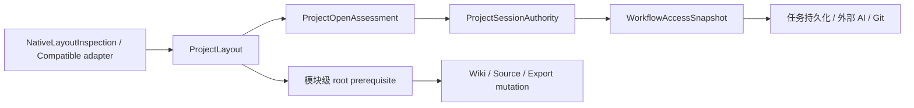
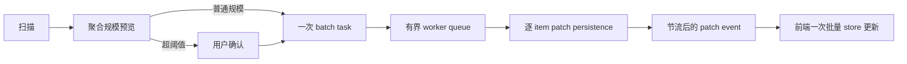
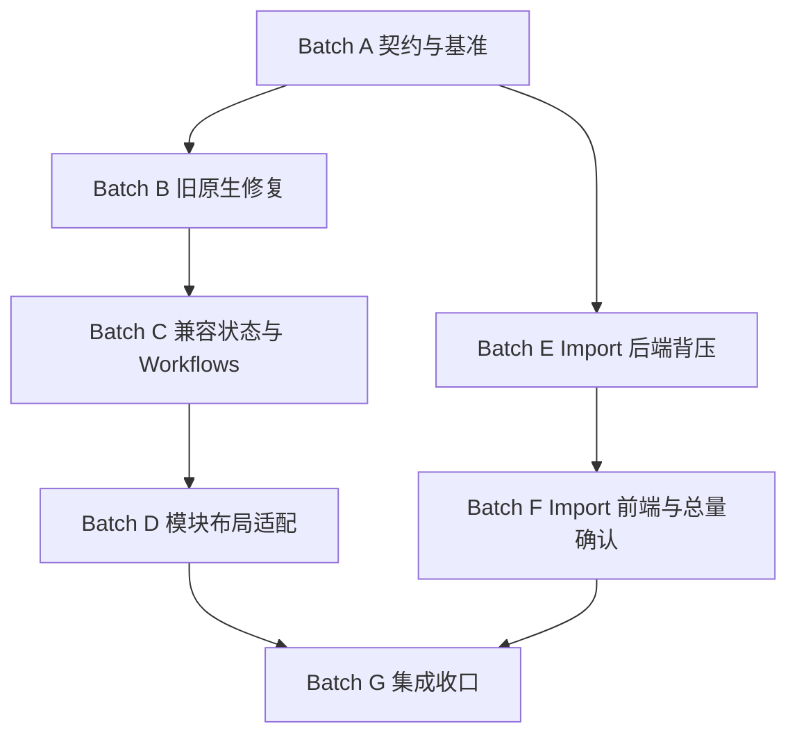

# 旧项目、兼容知识库与批量导入稳定性修复计划

> 日期：2026-08-05  
> 状态：待实施  
> 计划性质：审查结论的分批实施方案，不代表代码已经修复  
> 总原则：最小侵入、能力显式、用户内容不动、工作量有界、失败可恢复

## 0. 权威来源与审查范围

本计划服从以下产品和工程权威：

- [First-run / Project-open Workbench 设计](../specs/2026-07-30-first-run-project-open-workbench-design.md)
- [Workflows 面板重设计](../specs/2026-07-30-workflows-panel-redesign.md)
- [Import / Source / Media 流程设计](../specs/2026-07-24-import-source-media-flow-design.md)
- [SPEC 当前实现对齐记录](../../../SPEC/SPEC.md#16-当前实现对齐记录2026-07-11)
- [后端结构](../../../SPEC/BACKEND_STRUCTURE.md)
- [应用流程](../../../SPEC/APP_flow.md)
- 仓库根目录 `AGENTS.md` 的安全、检查、审查和日志规则

本计划处理三个已审查问题：

1. 部分旧原生项目打开后，Workflows 页面或工作流入口不可用。
2. 一次性导入大量文件后，扫描、启动处理或确认提交阶段可能卡死。
3. 已有 Markdown / Obsidian / Nashsu 知识库虽然能够打开，但因为兼容布局只提供部分读取能力，Chat、Workflows、Import、Export、Lint 等功能大量不可用或行为不一致。

本计划不重新设计这些页面，不改变已确认的产品信息架构，也不把普通材料目录升级为知识库。

## 1. 第一性原理

### 1.1 功能可用的最小闭环

一个项目功能只有在以下链路全部成立时才是真的可用：

```text
识别项目格式
  -> 派生逻辑读写与状态根目录
  -> 派生 trust / health / filesystem / capability
  -> 前端展示真实 prerequisite
  -> 后端在执行时重新验证
  -> 以有界任务、事件、IPC 和磁盘写入执行
```

任何一层猜测路径、复用过期信任或让工作量随条目数平方增长，都会产生“页面能打开但功能不能用”或“后台限流但应用仍卡死”的假可用状态。

### 1.2 修复必须保持的五条不变量

1. **用户内容不动。** 兼容知识库的现有 Markdown 布局保持原位；不得自动创建 `raw/`、`wiki/`、`exports/` 来伪装原生项目。
2. **能力来自事实。** 目录存在、信任、可写、健康和持久化分别派生，不能用“项目已注册”或“磁盘可写”代替具体能力。
3. **应用状态与内容写入分离。** 能写 `.app/compat/` 不代表能写用户 Wiki、Source 或 Export 目录。
4. **任务数量不等于条目数量。** `ImportItem` 是逐条状态事实；`BackendTask` 是一次用户操作的后台生命周期。批量导入不能为每个条目制造一个全局任务。
5. **总成本近似线性。** 对 N 个导入条目，查找、状态更新、事件、IPC 和落盘均应为 `O(N)` 或 `O(N log N)`；禁止在逐条循环内再次加载、扫描或保存整个 session。

## 2. 最小侵入决策

### 2.1 本轮明确采用

- 在现有 `ProjectLayout`、`ProjectOpenAssessment`、`ProjectSessionAuthority` 和 `WorkflowAccessSnapshot` 上补齐单一判定链，不另建平行项目系统。
- 旧原生项目使用现有 Repair confirmation 主机进行显式升级；不在打开项目时静默创建目录或恢复信任。
- 兼容知识库的应用状态只写入 `.app/compat/`；用户 Markdown 根目录只有在后端能够无歧义识别，或用户显式选择后才成为写入根目录。
- 保留 `ProjectContext` 的旧便利字段和现有 IPC 命令，先迁移调用者，等引用归零后再单独讨论删除。
- Import session 继续使用 Markdown、JSON 和本地文件；不引入数据库，不更换整个 Import V2 facade。
- 新增一个 operation-level 批量导入命令；现有 `start_import_items_v2` 暂时保留为受限兼容入口。
- 保留 Import item 逐条重试、跳过、取消和部分成功；只改变任务与持久化粒度。

### 2.2 本轮明确不做

- 不为所有项目引入新的全局 manifest，也不要求健康现有项目先迁移 manifest 才能打开。
- 不自动推断 Obsidian 根目录就是 Wiki 写入根目录。
- 不重写 Workflows、Import 或 Project-open 页面布局。
- 不删除旧 task/session JSON，不批量重写历史 session。
- 不改变 `raw/sources/` 不可变策略，不自动替换或删除原始来源。
- 不用提高线程数、扩大 Tokio 池、延长 UI timeout 或降低最大文件数来掩盖平方级开销。
- 不用虚假的 progress animation 代替真实进度和取消。

### 2.3 为什么暂不新增原生项目 manifest

当前故障可以通过统一现有 marker 判定、补齐显式 repair transition 和增加合同测试关闭。此时引入新 manifest 会同时触及新建、打开、最近项目、修复、信任、迁移和兼容路径，扩大回归面。

本轮在代码中建立唯一的、带版本常量的 `NativeLayoutInspection` 合同。如果未来出现第二次原生布局演进，再以单独 ADR 决定是否把版本持久化到 `.app/`。不能为了未来可能性扩大本轮修复。

## 3. 审查 Finding 与修复归属

| ID | Finding | 严重度 | 修复批次 |
| --- | --- | --- | --- |
| F-01 | `resolve_layout` 与 `ProjectRegistry::is_strict_native_layout` 使用不同原生 marker 集合 | P0 | Batch B |
| F-02 | `NativeLegacy` 被标记为 `Repairable`，但现有 repair 只支持 Recovery graph cache | P0 | Batch B |
| F-03 | `Repairable` 会撤销工作流信任，缺少修复后的 authority refresh | P0 | Batch B |
| F-04 | Workflows overview、baseline 和 output summary 仍读取固定原生路径 | P0 | Batch C |
| F-05 | Compatible enablement 只写 purpose/schema，没有安全 app-state roots | P0 | Batch C |
| F-06 | `ProjectWrite`、task persistence 和具体内容写入根目录被混成一个能力 | P0 | Batch C/D |
| F-07 | 多个服务绕过 `ProjectLayout`，直接使用 `wiki_dir`、`raw_dir`、`exports_dir` 或 `.app/...` | P1 | Batch D |
| F-08 | 兼容目录发现依赖浅层英文目录名启发式，CJK / 自定义 Vault 容易成为 Mixed | P1 | Batch D |
| F-09 | 文件发现每个文件发送一次 progress，并触发 task event 与 task JSON 写入 | P0 | Batch E |
| F-10 | 启动 N 个导入条目会创建 N 个 `BackendTask`，且多处逐条线性查找 | P0 | Batch E |
| F-11 | 单条 item 状态变化和单条 commit 会重写整个 session item 集合 | P0 | Batch E |
| F-12 | 前端逐任务 upsert、逐 item replace 和重复 refresh 形成第二层 `O(N²)` | P0 | Batch F |
| F-13 | 现有 large-data confirmation 只覆盖单文件表格估算，不覆盖总文件数和总字节数 | P0 | Batch F |
| F-14 | Rust session 与 React ImportQueue 跨 Tauri IPC，静态依赖图无法证明性能闭环 | P1 | Batch A/G |

## 4. 目标架构

### 4.1 项目能力链



关键规则：

- `ProjectLayout` 是路径事实的唯一来源。
- `WorkflowAccessSnapshot.persistence` 只说明 task/workflow 状态能否持久化，不授权内容写入。
- Wiki、Source、Export 等写操作必须同时通过通用 authority guard 和对应 layout root guard。
- 前端 disabled/guidance 只做解释，后台 start/confirm/apply 必须重新验证。

### 4.2 Import 有界执行链



关键规则：

- 一个“开始处理 N 项”动作创建一个 `BackendTask`。
- 每个 `ImportItem` 保留独立状态、错误、决策和重试信息。
- 进度最多按固定条数或固定时间窗口发出，不能每个文件/阶段无条件发出。
- session membership 变化时才重写 item ID 清单；item 状态变化只写该 item。

## 5. 批次与依赖



| Batch | 目标 | 是否改生产代码 | full gate | 回滚点 |
| --- | --- | --- | --- | --- |
| A | 冻结失败合同、fixture 和性能计数器 | 否，测试/工具为主 | 否 | 删除新增测试即可 |
| B | 统一旧原生判定并提供显式 repair transition | 是，authority/repair 高风险 | 是 | 保留旧 restricted 行为 |
| C | 为 compatible 建立安全 app-state roots，并修通 Workflows | 是，信任/持久化高风险 | 是 | 兼容项目回到 MemoryOnly |
| D | 消除用户可见模块的固定原生路径 | 是，跨模块文件操作 | 是 | 按模块回退，不删除 compat 状态 |
| E | 后端任务、事件、session 落盘线性化 | 是，并发/持久化高风险 | 是 | 前端仍可调用旧命令的小批路径 |
| F | 前端批量 patch、总量确认与旧命令切换 | 是，跨 IPC | 是 | 切回受限旧入口 |
| G | 全矩阵、性能门槛、审查与文档收口 | 仅修复发现的问题 | 是 | B/C/D 与 E/F 分别可回滚 |

Batch B-D 与 Batch E-F 可独立实施，但不能绕过 Batch A。Batch G 前不得删除兼容 IPC 或旧路径字段。

## 6. Batch A — 冻结契约、失败 fixture 与可计数基准

### 6.1 目标

先把三类问题写成确定的红灯测试和可测指标，防止实现阶段把“页面不报错”误当成修复完成。

### 6.2 项目 fixture 矩阵

新增测试 fixture builder，不向 `wiki/wiki/` 写测试状态：

| Fixture | 结构 | 期望 |
| --- | --- | --- |
| `native_current` | 完整当前 marker | Healthy、TrustedNative、Persistent |
| `native_legacy_missing_tasks` | 缺 `.app/tasks` | NativeLegacy、Repairable、有 repair plan |
| `native_legacy_missing_sources` | 缺 `raw/sources` | NativeLegacy、Repairable、有 repair plan |
| `native_legacy_semantic_gap` | 缺 purpose 或 schema | 可读但不可自动补写语义文档 |
| `nashsu_compatible` | `raw/`、`wiki/`、index/overview | 保留原 Markdown，启用前 restricted |
| `obsidian_restricted` | `.obsidian/` + CJK/嵌套 Markdown | 可读、本地搜索/图/Local Health 可用 |
| `obsidian_enabled_state_only` | `.app/compat/` 已启用、无内容 write mapping | Persistent app state，可写工作流仍提示缺 root |
| `markdown_custom_roots` | `资料/`、`笔记/`、根 Markdown | 不因英文目录名缺失而丢失可读内容 |
| `compatible_read_only` | 合法布局但文件系统只读 | MemoryOnly、无内容 mutation |
| `unsafe_link` | 指向项目外或敏感根的 link/reparse | 排除并给 warning，绝不写入 |

Windows junction、Unix symlink、CJK、Unicode normalization、大小写碰撞均复用现有 path-safety 测试策略。

### 6.3 Import 规模 fixture

至少提供 100、1,000、10,000 条 synthetic item；不运行真实 OCR、ASR、网络请求或大模型。

测试工具记录：

- 创建的 `BackendTask` 数量；
- `TaskUpdated` 事件数量；
- import patch 事件数量；
- task JSON 写入次数；
- session summary 写入次数；
- item JSON 写入次数；
- `load_session` 和全量 item 遍历次数；
- IPC 返回对象的条目数量或序列化字节数；
- 前端 Zustand `set` 次数；
- terminal item 引起的全量 refresh 次数。

优先使用 fake event sink、fake persistence observer 和确定性计数断言；墙钟耗时只作为宽松 smoke threshold，不能让 CI 因机器差异抖动。

### 6.4 新增或扩展测试文件

- `src-tauri/tests/project_layout_authority_contract.rs`
- `src-tauri/tests/project_legacy_repair.rs`
- `src-tauri/tests/workflow_compatible_layout.rs`
- `src-tauri/tests/import_v2_scale_contract.rs`
- `src-tauri/tests/import_v2_file_discovery.rs`
- `src-tauri/tests/import_v2_file_orchestration.rs`
- `src/features/import/importScaleContract.test.ts`
- `src/stores/importStore.test.ts`
- `src/stores/taskStore.test.ts`
- `src/types/project.contract.test.ts`
- `src/types/importV2.test.ts`

### 6.5 初始红灯必须证明

- 同一个旧目录被 layout resolver 判为 native，却被 registry 判为非 strict native。
- `NativeLegacy` 的 `repairAvailable` 为 false。
- Compatible enable 后 `taskStateRoot` 仍为空。
- Compatible Markdown 在 Workflows overview 中被错误报告为没有 readable content。
- 扫描 10,000 个文件产生近 10,000 次 progress 更新。
- 启动 10,000 项产生近 10,000 个全局任务。
- 单 item 变更导致 N 个 item 文件重写。
- 10,000 项 task/item 事件导致前端近似平方级 store 遍历。

### 6.6 退出门槛

- 每个 Finding 至少有一个失败测试或明确的静态合同断言。
- 性能测试能区分“worker 数量有界”和“控制面总开销有界”。
- 不修改产品代码，不把预期失败加入永久 skip。
- 记录基线计数，不以当前机器的绝对毫秒值作为唯一标准。

## 7. Batch B — 统一旧原生判定与显式修复状态机

### 7.1 目标

让旧原生项目从“被识别但无法修复”进入一个可预览、可确认、可重新验证的升级路径，同时保持打开动作只读。

### 7.2 单一原生布局检查

在 `src-tauri/src/models/layout.rs` 增加内部合同：

```rust
const CURRENT_NATIVE_LAYOUT_VERSION: u32 = 1;

enum NativeLayoutState {
    Current,
    RepairableLegacy { missing: Vec<NativeLayoutRequirement> },
    IncompleteLegacy { reasons: Vec<NativeLayoutGap> },
    NotNative,
}

struct NativeLayoutInspection {
    version: u32,
    state: NativeLayoutState,
}
```

名称可在实现时按现有风格调整，但语义必须保持：

- `Current` 使用唯一 marker 集合。
- `RepairableLegacy` 只允许缺失可安全重建的空目录或应用状态目录。
- 缺 purpose/schema 等语义内容时属于 `IncompleteLegacy`；应用不能猜写文档。
- 普通材料目录永远不能因为创建几个空目录而成为原生知识库。

将以下位置改为消费同一个 inspection，不再复制 marker 数组：

- `resolve_layout` / `native_markers_present`
- `ProjectRegistry::is_strict_native_layout`
- `assessment::classify_format`
- `ProjectService::health_report`
- `register_opened_project_authority`

暂时保留 `is_strict_native_layout` 方法签名，内部委托给 inspection，以减少调用面变化。

### 7.3 可自动修复范围

仅允许创建经过代码 allowlist 的缺失目录。首轮 allowlist 以新建项目真实创建合同为准，重点包括：

- `raw/sources/` 及必要的空分类目录；
- `wiki/sources/`、`wiki/queries/` 等已经由当前 native layout 明确拥有、且只缺目录的路径；
- `.app/tasks/` 及 Workflows/Chat 等当前版本需要的 app-state 目录；
- `exports/html/`、`skills/` 等空支持目录。

实现前必须把 allowlist 与 `ProjectService::create_structure` 的目录集合提取为同一常量/descriptor。禁止修复器创建或覆盖：

- `purpose.md`、`schema.md`；
- Wiki 页面；
- Source Markdown；
- raw 原始文件；
- 任意现存文件；
- 任意 link/reparse 路径；
- allowlist 外目录。

### 7.4 扩展现有 Repair DTO

复用现有 `ProjectRepairPlan` 和 confirmation host，不新增第二套 repair 页面。

将 `ProjectRepairOperation` 调整为能准确表达两类操作：

- `RegenerateGraphCache`：保留 backup、expected hash 和 Git checkpoint 规则。
- `CreateDirectory`：携带 target path、预期缺失状态和 allowlist descriptor；不伪造 backup/hash。

如果现有 struct 字段必须从必填改成可选，应同步更新：

- `src-tauri/src/models/project.rs`
- `src/types/project.ts`
- `src/types/project.contract.test.ts`
- confirmation preview renderer

不得用空字符串表示“不适用”。

### 7.5 Prepare / confirm / apply 顺序

1. Prepare 阶段只读，重新检查 canonical identity、layout、health、Git 和准确缺失路径。
2. UI 展示将创建的每个目录，并明确“不会移动或覆盖 Markdown”。
3. 用户确认后，后台重新检查 identity revision、authority revision、Git baseline 和每个 target 的缺失状态。
4. 按父目录到子目录顺序创建，只允许 project-contained、no-link 路径。
5. 中途失败时，只删除本次创建且仍为空的目录；不删除预先存在目录。
6. Apply 成功后重新 assessment；只有得到 `NativeCurrent + Healthy` 才刷新 native authority。
7. `TaskService` 只在新的 task root 被证明安全可写后执行 persistence rebind。
8. 返回新的 `ProjectSessionAuthority`，前端以 project key + authority revision guard 更新当前项目。

仅创建空目录不会产生可提交的 Git tree entry，因此不能声称存在 Git checkpoint。涉及缓存覆盖的 repair 继续遵守现有 checkpoint 规则，两类操作不能混淆。

### 7.6 Workflows 恢复语义

- 修复前：Local Quick Health 可内存运行；外部 AI 和写入工作流保持 blocked。
- 修复成功：Workflows overview 重新加载；新的任务使用 persistent task root。
- 修复失败或 stale：继续 restricted/repairable，不恢复旧 trust，不打开 task drawer。
- 旧 task JSON 不搬迁、不重命名；存在时按现有 recovery 规则读取。

### 7.7 预计生产文件

- `src-tauri/src/models/layout.rs`
- `src-tauri/src/models/project.rs`
- `src-tauri/src/app_state.rs`
- `src-tauri/src/services/project_service.rs`
- `src-tauri/src/services/project_service/assessment.rs`
- `src-tauri/src/commands/project_commands.rs`
- `src-tauri/src/models/confirmation.rs`，仅在 operation payload 需要扩展时
- `src/features/project/ProjectAssessmentPanel.tsx`
- `src/features/project/ProjectAuthorityDialog.tsx`
- `src/stores/projectStore.ts`
- `src/types/project.ts`
- 中英文 locale 文件

### 7.8 必测场景

- 缺 `.app/tasks`、缺 `raw/sources`、缺多个 allowlisted 目录。
- purpose/schema 任一缺失时无自动 repair plan。
- target 在 prepare 后被创建、换成文件、换成 link 或项目 identity 改变。
- repair 中途失败只回滚本次空目录。
- 修复成功后 NativeCurrent、Healthy、TrustedNative、Persistent 一致。
- 修复成功但 task root 实际只读时保持 MemoryOnly。
- 项目切换期间 repair 返回，不污染当前项目 UI。
- Windows/CJK/大小写碰撞路径。

### 7.9 退出门槛

- F-01、F-02、F-03 全部关闭。
- 原生 marker 只在一个 descriptor 中定义。
- 打开旧项目仍然零写入。
- 用户未确认时不会创建目录或恢复 trust。
- 两位 review subagents 完成高风险审查并关闭有效问题。
- `graphify update .` 已运行。
- 从头通过 `npm run check`。

## 8. Batch C — Compatible app-state 与 Workflows 最小可用闭环

### 8.1 目标

让已显式启用的 compatible vault 拥有安全、隔离、可持久化的应用状态，同时不把应用状态写权限冒充 Wiki/Source/Export 写权限。

### 8.2 Compatible state profile

当且仅当 `.app/compat/purpose.md` 和 `.app/compat/schema.md` 已经通过现有确认流程创建并重新验证后，`ProjectLayout` 派生以下 app-owned roots：

```text
.app/compat/
  purpose.md
  schema.md
  tasks/
  workflows/
  import-sessions/
  sources/
  compile/
  chats/
  lint-reports/
  graph-cache.json
  lint-ignore.json
  exports.json
  bookmarks.json
  settings.json
  agent-config.json
  layout.json        # 仅在用户配置内容写入根时存在
```

具体命名可与现有 service 常量协调，但必须满足：

- 所有 compatible app-owned state 都在 `.app/compat/` 下。
- enable confirmation 的 affected paths 与实际创建项一致。
- enable 阶段至少创建安全 task/workflow state root，使 persistence 判定可成立。
- 未启用项目仍不创建 `.app`。
- read-only 项目即使已有这些路径也不得被判为 writable。

### 8.3 分离 persistence 与 content write

保留 `WorkflowPersistenceMode` 表达 task/workflow 状态是否可持久化。

重新明确 `ProjectCapability::ProjectWrite`：只有存在至少一个经过验证的内容 write root 时才出现；能够写 app state 本身不产生 `ProjectWrite`。

为后端增加内部 typed root guard，例如：

```rust
enum ProjectWriteRootKind {
    Source,
    Wiki,
    Export,
    Query,
}
```

guard 返回 containment-checked 的真实路径，缺失时返回统一 typed error：

```text
PROJECT_LAYOUT_ROOT_UNAVAILABLE
details.rootKind = wiki | source | export | query
```

现有 `require_project_write_access` 暂不删除；将其语义限制为通用 authority/health/filesystem/state gate。实际内容 mutation 必须再调用 root guard。

### 8.4 Workflows 路径切换

优先关闭用户报告的 Workflows 故障：

- Overview 的 readable Markdown 改用 `layout.list_markdown_files`，不再固定读取 `context.wiki_dir` 和 `raw/extracted`。
- Local Quick Health 使用 layout roles；不存在的逻辑根显示 not applicable，不显示 failed。
- Baseline files 从 `purpose_context.read_path` 和 `schema_context.read_path` 读取。
- Update Wiki output summary 使用 `wiki_write_root`；缺失时显示准确 prerequisite。
- Generate Content output summary 使用 `export_root`；缺失时显示准确 prerequisite。
- Local Quick Health 在 restricted/read-only/MemoryOnly 下仍可执行并标记结果不持久化。
- Complete Health 可在 trusted read-only 项目内存执行；不能因为无 task root 就错误要求内容写权限。
- Update Wiki 同时要求 trust、writable、`wiki_write_root` 和 Git/checkpoint policy。
- Generate Content 同时要求 trust、writable、`export_root` 和适用的覆盖/checkpoint policy。

### 8.5 预计生产文件

- `src-tauri/src/models/layout.rs`
- `src-tauri/src/models/project.rs`
- `src-tauri/src/models/workflow.rs`
- `src-tauri/src/app_state.rs`
- `src-tauri/src/services/project_service.rs`
- `src-tauri/src/services/project_service/assessment.rs`
- `src-tauri/src/services/workflow_service/overview.rs`
- `src-tauri/src/services/workflow_service/preparation.rs`
- `src-tauri/src/services/workflow_service/health_check.rs`
- `src-tauri/src/services/workflow_service/update_wiki.rs`
- `src-tauri/src/services/workflow_service/generate_content.rs`
- `src/features/workflows/`
- `src/types/project.ts`
- `src/types/workflows.ts`

### 8.6 必测场景

- restricted Obsidian Local Quick Health 成功且不创建 `.app`。
- enabled compatible vault 的 task/workflow JSON 只进入 `.app/compat/`。
- enabled state-only vault 的 Update Wiki/Generate Content 分别提示缺 wiki/export root。
- trusted read-only compatible vault 的 Complete Health 内存成功。
- compatible purpose/schema 被 Workflows baseline 正确读取。
- 原生项目所有 path/result 与现有合同一致。
- 无逻辑 root 的检查为 not applicable。
- 伪造前端 capability 不能绕过后端 root guard。

### 8.7 退出门槛

- F-04、F-05、F-06 的 Workflows 部分关闭。
- 旧项目修复后 Workflows 可用，compatible restricted 项目至少有真实可用的 Local Quick Health。
- 没有内容 write root 时不会创建 native 目录。
- 两位 review subagents 完成审查。
- `graphify update .` 已运行。
- 从头通过 `npm run check`。

## 9. Batch D — Compatible adapter 与固定原生路径收口

### 9.1 目标

让更多模块按真实布局工作，同时把无法安全支持的操作显示为具体 prerequisite，而不是笼统“功能不可用”。

### 9.2 最小 adapter 层

在 project service 内新增小型 resolver/adapter 模块，不建立插件系统：

- Native current/legacy
- Nashsu LLM Wiki
- Obsidian vault
- Generic Markdown vault

每个 adapter 只负责：

1. 识别自身已有 marker。
2. 映射 read roots 和 role。
3. 在明确安全时提出已有 write root。
4. 读取用户确认后的 `.app/compat/layout.json`。
5. 输出 warning/confidence，不执行写入。

Nashsu 只有在现有 `wiki/`、`raw/` 等 marker 无歧义且用户完成 compatible enablement 后，才能映射对应已有 write root。Obsidian 和 generic Markdown 默认只有 read roots + app state，不默认把 `.` 当 Wiki 写入根。

### 9.3 显式 compatible root mapping

复用现有 Project Authority/Assessment UI，增加紧凑的“功能目录”配置，不创建新设置中心：

- Wiki 写入目录：可选现有 project-contained 目录。
- Source 写入目录：可选现有 project-contained 目录。
- Export 目录：可选现有目录；创建新目录必须单独确认。
- 每项可保持“未启用”。

后台 prepare 返回规范化相对路径、碰撞、link、安全和 Git 影响预览。确认后只写 `.app/compat/layout.json`；不移动现有 Markdown。

首次创建 `layout.json` 使用 create-new + atomic rename。修改已有 mapping 属于覆盖 app-owned 配置，必须先创建 Git checkpoint；没有可用 Git 时保持原 mapping 并返回 typed prerequisite，不能退化成无 checkpoint 覆盖。

`layout.json` 至少包含：

```json
{
  "schemaVersion": 1,
  "wikiWriteRoot": "笔记",
  "sourceWriteRoot": "资料",
  "exportRoot": "导出"
}
```

字段可空。读取时必须：

- 拒绝绝对路径、`..`、link/reparse 和敏感目录；
- 重新 canonicalize 并验证仍在项目内；
- 不因为配置文件存在就恢复 trust；
- 配置 stale 时降级对应 capability，不影响安全读取。

### 9.4 服务迁移顺序

按用户价值和风险分小提交迁移：

1. Workflows overview/preparation/result locations。
2. Wiki index、Local Search、Graph 和 Local Health 的读取路径。
3. Chat/session、Lint report/ignore、Task/Workflow persistence 的 app-state 路径。
4. Export artifact/record 路径。
5. Import session、Source state 与 Compile state 路径。
6. Settings、bookmarks、agent-config 路径。

每迁移一个模块都遵循：

```text
command -> AppState authority -> stable facade -> layout root guard -> FileStore
```

不得让 React 计算真实文件系统路径。

### 9.5 固定路径处理规则

- `ProjectContext.wiki_dir/raw_dir/exports_dir/app_dir` 暂时保留，标记为 native legacy convenience。
- 新代码不得直接使用这些字段。
- `compile_legacy_adapter.rs` 可以保留固定 native 路径，但必须只在明确 native legacy 分支可达，文件名和测试都表达其兼容性质。
- 对 `.app/import-sessions`、`.app/tasks` 等字符串进行调用面清单；除 native layout descriptor、迁移器和测试 fixture 外，生产 service 不得自行拼接。
- 用行为合同测试保证 compatible fixture 不会创建 `raw/`、`wiki/`、`exports/`。

### 9.6 兼容发现改善

不引入无界深扫：

- 保留顶层和目录项预算、取消检查、link policy。
- role 启发式支持 CJK 常见名，但不能仅凭名称授权写入。
- 已识别的 `index.md`、链接结构、Obsidian marker 和现有 `.app/compat/layout.json` 只提高读取置信度。
- 深层 inventory 继续是后台可取消操作；quick assessment 不扫描整个 Vault。
- `Mixed` 是合法结果，不应阻断 Local Search、Graph 或 Local Health。

### 9.7 预计生产文件

- 新增 `src-tauri/src/services/project_service/layout_adapters.rs`，或在现有 project service 内建立等价聚焦模块
- `src-tauri/src/models/layout.rs`
- `src-tauri/src/models/paths.rs`
- `src-tauri/src/services/project_service.rs`
- `src-tauri/src/services/wiki_index.rs`
- `src-tauri/src/services/chat_service/`
- `src-tauri/src/services/lint_service/`
- `src-tauri/src/services/export_service.rs`
- `src-tauri/src/services/import_v2/session_store.rs`
- `src-tauri/src/services/compile_service.rs`
- `src-tauri/src/services/compile_legacy_adapter.rs`
- 对应 command、DTO、frontend service 与 Project Authority UI

### 9.8 必测场景

- CJK、自定义、根目录、嵌套、Mixed roots 均可读取。
- Nashsu adapter 不搬动 Markdown，启用后只使用已经存在且验证过的目录。
- Obsidian state-only 模式下 Chat/Health 可用，但 Wiki/Source/Export 写入保持 blocked。
- 用户显式配置后，各模块只写配置根目录。
- 配置目录删除、变只读、变 link 或越界后 capability 立即降级。
- 原生项目无行为回归。
- compatible 项目不会生成 `raw/`、`wiki/`、`exports/`。

### 9.9 退出门槛

- F-06、F-07、F-08 关闭。
- 用户可从 prerequisite 看出缺的是 trust、writable、Git、state root 还是具体内容 root。
- 目标生产服务没有新的硬编码 native 路径。
- 两位 review subagents 完成跨模块与路径安全审查。
- `graphify update .` 已运行。
- 从头通过 `npm run check`。

## 10. Batch E — Import 后端背压与增量持久化

### 10.1 目标

在不更换 Import V2 facade、不破坏逐 item 语义的前提下，将扫描、启动、处理和 commit 的控制面成本降为线性。

### 10.2 Discovery 批量与节流

修改 `FileDiscoveryService::scan` 的 callback 实现：

- 缓冲最多 128 个 discovered files 后调用一次 `on_batch`；结束前强制 flush。
- progress task 更新同时满足“新增至少一批”且“距离上次持久化至少 100ms”，最终状态强制写入。
- cancellation 每个目录项继续检查，不能因为 batching 降低取消响应。
- skipped/truncated 统计随批次累计，不为每个 skip 发独立任务事件。

常量放在 import discovery 模块，并通过测试注入较小值验证；不要修改全局 `TaskService` 事件语义来解决一个 import 调用点的问题。

### 10.3 Operation-level batch task

新增 additive IPC：

```text
start_import_batch_v2
```

建议 DTO：

```ts
interface StartImportBatchV2Result {
  task: BackendTask;
  batchId: string;
  acceptedItemCount: number;
}
```

语义：

- 一次调用只创建一个持久化 `BackendTask`。
- `ImportItem` 继续保存逐条状态、error、pending action、retry metadata。
- worker job 共享 batch task 的 cancellation token。
- 一个原子计数器/受锁 aggregator 汇总 queued/running/completed/failed/waiting。
- Task progress 和日志经过节流；每个 item 的详细结果仍在 Import session/queue 查看。
- 单 item retry 也创建一个 operation task，但只包含该 item。
- app restart 后根据 session item 状态恢复可重试事实，不制造 N 个 recovered global tasks。

现有 `start_import_items_v2`：

- 保持注册和返回类型，避免立即破坏 IPC 合同。
- 设置 `LEGACY_START_ITEMS_LIMIT = 200` 的小批安全上限；超过上限返回 `IMPORT_BATCH_COMMAND_REQUIRED`。
- 前端切换成功前不删除。
- Batch G 搜索确认无生产调用者后，仍只标记 deprecated，不在本计划删除。

### 10.4 消除后端平方级查找

启动批次时一次构建：

```rust
HashMap<ItemId, ItemIndex>
```

然后：

- 一次验证 requested IDs；
- 一次读取 replaced waiting state；
- 一次生成 worker jobs；
- 不在 `for item_id` 内调用 `session.items.iter().find(...)`；
- `bind_item_task_ids` 不再逐 item 线性调用 `find_item_mut`。

在 batch-task 模型下 item 不再绑定唯一全局 task；如果为了历史兼容保留 `task_id` 字段，则统一绑定 batch task ID，并明确它表示所属 operation，而非一 item 一 task。

### 10.5 SessionStore 增量 API

保留现有 session schema 和全量 `load/save` 作为兼容/迁移工具，新增聚焦 API：

- `load_item(session_id, item_id)`
- `write_item(session_id, item)`
- `write_items(session_id, changed_items)`
- `write_session_record(session)`
- `add_items(session_id, new_items)`：写新增 item + 一次 membership summary

规则：

- item 状态转换只写对应 item JSON。
- `session.json` 中 item ID membership 只在 add/remove 时重写。
- 高频 item stage 不为了更新 `session.updated_at` 重写包含 N 个 ID 的 summary；在 batch 开始、结束、确认或明确 global status transition 时写一次。
- `serialized_writes(&session)` 不得再出现在逐 item 处理或逐 item commit 循环内。
- `load_session` 不得再出现在单 item stage transition 的内部热路径。

### 10.6 Commit 线性化

`commit_items_cancellable_with_progress`：

1. 批次开始加载 session 一次并构建 item index。
2. 每个 decision 通过 index 定位 item。
3. `commit_one` 的事务只包含该 item 的 Source/evidence/manifest 写入和该 item JSON。
4. 失败只标记该 item，保持部分成功。
5. 每个安全点检查 cancel。
6. 批次结束只写一次 session summary/completion。
7. checkpoint、baseline、external edit 和 source immutability 规则保持不变。

禁止为了减少写入把所有 item 合成一个无法部分成功、无法逐条恢复的大事务。

### 10.7 Import state root

SessionStore、scan result 和 completion record 必须从 `context.layout.import_state_root` 解析。原生仍映射 `.app/import-sessions`；compatible 使用 Batch C 定义的 `.app/compat/import-sessions`。缺失 root 时返回 typed prerequisite，不拼接 native fallback。

### 10.8 预计生产文件

- `src-tauri/src/services/import_v2/file_discovery.rs`
- `src-tauri/src/services/import_v2/session_store.rs`
- `src-tauri/src/services/import_v2/orchestrator.rs`
- `src-tauri/src/services/import_v2/commit.rs`
- `src-tauri/src/commands/import_v2_file_commands.rs`
- `src-tauri/src/commands/import_v2_commands.rs`
- `src-tauri/src/models/import_v2.rs`
- `src-tauri/src/models/import_v2_file.rs`
- `src-tauri/src/tasks/task_service.rs`，仅在需要 operation metadata 时
- `src-tauri/src/lib.rs`

### 10.9 定量退出门槛

对 10,000 个 synthetic files/items：

- discovery callback 次数不超过 `ceil(N / 128) + 2`。
- progress/task persistence 不随每个文件无条件发生；事件速率不超过每秒 10 次，开始/结束事件除外。
- `start_import_batch_v2` 创建且返回一个 `BackendTask`。
- item ID 验证和 job 创建只有常数次全量遍历。
- 单 item 状态变化写一个 item JSON，不重写其他 item。
- commit 总 item JSON 写入为 `O(N)`，不存在 N 次全量 `serialized_writes`。
- cancel 在下一个 batch/worker safe point 生效，目标延迟不超过 1 秒。
- 部分失败、waiting confirmation、retry 和 restart recovery 语义保持。

### 10.10 退出门槛

- F-09、F-10、F-11 关闭。
- 旧 IPC 合同仍注册，大批调用会明确引导新 batch command。
- 两位 review subagents 分别审查并发/持久化和无上下文盲点。
- `graphify update .` 已运行。
- 从头通过 `npm run check`。

## 11. Batch F — Import 前端批量状态、总量确认与切换

### 11.1 目标

让前端每个后端批次只进行一次主要 store commit，消除逐任务/逐 item 全数组复制，同时落实总数据量确认。

### 11.2 总量预览与确认

扩展 `FileScanResult`，增加 additive totals：

```ts
interface ImportScanTotals {
  fileCount: number;
  totalBytes: number;
  estimatedOutputFiles?: number;
  requiresConfirmation: boolean;
  reasons: Array<"file_count" | "total_bytes" | "estimated_output_files">;
}
```

阈值由后端定义和判断；前端只显示结果。达到 soft threshold 时：

1. 扫描完成但不向 session 添加 item。
2. UI 显示文件数、总大小、预计输出量和被跳过项。
3. 用户确认后，通过 scan task/result ID 接受已保存扫描结果，不重新扫描整个目录。
4. 用户取消只丢弃 scan result，不删除来源文件。
5. hard safety limit 继续由后端拒绝，并说明如何缩小范围。

现有 per-file `large_data` confirmation 保留；总量确认不能用一个布尔值覆盖每个表格文件的独立风险信息。

新增 additive `accept_import_scan_v2` 命令负责消费已持久化的 scan result。它必须重验 project/session/scan identity、来源 fingerprint、总量确认 token 和当前 layout import-state root；同一 scan result 只能幂等接受一次。

### 11.3 批量 store API

在现有 stores 增加：

```ts
taskStore.upsertTasks(tasks)
importStore.patchItems(items)
```

实现要求：

- 一次构建 changed ID map。
- 一次遍历现有数组并替换命中项。
- 新 item 一次追加。
- 一次 `set`，一次 selected item 校正，一次统计更新。
- 禁止 `forEach(upsertTask)`、`forEach(replaceItem)`。
- 统计 view model 使用 `useMemo` 或单次 reducer，不在同一 render 对列表执行多组独立 filter。

### 11.4 Import patch event

新增或复用一个 import-scoped 批量事件：

```ts
interface ImportSessionPatchEvent {
  projectId: string;
  projectRootPath: string;
  sessionId: string;
  batchId: string;
  items: ImportItem[];
  counts: ImportBatchCounts;
}
```

后台最多每 100ms flush 一次，terminal batch 强制 flush；缓冲区达到上限时合并同一 item 的最新状态，而不是突破事件速率立即增发。前端：

- 先验证 project key、session ID 和 epoch；
- 合法 backend task 仍全局 upsert；
- stale-project patch 不提交到当前 Import view；
- 一次调用 `patchItems`；
- terminal cohort 只触发一次 completion/session summary refresh；
- 不从每个 task terminal event 再调用 `get_session`。

### 11.5 前端切换

- `importV2Api` 新增 `startBatch`，保留 `startItems`。
- `useImportTaskCoordinator` 改为追踪 operation task + batch/session patches。
- `useImportBatchController` 的 cancel/retry 使用 batch ID 和 item selection。
- `ImportQueue` 继续最多渲染 200 条；本批不重写现有视觉结构。
- 如果完成批量 patch 后，10,000 项首次 session payload 仍超过验收阈值，再启用附录 A 的分页兜底；不得在无证据时预先重写整个 queue 数据模型。

### 11.6 预计生产文件

- `src/types/importV2.ts`
- `src/types/importV2Api.ts`
- `src/services/importV2Api.ts`
- `src/stores/taskStore.ts`
- `src/stores/importStore.ts`
- `src/features/import/useImportTaskCoordinator.ts`
- `src/features/import/useImportBatchController.ts`
- `src/features/import/importViewModel.ts`
- `src/features/import/ImportQueue.tsx`
- discovery/confirmation 对话框及中英文 locale

### 11.7 必测场景

- 10,000 item patch 只发生一次主要 `importStore.set`。
- 一个 batch task 不会在 task drawer 生成 10,000 行。
- project switch、session switch、旧 epoch patch 被抑制。
- batch terminal 只 refresh 一次。
- 总量确认前 session item 数不变；确认后使用保存的 scan result。
- 取消总量确认不会删除或改写来源。
- partial success、waiting、retry、skip、cancel UI 保持逐 item 可操作。
- 中英文数字、文件大小、CJK filename 和键盘焦点完整。

### 11.8 退出门槛

- F-12、F-13 关闭。
- 10,000 item synthetic UI 测试中，不出现逐 item task upsert 或逐 item full refresh。
- UI 主线程长任务目标小于 50ms；若自动化环境无法稳定测量，至少用 store commit/render count 证明结构上有界，并附一次手工性能证据。
- 两位 review subagents 完成前端状态与 fresh-context 审查。
- `graphify update .` 已运行。
- 从头通过 `npm run check`。

## 12. Batch G — 集成验收、回滚与文档收口

### 12.1 完整场景矩阵

项目能力：

- 当前原生、两类可修复旧原生、不可猜写的 incomplete legacy。
- restricted/enabled/read-only Obsidian。
- Nashsu、generic Markdown、CJK roots、Mixed roots。
- 无 Git、clean Git、dirty Git、初始 commit 缺失。
- link/reparse、项目移动、identity revision 改变。

Workflows：

- overview 可读性。
- Local Quick Health 内存/持久化。
- Complete Health trusted read-only。
- Update Wiki 缺/有 wiki root。
- Generate Content 缺/有 export root。
- repair 后 authority refresh 和 task persistence rebind。

Import：

- 100、1,000、10,000 文件扫描。
- 普通文件、超大表格、总量超阈值、hard limit。
- 启动、处理中取消、waiting confirmation、部分 commit、失败重试、重启恢复。
- native 与 compatible import state root。
- 项目切换时后台 batch 继续但不劫持当前 UI。

### 12.2 性能验收表

| 指标 | 目标 |
| --- | --- |
| 10,000 文件 discovery callback | `<= ceil(N/128) + 2` |
| 10,000 item 启动的 BackendTask | 1 |
| 单 item state transition 写入 | 仅该 item JSON，必要时有节流 summary |
| 逐 item commit 中全量 session serialization | 0 |
| import task/progress 事件率 | `<= 10/s`，边界事件除外 |
| 前端 patch 的主要 store commit | 每 flush 1 次 |
| terminal cohort full refresh | 1 次 |
| cancel 响应 | 下一个 safe point，目标 `< 1s` |
| 原生/compatible 内容越界写入 | 0 |

### 12.3 回滚规则

- 代码回滚不自动删除用户项目中已经创建的 `.app/compat/` 或旧原生 repair 空目录。
- 失败中的 repair 只回滚本次创建且仍为空的目录。
- Compatible root mapping 失效时降级 capability，不移动文件。
- Import 新 command 可独立回退到旧 command 的小批模式；不得重新开放旧命令的大批无界路径。
- 新 session 写法保持旧 schema 可读；回滚版本仍能通过原有全量 `load` 读取 item JSON。
- 不删除历史 task/session 以实现回滚。

### 12.4 可观察性

新增日志和错误必须结构化且不包含用户内容：

- layout format、confidence、missing root kind；
- repair plan ID、operation count、stale reason；
- import batch ID、item counts、worker limit；
- throttled event/write counts；
- cancel、partial success 和 terminal summary。

建议 typed error：

- `PROJECT_NATIVE_REPAIR_UNAVAILABLE`
- `PROJECT_NATIVE_REPAIR_STALE`
- `PROJECT_LAYOUT_ROOT_UNAVAILABLE`
- `PROJECT_COMPAT_LAYOUT_CONFIG_INVALID`
- `IMPORT_BATCH_COMMAND_REQUIRED`
- `IMPORT_TOTAL_CONFIRMATION_REQUIRED`
- `IMPORT_SCAN_RESULT_STALE`

错误 details 只放 root kind、相对路径、计数和 revision，不放 Source 正文、模型输出或密钥。

### 12.5 最终审查

由于涉及 filesystem、trust、Git policy、IPC、持久化、并发和后台任务：

- Reviewer A 使用共享上下文，审查产品意图、权限链、layout adapter、Workflows 和 Import 语义一致性。
- Reviewer B 使用 fresh context，专查 path safety、TOCTOU、stale authority、并发锁顺序、取消、restart recovery、session corruption、性能测试盲点。
- 合并有效问题并修复。
- 修复后重新运行相关 focused tests。
- 从头重新运行完整 `npm run check`。
- 运行 `graphify update .`，确认路径和依赖图与实现一致。

### 12.6 文档收口

- 仅当 wire contract 实际改变时更新 `SPEC/SPEC.md`、`APP_flow.md`、`BACKEND_STRUCTURE.md`。
- 更新 Workflows 和 Import feature README 的 ownership/non-goals。
- 在 `SPEC/progress.txt` 新增每个重要里程碑。
- 只有遇到重复、隐蔽或易复发问题时才新增 `SPEC/gotchas.txt`。
- 不修改 `UI-Frontend-design/`。

## 13. 每批统一交付模板

每个 batch 完成时必须报告：

1. 本批关闭的 Finding。
2. 实际修改文件。
3. DTO/IPC 兼容性变化。
4. 写入路径、确认、checkpoint 和 rollback 行为。
5. 原生、旧原生、compatible 三类行为差异。
6. Import 任务/事件/写入计数变化。
7. focused test 结果。
8. 两位审查者结论及修复。
9. `graphify update .` 结果。
10. 最终 `npm run check` 结果。
11. `progress.txt` / `gotchas.txt` 更新。
12. 未关闭风险和下一批前置条件。

## 14. 停止条件

出现以下情况必须停止当前批次并回到设计/用户确认，不能顺手扩大范围：

- 修复旧项目需要生成或覆盖 purpose/schema/Wiki/Source 内容。
- Compatible adapter 无法无歧义确定写入目录，且当前 UI 没有用户显式选择。
- 需要删除、移动或重排现有 Markdown 才能继续。
- 需要改变 `raw/sources` 不可变原则。
- 需要用数据库替代 JSON session 才能达到性能目标。
- 新 batch command 无法保持逐 item partial success/retry/cancel。
- path safety 只能通过放宽 link/reparse 检查实现。
- 计划外的产品信息架构或视觉重设计成为前置条件。
- 完整检查失败且失败属于本批改动。

## 15. Definition of Done

只有以下条件全部满足，三个问题才可判定关闭：

- 同一个目录在 layout、assessment、registry、authority 和 Workflows 中使用同一原生布局判定。
- 可安全升级的旧原生项目具有显式 repair plan；确认后可恢复 Healthy/Trusted/Persistent。
- 不可猜写的旧项目仍安全可读，不会被自动补成原生项目。
- Compatible restricted vault 的 Local Search、Graph、Local Quick Health 使用真实 Markdown roots。
- Compatible enable 后，app state 只进入 `.app/compat/`。
- Wiki/Source/Export 写入只发生在后端验证过的对应 write root。
- 生产服务不再为 compatible 项目发明 `raw/`、`wiki/`、`exports/`。
- 10,000 项导入只创建一个 operation task，事件和磁盘写入近似线性。
- 单 item 变化不重写整个 session，commit 循环不进行全量 session serialization。
- 前端使用 batch patch，不因每条事件复制完整任务和 item 数组。
- 总文件数/总字节数/预计输出量超过阈值时，用户在创建处理任务前看到并确认。
- 取消、部分成功、waiting、retry、restart recovery、project switch guard 均保持正确。
- 两轮高风险代码审查全部关闭有效问题。
- 最终 `npm run check` 从头通过。

## 附录 A — 分页兜底触发条件

本计划优先采用批量 patch，避免立即重写 ImportQueue 数据模型。只有在 Batch F 完成后仍满足任一条件，才启动独立分页子批次：

- 单次 `get_import_session_v2` 序列化或 IPC payload 明显阻塞主线程；
- 10,000 item 初次 hydrate 的主线程长任务持续超过 50ms；
- 内存占用超过验收环境可接受上限；
- 搜索/过滤的单次计算在 memoization 后仍不可接受。

分页子批次采用 additive API：session summary + cursor/offset item page；旧 `get_import_session_v2` 保留给历史详情和小 session。没有上述证据时，不提前引入服务端过滤、虚拟列表或 normalized entity cache。

## 附录 B — Graphify 溯源记录

本计划基于以下图谱路径确认修改边界：

- `ProjectLayout <- layout.rs <- app_state.rs -> ProjectTrustKind <- WorkflowAccessSnapshot`
- `FileDiscoveryService <- file_discovery.rs -> import_v2.rs <- orchestrator.rs -> SessionStore`

`SessionStore` 到 React `ImportQueue` 没有静态最短路径，这是 Tauri command/event 字符串边界造成的图谱盲区；因此 Batch A 与 Batch G 必须用 IPC contract test 和端到端计数补足，不能只依赖 AST 关系图。
