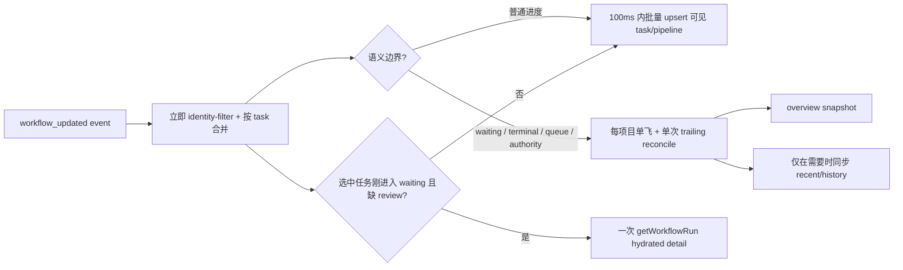
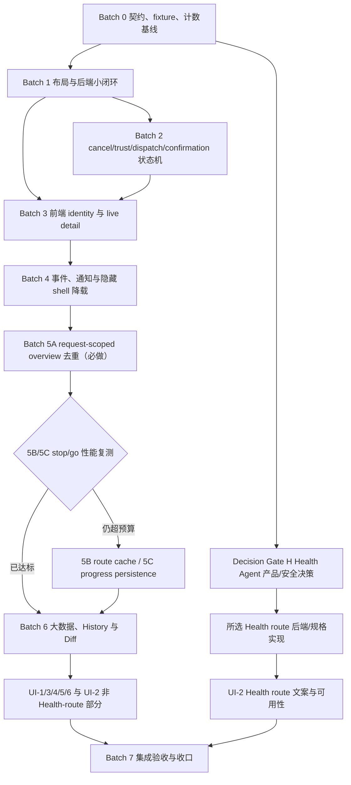

# Workflows 正确性、性能与 UI 修复计划

> 日期：2026-08-09  
> 状态：待实施  
> 阅读对象：执行修复、测试、审查和验收的 Agent  
> 计划性质：基于当前 Workflows 代码审查的分批实施方案；本文不代表任何问题已经修复  
> 总原则：先正确、再降载、后塑形；每批可验证、可回退，不越过项目、Git、信任和用户内容边界

## 0. Agent 执行约定

开始任何一个批次前，Agent 必须先阅读：

- 仓库根目录 `AGENTS.md`；
- [Workflows Panel Redesign](../specs/2026-07-30-workflows-panel-redesign.md)；
- [Workflows Panel Implementation Plan](2026-07-30-workflows-panel-implementation.md) 的现状说明与既有契约；
- [First-run / Project-open Workbench Design](../specs/2026-07-30-first-run-project-open-workbench-design.md) 的 trust、read-only、compatible 和 identity 规则；
- `SPEC/SPEC.md` 第 16 节、`SPEC/BACKEND_STRUCTURE.md`、`SPEC/progress.txt` 最新记录和 `SPEC/gotchas.txt`；
- `.codex/skills/llm-wiki-desktop-context/references/project-map.md`。

执行纪律：

1. 一次只执行一个批次或一个明确子批次，不把安全竞态、性能重构和视觉改版塞进同一提交。
2. 先运行 `git status --short`。审查时工作树已有大量用户改动；不得清理、重置、覆盖或顺手格式化无关文件。
3. 每个缺陷的回归测试与修复放在同一个可合并批次中。允许在本地先证明红灯，但不得把已知红灯测试留在批次出口。
4. React 不得读取文件系统、操作 Git、执行 Agent 或接触 secret；所有授权与副作用继续由后端服务承担。
5. 不修改 `UI-Frontend-design/`。它只作为视觉密度、结构和行为参考。
6. 不自动安装 Agent，不静默切换 Agent、Provider 或 model，不把 BYOK 当故障恢复 fallback。
7. 每个涉及权限、文件、Git、IPC、并发、持久化或后台任务的批次都属于高风险代码变更：必须有两名审查 Agent，并从头运行 `npm run check`。
8. 每个代码批次完成后运行 `graphify update .`；按仓库规则记录 `SPEC/progress.txt`，只在隐蔽、重复或易复发问题出现时记录 `SPEC/gotchas.txt`。

## 1. 审查结论

Workflows 不是空壳：三类内置工作流、项目级队列、prepare/start/retry/confirm、恢复、typed DTO、任务事件和主要 UI surface 都已落地，现有 focused tests 也覆盖了较多功能路径。

当前风险不是“功能完全不存在”，而是以下问题叠加：

- 高频 `workflow_updated` 事件会重复拉取昂贵 overview 和 100 条历史；
- 关闭的全局任务抽屉仍订阅并计算全部任务、日志和 Import 分组；
- 异步提交的 identity guard 不一致，same-root identity replacement 仍可能提交旧响应；
- compatible 状态路径、偏好并发、cancel/trust/dispatch 之间存在真实正确性缺口；
- waiting confirmation 的实时事件没有带 hydrated review，已打开详情页可能看不到 Diff；
- History、Preparation 和 Diff 对大数据量没有有界渲染或服务端真值；
- Overview、右栏、结果、无障碍与响应式实现尚未完全达到权威 Workflows 信息架构。

本次审查没有确认 P0 级的即时数据破坏或 secret 泄露，但存在多项应优先处理的 P1 正确性与性能问题。测试“通过”不能证明没有刷新风暴、隐藏渲染或竞态。

## 2. Finding 清单与修复归属

| ID | 严重度 | Finding | 主要证据 | 归属 |
| --- | --- | --- | --- | --- |
| WF-C01 | P1 | workflow preferences 硬编码到原生 `.app/workflows`，compatible 项目可能越过 `.app/compat/` | `preferences.rs:15,67-108` | Batch 1 |
| WF-C02 | P1 | preferences 的 load-modify-write 未按 owner 串行化，并发记忆不同 kind 可能丢更新 | `preferences.rs:84-113` | Batch 1 |
| WF-C03 | P2 | memory-only retry 复制旧 run 的 runtime `projectId`，同 root 重开后可能返回旧 ID | `coordinator.rs:509,531` | Batch 1 |
| WF-C04 | P1 | Health Check 的 Markdown prerequisite 只看 compile Source 版本和 Wiki 页，可能错误阻止 Source-only readable Markdown | `preparation.rs:414-456,976-981` | Batch 1 |
| WF-C05 | P2 | preparation 记录只检查过期，不主动清理或设置容量上限 | `preparation.rs:228-327` | Batch 1 |
| WF-C06 | P1 | cancel、trust revoke 与 dispatch guard 竞态可让任务停在 `Cancelling`，或在撤销信任后错误 claim/fail 队列 | `lib.rs:44-66,165-187,281-309`、`task_service.rs` | Batch 2 |
| WF-C07 | P1 | 前端 prepare/perform/navigation 的异步提交只比较 project key，未统一校验 epoch 与 canonical identity revision | `useWorkflowsController.ts:329-383`、`workflowNavigation.ts` | Batch 3 |
| WF-C08 | P1 | `WorkflowRun::to_run` 不带 `decisionReview`；选中任务实时进入 waiting 后，详情可能缺 Diff 直到重开 | `workflow.rs:589`、`workflow_commands.rs` detail hydration | Batch 3 |
| WF-C09 | P2 | 单一全局 loading/error 会让后台 reconcile 阻塞无关动作，并用泛化错误覆盖局部失败 | `useWorkflowsController.ts`、`workflowStore.ts` | Batch 3 |
| WF-C10 | P1 | waiting confirmation 的重启恢复必须继续绑定 owner/task/action/candidate；前端 live hydration 不能替代后端可执行确认的恢复安全 | `workflow_commands.rs`、`persistence.rs`、confirmation registry | Batch 2 |
| WF-P01 | P1 | 每个匹配的 workflow 事件都触发 overview + 100 条 history refresh；旧响应虽不提交，但 IPC 与后端工作没有取消或合并 | `useWorkflowsController.ts:182-280,295-324` | Batch 4 |
| WF-P02 | P1 | `TaskLogDrawer` 永久挂载；关闭时仍订阅全量状态、排序、过滤、分组和计算输出 | `AppShell.tsx:151`、`TaskLogDrawer.tsx:165-224,421` | Batch 4 |
| WF-P03 | P1 | 通知资格过滤晚于 permission 检查；permission 被拒绝后，高频事件可重复查询或请求权限 | `useTaskEvents.ts:83-91`、`notifications.ts:126-152` | Batch 4 |
| WF-P04 | P2 | 非当前 surface 的 controller/right-panel 订阅仍会被全局任务事件唤醒 | `WorkspaceController.tsx`、`RightContextPanel.tsx` | Batch 4 |
| WF-P05 | P1 | overview 每次重复枚举内容、计算 baseline/哈希并探测 route/Agent，事件风暴会放大后端成本 | `preparation.rs:399-456`、`overview.rs` | Batch 5A 必做；5B 跨请求 cache 按证据 |
| WF-P06 | P1 | Preparation、History、attempt grouping 和逐文件 Diff 对 1,000–10,000 项没有有界数据/DOM 策略 | `WorkflowPreparationView.tsx:28-64`、`WorkflowHistoryView.tsx:17`、`WorkflowTaskDetail.tsx:102-104` | Batch 6 |
| WF-U01 | P1 | Overview 只有三条工作流，未完整呈现 attention/active task 与 recent latest five | `WorkflowsOverview.tsx:58-86` | UI-1 |
| WF-U02 | P1 | 右栏优先读取残留 `selectedTaskId`，可能与当前 preparation/history surface 描述不同对象 | `WorkflowsRightPanel.tsx:14-38` | Batch 3、UI-4 |
| WF-U03 | P2 | confirmation 暴露 raw risk/action enum，完成结果用 `Object.entries` 通用 dump | `WorkflowTaskDetail.tsx:93-130` | UI-3 |
| WF-U04 | P1 | workflow warning/danger 正文使用低对比度 accent；窄屏 overlay 缺少完整 focus/inert/restore 语义 | `styles.css:4533-4628`、`AppShell.tsx:136-145` | UI-4 |
| WF-D01 | 决策门 | 权威规格允许 concrete Agent/BYOK Complete Health，但当前安全决策与代码明确禁用 Deep Lint Agent | `progress.txt:55,143`、`agent_service.rs:579-583,851-863` | Decision Gate H |

## 3. 不可破坏的不变量

所有批次必须持续满足：

1. 项目注册不等于信任。外部 AI、Agent 和 Skill 执行在 start、dispatch、retry、continue、confirm 时都重新验证 trust 与 canonical identity。
2. mutation 需要 writable；checkpoint-required mutation 继续需要后端验证 Git policy。前端 disabled 状态不是授权。
3. compatible app-owned 状态只能落在 `ProjectLayout` 提供的 `.app/compat/` 根；无 root 时降级为 memory-only，不发明原生目录。
4. `projectId` 是当前进程 UI/事件路由标识，不是持久身份。持久归属使用 canonical root、`canonicalIdentityKey` 和 `identityRevision`。
5. `raw/sources/` 默认不可变；不得因工作流修复移动、覆盖或删除用户原始来源。
6. queued task 在恢复信任后不能自动执行，必须显式 continue 并重新校验。
7. waiting confirmation 的 hydration 只恢复可读 review，不代表自动确认；apply 前继续复验 candidate、baseline、外部编辑、Git 和路径。
8. 性能优化不得通过隐藏真实进度、丢终态、延迟取消检查、放宽 path guard 或缓存过期权限来实现。
9. UI 不猜测未提供的数据，不解析日志来构造业务结果，不承诺虚假的耗时或成本。

## 4. 目标执行与刷新模型

实现后的 ownership：

- task event 是实时状态事实；普通 progress 可按 task 做短窗批量提交，但不触发全量列表拉取。waiting、terminal 和 confirmation 不进入延迟队列。
- overview 是项目能力、推荐项、队列摘要和 recent summary 的 reconciliation snapshot。
- history 是显式分页/过滤数据源，不是每条 progress event 的副作用。
- hydrated confirmation detail 只为当前选中、缺 review 的 waiting task 按需获取。
- 前端所有异步提交都由统一 request guard 验证；后端仍是最终 authority。

## 5. 批次与依赖

| Batch | 目标 | 生产代码 | 检查门 | 回滚点 |
| --- | --- | --- | --- | --- |
| 0 | 建 fixture、调用计数和审查基线 | 以测试/工具为主 | focused tests | 删除新增 harness，不改变产品 |
| 1 | 修 preferences root/并发、retry ID、Markdown prereq、preparation record 上限 | 是 | `npm run check` | 无 root 回到 memory-only；不迁移旧错误路径 |
| 2 | 修 cancel/trust/dispatch 竞态并加固 confirmation recovery linkage | 是，高风险 | 两次 review + `npm run check` | 维持 fail-closed，不恢复自动队列/确认 |
| 3 | 统一前端 async identity guard、waiting hydration 和操作状态 | 是，跨 IPC | 两次 review + `npm run check` | 保留现有 command/DTO，先回退前端 orchestration |
| 4 | 消除 refresh storm、隐藏 drawer 工作和权限请求风暴 | 是，并发/任务事件 | 两次 review + `npm run check` | 恢复手动 refresh，不恢复逐 progress 全刷 |
| 5 | 5A request-scoped overview 去重必做；5B 跨请求 route cache 与 5C progress 持久化按证据执行 | 部分必做、部分条件 | 两次 review + `npm run check` | 先关 5B/5C，保留安全的 request-scoped 去重 |
| 6 | server-filtered history、有界列表、lazy Diff | 是，可能扩 IPC | 两次 review + `npm run check` | 保留旧小数据 API；新 API additive |
| H | 产品明确选择 Health BYOK-only 对齐或独立 Agent 安全项目 | 决策后确定 | 产品/安全批准 + 对应 full gate | 未决时保持 fail-closed，Batch 7 blocked |
| UI-1–6 | 单独完成 IA、preparation、pipeline/result、History、a11y/responsive 与视觉收尾 | 是，前端/可能 additive DTO | 每子批 quick；跨层子批与合并后 full | 按 surface 独立回退 |
| 7 | 场景矩阵、性能证据、文档和最终 gate | 仅修 review finding | full from scratch | 回到最后一个已通过 batch |

## 6. Batch 0 — 冻结回归契约、规模 fixture 与可计数基线

### 6.1 目标

在重构前建立可重复证据，回答三个问题：调用了多少次、渲染了多少内容、竞态最终落到什么状态。不要用“感觉更顺”作为验收。

### 6.2 测试基础设施

前端：

- 在 `useWorkflowsController.test.tsx` 的 Tauri mock 中分别计数 overview、history、detail、prepare、start 调用。
- 为 task store/TaskLogDrawer 增加可观察的 heavy-body mount、poll、derive 或组件 render 计数；计数只存在测试代码。
- 为 notifications mock 计数 permission check、request 与 send。
- 建 same-root identity replacement fixture：project key 不变，但 `canonicalIdentityKey` 或 `identityRevision` 改变。
- 建 1,000/10,000 preparation options、10,000 history attempts、500 diff files 的 deterministic fixture。

Rust：

- 在 `workflow_queue.rs` / `workflow_recovery.rs` 使用 barrier/channel 控制 claim、dispatch guard、first-stage start 和 worker finish 窗口；禁止靠长 `sleep` 猜竞态。
- 提供可切换 trust、writable、runtime project ID 和 identity revision 的测试 authority。
- 对 `RouteCatalog::load`、Agent probe、Markdown enumeration、baseline hashing、task persistence 和 event emission 加 `#[cfg(test)]` 计数器或 fake。
- 测试 hook 不得进入生产 IPC 或 release build。

固定规模场景至少包括：2 秒内 200 个 workflow events 且末尾 terminal、drawer closed 下 1,000 个 task/log/activity events、1,000 个 Markdown 文件与 3 个 Agent probe、10 秒内 500 个 progress updates、10,000 个 scope options、10,000 条 history attempts，以及 500 个 20KB Diff。

### 6.3 必须证明的修复前现象

把证据记入本批 QA 记录，但不要把已知红灯留在批次出口：

- 50 个 ordinary workflow progress events 会导致额外 overview/history 调用。
- drawer 关闭时 heavy body 仍读取全量 tasks/logs/activities/outputs。
- permission denied 后的 eligible event burst 会重复进入 permission 路径。
- same-root identity revision 切换期间，prepare/perform 的旧响应仍只受 project key 保护。
- compatible preference 的目标路径仍是 `.app/workflows/preferences.json`。
- cancel-before-first-stage 与 trust revoke/claim 具有可控的竞态窗口。

### 6.4 基线和计量规则

- CI 硬门优先使用调用次数、状态转换次数、mounted row 数、DOM 节点数和 payload 大小；避免用易抖动的绝对毫秒作为唯一断言。
- 本地 trace 记录 interaction 长任务、Tauri invoke 时间、overview 阶段计数和 React commit；环境与样本必须随证据记录。
- 不在生产代码加入 `console.log`。可观察性使用 test fake、structured tracing 或现有日志边界。
- 固定 fixture 连续运行 10 次，确定性计数必须完全稳定。耗时基线使用 release build、至少 5 次 warm-up + 50 个测量样本，并定义 `CV = standard deviation / mean`；CV 目标低于 15%，否则先修计量工具再下性能结论。

### 6.5 退出门槛

- 所有 fixture 可重复运行，竞态不依赖时序运气。
- 当前 focused tests 仍绿。
- 已建立后续批次共用的量化表。
- 没有修改产品行为或用户项目文件。

## 7. Batch 1 — 修复布局感知状态、偏好一致性与小型后端闭环

### 7.1 Layout-aware preferences

目标文件：

- `src-tauri/src/services/workflow_service/preferences.rs`
- `src-tauri/src/models/layout.rs`
- `src-tauri/src/services/workflow_service/mod.rs`
- `src-tauri/tests/workflow_compatible_layout.rs`
- `src-tauri/tests/workflow_preparation.rs`

实施：

1. 删除硬编码 `PREFERENCES_PATH`，从 `context.layout.workflow_state_root` 派生 `preferences.json`。
2. native 写 `.app/workflows/preferences.json`；compatible 只写 `.app/compat/workflows/preferences.json`。
3. `workflow_state_root=None` 时统一使用 identity-isolated memory-only preference；不得创建目录、不得读取错误的 `.app/workflows`，identity replacement 后不得复用旧内存偏好。
4. 所有读写继续经过 `ProjectContext` 与 `FileStore` 的 path guard 和原子写。
5. 已经写错位置的历史文件不自动移动、不自动删除，也不作为 compatible 真值读取；迁移若有需要另立显式方案。
6. 对 `identityKey + identityRevision` 使用 operation lock，把 load、merge、sort、atomic write 放在同一事务中。锁内不得执行 Agent、网络或长任务。
7. memory-only 与 persistent 使用相同 kind-level merge 语义；写盘失败不能伪装成功。

必测：native、compatible、no-root、read-only、untrusted、Unicode 路径、symlink/reparse 外逃；三个 workflow kind 并发 remember 后全部保留；同 kind 并发写的提交顺序可解释且 JSON 完整。

### 7.2 Retry 使用当前 runtime project ID

目标文件：`coordinator.rs`、`workflow_commands.rs`、`workflow_recovery.rs`。

实施：

- retry 在 canonical owner guard 通过后，使用当前 `ProjectContext.project_id` 创建新 attempt；不得复制 `original.project_id`。
- canonical root、identity key/revision 仍来自安全 owner 校验；runtime ID 不加入持久 fingerprint。
- 同 root 重开、memory-only history、CJK/Windows case alias 都要回归；同 project ID 不同 root 必须拒绝。

### 7.3 Health Markdown prerequisite 使用真实 readable roots

目标文件：`preparation.rs`、`workflow_preparation.rs`、`workflow_compatible_layout.rs`。

实施：

- 用 `ProjectContext.layout` 允许的 readable Source/Wiki Markdown 事实判断 Health prerequisite，与 `baseline_files/list_readable_markdown` 使用同一逻辑来源。
- Source-only compatible 项目中的 malformed Markdown 仍应能进入 Local Quick 并报告 finding，而不是被“没有 Markdown”挡住。
- logical root 不存在时相关规则为 not applicable，不伪装 failed。
- Update Wiki 继续依赖 compile-readable Source versions；Generate Content 继续依赖 Wiki pages，不能把三个 workflow 的 prerequisite 混成同一条件。

### 7.4 Preparation record 清理

目标文件：`preparation.rs`。

实施：

- prepare/start/lookup 时主动 prune expired records。
- 设置 per-identity 与 global hard cap；优先移除已过期和最旧的未启动记录。
- 非过期的 started mapping 承担重复 start 返回 Existing 的幂等契约，不得直接淘汰；可压缩成轻量 `preparationId + revision -> taskId` tombstone，并单独设置 TTL/cap。
- record 只保存结构化 scope、revision 和必要元数据，不保存 secret、完整模型输出或额外 Source 正文。
- 被淘汰的未启动 token 返回现有 stale/expired typed error，要求重新 prepare，不猜测恢复；cap 压力下重放已成功 start 仍必须返回 Existing，绝不创建重复 task。

### 7.5 退出门槛

- compatible overview/prepare 不会创建 `.app/workflows`。
- 并发 preference 不丢 kind。
- same-root retry 返回当前 runtime project ID。
- readable Source-only Markdown 可运行 Local Quick Health。
- preparation store 在压力 fixture 后保持上限。
- 两次独立 review 关闭有效 finding；从头 `npm run check` 通过。

## 8. Batch 2 — 修复 cancel、trust revoke、dispatch 与 confirmation recovery 状态机

### 8.1 共享的 state-aware dispatch finalizer

目标文件：

- `src-tauri/src/lib.rs`
- `src-tauri/src/services/workflow_service/coordinator.rs`
- `src-tauri/src/services/workflow_service/stage_sink.rs`
- `src-tauri/src/tasks/task_service.rs`
- `src-tauri/tests/workflow_queue.rs`
- `src-tauri/tests/workflow_recovery.rs`

实施：

1. 用 coordinator/service 层的单一 `reject_claimed_dispatch` 替换三处重复 `fail_dispatch` closure。
2. 在 coordinator operation lock 内重新读取 task 和 cancellation token，并严格使用下表；不能让实现 Agent 自行选择目标状态：

| 当前事实 | 唯一目标 | 是否自动重排 |
| --- | --- | --- |
| `Cancelling` 或 token cancelled | `Cancelled`，清理未确认 candidate/registry，持久化、发 terminal event、再 claim next | 否 |
| canonical root / identity mismatch | `Interrupted` + typed non-retry identity error，并给 Prepare again；清理临时执行 authority | 否 |
| route/runner/access stale，且尚未产生副作用 | recoverable `Failed`，保留诊断与显式 retry；禁止 fallback | 否 |
| 真正仍为 `Queued`、从未 claim 且 owner 被 suspend | 保持 queued + `continuationRequired` | 仅用户显式 continue |
| 已 terminal | 幂等返回 | 否 |
| 其他不变量破坏 | `Interrupted` + typed invariant error；不得吞第二个错误 | 否 |

3. 每条路径都明确 candidate/confirmation cleanup、持久化、event 和 claim-next 的顺序；终结与 claim-next 只发生一次。
4. 三个 runner 只把 guard failure 交给共享服务；绝不能为了“避免卡住”而在 guard 失败后继续执行 runner。

### 8.2 Trust transition 先冻结 owner queue

目标文件：`app_state.rs`、`coordinator.rs`、`task_service.rs`。

实施：

1. 在 project trust transition 锁下先把该 owner 的 queued runs 标为 `continuationRequired=true`，阻止新 claim。
2. active/waiting 按 run 的权限需求处理：
   - Local Quick Health 在 canonical identity 与 readable access 仍成立时可继续，并安全 rebind 为 memory-only；
   - Complete Health 外部路线、Update Wiki、Generate Content 和 waiting mutation 必须停止；
   - waiting confirmation 停止时同步释放 registry claim，并按既有策略清理或保留可恢复 candidate，不能留下可点击 action。
3. 完成 active transition 与 persistence rebind 后再撤销 durable trust；active 的终态不得自动启动 suspended queue。
4. 恢复信任后仍需用户显式 continue；continue 按每个 run 的 policy 重新检查：external route -> trust，mutation -> writable，checkpoint-required scope -> Git，Local Quick -> readable access。校验持久化在 run 上的 route revision、baseline、scope 和 execution options，不要求临时 preparation token 仍存在。
5. 锁顺序固定为 `project_trust_transition -> coordinator operation -> TaskService locks`。持有任一锁时不得同步 dispatch runner、执行 Agent/网络调用或等待前端事件。

### 8.3 后端 confirmation recovery linkage

目标文件：

- `src-tauri/src/commands/workflow_commands.rs`
- `src-tauri/src/models/confirmation.rs`
- `src-tauri/src/services/workflow_service/persistence.rs`
- confirmation registry 与 Update Wiki / Generate Content candidate restore helpers

实施与测试：

- hydration 绑定完整元组：canonical root、identity key/revision、task ID、pending action ID、candidate reference；runtime project ID 只在 owner guard 通过后重绑定。
- task-owned candidate 必须位于该 task 的 staging root；project-relative candidate 继续通过 traversal、symlink/reparse 和 hash/manifest 校验。
- registry 恢复幂等，list/get 并发 hydration 不创建冲突 record。
- candidate 缺失、篡改、过期或外逃时 fail closed，转为 Interrupted/不可确认；不得继续展示可执行 action。
- 合法 waiting action restart 后可查看并确认；copied task/action/candidate 跨 root 拒绝。
- hydrate 与 confirm/cancel/discard 并发后无悬空 claim；两个并发 confirm 只有一次 apply/checkpoint。
- confirm 前仍重新验证 trust、writable、Git、baseline、外部编辑和 candidate hash；hydration 永不自动 apply。

### 8.4 必测竞态

- cancel 发生在 context resolve 前、identity check 前、first stage start 前。
- active + 2 queued 时 revoke trust：active 最终 cancelled，queued 保留且 continuation required。
- Local Quick 在 revoke 后继续或安全降级 memory-only；trusted read-only Complete 在 revoke 后停止。
- waiting confirmation 被停止时 registry/action/candidate linkage 一致，无残留可执行确认。
- revoke 返回后 Agent/BYOK/Skill 新调用为 0。
- 恢复信任但未 continue 时调用为 0。
- continue 时 route/Git/identity 已失效：保持安全 parked/prerequisite，不 dispatch。
- worker finish、cancel、revoke 三者并发时无死锁、无重复 terminal event、无重复 claim。
- revoke/continue/worker-finish 的三方 barrier 严格遵守锁顺序且无死锁。
- dispatch error 分别覆盖 Update Wiki、Health Check、Generate Content 三类 runner。

### 8.5 退出门槛

- 没有任务永久停在 `Cancelling`。
- 信任撤销后没有新的外部执行，queued 不丢、不误标 failed。
- 任意终结路径最多发一次 terminal event、最多 claim 一次 next。
- 合法 confirmation 可重启恢复，但不能跨 root/task/action/identity 复用 authority。
- Reviewer A 检查产品/队列/锁顺序；Reviewer B fresh-review 竞态、TOCTOU 和负向测试。
- 修复 review finding 后重新从头运行 `npm run check`。

## 9. Batch 3 — 统一前端 identity guard、live confirmation 与操作状态

### 9.1 单一 WorkflowRequestGuard

目标文件：

- `src/features/workflows/useWorkflowsController.ts`
- `src/stores/workflowStore.ts`
- `src/services/workflowNavigation.ts`
- `src/services/workflowApi.ts`
- 对应 test 文件

实施：

- 建立共享 snapshot：`{ projectKey, requestEpoch, canonicalIdentityKey, identityRevision }`。
- 首次 overview 以 `projectKey + requestEpoch + requestSequence` 原子提交完整 snapshot，并由该 snapshot 建立 canonical identity guard；不能先提交一半 access、再拼接其余数据。
- 同一 project key 下两个不同 identity 的 overview 乱序返回时，只允许最新 sequence 建立 guard，旧 response 对 access/run/error/surface 的 commit 均为 0。
- identity guard 建立后，prepare/start/get/retry/confirm/discard/cancel/reorder/continue/history/navigation 都必须验证完整 guard。
- guard 在写入 run、preparation、surface、selection、error、pending state 和 navigation 之前逐项校验。
- same-root identity revision replacement 必须使旧请求静默失效；不得把旧错误显示到新 identity。
- pending task event 在 access 未知时可以有界缓存；access 建立后只接纳 project ID、identity key/revision 全匹配事件。
- 保持后端为最终 authority；前端 guard 只是防止 stale UI commit。

### 9.2 选中 waiting task 的按需 hydration

实施：

1. event 先立即 upsert run，保证 waiting 状态和 pipeline 不延迟。
2. 仅当当前选中 task 刚进入 waiting、`decisionReview` 缺失、pending action 可识别时调用一次 `getWorkflowRun`。
3. 用 `projectKey + identityRevision + taskId + pendingActionId` 作为 in-flight key，快速重复事件只合并为一个 detail request。
4. 非选中 waiting task 不拉完整 Diff；用户打开时再 hydrate。
5. detail 返回前再次验证 request guard、当前 selection 和 action ID；不允许旧 review 覆盖新 action。
6. 后续不带 review 的普通 event upsert 不得擦除已 hydrated review。

必测：selected/non-selected waiting、快速 waiting burst、waiting 后 identity replacement、打开后 action 更新、hydration 与 cancel/discard 并发、review 在后续 progress event 后仍存在。

### 9.3 Surface 与右栏使用同一展示状态

- `overview / preparation / task-detail / history` 是唯一主 surface。
- 进入 preparation/history 时清理或忽略旧 task selection；进入 task detail 必须有对应 run。
- Right panel 先按 surface 派生 context，不再让残留 `selectedTaskId` 抢占 preparation。
- 覆盖“任务详情 → 调整设置重试 → preparation”“跨 surface launch”“history 返回”等路径。

### 9.4 Operation-scoped pending/error

- 用明确 operation key 表示 `overview:init`、`overview:reconcile`、`prepare:<kind>`、`start:<preparationId>`、`task:<id>:cancel`、`history:page` 等。
- 后台 reconcile 不切换全局 loading，不清空当前可读数据。
- 每个按钮只被自身或冲突操作禁用；重复 start/confirm 保持幂等。
- 主错误显示本地化、可行动摘要；backend code/message 放入折叠技术详情。一个局部失败不得覆盖另一个 surface 的错误。

### 9.5 退出门槛

- same-root identity replacement 下所有旧 async response 提交为 0。
- selected waiting transition 自动出现 hydrated review，非选中任务 detail IPC 为 0。
- 主区与右栏永远描述同一 surface/object。
- 后台 reconcile 不触发全局 spinner，不禁用无关动作。
- 两次 review 后从头 `npm run check` 通过。

## 10. Batch 4 — 消除事件刷新风暴、隐藏 drawer 工作与 permission 风暴

### 10.1 拆分 live event 与 reconciliation

目标文件：`useWorkflowsController.ts`、`workflowStore.ts`、`useTaskEvents.ts` 及 tests。

把当前单一 `refresh()` 拆成至少三类动作：

- `applyWorkflowEvent`：identity-filter 后按 `projectKey + taskId` 合并 ordinary progress，最多约 10Hz 提交；
- `reconcileOverview(reason, background)`：项目级 single-flight，并且最多保留一个 trailing run；
- `loadHistoryPage(filters, cursor)`：只由初始 recent/history、筛选、显式 load-more 或必要终态 reconciliation 触发。

事件策略：

- ordinary stage/progress/log event：只做短窗批量 upsert，不请求 overview/history；
- waiting、terminal、queue order、continuation、access/identity 变化：安排一次 trailing overview reconcile；
- history surface 可在 terminal boundary 安排一次当前 filters 的 reconciliation；overview recent 优先使用 event 中已知 run，不因每条 progress 拉 100 条历史；
- 手动 refresh 明确刷新 overview；history 是否刷新由当前 surface 决定。

waiting、terminal 与 confirmation 先 flush 同 task 的 buffered progress 并立即提交；不得等待普通 progress 窗口。single-flight 必须确保同一项目同一时刻实际 Tauri invoke 不重叠，不只是用 request version 丢弃旧响应。切换项目后旧请求可完成但不能提交，也不能触发新项目 trailing refresh。

### 10.2 TaskLogDrawer 只在打开时挂载 heavy body

目标文件：`AppShell.tsx`、`TaskLogDrawer.tsx`、`taskStore.ts`。

- 拆成只订阅 `drawerOpen` 的轻量 host 与仅在 open 时 mount 的 body；host 负责捕获/归还触发焦点，body 负责内部 focus trap。
- body 使用 selected-task 和必要列表 selector，不订阅整个 logs/activities/outputs map 后再取一项。
- sort、Import grouping、Blob/output size、polling、log merge 和 focus trap 都不得在 drawer closed 时执行。
- 大日志通过有界窗口/虚拟或增量呈现；完整日志仍由后端保留，复制完整诊断时显式获取，不能为性能静默丢数据。
- 打开/关闭保持 Escape、焦点进入、焦点归还和当前 selection 语义。

### 10.3 先判定通知资格，再接触 permission

目标文件：`notifications.ts`、`useTaskEvents.ts`、`notifications.test.ts`。

顺序固定为：

1. event/task 类型是否允许通知；
2. workflow 状态是否为 waiting/completed/failed；
3. 用户通知设置是否开启；
4. payload 是否安全且可本地化；
5. 最后才检查 permission 并发送。

实现：

- 缓存 `granted/denied/unknown` 与 in-flight permission promise；denied 不在每个事件上重问。cache 绑定 permission epoch，而不是永久 session 常量。
- 优先只在用户显式开启通知的设置动作中 request permission；后台事件不得反复弹权限。
- 用户显式开启/重试通知、从系统权限设置返回并重新聚焦、或 notification plugin 报告权限变化时递增 epoch；新 epoch 可以重新 check，但只有显式用户动作可以再次 request。
- queue/start/progress 不通知；workflow 配套的通用 `task_updated` 不得与专用 `workflow_updated` 重复通知；通知不包含敏感路径或模型正文。

### 10.4 Route-local subscriptions

- Workflows controller 仅在 Workflows surface 或确实需要的 shell ownership 下激活。
- `WorkspaceController`、`RightContextPanel` 先按 active view 分支，再挂载对应 controller/selector；避免在分支前订阅无关 feature store。
- 先消除上述主要热路径，再根据 profiler 证据决定是否加 `memo`；不要用 memo 掩盖全局订阅。
- 全局 `useTaskEvents -> taskStore` 继续保存后台任务事实；route-local 只移除无关 view/controller 的派生和 render，不能丢后台 task upsert。
- pending Import path、workflow launch intent、Settings-return intent 在 controller 卸载/重挂载后必须恰好消费一次；intent 继续绑定 project/identity guard，切换项目后不得误投递。

### 10.5 定量退出门槛

`workflow store commit` 的计数定义：初始 overview/history settled 后开始观测，用 `useWorkflowStore.subscribe` 统计 `runs/overview/historyCursor` slice identity 变化；包含 progress flush、terminal flush 和 trailing reconcile，排除初始 load、React StrictMode render 与无关 UI state。

| 场景 | 必须达到 |
| --- | --- |
| 初次打开 Workflows | overview invoke 1；recent/history invoke 至多 1 |
| 50 个 ordinary progress events | 最新 run 在一个短窗 flush 内可见；额外 overview 0；额外 history 0 |
| 2 秒内 200 个 progress events | workflow store commit `<= 25`；普通进度可见延迟本地 p95 `<= 150ms`；terminal/confirmation `<= 250ms` |
| waiting/terminal burst | 每项目实际 in-flight overview 最多 1；整波 trailing reconcile 最多 1 |
| 后台 reconcile | 全局 loading 切换 0；当前数据不闪空 |
| drawer closed + 1,000 task events | heavy body mount/derive/poll 0 |
| 非通知资格的 1,000 events | permission check/request/send 均为 0 |
| permission denied 的 eligible burst | 每个未失效 permission epoch 的 check/request 并发峰值与调用数至多 1；send 0 |
| project switch during in-flight | 旧项目对新项目 store/navigation commit 0 |
| 100 次无关 feature store 更新 | Workflows main/right-panel commit 0 |
| route controller 卸载/重挂载 | Import/workflow/Settings-return intent 不丢、不重复，且不会跨项目消费 |

本批属于 task-event/concurrency 关键路径：两次 review，修复后从头运行 `npm run check`。

## 11. Batch 5 — 必做的 request-scoped overview 去重与有条件的跨请求优化

### 11.1 Batch 5A：Request-scoped overview evaluation snapshot（必做）

当前一次 overview 内已经确认存在重复 build/scan/hash/probe；Batch 4 只能减少调用次数，不能消除单次调用成本。因此 5A 不能被 stop/go 跳过。

目标文件：`overview.rs`、`preparation.rs`、`fingerprint.rs`、相关 services/tests。

- 一次 overview 为三个 workflow 共享 ProjectLayout、readable roots、Source versions、Wiki paths、route catalog、Git/access snapshot 和本次请求内的 lazy hash map。
- 每个唯一 Markdown 文件在一次请求内最多 read/hash 一次；OverviewService 不得在 preparation snapshot 后再次枚举同一 inventory。
- Agent/provider availability 每个具体执行端在一次 overview 内最多探测一次；多个 cold Agent probe 并行执行。
- request-scoped reuse 不跨请求保存权限或内容事实；prepare/start/confirm/apply 继续读取权威新鲜数据。
- 优化前后 overview DTO、prerequisite、route、baseline 和 recommendation 逐字段一致。

5A 硬门：source inventory `<=1`、wiki/readable inventory `<=1`、每个唯一文件 hash `<=1`、每种 Agent cold probe `<=1`。

### 11.2 Batch 5B：跨请求 route cache（Stop/Go）

仅当 5A 后 Agent probe 仍主导 warm overview 才执行。建议 TTL 30 秒，但必须先满足：

- Agent key 使用 kind、resolved executable path、廉价文件身份或 PATH generation、settings revision 与 project identity；Agent version 是缓存值，不能为了构造 warm key 先运行版本 probe。
- provider availability 只有在 Settings/OS-secret service 提供可靠 secret generation 时才能跨请求缓存；否则只做 5A request-scoped reuse。
- 手动 refresh、Agent 配置/安装动作、settings/identity/secret generation 变化建立新 cache epoch，可 force probe。
- trust、writable、Git dirty、identity revision 不得用 TTL 代替后端即时验证。
- apply/confirm 的 baseline/content hash 复验不得命中展示 cache。

5B 硬门：TTL warm overview 的 Agent 子进程为 0；cold Agent phase `<=` 最慢单个 probe timeout + 500ms。Agent phase 与 inventory/hash phase 分开计时，不能把整个 1,000 文件 cold overview 硬套进 3.5 秒。

### 11.3 Batch 5C：非关键 progress 的有界持久化（Stop/Go）

只有 5A 与 Batch 4 后，task JSON 写入仍明显支配 I/O 时执行。先把 durability 分为：

- `Barrier`：create、stage boundary、waiting confirmation、checkpoint/pending action、mutation boundary、cancel/terminal、persistence transition；
- `ObservationalProgress`：current item、count、percentage 等可恢复观察性进度。

实施：

- 观察性磁盘 snapshot 使用明确的 250ms persistence window；崩溃最多丢一个持久化窗口内的观察性 progress，不能丢任何 barrier 事实。
- Barrier 顺序固定为：取得 revisioned snapshot -> per-task 串行原子持久化成功 -> 发布 event/推进 queue/返回调用方。失败时不得先让未持久化 barrier 对 UI 或下一 task 可见；必须安全回滚内存 revision，或进入明确 recoverable failure。
- 在全局 task write lock 内只取得一致 snapshot；序列化和原子写移出该锁。旧 writer revision 不得覆盖新 snapshot。
- progress 写失败不能静默；下一 barrier 必须先 flush 成功，或终结为明确可恢复错误。
- cancellation token 检查不进入持久化窗口，不把不同项目放入同一无隔离 writer。
- event coalescing 的默认 owner 是 Batch 4 前端；5C 首先只节流磁盘。若证据要求后端合并 progress event，后端成为唯一 owner，前端收到后立即提交，端到端“后端产生 progress -> UI 可见”本地 p95 仍 `<=150ms`；禁止前后端串联两个 100ms 窗口。

500 progress/10 秒的观察性写入门为 `<= ceil(elapsed / 250ms) + 1 + barrierCount`，即该 fixture `<=41 + barrierCount`。同 task writer 并发峰值为 1，磁盘 I/O 持有全局 task write lock 的时间为 0。

必测：progress/barrier 交错、stale writer、terminal write failure、authority rebind、cancel、confirmation、crash/recover。出现终态不一致、写失败被吞、旧 revision 覆盖、新 queue 在 barrier 落盘前启动时，立即回退为全 Barrier 同步模式。

### 11.4 测量协议与总退出门槛

- 确定性调用/写入计数连续重复 10 次且完全一致。
- 毫秒/p95 只作为固定参考机本地门：release build，明确 cold/warm cache 重置，至少 5 次 warm-up + 50 个测量样本；记录机器与阶段起止点。离散度使用 `CV = standard deviation / mean`，目标 `<15%`。
- 1,000 Markdown warm overview 参考目标 p95 `<=1s`。若 Batch 0 基线本就达标，只要求 5A 调用次数硬门且不得回退超过 10%；若基线超预算，才同时要求达到参考目标或至少改善 50%。
- cold total overview 分解为 Agent phase、inventory/hash phase 与 orchestration；总预算由三者基线校准，不直接等同 Agent timeout。
- access/identity/settings/secret epoch 变化即时失效；confirm/apply 始终读取当前文件事实。
- 5A、执行过的 5B/5C 都需两次 review；最终从头 `npm run check`。

## 12. Batch 6 — 大数据 Preparation、History、attempt grouping 与 Diff

### 12.1 Preparation

目标文件：`WorkflowPreparationView.tsx`、presentation helpers、controller tests。

- 用稳定 typed route key 替代 render 热路径中的重复 `JSON.stringify`。
- 用 `Set` 维护 selected source/page membership，避免每行 `includes` 形成 O(N²)。
- 增加搜索、全选当前结果、清空选择、已选计数和 dirty state；全选语义必须清楚区分“全部数据”与“当前过滤结果”。
- 1,000–10,000 options 使用虚拟列表或有界增量列表，mounted option rows `<= 200`。
- 首次范围确认、reprepare、baseline stale 和 start 幂等语义保持不变。

### 12.2 History 的服务端真值

目标文件：`WorkflowHistoryView.tsx`、`useWorkflowsController.ts`、`workflowApi.ts`、`workflow_commands.rs`、`task_service.rs`。

- UI filter 改变时把 workflow kind/status 传给已有 list command，清空旧 page 并从 cursor `null` 重新加载。
- 不能对“当前只加载的 100 条”做客户端过滤后宣称无结果。
- cursor 与 `canonicalIdentityKey + identityRevision + filters` 绑定；切换 identity/filter 后旧 page 不提交。
- history page 默认 50、hard max 100；list DTO 只返回 summary，不携带 per-file Diff。单页 serialized response 目标 `<=1MiB`。
- backend 可以首次 O(N log N) 建立 project/identity-scoped 有序索引，但后续 page 不得为返回 50 条而重新序列化或传输全部 10,000 runs；任务增删/终态时增量失效或更新索引，不引入数据库。
- `groupWorkflowAttempts` 改为单次 Map 聚合与稳定排序，避免反复 spread/copy。
- 首屏、Overview recent、完整 History 分开：Overview 只需要 latest five，History 按页加载。
- 页面 DOM 保持有界；优先使用现有依赖或简单 windowing。只有证据表明无法达标时才新增虚拟列表依赖。
- workflow run upsert 避免每个 progress 都 `filter + full sort`；可使用 normalized map/order，或仅在排序键变化时调整顺序。

### 12.3 Lazy Diff 与 payload 门

第一阶段先做 DOM lazy：

- closed file `
` 不 mount `<pre>` 和语法内容；打开一个文件只 mount 一个 Diff body。
- 路径、统计、风险、checkpoint 和 conflict summary 仍在首屏可见。

满足任一条件就增加 additive、guarded detail API：完整 review serialized payload `>1MiB`、任一单文件 Diff `>256KiB`，或固定参考机 detail serialization/IPC 主线程任务 `>50ms`。

- 输入必须是 task ID、pending action ID 和 backend-owned file identifier，不接受任意绝对路径。
- 后端重新验证 owner、identity、pending action 和 candidate linkage。
- 支持按文件/分页读取，单次默认/上限由 typed contract 固定且 response `<=256KiB`；明确显示 truncation 与继续查看动作。
- 原有 detail API 保留给小 review 和兼容调用，不能在同一批破坏 wire contract。

### 12.4 规模退出门槛

| Fixture | 门槛 |
| --- | --- |
| 10,000 preparation options | membership O(1)；mounted rows `<= 200`；全选/清空结果正确 |
| 10,000 history attempts | 服务端 filter 真值；attempt grouping O(N)；mounted rows `<= 200` |
| 500 diff files | 初始 mounted diff `<pre>` 为 0；展开 1 项后为 1 |
| History page | `<=100` records、serialized `<=1MiB`；调用次数为 initial/filter/load-more 各 1，不因 scroll item 逐条调用 |
| Large review | 超过 `1MiB`/单文件 `256KiB`/IPC `50ms` 任一门时走按文件 API；单次 response `<=256KiB` |
| 100+ Unicode/CJK/长路径 | 不产生 shell 横向滚动；完整值可复制/访问 |
| filter/identity 快速切换 | stale page commit 0；cursor 不串用 |

本地专用 perf harness 的参考目标：10,000 attempts grouping `<= 20ms`、option toggle/search p95 `<= 50ms`、单文件 Diff 展开 p95 `<= 100ms`。这些毫秒目标用于同机对比与 trace，不替代 CI 中的复杂度、调用次数和 DOM 硬门；若窗口化破坏键盘/读屏顺序，回退到每页最多 100 条的显式分页，保留 Set、线性 grouping 和 lazy Diff。

若新增或扩展 IPC，本批执行两次 review 和完整 `npm run check`；仅做局部前端 Set/lazy mount 时至少 `npm run check:quick`，但与完整 Batch 6 合并前仍需 full gate。

## 13. Decision Gate H — Health Check Agent 路线（产品决定已批准，分批实施中）

> 2026-08-12 superseding status：产品所有者已批准 Agent 路线，并以 [Agent Deep Lint / Agent 修复实施计划](2026-08-12-decision-gate-h-agent-deep-lint-repair-implementation.md) 的 1A/2A/3A/4A 取代下列旧 Path A/B 选择：内置固定 `wiki-lint`；Agent 只写 task-owned candidate 的授权 Wiki，raw/Source 只读；一次批批准且仅 delete/overwrite/conflict 二次确认；最多三轮 deterministic recheck 并保留 Diff/rollback。旧 `credential broker`、专门 no-tools/no-network 项目和逐工具审批不再是 Gate H 前置条件；trust、writable、Git checkpoint、path/link、no-secret、route revision、cancel/timeout、checked apply、no fallback 等 Hard Rules 保持不变。
>
> 这关闭 `WF-D01` 的产品未决状态，不表示最终交付门已通过。H3 已启用后端真实 route，H4B 已接入 guarded repair operation，H5 已完成 Lint/Workflows repair UI；H6 的 full gate 与完整负向、性能、WebView2 证据尚未全绿，因此 Batch 7 仍保持 blocked。以下 13.1–13.3 保留为决策前历史证据，不再作为当前实施前置条件。

这是安全/产品决策，不是可以顺手修掉的普通 bug。

当前事实：

- 产品规格把 Complete Health 的 usable AI route 表述为 concrete Agent/BYOK；
- 2026-07-18 与 2026-08-01 的安全决策明确将 Deep Lint 限定为 BYOK；
- `AgentService::supports_lint_agent` 固定返回 false；
- `run_lint_streaming` 返回 `LINT_AGENT_UNAVAILABLE`，原因是没有已验证的 credential/no-tools broker。

WF-D01 是阻塞性的二选一门。产品所有者必须先批准其中一条，Agent 不能用 `progress.txt` 自行覆盖 sole-authority Workflows 规格。

### 13.1 路径 A — 产品明确采用近期 BYOK-only

若产品所有者批准，实施顺序必须是：

1. 先更新权威 Workflows 规格、当前 SPEC、UI 文案和 route contract tests，明确近期 Complete Health 为 BYOK-only。
2. 保持 Deep Lint Agent disabled。
3. 让 Health preparation 的 `availableRoutes` 只展示 runner 真正可执行的 BYOK 路线；Agent 不得出现在可选项后再必然失败。
4. Complete Health 继续支持显式 BYOK；Local Quick 继续完全本地。
5. 默认 Agent 不可用时不得静默切到 BYOK；给出明确 route prerequisite。

该路径的实现归入 Batch 1 的 route truthfulness 子批；若 Batch 1 其他工作已完成，则作为独立 H-A 高风险子批执行。至少测试：

- Health `availableRoutes` 不广告 Agent，但 Update Wiki / Generate Content 的 Agent 路线不受误伤；
- forged 或持久化的 Health Agent route 在 start、retry、continue、dispatch 全部 fail closed，Agent invocation 为 0；
- 显式 BYOK 可运行，默认 Agent 不可用时不 fallback；
- untrusted Complete BYOK 被拒；trusted read-only Complete 可 memory-only 运行；
- Local Quick 在 restricted/read-only 下不触发外部执行或状态目录创建。

### 13.2 路径 B — 产品批准启用 Agent

必须另立安全项目并先获得产品/安全批准，至少包含：

- credential broker 与隔离目录；
- 可验证 no-tools/no-network 或等价最小权限执行协议；
- executable/version/profile binding；
- prompt/input 泄露和 project-local endpoint 威胁模型；
- cancellation、timeout、日志脱敏、route revision 和负向集成测试；
- 两轮安全 review 与完整 gate。

### 13.3 未决期间的规则

在路径 A 的权威文档更新完成，或路径 B 的安全项目通过之前：

- 任何 Agent 都不得把 `supports_lint_agent` 改成 true，也不得删掉 `LINT_AGENT_UNAVAILABLE`；
- 允许补充 fail-closed 绕过测试和避免 UI 广告当前不可执行 route，但这只是 interim hardening，不关闭 WF-D01；
- Health Preparation 的最终文案/可用性验收和 Batch 7 总体验收保持 blocked；
- 其他不依赖 Health Agent 产品决策的正确性、性能和 UI 批次可以继续。

本计划只有在路径 A 或 B 由产品所有者明确批准并完成相应验收后，才能宣称完全 Done。

## 14. 独立 UI/UX 优化计划

UI 改造依赖 Batch 3 的 surface/identity 真值、Batch 4 的刷新模型和 Batch 6 的有界数据。不要先用视觉样式遮住错误状态或热路径。

### 14.1 设计目标

用户打开 Workflows 后应当：

- 5 秒内识别当前活跃任务、待处理事项或唯一推荐动作；
- 不超过 3 次主要操作启动任一内置 workflow；
- 不打开原始日志也能理解当前阶段、进度、当前对象和是否需要介入；
- 对任何写入结果看见受影响路径、Git 状态和恢复动作；
- 在中文、英文、键盘、200% 缩放和窄桌面窗口下完成相同任务。

视觉继续是 Codex-like 的紧凑桌面工具：13px 主 UI、单层 pane、hairline border、近单色、稀疏 teal accent。不要改成卡片墙、营销页、全屏向导或 Agent 配置中心。

### 14.2 UI Anti-goals

- 不新增工作流、任意 prompt task、schedule、用户模板或全局“新建工作流”。
- 不恢复旧 Agent/BYOK card grid、generic `Run Agent` modal、安装引导或四卡启动器。
- 不重排 Update Wiki、Health Check、Generate Content；推荐项只改变强调，不改变顺序。
- 不复制 Settings、Lint 或 Exports 的职责；Agent/provider 只作只读摘要和 Settings 链接。
- 不新增跨项目聚合、导航 badge 或自动启动。
- 不改变 trust、read-only、Git checkpoint、confirmation、queue 或 no-fallback 契约。
- 不把 preparation 改回 modal，不用 tutorial modal 代替就地 prerequisite。
- 不把窄桌面适配扩成移动端重设计，不修改 `UI-Frontend-design/`。

### 14.3 UI 优先级、依赖与数据 ownership

实施依赖：

- P1 contrast、visible focus、semantic button 等基础 a11y 可在 Batch 3 前独立修复。
- surface/right-panel truth 依赖 Batch 3；Pipeline/confirmation 依赖 Batch 2 后端 linkage、Batch 3 hydration 和 typed DTO。
- Overview/recent snapshot 依赖 Batch 4 refresh model；History 和 Preparation 大范围 UI 依赖 Batch 6。
- UI-2 的 Health route 文案/可用性依赖 Decision Gate H；其他 UI 不必等待。
- P3 视觉收尾必须最后执行，不能与 P1 WCAG/键盘修复混为一批。

Overview recent five 与右栏摘要必须来自 backend-derived、project/identity-guarded、bounded snapshot，不能继续扫描可能被分页、filter 或截断的通用 `runs`。若现有 DTO 不足，先做独立 additive contract 子批，例如：

- `recentRuns: WorkflowRunSummary[]`，hard max 5；
- `contextSummary`：pending Source count、last Health summary、recent artifact summary、queue summary；
- task detail context 明确包含 output location、Git state 和 affected-path summary。

该 contract 绑定 canonical identity/revision，与 History filter/store 分离。任何 DTO/IPC 扩展都执行两次 review 与完整 `npm run check`，不能按普通 UI quick gate 处理。

Shell IA 同时锁定：分组 `知识处理 / Knowledge Processing`；条目 `工作流 / Workflows`；Lucide `Workflow`；无 badge/running indicator；Import/Lint/Exports 保持邻接；侧栏 Agent 名称/版本 footer 不变；页头是 `工作流`、`更新 · 检查 · 生成` 和唯一动作 `运行记录`，不得出现重新检测、安装引导、运行 Agent 或全局新建按钮。

### UI-1（P1）— Overview 与唯一主动作

目标文件：

- `WorkflowsOverview.tsx`
- `WorkflowRow.tsx`
- `workflowPresentation.ts`
- `workflows.test.tsx`

按以下固定结构重组：

1. `Needs attention / Active task`：running、queued、waiting、failed、interrupted 优先；
2. `Available workflows`：固定三行；
3. `Recent runs`：latest five；
4. 完整记录只从 `Run history` 进入。

每行显示 icon、name、单行 outcome、项目状态、上次运行或 prerequisite hint、一个 primary action。动作映射：

| 状态 | 主动作 |
| --- | --- |
| Ready | 运行 |
| 相同 task running/queued | 查看进度 |
| 其他 task active | 加入队列 |
| Wiki 无变化 | 已是最新 / 查看 |
| 缺内容或 route | 运行；点击后进入 prerequisite guidance，不创建无效 task |

waiting/failed/interrupted 的恢复动作属于领先的 attention task，不混入固定三条 workflow row 的动作表。只允许一个 recommended next step。无项目、空项目和部分配置仍显示三行；详细 prerequisite guidance 只在用户点击，或该行是唯一 recommended next step 时展开，不能同时铺满三行，也不弹教程。

验收：首屏同时回答“现在发生什么、我能做什么、最近发生过什么”。

### UI-2（P2）— Preparation 的决策顺序与大范围操作

目标文件：`WorkflowPreparationView.tsx`、controller、presentation helpers。

主区顺序固定为：

1. 将发生什么；
2. 输入范围和任务量；
3. 输出位置；
4. 是否修改 Wiki；
5. Git checkpoint 行为；
6. 当前执行路线；
7. workflow-specific structured options；
8. `开始运行`。

要求：

- baseline fingerprint、Skill ID、provider/model 等技术信息放入折叠“执行详情”。
- Update Wiki 可搜索、查看、排除范围，并准确表达“无变化”。
- Health Check 清楚区分 Local Quick 与 Complete，并说明为何可用/不可用。
- Generate Content 覆盖页面、主题、多页与 Project Report，不暗示只处理单页。
- 首次运行明确确认 scope；quick rerun 仅在 baseline、scope 和 prerequisite 仍有效时出现，且永不自动启动。
- advanced settings 中提供一次性 route override；route 不可用时提供 Settings action。Settings/Import 返回后恢复用户设置，不自动 start，失败不 fallback。
- 覆盖 loading、error、empty scope、invalid option、route unavailable、submitting；提交时防双击重复 task。
- 首次 remote provider 使用只说明一次选中内容会离开设备。

### UI-3（P1）— Pipeline、Confirmation、Failure 与 typed Result

目标文件：`WorkflowPipeline.tsx`、`WorkflowTaskDetail.tsx`、`workflowPresentation.ts`。

Pipeline：

- current stage 展开，显示当前对象、count progress 和必要 activity；
- completed stage 收起并显示真实 duration；无数据时不估算；
- future stage muted；failed stage 自动展开并给下一步；
- waiting confirmation 是显式 decision node；
- overall progress 有 accessible name、value/indeterminate 和当前 stage text；
- stdout/stderr 折叠、只读、可复制，不主导页面；
- cancelled 与 failed 在视觉、文案和恢复动作上分离。

High-risk review 首屏顺序：风险原因 → created/modified/overwritten/deleted counts → exact paths → 是否检测到用户编辑 → `Git 检查点` → expandable per-file Diff。用户编辑冲突显示 three-way Diff。CTA 使用“应用 8 个文件变更”“放弃本次结果”等具体文案；原子 apply/rollback 期间禁用取消并解释原因。

失败必须显示 failed stage、已完成阶段、项目是否已修改、原因和建议动作，并提供“按原设置重试”“调整本次设置后重试”及必要的 Settings 入口。重试是关联的新 attempt，不伪装原任务续跑。

删除 `Object.entries(run.result)` 通用 dump，建立三类 typed presenter：

- Update Wiki：created/updated/skipped、paths、checkpoint/commit、duration、route、查看更新、再次运行、建议 Health；
- Health Check：severity/type summary、local/deep coverage、duration、route、前往 Lint、再次运行；
- Generate Content：artifact type/count、output paths、validation、duration、route、查看结果、再次运行。

若 DTO 缺字段，先增加 additive typed contract 和测试；UI 不解析日志或猜字段。

### UI-4（P1）— Right panel、a11y、i18n 与 responsive

目标文件：

- `WorkflowsRightPanel.tsx`
- `AppShell.tsx`
- `WorkspaceController.tsx`
- `src/styles.css`
- `src/i18n/locales/en.json`
- `src/i18n/locales/zh-CN.json`

右栏严格随 surface：

- Overview/无选择：项目摘要、pending Source、last Health、recent artifact、queue；
- Workflow/preparation：prerequisite、scope、route summary、Git policy、output；
- Task detail：current stage、scope、route、Git、output location、affected paths、actions；
- History：仅显示当前 history/filter 或选中记录的只读摘要，不保留旧 preparation action。

窄桌面：

- `>1180px` 保持 docked `aside/complementary`；`<=1180px` 使用带标题关联的 dialog 语义与 `aria-modal` overlay，不压缩 pipeline；overlay 宽度使用 viewport clamp。
- 打开后焦点进入 panel，背景 inert，Tab 留在 panel；所有交互保持 visible focus、语义 button 和逻辑 Tab 顺序。
- 支持 Escape、明确 close button、backdrop，关闭后焦点返回触发按钮；
- 纯视觉 backdrop 若 `aria-hidden` 就不得自身带 click handler/focus；outside-click 由非隐藏的 overlay 容器做 target check，或使用有 accessible name 的正常控件。无论哪种实现，都不能替代可见 close button。
- 路径、Diff、logs 局部 overflow，不让整个 shell 横向滚动。
- 820px stress reflow 时左栏真实收为约 56px icon rail；workflow row、History filters、Preparation options、confirmation/result action bar 结构性换行，中文/英文 primary action 始终可见。820 只用于桌面 reflow 压测，不扩展为移动端产品。
- 1180/1179/1120/820 与 200% zoom 均断言：无 shell 横向滚动、无关键内容裁切、无主区/右栏/子列表互相竞争的双重滚动陷阱。

A11y 与 i18n：

- 新增/使用 `--danger-text`、`--warning-text` 等 semantic text token；普通文本达到 WCAG AA，accent 只用于 icon/border/fill。
- status 同时用 icon、label、tone，不只靠颜色。
- surface 切换后把焦点送到新标题；返回时恢复原触发器。阶段变化只用克制的 `aria-live="polite"`，不播报每条 log。
- icon-only button 有 accessible name 与 tooltip；截断 path 有完整 accessible/copy value。
- 尊重 `prefers-reduced-motion`。
- task state、risk、action type、stage、artifact/result 字段全部显式 i18n，不泄露 raw enum。
- 日期使用当前应用语言的 `Intl.DateTimeFormat`；duration/count 同步本地化。
- 文案契约显式断言 `输出类型 / Output type`、`舒适阅读页 / Comfortable reading page`、Generate Content 覆盖 Project Report，中文直接使用 `Git 检查点`；最长中英文标签不能遮挡 primary action。

### UI-5（P2）— History

目标文件：`WorkflowHistoryView.tsx`、controller/store、presentation helpers。

- 展示当前项目/identity 的完整记录，并使用 Batch 6 的 workflow/status 服务端 filter 与 cursor。
- retry 创建关联的新 attempt；按原任务分组但不伪装续跑。
- 每条 summary 显示 workflow、status、locale date/duration、关键结果和可用恢复动作。
- 覆盖首次空历史、筛选空、loading、load-more、error 和 stale cursor；筛选器在窄宽中英文下结构性换行。
- History filter/page 只修改 History state，不污染 Overview recent five 或右栏 `contextSummary`。
- History surface 的页头不重复展示同一个“运行记录”动作。

### UI-6（P3）— 视觉一致性收尾

- 去掉重复 status，统一 Overview/History/Task detail 的行高、divider、status icon 和 action alignment。
- skeleton 与最终内容尺寸匹配，surface 切换不明显跳动。
- stage expand、overlay 和 result appearance 仅使用短促状态过渡；reduced motion 时关闭非必要动画。
- 不增加 gradient、装饰 blob、大面积强调色、嵌套 card 或营销视觉。

### 14.4 UI 自动化与视觉矩阵

自动化：

- presentation：七种 task state、所有 prerequisite、duplicate task、唯一 recommendation、主动作；
- Overview：attention-leading、固定顺序、recent five、empty/no-project；
- controller：surface switch、stale selection、focus return、Settings 返回不自动运行；
- pipeline：current/completed/future/failed/confirmation、duration、ARIA determinate/indeterminate；
- 三类 result presenter：字段、CTA、optional missing data；
- preparation：first confirmation、quick rerun invalidation、empty scope、double submit；
- history：server filter、attempt grouping、locale date、empty/error/loading；
- overlay/drawer：focus entry/trap/Escape/close/restore；
- i18n：key parity、权威术语、禁止 raw enum；
- Shell IA detector 显式断言 Knowledge Processing/Workflows/Workflow icon、无 badge、相邻 Import/Lint/Exports、Agent footer 不变，以及唯一页头动作；同时禁止旧 Agent 配置 IA 与全局新建按钮。

视觉/人工矩阵：中文/英文；默认浅色和其他受支持主题；1440、1180、1179、1120px，820px 作为 stress reflow，以及 200% zoom；七种 task state；8–9 stage pipeline；0/1/100+ confirmation paths；超长 CJK/Unicode/Windows/macOS/Linux 路径；restricted/read-only/dirty Git/no route；reduced motion 和高对比度。

每个纯前端 UI 子批至少运行 `npm run check:quick`；任何 additive DTO/IPC 子批和 UI-1–6 合并后从头运行 `npm run check`，并保存真实 app viewport 的 visual/reflow 证据。若仓库没有稳定浏览器视觉 harness，先用现有测试加人工截图证据，不得顺手引入大型测试栈。

## 15. Batch 7 — 集成验收、审查与文档收口

### 15.1 场景矩阵

项目/identity：

- native、compatible、no workflow state root；
- trusted/untrusted、writable/read-only、clean/dirty/no Git；
- same root/new runtime project ID；
- canonical alias、Windows case-only、CJK、symlink/reparse、identity revision replacement。

队列/恢复：

- one active + multiple queued；reorder、cancel、revoke、restore、explicit continue；
- cancel-before-first-stage；dispatch guard failure；worker finish/revoke race；
- app restart 后 queued continuation、waiting confirmation、interrupted retry；
- copied task/action/candidate 跨 root 的负向测试。

功能：

- Update Wiki changed/full、无 Source、conflict、高风险 confirmation；
- Health Local Quick restricted/read-only、Source-only malformed Markdown、Complete BYOK，以及已批准 Decision Gate H 路径的完整 contract；新实施计划 H0–H6 未全部验收前 Batch 7 仍 blocked；
- Generate Content 四种 artifact、新建/覆盖、restricted content/remote acknowledgement；
- Dashboard、Wiki、Lint、Exports、Workflows 的统一 launch intent。

性能/UI：

- 50 event burst 与 200 events/2 秒完整预算、closed drawer 1,000 events、每 permission epoch denied burst；
- 100 次无关 store update 与 route intent 卸载/重挂载 exactly-once；
- 5A inventory/hash/probe 调用次数；5B 若实施则 cold/warm Agent phase；5C 若实施则 500 progress/10 秒写入公式、writer revision 与 barrier failure；
- 10,000 preparation options、10,000 history attempts、500 diff files；
- History page/payload 与 lazy Diff IPC 上限；
- CN/EN、主题、1180/1179/1120/820 reflow、200% zoom、keyboard-only、reduced motion。

### 15.2 最终审查

- Reviewer A 使用共享上下文，检查权威产品意图、ProjectLayout/authority、队列、typed contract、UI IA 与跨 surface 集成。
- Reviewer B 使用 fresh context，专查 stale identity、TOCTOU、锁顺序、取消、路径逃逸、event storm、未界定 payload、a11y 和遗漏负向测试。
- 主 Agent 合并有效 finding，逐项修复；不能仅在交付说明中接受风险。
- 修复后重跑相关 focused tests，并从头重跑 `npm run check`。

Windows 若遇到 Cargo PDB/LNK 文件锁，使用新的任务专用 `CARGO_TARGET_DIR` 重跑；不得用跳过 Rust tests 伪装通过。

### 15.3 文档与可观察性收口

- 只有 wire contract/ownership 真正改变时更新 `SPEC/SPEC.md`、`SPEC/APP_flow.md`、`SPEC/BACKEND_STRUCTURE.md`。
- 更新 Workflows feature README 的 owner/non-goal/refresh model。
- 每个重要批次在 `SPEC/progress.txt` 记录结果；`SPEC/gotchas.txt` 只记隐蔽或易复发问题。
- 记录最终调用次数、DOM 上限、event/persistence rate、测试数量、review 结论和 full gate 用时。
- 运行 `graphify update .` 并确认新的 controller/service 关系已入图。

## 16. 每批统一交付模板

每个实现 Agent 在批次结束时必须报告：

1. 关闭的 Finding ID；
2. 实际修改文件；
3. DTO/IPC 兼容性变化；
4. identity、trust、writable、Git、path 与 confirmation 行为；
5. native/compatible/memory-only 差异；
6. 修复前后调用、事件、写入、render/DOM 或 payload 计数；
7. focused tests 结果；
8. 两位 reviewer finding 与处理；
9. `npm run check:quick` 或 `npm run check` 结果；
10. `graphify update .` 结果；
11. `progress.txt` / `gotchas.txt` 更新；
12. 未关闭风险、stop/go 结果和下一批前置条件。

## 17. 停止条件

出现以下任一情况，Agent 必须停止当前批次并回到设计或请求用户决定：

- 需要自动移动、覆盖、删除用户 Markdown 或 `raw/sources/` 才能继续；
- compatible 写入根无法从 `ProjectLayout` 无歧义获得；
- 需要把 project registry、project ID 或磁盘可写当作 trust；
- 需要放宽 canonical path、symlink/reparse、identity revision 或 Git guard；
- 需要在 trust 恢复后自动运行 queued task；
- 需要在新实施计划对应 H3/H4B 之前提前启用 Deep Lint Agent 或 repair mutation，或需要绕开既有 Agent/candidate/Git/confirmation/queue 合同；
- 需要引入数据库、替换现有 Markdown/JSON source of truth；
- 需要用静默 fallback、虚假 progress 或丢 terminal persistence 达到性能目标；
- 需要改写 Settings、Lint、Exports 或 Workflows 权威信息架构；
- 需要新增大型依赖，但没有 profiler/DOM/payload 证据证明现有方案达不到门槛；
- 完整检查失败且失败由当前批次引入。

## 18. Definition of Done

只有全部满足才可判定本计划完成：

- compatible preferences 永不越过 `.app/compat/`，并发 remember 不丢更新。
- same-root retry 使用当前 runtime project ID；所有 async UI commit 受完整 identity guard 保护。
- cancel/trust/dispatch 任意竞态都不会留下悬空 `Cancelling` 或撤销信任后的新外部执行。
- waiting confirmation 在选中详情中实时 hydrate，且不会跨 task/action/identity 串用 review。
- ordinary workflow progress 不再触发 overview/history refresh；每项目 reconcile 单飞且有界。
- drawer 关闭时 heavy work 为 0；不合格通知不接触 permission；denied 不重复请求。
- Batch 5A 已消除单次 overview 内的重复 inventory/hash/probe；5B/5C 若跳过，有量化 stop/go 证据证明跨请求 cache 或 progress persistence coalescing 不需要实施。
- Preparation、History 和 Diff 在规定 scale fixture 下保持有界 DOM、正确 filter 和稳定 identity/cursor。
- Overview 具有 attention、固定三行和 recent five；右栏与主 surface 始终一致。
- Pipeline、confirmation、failure、completion result 不依赖 raw logs 或 raw enum 才能理解。
- 中英文、键盘、200% zoom、窄桌面、reduced motion 和默认主题 WCAG AA 验收通过。
- WF-D01 的产品决定已于 2026-08-12 关闭；必须按新 Agent Deep Lint / repair 实施计划完成 H0–H6 的合同、bridge、route、repair、UI 与最终矩阵后，本计划才可标记 complete 并解除 Batch 7 阻断。
- 无论选择哪条路径，未经验证的 Health Agent route 始终 fail closed，且不存在 forged route 绕过或静默 fallback。
- 两轮高风险审查关闭所有有效 finding。
- 最终 `npm run check` 从头通过，`graphify update .` 完成，进度与必要 gotcha 已记录。
