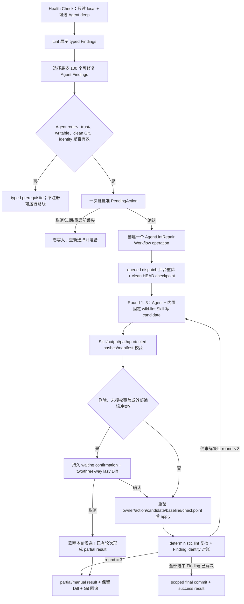
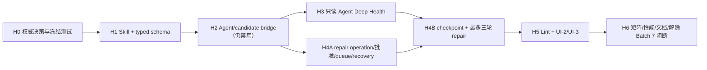

# Decision Gate H：Agent Deep Lint / Agent 修复实施计划

> 日期：2026-08-12
>
> 状态：产品路线已批准，等待按批实施
>
> 范围：仅关闭 `WF-D01`、补齐 Agent Deep Lint 与 Agent 修复桥接，并解除原 remediation plan 的 Batch 7 阻断
>
> 本文性质：基于 2026-08-12 当前代码的可执行实施计划；本文不表示生产代码已经完成

## 0. 结论先行

产品所有者已经选择原 Decision Gate H 的 Agent 路线，但明确替换了旧 Path B 的独立安全项目：本项目不建设 credential broker、专门 no-tools/no-network 项目、逐工具审批体系或新的 Agent runtime。实现沿用现有 Agent CLI、task-owned candidate workspace、Git、confirmation、Workflow queue/task/history 和 typed DTO 边界。

目标链路是：

1. Health Check 始终只读；Complete Health 可通过真正可执行的 concrete Agent 路线产生语义 Finding。
2. Lint 是 Finding 与修复 owner；用户选择一批 Finding 并一次批准该批 Agent 修复。
3. 批准后才创建 Git checkpoint；Agent 在任务自有候选工作区内直接使用内置、版本固定的 `wiki-lint` Skill 修改候选 Wiki。
4. 后端用既有 manifest、hash、Diff、confirmation 与 Git 机制验证并应用候选；`raw/**` 与忠实 Source 页面永远不可写。
5. 每轮应用后运行 deterministic lint，最多三轮；仍未解决则保存 typed result 与 Diff，标记人工处理并提供 Git 回滚。
6. Agent 不可用时不广告 Agent 路线；Agent 修复没有 BYOK fallback，也不自动安装 Agent。

本计划不新增第四个可见工作流。Agent 修复是 Lint 发起、挂在 Health/Lint 结果下的 `WorkflowOperation::AgentLintRepair`，复用现有项目串行队列、TaskService、历史、取消和恢复；Workflows Overview 仍固定显示“更新 Wiki / 健康检查 / 生成内容”三行。

## 1. 权威输入与当前基线

### 1.1 已核对的权威资料

- 仓库规则：[`../../../AGENTS.md`](../../../AGENTS.md)
- Workflows 唯一权威规格：[`../specs/2026-07-30-workflows-panel-redesign.md`](../specs/2026-07-30-workflows-panel-redesign.md)
- 产品与系统规格：[`../../../SPEC/PRD.md`](../../../SPEC/PRD.md)、[`../../../SPEC/SPEC.md`](../../../SPEC/SPEC.md)
- 后端与流程：[`../../../SPEC/BACKEND_STRUCTURE.md`](../../../SPEC/BACKEND_STRUCTURE.md)、[`../../../SPEC/APP_flow.md`](../../../SPEC/APP_flow.md)
- 原 remediation plan：[`2026-08-09-workflows-correctness-performance-ui-remediation.md`](2026-08-09-workflows-correctness-performance-ui-remediation.md)，特别是总则、§13 Decision Gate H、UI-2 Health 依赖与 §15 Batch 7
- 当前进度与踩坑：`SPEC/progress.txt`、`SPEC/gotchas.txt`，并交叉检查根目录 `progress.txt`、`gotchas.txt`
- Graphify：对 `HealthCheckRunner`、`AgentService`、`LintService`、`GitService`、`ConfirmationRegistry`、`WorkflowService`、`TaskService` 运行了 query/path/explain；查询确认当前调用链仍是 `commands -> AppState -> stable facade -> focused module`。

### 1.2 2026-08-12 当前工作树事实

- 基线分支：`master`；计划调研开始时工作树干净；基线提交为 `fe4cd847 fix(workflows): complete UI-6 polish`。
- remediation Batch 0–6、UI-1–UI-6 已完成；UI-2 仅保留 Health Agent route copy/availability 的临时过滤，Decision Gate H 仍是 Batch 7 唯一明确阻断项。
- Workflows 已有固定三行 Overview、项目串行队列、prepare/start、typed pipeline/result、持久 waiting confirmation、retry/cancel/continue/recovery、server-filtered history 与 lazy Diff；不得重做。
- `HealthCheckRunner` 已完成 local-first、Complete route、snapshot revalidation、Finding merge/dedup、report persistence 和取消，但 Agent route 被 `supports_lint_agent == false` 与 `LINT_AGENT_UNAVAILABLE` 硬禁用。
- `LintService` 已有 deterministic rules、deep prompt/parser、report/history、ignore、single/batch fixes；内置 `wiki-lint` Skill 已通过 `include_str!` 存在，但当前仅分析，且仍把项目 `skills/wiki-lint/SKILL.md` 作为不可信扩展读入。
- `AgentService` 已有 CLI 检测/版本、30 秒 route probe cache、Windows shim 解析、structured stream parser、15 分钟进程上限、16 MiB 输出上限、取消与进程树终止；Claude/Codex 已有 lint invocation profile，OpenClaw/Hermes 尚无 lint contract。
- `CompileService` 与 Update Wiki runner 已有 task-owned candidate workspace、protected Source hash、manifest、baseline conflict、checked apply、apply journal、two-way/three-way Diff、1 MiB review 与单文件 256 KiB lazy page；这是 Agent 修复必须复用的唯一候选/Diff 实现。
- `GitService` 已有 clean HEAD checkpoint、scoped checkpoint/final commit、changed-files/diff、whole/scoped rollback；不得另建 Git 子系统。

### 1.3 对 nashsu/llm_wiki 的采用范围

参考 [`nashsu/llm_wiki`](https://github.com/nashsu/llm_wiki) 与其 [`llm-wiki.md`](https://github.com/nashsu/llm_wiki/blob/main/llm-wiki.md) 的简洁分层：原始输入保持只读，确定性 Lint 负责结构事实，语义 Lint 产生可证据化 Finding；简单问题直接修，复杂问题进入 Review。本项目只借用这层次，不复制其 runtime：真正的 Agent Skill 修复仍必须经过本项目的 Tauri IPC、AppState authority、Workflow queue、Git checkpoint、candidate/manifest 和 PendingAction。

## 2. 产品锁定决定与旧 Path B 的显式替换

| 项目 | 2026-08-12 决定 | 实施含义 |
| --- | --- | --- |
| 1A Skill 权威 | 应用内置、版本固定的 `wiki-lint` Skill 是唯一权威流程 | 删除 deep prompt 对项目 `skills/wiki-lint/SKILL.md` 的读取/哈希；项目 `purpose.md`、`schema.md` 与 layout context 仅作为 `<untrusted-wiki-data>` 输入 |
| 2A 写范围 | Agent 只修改 `wiki/**` 与应用生成的索引/报告 | Agent 仅写 task-owned candidate 中的可写 Wiki；`raw/**`、layout-defined Source roots 与 `wiki/sources/**` 受保护；`.app/lint-reports/**`、history/index 只由现有后端服务写，不交给 Agent |
| 3A 批批准 | 一次批准整个选中修复批次；仅删除、覆盖、冲突二次确认 | 初次 PendingAction 绑定 report、Finding IDs、route、identity、Skill version 和 baseline；普通 selected-path 更新/新建由该批准覆盖；删除、未授权既有路径覆盖、baseline 冲突进入持久二次确认 |
| 4A 三轮 | 最多三轮 Agent 修复 → deterministic lint 复检 | 第四次 Agent invocation 必须为 0；仍未解决返回 `partially_completed/manual_review_required`，保留 Diff、checkpoint、final commit 与 rollback 信息 |

旧 Path B 以下内容被产品决定替代，不得作为启用前置条件偷偷保留：

- credential broker 与新的认证目录代理；
- 专门的 no-tools/no-network 安全项目；
- 每个 Agent 工具调用逐项批准；
- 以 project-local endpoint threat model 作为 Gate H 的阻断项目；
- 因上述项目未完成而继续固定 `supports_lint_agent == false`。

以下仓库 Hard Rules 没有被替代，任何批次都不得降低：

- external Agent/Skill 必须 `trusted`；修复必须 `writable`；prepare、start/confirm、queued dispatch、retry/continue 和 apply 前后台重验 canonical identity、access 与 route revision。
- Agent 修复前必须成功创建项目本地 Git checkpoint；dirty worktree 不自动吸收、不 stash、不清理，直接给出 prerequisite。用户若要提交现有变更，走现有显式 Git checkpoint 流程后重新准备。
- `raw/**`、忠实 Source 与 layout-defined Source roots 不可修改；越界写不是“可确认风险”，而是候选无效、丢弃并失败。
- 不静默安装 Agent，不改变默认 Agent/Provider/model，不自动第二次模型，不从 Agent 修复回退 BYOK。
- 长任务继续可取消、可观察、有日志、有进度；日志不得包含 prompt 全文、凭据、原始环境、CLI 配置或完整 Wiki 正文。
- 外部编辑、路径逃逸、case/Unicode alias、symlink/reparse、candidate/baseline/identity 不匹配继续 fail closed。
- React 不读文件、不执行 Agent/Git、不决定 authority；所有判断来自 typed backend facts。

`SPEC/gotchas.txt` 中“必须等待 credential/no-tools broker”的历史条目不得改写；H0 只能在文件顶部追加一条 2026-08-12 superseding decision，说明该前置条件已被本产品决定取代。“扫描前后必须比较路径并哈希 purpose/schema/Skill”的经验仍保留，但 Skill 哈希改为编译期内置 Skill id/version/content hash，项目 Skill 从输入集合中移除。

## 3. 复用清单与禁止替代项

| 能力 | 当前实现位置 / 符号 | 处理 | 明确禁止 |
| --- | --- | --- | --- |
| Health runner | `services/workflow_service/runners/health_check.rs`: `HealthCheckRunner`、`execute_health_check`、`execute_prepared_deep_route`、`validate_prepared_deep_route`、`merge_findings`、`finding_identity` | 直接复用 local-first、snapshot、merge、report；只扩展可执行 Agent branch 与 route truth | 新 Health engine、新 report store |
| authority | `AppState::{resolve_project_context, require_trusted_external_execution, require_trusted_writable_project}`、`WorkflowAccessSnapshot` | 每个边界直接复用并增加 repair 专用调用点 | 以前端 disabled 或 ProjectRegistry 注册替代授权 |
| Agent runtime | `AgentService`、`AgentInvocation`、`ProcessRunner`、`run_task_streaming`、route probe cache、structured parser、process tree cancellation | 扩展 `lint_analysis_invocation/run_lint_streaming` 与 `lint_repair_invocation`；首期只支持已有明确 contract 的 Claude/Codex | 新 runtime、新进程管理器、新凭据代理、宣称 OS 级 no-network |
| Skill | `templates/skills/wiki-lint/SKILL.md`、`lint_service/deep.rs::BUNDLED_WIKI_LINT_SKILL` | 版本化并同时定义 analysis/repair contract；在 candidate 中写只读副本并校验 hash | 新 Skill registry/engine、项目 Skill 覆盖内置 Skill |
| deep parser | `LintService::{prepare_health_deep_lint_snapshot, verify_deep_lint_snapshot, finish_deep_lint_snapshot, parse_agent_issues_for_known_paths}` | 扩展 schema/version 校验、Finding 关联和 repair round parser | 从日志猜结果、接受未知 path/enum |
| deterministic lint/fixes | `lint_service/rules.rs`、`deep.rs`、`fixes.rs::apply_fixes_batch` | 每轮复检复用；既有简单 fix 继续原路径，Agent 不重写 deterministic fixer | 第二套 lint、让模型声明“已解决”代替复检 |
| candidate/manifest | `CompileService::{create_workspace_for_sources, manifest_from_workspace_protected_with_policy, classify_workflow_changes, apply_confirmed_workflow_manifest, candidate_diff}` | 以最小 `LintRepair` policy/profile 扩展同一实现；不要求 compile core pages，但保留 path/hash/journal | 新通用 patch/diff engine、直接信任 Agent stdout |
| review/Diff | `workflow_service/runners/update_wiki.rs` 的 persisted candidate、two/three-way review、lazy diff page、restore/apply helpers | 原地泛化为 Update Wiki 与 Agent repair 共用的 task-owned candidate review；若必须抽取，只移动既有实现并保留单一 owner | 复制一套 Diff、把大 Diff 塞进 run/history DTO |
| Git | `GitService::{clean_head_checkpoint, create_scoped_checkpoint, changed_files_since_checkpoint, diff_candidate_files, rollback_to_checkpoint, rollback_paths_to_head_preserving_ignored}` | checkpoint、final commit、失败回滚与用户回滚直接复用；只加 lint repair 的窄 facade/command | 新 Git wrapper、stash、`git add --all`、吸收 dirty tree |
| confirmation | `models/confirmation.rs::{PendingAction, ConfirmationExecution, ConfirmationRegistry}` | 新增 `AgentLintRepairStart` 与 `AgentLintRepairReview` execution variant，绑定 exact owner/task/action/candidate | 新 confirmation registry、仅靠 UI modal、可重放 action |
| queue/task/history | `WorkflowService`、`WorkflowCoordinator`、`TaskService`、`persistence::recover_workflow`、workflow commands | 新增隐藏 operation discriminator 与 repair runner key；复用同一项目队列、task facts/log/activity/history/cancel/recovery | 新队列、新 task/log/history 框架、第四个 Overview kind |
| typed DTO | `models/{lint,workflow,confirmation}.rs`、`src/types/{lint,workflow}.ts` | 镜像增加 preparation/request/round/result/operation，版本迁移与 deny-unknown | ad-hoc 字符串协议、前端解析日志 |
| Lint UI | `LintView`、`LintIssueList/Details`、`lintStore` | 增加 Finding 多选、Agent availability、批批准入口、linked task/result | 新 Agent dashboard、generic Run Agent dialog |
| Workflows UI-2/UI-3 | `WorkflowPreparationView`、`WorkflowTaskDetail`、`workflowPresentation`、`useWorkflowsController` | 去掉 Health Agent interim filter；显示 repair subtype/pipeline/result/Diff/rollback | 重做 Overview/History、恢复旧 Agent 卡片墙 |

### 3.1 为什么候选工作区不违反“Agent 可直接修改”

Agent 在 task-owned candidate workspace 内拥有普通 workspace-write 能力，不做逐工具审批，也不要求新 no-tools/no-network profile；它直接修改候选 `wiki/**`。应用不会把未验证 CLI 输出直接落到真实项目树，而是复用当前 Update Wiki 已验证的 manifest、baseline 和 checked apply。这是现有 Agent CLI 普通候选执行方式，不是新的安全项目。

初次批批准预授权：

- exact selected Finding 的 `path`；
- Agent 为这些 Finding 新建且当时不存在的安全 `wiki/**/*.md`；
- 后端确定性派生的 `wiki/index.md`、`wiki/overview.md`、`wiki/log.md` 更新；
- `.app/lint-reports/**`、task/history/index 等只由现有服务写入的应用状态。

以下进入二次确认：删除；候选覆盖一个不在预授权 path 集中的既有 Wiki 文件；创建路径在 baseline 后已出现；任何 baseline hash/三方比较冲突。`raw/**`、Source roots、candidate root 外写、symlink/reparse 逃逸永不提供“继续确认”。

## 4. 目标 ownership 与端到端状态机

### 4.1 ownership

- Health Check：只读运行、Finding 生成、coverage/report；不持有修复执行。
- Lint：Finding 选择、Agent repair preparation、初次批批准、结果关联与人工处理入口。
- WorkflowService：批准后的一个 repair operation task、串行排队、pipeline、history、cancel/retry/recovery。
- AgentService：CLI route 与进程生命周期，不判断业务修复是否成功。
- LintService：内置 Skill contract、candidate 输入、Agent 输出解析、Finding 关联、deterministic recheck。
- CompileService/Update Wiki review helpers：唯一 candidate manifest/checked apply/two-way/three-way Diff 实现。
- GitService：checkpoint、final scoped commit、失败/用户回滚。
- ConfirmationRegistry：初次批批准与后续危险候选确认。

### 4.2 状态机



### 4.3 明确终态

| 场景 | 必须得到的结果 |
| --- | --- |
| Agent 缺失/不支持 | Agent selection 不出现在 `availableRoutes`；Lint 不显示可运行 repair CTA；已有 stale/forged route fail closed；不调用 BYOK |
| untrusted | Health Local Quick 可按现有规则只读运行；Agent deep/repair 均返回 trust prerequisite，Agent invocation 0 |
| read-only | Agent deep Health 可 memory-only；repair 不创建 PendingAction/task/checkpoint |
| dirty/no Git | repair preparation 显示精确 Git prerequisite；不 stash、不吸收、不 checkpoint、不启动 Agent |
| 初次批准取消/过期 | 零 task 或零 mutation；action 不可重放；重新准备 |
| queued 后取消 | 复用 queue cancel/undo；未 dispatch 时 checkpoint/Agent invocation 0 |
| Agent 运行中取消 | 终止进程树、丢弃 candidate；若此前轮次已应用则 scoped rollback 到初始 checkpoint；终态 `cancelled/rolled_back` |
| Agent/parse/validation 失败 | 无 fallback；候选丢弃；已应用轮次回滚；typed error 带 `not_modified` 或 `rolled_back` |
| 外部编辑 | affected-path union 的 baseline/current/candidate 不同即进入 three-way review；确认前再次变化则 stale，要求重新准备 |
| 删除/未授权覆盖 | waiting confirmation；不在初次批准中隐式应用 |
| 越界/Source 修改 | 不可确认失败；候选丢弃；task failed，项目 `not_modified` 或回滚 |
| 三轮仍未解决 | 已验证的安全改动形成 scoped final commit；result 标记 unresolved/introduced Finding，保留 lazy Diff 与 rollback；不自动第 4 轮 |
| 进程重启：running | 现有 recovery 映射为 `interrupted`；保留 completedRound/checkpoint/candidate facts，但不伪造续跑；显式 retry 创建关联新 attempt |
| 进程重启：waiting | exact project/root/task/action/candidate binding 恢复 review；不自动确认；candidate 无效则 interrupted/prepare again |
| 回滚 | 只在 expected final commit/HEAD 与 affected hashes 仍匹配时调用 GitService scoped rollback；否则返回冲突而不覆盖后续编辑 |

## 5. Skill 与 typed contract

### 5.1 内置 Skill contract

在 Rust 中定义并测试以下常量，版本只在 contract 有意变化时递增：

```text
WIKI_LINT_SKILL_ID = "builtin.wiki-lint"
WIKI_LINT_SKILL_VERSION = "2026-08-12.1"
WIKI_LINT_SKILL_SHA256 = sha256(include_str!(.../wiki-lint/SKILL.md))
```

`SKILL.md` 同时定义两个 operation：

- `analyze`：保持六类语义 Finding；只输出 typed JSON，不修改候选。
- `repair`：只处理 request 中 selected Finding IDs；可修改 candidate `wiki/**`；不得写 Source/raw/contract；最后输出一份 round JSON。Skill 必须声明模型结论只是提议，最终 resolved 状态以 backend deterministic recheck 和 Finding identity 对账为准。

项目 `skills/wiki-lint/SKILL.md` 不读取、不复制、不哈希、不显示为 extension。`purpose.md`、`schema.md`、语言、layout roles、selected Finding evidence 与 prior-round result 放在明确的不可信输入段，不能改变 Skill authority、write allowlist、round limit 或 output schema。

### 5.2 建议 Rust/TypeScript 镜像类型

```rust
struct WikiLintSkillRef {
    id: String,
    version: String,
    sha256: String,
}

struct AgentLintRepairPreparation {
    preparation_id: String,
    preparation_revision: String,
    report_id: String,
    selected_finding_ids: Vec<String>,
    route: WorkflowRoute,              // Agent only
    skill: WikiLintSkillRef,
    authorized_paths: Vec<String>,
    baseline_fingerprint: String,
    pending_action: PendingAction,
}

struct AgentLintRepairRequest {
    schema_version: u32,
    operation: "repair",
    skill: WikiLintSkillRef,
    report_id: String,
    selection_revision: String,
    round: u8,
    max_rounds: u8,                    // exactly 3
    findings: Vec<AgentLintRepairFinding>,
    prior_rounds: Vec<AgentLintRepairRoundSummary>,
    writable_paths: Vec<String>,
    read_only_roots: Vec<String>,
    purpose: Option<String>,
    schema: Option<String>,
    language: String,
}

struct AgentLintRepairRoundOutput {
    schema_version: u32,
    skill: WikiLintSkillRef,
    report_id: String,
    selection_revision: String,
    round: u8,
    finding_results: Vec<AgentLintRepairFindingResult>,
    declared_changes: Vec<AgentLintRepairDeclaredChange>,
    summary: String,
}

enum AgentLintRepairFindingStatus {
    Attempted,
    Skipped,
    NeedsReview,
    Failed,
}

enum AgentLintRepairOutcome {
    Succeeded,
    PartiallyCompleted,
    ManualReviewRequired,
    Cancelled,
    Failed,
    Interrupted,
    RolledBack,
}
```

Agent 输出不允许直接声明最终 `Resolved`。后端复检后生成 typed `resolvedFindingIds`、`unresolvedFindingIds`、`introducedFindingIds`、`skippedFindingIds`、每轮 affected paths、checkpoint/final commit、`diffAvailable` 与 `rollbackAvailable`。

### 5.3 Finding 关联、幂等与重试

- selection revision = canonical hash of `project identity revision + report id + sorted Finding IDs + route revision + Skill id/version/hash + sorted authorized path/baseline hashes`。
- 只接受 report 中仍存在、来源为 Agent、类型属于固定六类且 path 可解析的 Finding；deterministic simple fixes 继续走 `apply_fixes_batch`。
- 每轮复检用现有 `finding_identity`/stable issue id：原 identity 消失才算 resolved；仍存在为 unresolved；未在选择集合且新出现为 introduced，不允许把“问题换 ID”算成功。
- 同一 action 的重复 confirm 返回同一 created task 或 `already consumed`，不能创建两个任务；同一 task 的 round number 单调、最多 3。
- runtime retry 不自动重放旧 candidate。terminal 后显式 retry 创建 linked attempt，并以当前 report/current files 重新准备、重新批准和重新 checkpoint。
- waiting confirmation restart 只恢复 exact candidate；running restart 变 interrupted，用户显式 retry。

### 5.4 allowlist

Agent candidate write allowlist：

- native：`wiki/**/*.md`，排除 `wiki/sources/**` 与任何 layout-defined Source role；
- compatible：只允许 `ProjectLayout` 标记为 Wiki write role 的 Markdown path；没有明确 Wiki write root 时 repair 不可用；
- candidate 内置 Skill、request、purpose/schema、Source copies 均为 protected hash；变化即失败；
- project `.app/**` 不在 Agent write allowlist。Lint report/history、workflow/task state、search/graph/index refresh 只能由现有后端服务写入 layout-defined roots；
- 任意绝对路径、`..`、case/Unicode alias collision、symlink/reparse、candidate root 外路径、非普通文件、非 Markdown Wiki 输出均拒绝。

## 6. H 系列依赖图与提交边界



每批一个独立提交；不得把下一批的 feature flag/route enablement 提前混入。所有 executable batch 都是 authority/IPC/Git/task 高风险变更，必须 Reviewer A（共享上下文）+ Reviewer B（fresh context）双审，并从头运行 `npm run check`。H0 即使主要是文档/合同测试，也运行 focused contracts 与 `npm run check:quick`；若触及 wire fixture/schema，则直接 full gate。

## 7. Batch H0 — 权威决定落盘与 fail-closed 合同冻结

### 目标与关闭项

- 在权威 Workflows spec、PRD/SPEC/BACKEND/APP flow 中记录 1A/2A/3A/4A，关闭“产品未决”部分的 `WF-D01`，但不启用 runtime。
- 明确旧 Path B 哪些要求被替代、哪些 Hard Rules 继续有效。
- 建立可证明“未到 H3/H4B 前行为仍禁用”的合同测试。

### 依赖

- 无；必须第一个提交。

### 精确目标文件/符号

- `docs/superpowers/specs/2026-07-30-workflows-panel-redesign.md`：Health Check、Lint repair、route/confirmation/recovery 段。
- `SPEC/{PRD.md,SPEC.md,BACKEND_STRUCTURE.md,APP_flow.md}`：Agent Deep Lint、Skill authority、repair flow、Git/confirmation。
- 原 remediation plan §13 与 §15：记录“Decision approved, implementation tracked by this plan”，不得改写已完成 Batch 0–6/UI 事实。
- `src-tauri/tests/{workflow_contracts.rs,workflow_routes.rs,workflow_health_check.rs}` 与 `src/features/workflows/workflowBaselineFixtures.test.tsx`：先只冻结 schema/disabled truth。
- `SPEC/progress.txt`；只有发现新的隐蔽问题才写 `SPEC/gotchas.txt`。

### 先写回归测试

1. 当前 Agent deep route 仍不出现在 Health available routes，forged route start/dispatch invocation 0。
2. 当前 Agent repair command/operation 不存在或不可达；无生产行为提前变化。
3. fixed-three WorkflowKind/Overview fixture 不因后续 repair operation 计划而变化。

### 实现步骤

1. 把产品批准四项逐字转为权威合同与 acceptance；标注旧 Path B 被替代的条目。
2. 在规格中定义“Agent 直接修改 candidate、backend checked apply”的语义。
3. 定义首期 supported lint Agent 为 Claude/Codex；OpenClaw/Hermes 只有在同等 invocation/output tests 落地后才可加入，不做虚假广告。
4. 将历史 gotcha 199/221 标为被 2026-08-12 产品决定取代，但保留 no-secret、path、route、cancel 等通用防线。

### focused tests / review / gate

- `cargo test --manifest-path src-tauri/Cargo.toml --no-default-features --test workflow_contracts`
- `cargo test --manifest-path src-tauri/Cargo.toml --no-default-features --test workflow_routes`
- `cargo test --manifest-path src-tauri/Cargo.toml --no-default-features --test workflow_health_check`
- Reviewer A 核权威产品意图；Reviewer B 专查是否偷偷保留 broker/no-tools 项目或删除 Hard Rule。
- `npm run check:quick`；若改 wire fixture/schema，改为 `npm run check`。

### 停止条件、回滚点、记录

- 停止：权威文件对“candidate 还是项目根可写”仍冲突，或首期 Agent 范围无法从现有 invocation 证据确定。
- 回滚：整批仅文档/测试，回滚 H0 提交即可；runtime 保持禁用。
- 完成后 `graphify update .`；写 `SPEC/progress.txt`；只有新陷阱写 gotchas。

## 8. Batch H1 — 版本固定 Skill 与 typed analysis/repair schema

### 目标与关闭项

- 落地 1A；建立 analysis/repair 双 operation 的唯一内置 Skill contract。
- 建立 Agent 输入/输出、Finding 关联与结果 schema；不启用 Agent route、不写项目。

### 依赖

- H0。

### 精确目标文件/符号

- `src-tauri/templates/skills/wiki-lint/SKILL.md`。
- `src-tauri/src/services/lint_service/deep.rs`：`BUNDLED_WIKI_LINT_SKILL`、`build_deep_lint_prompt_details`、`capture_prompt_input_hashes`、`parse_agent_issues_for_known_paths`。
- 新增聚焦模块 `src-tauri/src/services/lint_service/repair.rs`，只放 repair contract/build/parse/correlation；在 `lint_service/mod.rs` 保持同一 `LintService` facade。
- `src-tauri/src/models/lint.rs`、`src/types/lint.ts`。
- `src-tauri/tests/workflow_contracts.rs` 与 lint service unit tests。

### 先写回归测试

1. 项目 `skills/wiki-lint/SKILL.md` 中的 override/prompt injection 不出现在 prompt、snapshot hash 或 candidate contract。
2. purpose/schema/context 明确位于不可信 data boundary，不能覆盖 Skill id/version/maxRounds/write roots。
3. Skill id/version/content hash Rust/TypeScript fixture 完全一致；未知 schemaVersion、Skill hash、round、Finding ID、path、operation 被拒。
4. Agent 自称 resolved 不会直接进入最终结果；backend correlation 才能产生 resolved。
5. CJK/Unicode/case collision、`..`、unknown path、重复 Finding result、输出超过上限失败。

### 实现步骤

1. 重写内置 Skill，保留六类 analysis Finding，新增 repair request/output contract 与禁止范围。
2. 删除 project Skill 读取；snapshot 输入改为 path union + purpose/schema + built-in Skill ref。
3. 新增 mirrored DTO 与 strict serde/TypeScript union；所有 enum `snake_case` wire 值固定。
4. 增加 `selection_revision`、round parser、Finding correlation helper；不让 parser 触碰文件/Git/task。
5. 保持现有 BYOK analysis 输出兼容：旧 fenced array 通过显式 schema-v1 adapter 解析，repair 只接受新 schema。

### focused tests / review / gate

- `cargo test --manifest-path src-tauri/Cargo.toml --no-default-features services::lint_service`
- `cargo test --manifest-path src-tauri/Cargo.toml --no-default-features --test workflow_contracts`
- `npm test -- src/stores/lintStore.test.ts src/features/lint/lintView.test.tsx`
- Reviewer A 核 Skill/产品语义；Reviewer B 专查 prompt injection、schema confusion、ID/path alias 和 unbounded output。
- 从头 `npm run check`。

### 停止条件、回滚点、记录

- 停止：为了复用 contract 必须引入通用 Skill engine，或旧 BYOK report 无法在不破坏 wire 的情况下兼容。
- 回滚：回滚 H1；H0 决策保留，Agent route 仍禁用。
- 完成后 `graphify update .`、`SPEC/progress.txt`；新的 parser/encoding 陷阱才写 gotchas。

## 9. Batch H2 — Agent lint/candidate 执行桥接，route 仍保持禁用

### 目标与关闭项

- 用现有 AgentService 与 candidate/manifest 实现真实 analysis/repair bridge。
- 完成 2A 写路径保护和普通 workspace execution；仍不把 `supports_lint_agent` 改为 true。

### 依赖

- H1。

### 精确目标文件/符号

- `src-tauri/src/services/agent_service.rs`：`lint_invocation`、`run_lint_streaming`、`run_task_streaming`、`validate_candidate_workspace`、structured transport parser。
- `src-tauri/src/services/lint_service/{deep.rs,repair.rs,mod.rs}`：`create_repair_workspace`、protected snapshot、round request/output。
- `src-tauri/src/services/compile_service.rs`：在现有 `CompileGenerationPolicy`/manifest/apply journal 上增加窄 `LintRepair` profile 与 public helpers；不新建通用 engine。
- `src-tauri/src/services/workflow_service/runners/update_wiki.rs`：只泛化 candidate descriptor/review helper 的 owner binding；默认不搬文件。
- `src-tauri/src/models/compile.rs`：仅在既有 manifest 无法表达 authorized paths/operation 时 additive 字段，旧 schema 默认值明确。
- AgentService、CompileService、LintService unit tests。

### 先写回归测试

1. Claude/Codex analysis invocation 与 repair workspace-write invocation args、cwd、stdin、structured final output 精确匹配；OpenClaw/Hermes lint 继续 unsupported。
2. `supports_lint_agent` 仍 false，外部 command/Health route invocation 0；本批 helper 只能由测试直接调用。
3. Agent 在 candidate 中修改 `raw/**`、Source、Skill/request/purpose/schema、越界 symlink/reparse、非 Markdown 或 unknown path 时 manifest validation 失败。
4. selected-path update/new safe Wiki candidate 可生成 manifest；delete/unexpected overwrite/conflict 被正确分类，不提前 apply。
5. output >16 MiB、15 分钟 timeout、cancel、non-zero exit、malformed structured final、Windows shim 均有 deterministic result。
6. candidate cleanup 有 active lease；重启遗留 descriptor 的路径必须在 task root 内。

### 实现步骤

1. 将 `run_lint_streaming` 从硬错误拆为实际 transport helper，但保持 capability flag false。
2. 增加 Claude/Codex repair invocation，复用现有环境清理、structured parser、TaskActivity、取消和超时；不增加 broker/no-network flags。
3. 由 LintService 创建 bounded candidate：复制 Wiki、purpose/schema、protected Source、内置 Skill 与 typed request；不复制项目 Skill和 raw originals。
4. 扩展同一 manifest policy，允许 lint repair 不强制 compile core-page/source-frontmatter 语义，同时保留安全路径、hash、apply journal、delete classification。
5. 对 Update Wiki 已有 review helper 做最小 owner 泛化，使 H4B 可复用 two/three-way/lazy Diff；不得复制实现。

### focused tests / review / gate

- `cargo test --manifest-path src-tauri/Cargo.toml --no-default-features services::agent_service`
- `cargo test --manifest-path src-tauri/Cargo.toml --no-default-features services::compile_service`
- `cargo test --manifest-path src-tauri/Cargo.toml --no-default-features services::lint_service`
- Reviewer A 核与现有 compile/workflow integration；Reviewer B 专查 path escape、Source mutation、CLI profile、cancel/timeout、candidate cleanup。
- 从头 `npm run check`。

### 停止条件、回滚点、记录

- 停止：必须新建第二套 patch/Diff/apply engine；无法证明 candidate root/Source protection；某 CLI 没有可测试的 workspace-write/structured final contract。
- 回滚：回滚 H2，保留 H1 contract；route 仍 false，不产生用户行为变化。
- 完成后 `graphify update .`、`SPEC/progress.txt`；记录新的 CLI/candidate gotcha。

## 10. Batch H3 — 启用只读 Agent Deep Health 与真实 route availability

### 目标与关闭项

- 关闭 `WF-D01` 的只读 Deep Lint 部分。
- Health Complete 能显式选择已安装且支持的 Claude/Codex；Health 自身依然零项目内容写入。
- 保留显式 BYOK analysis route，但 Agent 不可用时不自动选择或回退 BYOK。

### 依赖

- H2。

### 精确目标文件/符号

- `src-tauri/src/services/agent_service.rs`：`supports_lint_agent`、`run_lint_streaming`。
- `src-tauri/src/services/workflow_service/{preparation.rs,runners/health_check.rs}`：`available_routes`、route evaluation、`execute_prepared_deep_route`、`validate_prepared_deep_route`。
- `src-tauri/src/commands/lint_commands.rs`：legacy `start_deep_lint` route resolution 只在 contract 相同的情况下启用。
- `src-tauri/tests/{workflow_routes.rs,workflow_health_check.rs,workflow_preparation.rs}`。
- route/Agent unit tests；暂不改最终 UI copy（H5）。

### 先写回归测试

1. installed + supported Claude/Codex 才进入 Health `availableRoutes`；unsupported/failed/stale/OpenClaw/Hermes 不出现。
2. default Agent 缺失返回 Agent prerequisite，不 fallback BYOK；只有用户显式选 BYOK 才运行 BYOK。
3. forged/stale Agent route 在 start/retry/continue/dispatch 全部 fail closed；route revision/version/profile 变化后 invocation 0。
4. untrusted Agent Complete 拒绝；trusted read-only 可 memory-only；Local Quick restricted/read-only 不外部执行、不创建 state。
5. Agent deep run local-first、snapshot 变化失败、Finding merge/dedup/coverage/report 与 cancel 正确；项目 Markdown、Git status、raw/Source hash完全不变。

### 实现步骤

1. 只对 Claude/Codex 返回 lint support；保持其他 Agent false。
2. 用 H2 transport 替换 `LINT_AGENT_UNAVAILABLE`；错误文案不再要求 broker，也不推荐自动切 BYOK。
3. route catalog 用 capability + installed/profile/revision 真值；prepare/start/dispatch 每次重验。
4. Health runner 继续使用现有 temporary read-only lint workspace、snapshot verify、Finding merge 与 report store。
5. legacy Lint deep command 若启用，必须复用同一 support/route/snapshot contract；否则保留并明确迁移到 Health，不建第二条弱路径。

### focused tests / review / gate

- 三个 workflow integration tests：`workflow_routes`、`workflow_health_check`、`workflow_preparation`。
- `cargo test --manifest-path src-tauri/Cargo.toml --no-default-features services::agent_service`
- Reviewer A 核 Health readonly/route truth；Reviewer B 专查 forged route、no fallback、read-only/untrusted、snapshot TOCTOU。
- 从头 `npm run check`。

### 停止条件、回滚点、记录

- 停止：任何 supported Agent 无法通过真实 structured output contract；Health Agent branch 对项目内容或 Git 产生写入。
- 回滚：单独回滚 H3，恢复 `supports_lint_agent=false`/UI 过滤；H2 bridge 继续不可达。
- 完成后 `graphify update .`、`SPEC/progress.txt`、必要 gotcha。

## 11. Batch H4A — repair operation、初次批准、queue/task/history/cancel/recovery 合同

### 目标与关闭项

- 复用一个现有 Workflow queue task 表达 Agent repair，不新增 visible WorkflowKind。
- 初次批批准绑定 exact selection；批准后只创建一个 operation task。
- 先完成 schema migration、queue/history/cancel/recovery skeleton；runner 仍 fail closed，不写项目。

### 依赖

- H2；可以与 H3 代码准备并行，但提交必须在 H2 后，H4B 前。

### 精确目标文件/符号

- `src-tauri/src/models/workflow.rs`：schema v2、`WorkflowOperation::{BuiltIn,AgentLintRepair}`、`WorkflowResult::AgentLintRepair`、summary/outcome。
- `src/types/workflow.ts` 与 baseline fixtures：严格镜像。
- `src-tauri/src/models/confirmation.rs`：`ConfirmationExecution::AgentLintRepairStart`，exact binding/match/restore tests。
- `src-tauri/src/commands/lint_commands.rs`：`prepare_agent_lint_repair`、`confirm_agent_lint_repair_start`、cancel preparation。
- `src-tauri/src/services/workflow_service/{mod.rs,coordinator.rs,persistence.rs,overview.rs}`：runner key 按 kind+operation；fixed-three Overview 过滤/归组。
- `src-tauri/src/tasks/{task_service.rs,task_model.rs}`：只增加 operation facts；不新建 TaskService。
- `src-tauri/src/app_state.rs`、`src-tauri/src/lib.rs`：service/command wiring。
- tests：`workflow_contracts.rs`、`workflow_queue.rs`、`workflow_recovery.rs`、`workflow_baseline_fixtures.rs`。

### 先写回归测试

1. schema-v1 persisted WorkflowRun 恢复为 `operation=built_in`；schema-v2 Rust/TS fixture 镜像；未知 future version fail closed。
2. Agent repair 不新增第四个 Overview row；history/detail 能按 subtype 显示；same project queue 仍一次只运行一个 task。
3. prepare 对 report/selected IDs/route/identity/Git 生成 stable selection revision；重复 prepare 可解释，重复 confirm 只创建一个 task。
4. pending start action 切项目、过期、重启、复制到另一 root、改 task/action/revision 后不可执行；未确认没有 checkpoint/task/Agent。
5. queued cancel/undo、trust revoke、dispatch guard、restart queued continuation、running→interrupted 都复用既有语义。
6. skeleton runner 被 dispatch 时返回 typed unavailable，project mutation state `not_modified`。

### 实现步骤

1. bump workflow schema 并写 v1→v2 migration/default，先保证所有旧 fixtures/history 可读。
2. 给 `WorkflowRunner` 增加稳定 `WorkflowRunnerKey(kind, operationKind)`；三个现有 runner 默认为 built-in。
3. Lint preparation 从当前 Health report 解析 selection，后台验证 Agent-only route/trust/writable/Git clean/path，再注册 `AgentAutoFix` PendingAction。
4. confirm claim 后再重验并通过 `WorkflowService`/`WorkflowCoordinator` 创建一个 Agent repair operation；利用 existing created/existing dedupe。
5. Overview 仍归到 Health attention/active summary但不改变固定三行；history/result DTO 携带 operation subtype。
6. recovery 只恢复可信 task facts；running 变 interrupted，queued 需 explicit continue，初次未确认 action 重启后安全失效并重新准备。

### focused tests / review / gate

- `cargo test --manifest-path src-tauri/Cargo.toml --no-default-features --test workflow_contracts`
- `... --test workflow_queue --test workflow_recovery --test workflow_baseline_fixtures`
- `npm test -- src/features/workflows/workflowBaselineFixtures.test.tsx src/stores/workflowStore.test.ts src/stores/lintStore.test.ts`
- Reviewer A 核 fixed-three IA/queue integration；Reviewer B 专查 replay、schema migration、copied binding、trust/dispatch/cancel races。
- 从头 `npm run check`。

### 停止条件、回滚点、记录

- 停止：必须增加第四个 WorkflowKind/queue，或无法无损恢复 schema-v1 tasks。
- 回滚：回滚 H4A；H3 只读 Agent Health 可独立保留，repair CTA 不启用。
- 完成后 `graphify update .`、`SPEC/progress.txt`、必要 gotcha。

## 12. Batch H4B — checkpoint、最多三轮修复、二次确认、结果与回滚

### 目标与关闭项

- 完成 3A/4A 的 mutation state machine。
- 一次初始批准后 checkpoint；最多三轮 candidate Agent repair + deterministic lint；危险候选二次确认；最终 success/partial/manual/rollback 全部 typed。

### 依赖

- H3、H4A。

### 精确目标文件/符号

- 新增 `src-tauri/src/services/workflow_service/runners/agent_lint_repair.rs`：只做 orchestration，调用现有 facades。
- `workflow_service/runners/mod.rs`、`workflow_service/mod.rs`、`src-tauri/src/lib.rs`：注册 `(HealthCheck, AgentLintRepair)` runner。
- `src-tauri/src/services/lint_service/repair.rs`：workspace/round/correlation/recheck。
- `src-tauri/src/services/compile_service.rs` 与 `workflow_service/runners/update_wiki.rs`：复用 lint manifest/apply/review/lazy Diff。
- `src-tauri/src/services/git_service.rs`：只在现有方法不能原子表达 final scoped commit/rollback binding 时加窄 helper。
- `src-tauri/src/models/confirmation.rs`：`AgentLintRepairReview` exact binding。
- `src-tauri/src/commands/workflow_commands.rs`：hydrate/confirm/discard repair review、terminal diff page。
- `src-tauri/src/commands/lint_commands.rs`：`rollback_agent_lint_repair`。
- `src-tauri/src/tasks/task_service.rs`、workflow persistence：round/checkpoint/candidate descriptor barriers。
- integration tests：新增 `src-tauri/tests/workflow_agent_lint_repair.rs`，并扩展 queue/recovery/health/routes。

### 先写回归测试

按固定 fake Agent/clock/barrier，不用 sleep：

1. happy path：Finding→批准→queued/running→checkpoint→round1 candidate→apply→deterministic lint resolved→final commit；exact one checkpoint、one Agent、one final commit。
2. round contract：前两轮仍 unresolved、第三轮 resolved = 3 invocations；第三轮仍 unresolved = manual result；第 4 次 invocation 永远 0。
3. selected path update/new page 无二次确认；delete/unexpected existing overwrite/conflict 必须 waiting，apply 前 mutation 0。
4. waiting confirmation restart/hydrate/confirm/discard；action/candidate/root/hash/checkpoint 任一改变即 stale。
5. Source/raw/Skill/request mutation、path escape、case/Unicode collision、symlink/reparse、candidate descriptor tamper 不可确认且 rollback。
6. external edit before apply 生成 three-way review；review 后再编辑导致 stale；不覆盖用户内容。
7. dirty/no Git/trust revoke/read-only/project switch/identity revision/route profile change在 start、dispatch、每轮、confirm、finalize 均 fail closed。
8. cancel queued、Agent running、between rounds、waiting confirm、apply journal 中断；终态和 `projectMutationState` 准确。
9. restart running→interrupted；persisted candidate 只在 task-owned root 有效；显式 retry 是 linked new attempt，无自动运行。
10. Agent exit/timeout/invalid JSON/lint recheck failure/final commit failure/rollback failure分别返回 typed result，不 fallback BYOK。
11. terminal manual result 保留 resolved/unresolved/introduced IDs、round summaries、affected paths、lazy Diff、checkpoint/final commit/rollback facts。
12. rollback 只在 expected HEAD/final commit/affected hashes 匹配时成功；后续用户编辑或新 commit 时拒绝。

### 实现步骤

1. runner dispatch 后再次校验 identity/trusted/writable/route/Git clean，调用 `clean_head_checkpoint`；失败不启动 Agent。
2. 持久化初始 selection、authorized paths、baseline union、Skill ref、checkpoint 与 `completedRound=0`，用 TaskService Barrier 保证状态先落盘再 emit。
3. 每轮从当前已应用 Wiki 重建 candidate；调用 H2 repair invocation；解析 round output；生成/验证 manifest 和 protected hashes。
4. 用 initial approval binding 判定普通 preauthorized changes；若含 delete/unexpected overwrite/conflict，持久化 task-owned descriptor、PendingAction 与 lazy review，进入 waiting。
5. apply/confirm 前再次校验 candidate/baseline/checkpoint/access；使用现有 checked writes/apply journal；失败按 journal+Git rollback。
6. apply 后运行 deterministic lint，按 stable identity 计算 resolved/unresolved/introduced。只有 unresolved 且 round<3 才开始下一轮。
7. success 或 round3/manual 时对 exact affected paths 创建 scoped final commit，刷新现有 search/graph/index；persist typed result/history。
8. cancel/runtime failure 默认回滚整个 batch 到初始 checkpoint；预期的 round3 unresolved 不是失败，保留已验证改动并形成 partial final commit。
9. 提供窄 rollback command；复制 Chat convenience rollback 的 exact HEAD/hash guard，不做通用 Git UI。

### focused tests / review / gate

- `cargo test --manifest-path src-tauri/Cargo.toml --no-default-features --test workflow_agent_lint_repair`
- `... --test workflow_queue --test workflow_recovery --test workflow_health_check --test workflow_routes`
- AgentService/LintService/CompileService/GitService/confirmation unit tests。
- Reviewer A 核 logic、产品批准语义、既有 service 复用；Reviewer B fresh review 专查 TOCTOU、外部编辑、rollback、journal、path、cancel/restart、第四轮与 fallback。
- 修复所有有效 finding 后，从头 `npm run check`。

### 停止条件、回滚点、记录

- 停止：checkpoint 失败仍可启动 Agent；越界写可通过确认；取消/失败 mutation state 无法证明；需要第二套 Diff/apply；三轮上限不能用 deterministic counter 固定。
- 回滚：回滚 H4B；保留 H3 read-only Agent Health 与 H4A 不可执行 skeleton，repair UI 保持隐藏。
- 完成后 `graphify update .`、`SPEC/progress.txt`；新的 journal/recovery/path gotcha 必记。

## 13. Batch H5 — Lint 修复入口、UI-2 Health route、UI-3 task/result

### 目标与关闭项

- 完成 Lint 端 Finding selection/一次批准/linked task/result/rollback UX。
- 解除 UI-2 对 Health Agent route 的 interim filter，展示后端真实 availability 与 copy。
- 复用 UI-3 pipeline/confirmation/result/lazy Diff，不新增 Agent 配置页或 generic modal。

### 依赖

- H4B。

### 精确目标文件/符号

- `src/features/lint/{LintView.tsx,LintIssueList.tsx,LintIssueDetails.tsx,lintView.test.tsx}`；必要时新增聚焦 `AgentLintRepairPanel.tsx`，不建新页面。
- `src/stores/{lintStore.ts,lintStore.test.ts,workflowStore.ts}`。
- `src/features/workflows/{WorkflowPreparationView.tsx,WorkflowTaskDetail.tsx,workflowPresentation.ts,useWorkflowsController.ts}` 与 tests。
- `src/types/{lint.ts,workflow.ts}`。
- `src/i18n/locales/{zh-CN,en}.json`、`src/styles.css`。
- `WorkspaceController`/navigation 只复用 existing launch intent 与 task selection，不改 shell IA。

### 先写回归测试

1. Lint 仅对当前 Health report 中 eligible Agent Findings 提供多选；跨 report/project/identity 切换清空 stale selection/action。
2. Agent missing/unsupported 不显示可运行 CTA；可以显示只读 prerequisite/Settings 链接，但不得文案暗示可直接运行；repair 永不调用 BYOK。
3. trusted read-only/untrusted/dirty/no Git 显示 backend prerequisite；前端不能通过修改 state 强行 start。
4. 批确认列出 Finding 数、路径范围、Skill version、最多三轮、checkpoint、raw/Source 只读、可能二次 review；确认一次只发一个 action。
5. Health preparation 只展示 backend `availableRoutes`；supported Agent detail/copy 显示，unsupported 不出现；explicit BYOK 与 no-fallback 文案清楚。
6. task detail 显示 round 1/3、Agent、deterministic recheck、waiting review、resolved/unresolved/introduced、checkpoint/final commit、Diff/rollback。
7. cancel/restart/interrupted/partial/manual/rollback error/confirmation stale 都有中英文 typed copy，不显示 raw enum/log guessing。
8. keyboard、focus restore、200% zoom、820 stress reflow、CJK/长路径、100 Findings、500 diff files 使用既有 virtual/lazy contract，无水平溢出。

### 实现步骤

1. 在 Lint report 中增加 selection 与 `Use Agent to fix / 使用 Agent 修复`，保持 deterministic “Fix” controls 不变。
2. store 调用新 typed prepare/confirm/cancel/rollback IPC；所有 async commit 使用 project key + canonical identity revision guard。
3. 初次 PendingAction 使用 Lint-owned batch confirmation；批准后把 returned operation task upsert 到全局 task/workflow store并打开 task detail。
4. 删除 `WorkflowPreparationView` 对 Health Agent 的硬编码 filter/隐藏 detail，只渲染 backend truth。
5. 扩展 existing pipeline/result presenter 和 lazy Diff；不在 Lint 复制 task engine，不把 Diff 全量存 Zustand。
6. 添加 i18n、语义状态、focus/reduced-motion/窄屏样式；不修改 `UI-Frontend-design/`。

### focused tests / review / gate

- `npm test -- src/stores/lintStore.test.ts src/features/lint/lintView.test.tsx src/features/workflows/workflows.test.tsx src/features/workflows/useWorkflowsController.test.tsx src/stores/workflowStore.test.ts`
- 相关 Rust command/contract tests。
- Reviewer A 核 Lint/Workflows ownership 与权威 copy；Reviewer B fresh review 专查 stale project/identity、双提交、false availability、a11y、large DOM/Diff。
- 保存真实 Tauri WebView2 CN/EN、1440/1120/820 stress、waiting/partial/manual evidence。
- 从头 `npm run check`。

### 停止条件、回滚点、记录

- 停止：UI 必须自行读 Agent/Git/文件才能决定 availability；100 Findings 或 lazy Diff 破坏既有 bound；需要新 Agent dashboard。
- 回滚：回滚 H5；backend H3/H4B 保留但 repair CTA/Health Agent UI feature flag 回到隐藏，不能留下半可用入口。
- 完成后 `graphify update .`、`SPEC/progress.txt`；新的 async/a11y gotcha 才记录。

## 14. Batch H6 — 性能、负向矩阵、文档收口与 Batch 7 解阻

### 目标与关闭项

- 用完整矩阵证明 1A–4A 与 Hard Rules；关闭 `WF-D01`。
- 只有 H0–H5 全绿后，更新原 remediation plan 将 Decision Gate H 和 Batch 7 标为 unblocked；不在本批重新规划其他 Batch 7 工作。

### 依赖

- H5。

### 性能上限与计数硬门

| 项目 | 上限/验收 |
| --- | --- |
| selected Findings | 每批最多 100；超出返回可恢复“拆分批次”，不静默截断 |
| rounds | `1..=3`；任何路径第 4 次 Agent invocation = 0 |
| prompt | 复用 120,000 chars 总预算与每页 1,000 chars analysis excerpt；repair request metadata 也计入预算 |
| candidate | 最多 2,000 Markdown 文件、64 MiB；最多 500 changed files、32 MiB candidate content；越限 fail before apply |
| Agent process | 每轮沿用 15 分钟与16 MiB captured output；三轮最坏 45 分钟；取消请求后 1 秒内进入 cancelling，5 秒内完成进程树终止或返回明确 teardown error |
| DTO/Diff | run/history 只存有界 summary；inline review ≤1 MiB，单文件/单页 lazy Diff ≤256 KiB；大/three-way 永远 lazy |
| 扫描复杂度 | initial snapshot 一次；每轮 candidate validation 与 deterministic lint 各一次项目级线性 scan；禁止按 Finding 重扫全项目，计数应为 `O(rounds × files)` |
| persistence/events | 复用 TaskService 250 ms observational lanes 与 Barrier；普通 progress 不触发 overview/history 全刷；waiting/terminal 立即 reconcile |
| memory/UI | 100 Findings selection 使用 Set/有界列表；500 Diff 只 materialize 当前文件/page；不把正文或完整 Diff 放 store/history |

### 完整测试矩阵

- 项目：native/compatible/no Wiki write root；trusted/untrusted；writable/read-only；clean/dirty/no Git；canonical alias、case-only、CJK、Unicode normalization、symlink/reparse。
- route：Claude/Codex installed/failed/version change/profile change；OpenClaw/Hermes unsupported；explicit BYOK analysis；Agent repair无 BYOK；forged/stale route。
- Finding：0/1/100/101；六类；duplicate IDs；unknown/changed path；report stale；deterministic-only Finding；introduced regression。
- mutation：safe selected update/new；app backend index/report；delete；unexpected overwrite；two-way/three-way conflict；raw/Source/Skill mutation；500 files；external edit before/after review。
- lifecycle：queued/reorder/cancel/undo/revoke/continue；cancel before checkpoint/during Agent/between rounds/waiting/apply；timeout/parse failure/lint failure/final commit failure/rollback failure；restart queued/running/waiting/terminal。
- result：round1 success、round3 success、round3 unresolved、partial after review discard、failed not-modified、rolled-back、interrupted、rollback available/unavailable。
- UI：CN/EN、keyboard、screen reader names、focus trap/restore、reduced motion、200% zoom、1440/1180/1179/1120/820 stress、长 Windows/macOS/Linux path。

### 实现/验收步骤

1. 增加 deterministic counter/perf harness；计数是 CI hard gate，毫秒是同机 release reference，五次 warmup + 50 samples，CV<15%。
2. 跑全部 focused suites与完整 Gate H e2e；修复有效 finding，不把红灯留给 Batch 7。
3. Reviewer A 共享上下文审产品意图、authority、queue、typed contracts、UI ownership；Reviewer B fresh context 专查 route/fallback、TOCTOU、path、cancel/restart、limits、a11y。
4. 从头 `npm run check`；失败后修复并从头重跑，不拼接局部成功。
5. 更新 Workflows spec、PRD/SPEC/BACKEND/APP flow 当前实现段、Workflows/Lint README、原 remediation plan H/Batch7 status。
6. 记录真实调用次数、payload、耗时/CV、测试数量、review 结论与 gate 时间。
7. `graphify update .`，用 query/path 验证 Health→Agent、Lint→repair runner→WorkflowCoordinator/TaskService、repair→Git/Confirmation/Compile candidate 的关系入图。

### 停止条件、回滚点、记录

- 停止/No-go：任一越界写、无 checkpoint mutation、第四轮、silent BYOK fallback、stale confirmation apply、外部编辑覆盖、取消后未知 mutation state、restart 自动续跑、DTO/Diff 超限、双 review 未清零、full gate 未绿。
- 回滚：按逆序回滚 H5→H4B→H4A→H3；最小安全态是 H2 bridge 不可达且 `supports_lint_agent=false`。H0/H1 文档/contract 可保留，但不得声称 route 已完成。
- 只有所有门通过才在 `SPEC/progress.txt` 记录 Gate H closed、将 Batch 7 标为 unblocked；gotchas 只记录实际新发现的隐蔽/易复发问题。

## 15. 每批统一交付模板

每个 H 批次提交必须报告：

1. 批次名、关闭的 Finding/产品决定；
2. 实际修改文件/符号；
3. 先红后绿的回归测试；
4. focused tests 数量与结果；
5. Reviewer A/B finding 与修复；
6. `npm run check` 或 H0 允许的 gate 结果；
7. Graphify update/query 结果；
8. `SPEC/progress.txt`/`SPEC/gotchas.txt` 更新；
9. commit hash、回滚点与工作树状态；
10. 是否满足继续下一批的 Go 条件。

## 16. 最终验收标准

- Health Check 仍是可证明的只读操作；Complete Health 只广告真正可执行的 Agent/BYOK route。
- Claude/Codex Agent Deep Lint 真实运行并产生 typed Finding；unsupported Agent 从不出现，forged/stale route invocation 0。
- 内置 `wiki-lint` Skill 的 id/version/hash 可审计；项目 Skill 无法覆盖；purpose/schema/context 只作为不可信输入。
- Lint 中可选择语义 Findings，一次批准创建一个 repair task；Agent repair 无 BYOK fallback。
- checkpoint 先于任何真实项目 mutation；raw/Source 保持 byte-for-byte 不变；allowlist/path/link guard 全部 fail closed。
- safe selected-path changes 在初次批准下应用；delete/unexpected overwrite/conflict 持久等待二次确认并提供 lazy two/three-way Diff。
- deterministic recheck 最多三轮；三轮后不再调用 Agent，typed manual result 保留 Diff、unresolved/introduced IDs 与 Git rollback。
- cancel/failure/restart/external edit/dirty Git/read-only/untrusted/Agent missing 都有精确终态，不产生 silent mutation 或 silent fallback。
- repair operation 复用现有 Workflow queue/task/history/cancel/recovery，不出现第四个 Overview kind、第二套 confirmation/Git/Diff/task runtime 或数据库。
- 所有 H 批次双审清零、full gate 通过、Graphify/current docs 更新后，原 Batch 7 才解除阻断。

## 17. 仍需产品决定

无。首期仅支持 Claude/Codex 是基于当前已存在、可测试的 lint invocation 与 structured transport contract 的工程收敛，不改变已批准产品路线；OpenClaw/Hermes 后续若补齐同等 contract，可作为独立 additive 批次评审，不能在本计划中虚假开放。
