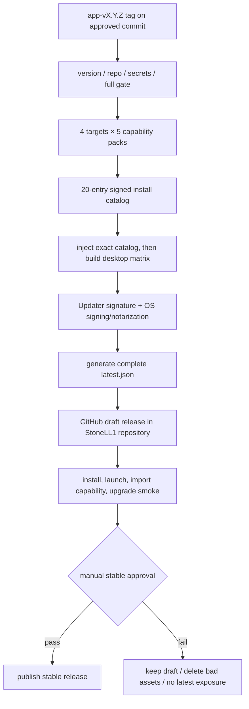
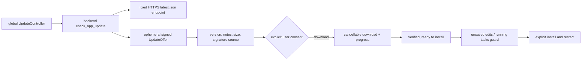
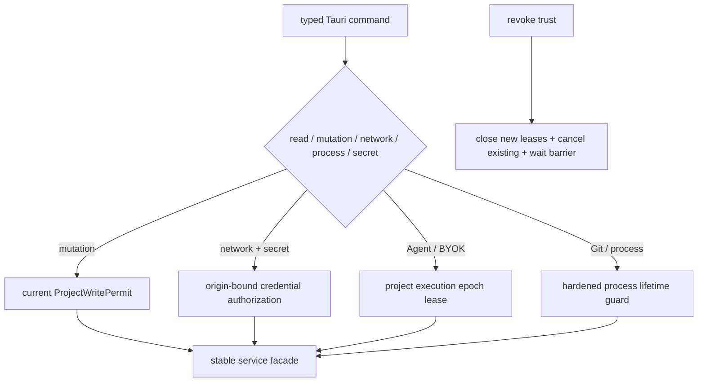

# LLM Wiki Desktop 发布前最终四项修复执行计划

> **状态：** Batch 6 local automated acceptance complete; Public beta No-Go（真实 draft、四平台签名安装/升级与匿名 endpoint 仍 Pending）
>
> **日期：** 2026-08-16
>
> **面向对象：** 后续负责实现、复核、打包和发布的 Codex / Agent
>
> **目标发布仓库：** `StoneLL1/llm-wiki-desktop`（已确认，Public）
>
> **首发版本：** `0.1.0`（已确认）
>
> **来源审查：**
> [`../../audits/2026-08-14-audit-security-and-privacy.md`](../../audits/2026-08-14-audit-security-and-privacy.md)、
> [`../../audits/2026-08-14-audit-reliability-and-data-integrity.md`](../../audits/2026-08-14-audit-reliability-and-data-integrity.md)、
> [`../../audits/2026-08-14-audit-release-testing-and-operations.md`](../../audits/2026-08-14-audit-release-testing-and-operations.md)、
> [`../../audits/2026-08-14-audit-accessibility-i18n-and-product-quality.md`](../../audits/2026-08-14-audit-accessibility-i18n-and-product-quality.md)
>
> **执行顺序：** Batch 0 → 1 → 2A → 2B → 2C → 2D → 3A → 3B → 4A → 4B → 5 → 6

## 1. 计划目标

性能修复完成后，本计划只选择四条对“用户能否完成任务、失败后能否恢复、发布后能否被安全维护”影响最大的交付线：

| 编号 | 最终修复项 | 为什么进入最后四项 |
| --- | --- | --- |
| FINAL-01 | 发布安全边界统一收口 | 已知 P1 涉及 API key 外发、写权限绕过、撤权后继续外发、Git/Agent 进程和 Windows 路径竞态；任何一项未关闭都不能把公开发布称为安全 |
| FINAL-02 | 结构化错误与真实恢复体验 | 首次创建/打开项目仍可能显示 `[object Object]`；capability、updater 和安全拒绝都需要统一、可本地化、可行动的错误模型 |
| FINAL-03 | Import capability 安装、续传和原任务继续闭环 | 干净安装中的 catalog 仍为空，OCR/ASR/browser 缺能力时用户会遇到永久禁用按钮，核心 Import 旅程直接中断 |
| FINAL-04 | StoneLL1 GitHub Release 桌面发布与签名更新 | 当前更新设置只有占位行为；没有 updater plugin、签名 endpoint、真实 installer release 或旧版本升级证据 |

其中 FINAL-01 是一个发布安全工作流，而不是一个小 UI 修补。它把审查中同属“发布前必须关闭”的安全 P1 合并成一条强制门禁，再按 2A–2D 分批实现。不能因为这些问题用户平时看不见，就把它们排除在“最后修复”之外。

本计划完成后的用户体验目标：

- 新用户可以安装应用、创建或打开项目，并在失败时看到明确原因和下一步操作。
- 扫描 PDF、图片、音视频和需要浏览器运行时的来源缺能力时，可以安全下载安装，并自动回到原 Import 会话继续。
- 用户保存的 Provider 密钥只会发往被明确绑定和批准的目的地；撤销信任后不会继续外发或写回。
- 用户可以检查更新、阅读变更说明、看到下载进度，并在明确同意后安装签名更新。
- 旧版本到新版本的真实升级、失败恢复、离线行为和错误签名拒绝都有 packaged 证据。

## 2. 当前基线与必须先承认的事实

### 2.1 仓库坐标

用户已于 2026-08-16 确认以下发布合同：

```text
canonical repository: https://github.com/StoneLL1/llm-wiki-desktop
visibility: public
first public version: 0.1.0
```

当前本地工作树仍没有配置 `git remote`。因此 Batch 0 不再重新讨论仓库地址或可见性，而是负责把本地 `origin`、默认分支、workflow 权限和所有 release/updater endpoint 与上述已确认合同对齐，并用自动断言防止后续漂移。

由于仓库已确认为 public，桌面客户端可使用匿名 GitHub Release 下载地址；但发布流水线仍必须从未登录环境验证 release 页面、`latest.json` 和安装资产返回成功且不要求凭据。若未来迁移为 private，必须另立迁移计划并切换到公开只读 release 仓库或公开 HTTPS 制品端点；不得把 GitHub token、PAT 或任何访问凭据编入客户端。

### 2.2 当前发布基线

- 首个公开版本已确认为 `0.1.0`；该版本目前在 `package.json`、`src-tauri/Cargo.toml`、`src-tauri/tauri.conf.json` 中一致，但还没有自动一致性门禁。
- Tauri identifier 是 `com.llmwiki.desktop`；公开首发前必须确认并冻结，发布后更换会破坏升级和平台身份连续性。
- `src-tauri/tauri.conf.json` 没有 `createUpdaterArtifacts`、updater public key 或 endpoint。
- `src-tauri/Cargo.toml` 和 `src-tauri/src/lib.rs` 没有 updater plugin。
- `UpdateSettings.tsx` 只读取本机版本，`latestVersion` 永远为空。
- `capabilities/install-catalog.json` 的 `entries` 为空。
- capability release workflow 已能生成 4 target × 5 pack 的 20 项 catalog，但它当前独立创建 GitHub Release，desktop build 没有消费其 application-integration artifact。
- 普通 CI 有三 OS 源码测试，但不构建、安装、启动、升级或卸载真实 Tauri 产物。
- 更新偏好虽然被标注为 Global，当前仍通过项目 settings 保存；没有项目时也没有可靠的全局 updater controller。

### 2.3 官方 updater 约束

实施 Agent 必须以当前 Tauri v2 官方文档和锁定版本 API 为准，不得复制旧博客代码：

- [Tauri v2 Updater](https://v2.tauri.app/zh-cn/plugin/updater/)
- [Tauri GitHub Release Pipeline](https://v2.tauri.app/zh-cn/distribute/pipelines/github/)

必须保持以下事实：

- updater 签名验证不能禁用。
- `pubkey` 是公钥内容，不是文件路径。
- production endpoint 必须是 HTTPS。
- `latest.json` 中每个平台都必须有有效 URL 和签名；一个坏平台条目可导致整个静态 manifest 验证失败。
- updater 签名与 Windows Authenticode、macOS Developer ID/Notarization 是不同层次，不能互相替代。
- GitHub 静态 release 不提供真正的百分比灰度。该方案的 staged rollout 只能是“draft → 内测 prerelease → stable publish”；需要百分比灰度时必须另建动态 update service，不在本计划内。

## 3. 本轮非目标

- 不引入数据库保存项目内容、更新记录或 capability 状态。
- 不重做现有 UI 视觉体系、导航信息架构或性能优化。
- 不实现自建动态更新服务器、用户分群或百分比灰度。
- 不允许静默安装更新；`checkUpdates` 只代表检查，不代表下载或安装。
- 不在客户端保存 GitHub PAT、release token、Tauri 私钥、OS code-signing 私钥或 capability signing 私钥。
- 不用“信任项目”一次性授权所有 provider、Agent、网络目的地和写能力。
- 不把项目级 Git checkpoint 用于应用自身升级；应用升级不应修改用户项目。
- 不以 jsdom、`cargo check` 或构建成功替代真实安装包升级证据。
- 不承诺旧版本静默降级。稳定回滚采用撤下坏 release，并发布更高 SemVer 的修复版本。
- 不顺带迁移所有全局 settings；本计划只把 updater 必需的应用级偏好移出项目 settings，并保留旧字段的兼容读取。

## 4. 不可破坏的第一性原理

### 4.1 密钥安全取决于使用时的目的地，不只取决于存储位置

把 key 放进 OS keyring 只解决“静态保存”问题。每次使用前仍必须证明：

```text
credential account
  = provider kind
  + canonical HTTPS origin
  + stable config id
  + current user authorization
```

项目配置不能仅凭 provider 名称借用另一个项目或另一个 origin 的全局 secret。

### 4.2 项目已登记不等于允许写入或外发

- `resolve_project_context` 只解决项目身份和 layout。
- mutation 必须持后端不可伪造的 write permit。
- external AI/Agent 必须持当前 execution epoch 的 lease。
- revoke 返回成功时，该 root 下的外部执行必须已经被关闭、取消并越过 barrier。
- 读操作为了 cache 不得偷偷写只读项目；此时必须使用 MemoryOnly policy。

### 4.3 错误是产品协议，不是异常字符串

用户错误面必须区分：

- 当前版本未实现；
- 可安装但尚未安装；
- 暂时不可达，可重试；
- 权限不足，需要用户操作；
- 被安全策略拒绝；
- 失败但可从 checkpoint/partial 继续；
- 必须重启或联系支持。

所有用户摘要使用 i18n；英文后端 message 只进入可展开、已脱敏的技术详情。

### 4.4 发布真实性由同一个不可变 tag 贯穿

同一 release 必须绑定：

- Git tag 与 commit SHA；
- app version；
- desktop installers；
- updater artifacts 与 `.sig`；
- `latest.json`；
- capability packs、catalog 和 trusted key；
- SBOM、checksums、provenance；
- packaged smoke 证据。

任何一项来自不同 tag、不同 commit 或不同 target，都必须 fail closed。

### 4.5 更新检查不得阻塞 local-first 主流程

- 首屏和打开本地项目不能等待 GitHub。
- 自动检查只能在 shell interactive 后异步执行。
- 离线、DNS 失败、rate limit 或 endpoint 不可达只能影响 updater 状态，不能拖死 Wiki/Search/Edit。
- 下载和安装属于长任务：必须有进度、取消/停止边界、失败恢复和明确终态。
- 安装/重启前必须处理未保存编辑和正在运行的关键任务，不能直接强制退出。

## 5. 目标架构

### 5.1 统一 release 流水线



### 5.2 应用内更新



前端不能传入 endpoint、下载 URL、signature 或任意 release channel；这些必须来自编译配置和后端已验证的 offer。

### 5.3 安全 authority



## 6. 总体验收门槛

| 场景 | 必须满足 |
| --- | --- |
| Provider secret | 官方 key 只能到官方 canonical HTTPS origin；Custom key 只能到已绑定 origin；跨 origin redirect 不携带 secret |
| Ollama | 默认只允许 loopback；任意内网、metadata、DNS rebinding 必须被阻止或进入单独的显式授权 |
| 项目写入 | untrusted、read-only、recovery、revoke-race 下所有 mutation 目录逐字节不变并返回统一 typed error |
| 撤销信任 | revoke 返回后该 root 不再产生 Agent/BYOK 请求、子进程或 Chat 写回 |
| Git/Agent | hooks/fsmonitor/diff/credential helper 不执行；超时/取消后进程树被回收；敏感环境不可见 |
| Windows 文件安全 | junction/reparse 竞争下 create/overwrite/delete/rename/rollback 均 fail closed，项目外 sentinel 不变 |
| 错误体验 | zh/en 的 open/create/import/provider/update/task 失败均不出现 `[object Object]`、裸 enum 或仅英文技术消息 |
| Capability | 4 target × 5 pack catalog 完整；干净 VM 可安装、健康检查并继续同一个 Import item/session |
| Capability 恢复 | 25%/75% 强杀后可继续或明确安全重下；无 orphan 累积；最终完整 hash/signature 复验 |
| Updater | 旧签名版本检测新版本，显式下载/安装；坏 signature、坏 manifest、404、离线、同版本、降级均安全处理 |
| 发布产物 | Windows x64、macOS arm64/x64、Linux x64 的 installer/updater artifact 与同一 tag/commit 对齐 |
| 应用连续性 | 更新失败保留旧版本可启动；卸载或升级不删除用户项目；离线本地阅读/搜索/编辑不受 updater 影响 |

## 7. 全 Batch 通用执行协议

每个实施 Batch 必须遵守：

1. 开始前运行 `git status --short`，记录并保护用户已有修改；不得清理或覆盖既有 graphify、audit、plan 和 progress 变更。
2. 先用 Graphify 查询当前 Batch 的调用链，再读计划列出的源码、测试、权威 SPEC 和相关 gotcha。
3. 先写能暴露旧问题的失败合同，再修改生产实现；不接受只补 happy-path 测试。
4. 所有跨项目异步提交继续绑定 `projectId + rootPath`；security authority 再绑定 canonical identity/revision/epoch。
5. 每个 Tauri command 必须被分类为 `read / mutation / network / external-process / secret`；多类命令必须满足全部门禁。
6. secret、签名私钥、PAT、证书密码不得进入源码、测试快照、console、Task 日志、support bundle 或 artifact metadata。
7. 任何涉及写权限、secret、external AI、进程、文件 mutation、updater 或 release workflow 的 Batch 都属于高风险变更：
   - Review A：带共享上下文，核对设计意图、权威边界和集成一致性；
   - Review B：fresh context，专找绕过、竞态、错误恢复、密钥泄漏和缺失负向测试。
8. 迭代期间先跑聚焦测试；每个高风险 Batch 收尾按仓库规则从头运行完整 `npm run check`，失败后修复并从头重跑。
9. GitHub workflow 变更除静态 YAML/脚本测试外，必须在 fork/draft tag 上做真实 workflow rehearsal；本地解析不能替代 runner 证据。
10. 每个重要里程碑在根 `progress.txt` 顶部追加记录；只有发现可复发陷阱时才追加 `gotchas.txt`。
11. 修改代码后运行 `graphify update .`；若命中已知 Windows 权限 gotcha，按 fail-closed 方式记录，不能声称 graph 已更新。
12. 一个 Batch 未满足 exit criteria 时，不得提前开始依赖它的下一 Batch，也不得把审查项标为 Closed。

---

## 8. Batch 0：发布坐标、身份、版本与红线合同

### 8.1 目的

在写 updater 或 release workflow 前冻结不可随意变化的发布身份，并把当前缺口变成自动化红线。

### 8.2 仓库与渠道确认

以下渠道合同已经冻结：

- canonical repository：`StoneLL1/llm-wiki-desktop`；
- visibility：`public`；
- first public version：`0.1.0`；
- stable tag 格式：`app-vX.Y.Z`；
- prerelease tag 格式：`app-vX.Y.Z-rc.N`；
- first stable tag：`app-v0.1.0`；
- stable updater endpoint：`https://github.com/StoneLL1/llm-wiki-desktop/releases/latest/download/latest.json`；
- capability asset base：`https://github.com/StoneLL1/llm-wiki-desktop/releases/download/<exact-tag>/...`。

Batch 0 仍必须验证：

- 本地 `origin` 精确指向已确认的 canonical repository；
- 默认分支名称及 release commit 的可追溯策略；
- GitHub Actions / Environment 的最小权限和审批 owner；
- 从未登录环境匿名访问公开 release 页面；
- draft 发布后、正式发布前验证 `latest.json` 与全部下载资产不需要 Authorization。

匿名访问失败视为发布配置错误；不得通过客户端 Authorization header、GitHub token 或 PAT 绕过。

### 8.3 冻结应用身份

由人类 owner 明确确认并记录：

- `productName = LLM Wiki Desktop`；
- `identifier = com.llmwiki.desktop`；
- Windows publisher subject；
- Apple bundle/team identity；
- updater signing public key；
- capability signing public key id；
- 首个 public beta/stable version：`0.1.0`（已确认）。

首个稳定安装包发布后，identifier、updater key 和平台 signing identity 不得无迁移方案更换。

### 8.4 版本一致性脚本

新增或扩展脚本，例如：

- `scripts/check-release-version.mjs`
- `scripts/check-release-config.node-test.mjs`

至少断言：

- `package.json`、`src-tauri/Cargo.toml`、`src-tauri/tauri.conf.json` 版本完全一致；
- tag 中版本与配置版本一致；
- 首次稳定发布必须使用 `app-v0.1.0`；
- SemVer 合法且 stable tag 不含 prerelease；
- release commit 可从默认分支追溯；
- `latest.json` 只能由 stable job 生成；
- identifier/productName 未意外变化；
- endpoint repo 与批准坐标一致。

### 8.5 建立红线测试

先增加当前应失败的合同：

1. release-mode catalog 为空必须失败；
2. updater plugin/config/endpoint/pubkey 缺失必须失败；
3. `UpdateSettings` 检查后永远没有 offer 的占位实现必须失败；
4. serialized `BackendError` 不得变成 `[object Object]`；
5. provider secret 不得发往任意 request origin；
6. mutation command inventory 中每个写命令必须声明 write authority；
7. release workflow 不能在 desktop/capability/manifest 未齐时发布 stable。

测试可先提交为 quarantined/red fixture，但不能用 `skip` 永久隐藏。每个后续 Batch 负责转绿自己拥有的红线。

### 8.6 Exit criteria

- 本地 `origin`、默认分支、workflow 权限和 endpoint 已与已确认的 public 仓库合同一致。
- 未登录环境可匿名访问发布页面；正式资产生成后，同样可匿名访问 `latest.json` 与安装资产。
- 发布身份、tag/version 策略和 key owner 已形成文档。
- 版本一致性检查在本地和 CI 可运行。
- 四项修复各有至少一个确定性红测试。
- 尚未生成或提交任何私钥。

---

## 9. Batch 1：统一 BackendError、用户摘要与恢复动作

### 9.1 目的

先建立后续 capability、security 和 updater 共用的错误协议。没有这一层，后续每个新功能都会重新拼接英文字符串和 `[object Object]`。

### 9.2 共享错误适配层

建议新增：

- `src/lib/backendError.ts`
- `src/components/app/ActionableErrorNotice.tsx`
- `src/test/backend-error-presentation.test.tsx`

共享类型至少包含：

```ts
interface NormalizedBackendError {
  code: string | null;
  summaryKey: string;
  summaryParams?: Record<string, string | number>;
  technicalDetails: string | null;
  recoverable: boolean;
  userActionRequired: boolean;
  actionKind: "retry" | "reauthorize" | "repair" | "open_settings" | "restart" | "copy_details" | null;
}
```

适配器必须处理：

- Rust serialized `BackendError`；
- JS `Error`；
- string reject；
- `null`、数组、循环对象和无法 stringify 的 unknown；
- details 中的路径、URL query、Authorization、token、api key、cookie 等脱敏。

不要给每个 Rust error 增加自由文本 `messageKey`。以稳定 `code` 作为前后端合同，前端维护 code → locale key/action 的受审映射；未知 code 使用安全通用摘要，并保留已脱敏技术详情。

### 9.3 统一组件行为

`ActionableErrorNotice` 至少支持：

- 本地化摘要；
- 明确的重试/重新授权/打开设置/修复/重新加载动作；
- 可展开技术详情；
- 复制详情前再次脱敏；
- `role="alert"` 或适合长任务状态的 `role="status"`；
- 不把完整绝对项目路径默认暴露在主摘要中；
- 操作执行中禁用重复点击，失败后可再次操作。

### 9.4 首批迁移面

优先迁移：

- `src/features/project/NoProjectWorkspace.tsx`
- `src/stores/projectStore.ts`
- `src/features/import/ImportCapabilityDialog.tsx`
- `src/features/settings/UpdateSettings.tsx`
- `src/features/settings/useProviderWorkflow.ts`
- `src/features/chat/ChatView.tsx` / Page Chat 的发送错误面
- Task/Workflow 已有 `summary + technicalDetails` 的实现改为复用共享 helper，不再维护平行 parser。

本 Batch 不要求一次迁移仓库每个 toast，但必须建立静态扫描或测试，禁止新增 `String(error)` 直接进入用户 UI。

### 9.5 i18n 合同

- en/zh-CN exact-key parity；
- error code 映射必须两种语言都有摘要和动作；
- risk/action enum 不得直接进入界面；
- 技术详情允许英文，但必须明确标为 technical details；
- 安全拒绝文案不泄漏内部策略细节到攻击者可控页面，同时给合法用户可行动说明。

### 9.6 测试矩阵

| 输入 | 断言 |
| --- | --- |
| 真实 serialized BackendError | 显示本地化摘要、code 对应动作，保留脱敏技术详情 |
| plain Error/string | 不崩溃，有通用摘要 |
| object/circular object | 不出现 `[object Object]`，不因 stringify 再抛错 |
| 含 secret/query/cookie details | UI、复制文本、console 均无原秘密 |
| zh/en 切换 | 摘要和动作同步切换，技术详情不被误当主文案 |
| 重试失败两次 | 操作状态恢复，可再次点击，不无限 loading |

### 9.7 Exit criteria

- 首次创建/打开、Provider 测试、capability 和 updater 错误均使用共享模型。
- 测试断言用户界面不存在 `[object Object]`。
- locale parity 和 secret redaction 合同通过。
- 两轮 review 有效意见已处理。
- 从头运行完整 `npm run check` 通过。

---

## 10. Batch 2A：Provider secret-to-origin 与网络目的地绑定

### 10.1 目的

关闭 `test_llm_provider` 可把全局 key 发送到任意 request base URL，以及 Ollama probe 可被项目设置用作内网探测的问题。

### 10.2 后端授权模型

新增稳定、后端生成的 provider config identity，例如：

```text
ProviderCredentialBinding {
  config_id,
  provider_kind,
  canonical_origin,
  credential_account_id,
  approved_at,
  revision
}
```

要求：

- OpenAI、Anthropic、Google 使用审核过的 canonical HTTPS origin allowlist；
- 官方 provider 不接受项目配置替换成 Custom origin；
- Custom provider 第一次保存 secret 时显示精确 scheme/host/port，并绑定 config id + origin；
- origin 变化后旧 secret 不得自动复用，必须重新授权/重新绑定；
- legacy 只按 provider kind 保存的 secret 不得自动发送到 Custom origin；
- HTTP 只允许明确的 loopback local provider；不允许 `0.0.0.0`、任意 LAN、link-local 或 metadata target；
- redirect 默认关闭；如确需 same-origin redirect，必须重新验证且 origin 变化前剥离 secret header；
- 所有 secret 读取前先验证 trusted external-AI authority 和当前 binding。

SecretService 的 account key 必须包含稳定 binding identity；迁移测试要证明旧 account 不会被错误读取。

### 10.3 Ollama 和 Custom URL policy

不要复制一个简化 SSRF checker。复用 Import 已成熟的 URL/DNS/IP/redirect policy 抽象，区分：

- loopback local service；
- public HTTPS service；
- private target explicit grant；
- denied metadata/reserved/mixed DNS/rebinding target。

`check_ollama_reachable` 不得从恶意项目 settings 对任意 `{base}/api/tags` 直接 GET。

### 10.4 负向测试

- `http://attacker`、HTTPS attacker、自签名 TLS；
- 301/302/307/308 same-origin/cross-origin；
- `127.0.0.1`、`localhost`、`0.0.0.0`、LAN、link-local、metadata；
- IPv4-mapped IPv6、混合 DNS、DNS rebinding；
- 项目 A/B 同 provider 不同 origin；
- config id 被篡改、origin 大小写/默认端口/尾点 normalization；
- untrusted/recovery 项目；
- 攻击 server 请求计数必须为 0，日志不得出现 key。

### 10.5 Exit criteria

- secret 只能通过 origin-bound binding 读取和使用。
- 前端不能提交任意 endpoint 让后端携 secret 请求。
- Ollama 默认只探测 loopback。
- 跨 origin redirect 不携带任何 secret header。
- 两轮安全 review 和完整 `npm run check` 通过。

---

## 11. Batch 2B：ProjectWritePermit 与全项目撤权 barrier

### 11.1 目的

关闭“registered project 被误当成 writable/trusted project”和 Chat 撤权竞态。

### 11.2 mutation inventory

生成机器可读或静态测试维护的 command inventory，至少覆盖：

- Import V2 final confirm/commit；
- Source apply/discard/restore/reprocess/move/delete；
- Wiki save/create/rename/delete；
- Settings/provider 写入；
- Graph persistent cache/layout；
- Exports/Lint/Workflow/Chat convenience 写入；
- task/state cleanup、rollback 和 repair。

每条 mutation command 必须进入统一 helper，例如：

```text
with_current_project_write_access(project_id, root, |permit, context| ...)
```

service 中真正执行 mutation 的 API 只接受不可从 IPC 反序列化的 `ProjectWritePermit` 或更窄 capability；不能继续让 command 先 resolve、释放锁、再拿裸 `ProjectContext` 写入。

### 11.3 cache policy

Graph/Search/Wiki 等 read command 若需要生成 cache，必须显式选择：

- `MemoryOnly`；或
- `Persistent(ProjectWritePermit)`。

只读/受限/恢复项目仍能阅读，不能因为写 cache 失败而整页失败。

### 11.4 execution epoch 与 revoke

把 Workflow 已有 launch permit/registry 泛化到：

- Chat Agent；
- Chat BYOK；
- Page Chat；
- Source AI；
- Skills/Agent convenience；
- 其他会外发项目内容的后台任务。

规则：

1. retrieval 可以在只读 snapshot 上执行；
2. 真正 spawn/send 前必须持当前 epoch lease；
3. revoke 先关闭新 lease，再取消该 root 下全部外部 task；
4. 等待 barrier 完成后才返回 revoke success；
5. 网络响应/Agent 输出写回前 compare current epoch；
6. 旧 epoch 结果可保留脱敏审计事实，但不能写入当前项目或接管 UI。

### 11.5 并发矩阵

- trusted/untrusted × writable/read-only × healthy/recovery；
- resolve 后 revoke、permit 后 revoke、mutation commit 前 revoke；
- Chat retrieval/launch barrier；
- BYOK request/response/commit barrier；
- A 运行 → 切 B → revoke A；
- revoke 返回后目录 tree/hash、provider request count、Agent process count 均不再变化。

### 11.6 Exit criteria

- command inventory 无未分类 mutation。
- 所有生产写入口持后端 permit。
- revoke success 具备“外部执行已停止”的可证明语义。
- read-only Graph 等阅读路径不因 cache persistence 失败。
- 两轮 review 和完整 `npm run check` 通过。

---

## 12. Batch 2C：Git/Agent 统一进程安全与 bounded context

### 12.1 hardened process runner

把 assessment 已有安全 Git 启动策略推广到所有 app-owned Git：

- `core.hooksPath` 指向空目录/`NUL`；
- `core.fsmonitor=false`；
- 关闭 pager、prompt、credential helper、external diff、textconv；
- stdin null；
- 环境 allowlist，不继承 token/key/cloud credential；
- stdout/stderr 原始字节上限；
- deadline、cancel、kill process tree、wait/reap；
- 每项目并发隔离，项目 A 卡住不能阻塞项目 B。

所有 Agent probe 和正式 runner 复用统一 `ProcessLifetimeGuard`，不允许 timeout 只 kill parent。

### 12.2 Agent Chat 最小能力

- 普通 Chat 优先由应用完成 bounded retrieval，把选中的 Markdown snapshot 交给无工具模型。
- 如产品路径必须使用 CLI file tools，只暴露 task-owned 只读 snapshot，不暴露真实项目外目录。
- 所有 Agent 路径无条件从空环境开始，再加入最小 allowlist。
- 需要宿主 OAuth/keychain 的路径必须是显式、单独 capability，不能顺便暴露完整 HOME/config。
- Edit/Write/Bash 只允许在 candidate workspace；最终 apply 回到 Batch 2B 的 permit/checkpoint/checked mutation。

### 12.3 对抗测试

- `.git/config` hooksPath/fsmonitor/external diff 写 marker；
- 无限 hook/child process；
- 读取伪造敏感 env；
- Markdown prompt injection 请求读取项目外 sentinel、HOME、SSH、cloud env；
- Agent 尝试写项目外 marker；
- timeout/cancel 后父子 PID 全消失。

### 12.4 Exit criteria

- 所有 app-owned Git 只走 hardened runner。
- Agent probe/runner 统一回收进程树。
- 普通 Chat 不给不可信 Markdown 无界本机工具能力。
- 两轮 review、真实进程测试和完整 `npm run check` 通过。

---

## 13. Batch 2D：Windows handle-relative mutation 与跨平台竞态门

### 13.1 目的

关闭 Windows 检查路径后按名字执行 overwrite/delete/rename/rollback 的 junction/reparse TOCTOU。

### 13.2 实施边界

引入平台抽象，例如 `SafeProjectDirHandle` / `BoundProjectMutationRoot`：

- Windows：retained directory handle、reparse-safe open、handle/descriptor-bound rename/disposition/delete；
- Unix：`openat/openat2`、`O_NOFOLLOW`、`renameat/unlinkat`；
- mutation service 不再消费未经绑定的裸 `PathBuf` 作为最终写 capability；
- temp file、replace、delete、rollback 必须共享同一个已验证 parent binding；
- 每次打开 existing target 验证 regular-file/type/identity；
- 不跟随 symlink/junction/reparse point。

先迁移 Import transaction，再迁移通用 FileStore 和 Batch 2B inventory 中的高风险 overwrite/delete/rename。

### 13.3 真实平台测试

- Windows runner 持续切换 junction/reparse point；
- macOS/Linux 持续切换 symlink；
- create/overwrite/delete/rename/rollback；
- 项目外 sentinel 字节逐次验证；
- 文件锁、权限变化、parent 被替换、target 类型变化；
- 不得以 `#[ignore]` 或平台 skip 把 Windows release blocker 变绿。

### 13.4 Exit criteria

- Windows 高风险 mutation 不再退回“校验后按路径 MoveFileEx/remove_file”。
- 通用写 API 持 retained binding。
- 三平台竞争矩阵通过，项目外 sentinel 始终不变。
- 两轮 review 和完整 `npm run check` 通过。

---

## 14. Batch 3A：Capability release artifact 与 desktop build 注入

### 14.1 目的

让每个正式桌面构建都内置与自身 tag/commit/target 对齐的完整 catalog，而不是使用源码树里的空 placeholder。

### 14.2 重构 capability workflow

把当前 `.github/workflows/capability-release.yml` 拆成：

1. 可复用的 capability build workflow/job：只构建、签名、验证和上传 workflow artifacts；
2. 最终 release publisher：只能由 Batch 5 的统一 desktop release orchestration 调用。

禁止 capability job 在 desktop installers、updater manifest 和 smoke 未完成前独立发布 stable GitHub Release。

### 14.3 catalog 合同

正式 catalog 必须满足：

- schema version 合法；
- exactly 20 unique entries：4 target × 5 pack；
- capability id、target triple、version、compressed/installed/model bytes 完整；
- URL 固定到 exact immutable tag，不使用 mutable `latest`；
- SHA-256、签名、key id 和 manifest identity 一致；
- key id 存在于随 app 编译的 trusted keys；
- 不含 localhost、placeholder、example.com、空 URL；
- catalog/tag/commit provenance 可追踪。

源码开发态可以保留空 catalog，但 release-mode build 必须设置明确开关并在编译/预检阶段拒绝空 catalog。不能继续使用对空数组 `all(valid)` 的真空通过测试。

### 14.4 注入方式

选择一种可审计、确定性的 build-time 注入：

- release job 下载 `capability-install-catalog` artifact；
- 验证 artifact 来自同一 workflow run、tag 和 commit；
- 将 catalog + trusted keys 放入受控 staging 路径；
- build script/compile-time include 从该 staging 输入读取；
- 构建后从二进制或 app resource 反向读取/探测，证明内置的是非空 exact catalog。

不要在 release job 里用不受验证的 `curl latest` 覆盖源码文件，也不要把动态下载的私钥写入 workspace。

### 14.5 测试

- 空 catalog、19/21 entries、重复 entry；
- target 缺失、错误 tag、错误 commit、unknown key；
- hash/signature mismatch；
- catalog artifact 来自另一 workflow run；
- source/dev build 的明确 fallback；
- release build 内置 catalog 反向验证。

### 14.6 Exit criteria

- release build 不可能带空 catalog。
- capability assets 与 desktop tag/commit 一致。
- capability job 不再提前发布 stable release。
- 两轮 review、workflow rehearsal 和完整 `npm run check` 通过。

---

## 15. Batch 3B：Capability 下载续传、安装健康检查与原 Import 继续

### 15.1 下载恢复

替换随机 `.download-{nonce}.zip` 全量重下模型：

- deterministic partial path 绑定 capability id + version + target + expected hash；
- sidecar metadata 记录 URL identity、ETag/Last-Modified、expected length/hash、已下载 bytes；
- 服务支持 Range 时从已验证偏移继续；
- 不支持 Range 或 identity 变化时安全丢弃 partial 后重下；
- app startup reaper 清理过期、无 owner、元数据损坏的 orphan；
- 用户主动取消与进程 crash 区分；
- 最终始终重做完整 archive hash、signature 和 manifest 验证。

下载必须接入统一 Task/进度/取消语义，不能只在 dialog 本地 loading。

### 15.2 安装事务

- staging 目录与最终目录同 volume；
- 解压使用 entry count、depth、total bytes、symlink/special-file 限制；
- 安装前后都验证 target、entrypoint、manifest、signature；
- replace 使用 Batch 2D 的安全 mutation primitive；
- 旧版本在新版本健康检查通过前保持可回退；
- crash 后能区分 installed/staging/partial 并恢复或清理。

### 15.3 原 Import 会话继续

安装成功后不得让用户重新选择文件或重建 batch：

1. 安装请求绑定 `projectId + rootPath + sessionId + itemId + capability requirement revision`；
2. 安装终态重新加载当前 session；
3. 再次验证该 item 仍在等待同一 capability；
4. 运行 capability health check；
5. 把 item 从 `waiting_capability` 推进到明确授权/继续状态；
6. 项目或 item 已变化时只记录 task 事实，不接管当前 UI；
7. 失败保持原 item 可重试，不丢 staged evidence。

### 15.4 UI 状态

明确区分：

- `not_installed`：可安装；
- `downloading`：显示 bytes/percent/取消；
- `paused`：可以继续；
- `verifying`；
- `installing`；
- `health_check_failed`：可重试/重装；
- `signed_release_unavailable`：当前 build 不支持，不显示假安装按钮；
- `installed`：自动继续原任务。

全部错误复用 Batch 1 的共享适配层。

### 15.5 Packaged 验收

四个 target 的干净 VM 至少覆盖：

- OCR 图片/扫描 PDF；
- ASR 音频；
- browser runtime 网页；
- browser-runtime-lite/media-metadata 至少各一条真实 health route；
- 25%/75% 强杀；
- 主动取消后重新开始；
- hash/signature 损坏；
- 磁盘不足、权限不足、杀软锁文件；
- 安装完成后继续同一个 item/session。

### 15.6 Exit criteria

- 干净安装不再出现永久禁用 capability 死路。
- 下载恢复和 orphan reaper 有真实强杀证据。
- 安装成功后原 Import item 自动继续。
- 两轮 review、packaged smoke 和完整 `npm run check` 通过。

---

## 16. Batch 4A：Tauri updater 后端、签名配置与全局偏好

### 16.1 依赖与配置

按仓库锁定的 Tauri 2.x 版本接入 Rust updater plugin，保持 GUI feature 可选：

- `src-tauri/Cargo.toml`：desktop target 的 `tauri-plugin-updater` optional dependency；
- `gui` feature 纳入 updater dependency；
- `src-tauri/src/lib.rs`：初始化 plugin；
- `src-tauri/tauri.conf.json`：`bundle.createUpdaterArtifacts = true`；
- updater `pubkey` 使用提交到源码的 public key 内容；
- endpoint 固定为批准的 StoneLL1 public release endpoint；
- Windows `installMode` 使用有进度反馈的 `passive` 或经过产品确认的 `basicUi`，禁止默认 `quiet`。

私钥只存在 GitHub protected environment secrets：

- `TAURI_SIGNING_PRIVATE_KEY`
- `TAURI_SIGNING_PRIVATE_KEY_PASSWORD`

updater key 与 capability signing key 分离。必须有离线备份、owner、恢复流程和 rotation 记录；丢失 updater 私钥意味着无法给现有安装用户发布后续更新。

### 16.2 后端 UpdateService

新增稳定边界，建议位置：

- `src-tauri/src/services/update_service.rs` 或 facade directory；
- `src-tauri/src/models/update.rs`；
- `src-tauri/src/commands/update_commands.rs`；
- `AppState` 中的 `UpdateCoordinator` / pending offer registry。

命令建议：

```text
get_update_state
check_app_update
download_app_update
cancel_app_update_download
install_app_update
dismiss_app_update
```

约束：

- 命令不接受任意 endpoint、URL、signature 或 version override；
- `check` single-flight，有 timeout、最大 manifest bytes 和稳定 typed error；
- 返回 ephemeral `offerId`，绑定当前版本、target、arch、远端版本、URL/signature identity 和检查 generation；
- download/install 必须消费或重验同一个 offer；过期 offer fail closed；
- 同版本和低版本不返回可安装 offer；
- 下载有进度 channel、取消和 terminal state；
- install 前再次验证签名和 offer identity；
- updater 失败不改变用户项目或全局 task 事实；
- 不把 release notes 当 HTML 执行，按纯文本/安全 Markdown 渲染。

### 16.3 全局更新偏好

更新属于 app global 能力，不属于项目。新增 app-global preferences persistence，存储在 OS app config 目录，而不是项目 `.app/settings.json`：

- `checkUpdates`；
- `updateFrequency`；
- `autoDownloadUpdates`；
- `promptChangelogBeforeInstall`；
- `lastCheckedAt`；
- dismissed offer/version。

由于当前尚未公开发布，可采用以下兼容策略：

- 继续反序列化项目 settings 中的 legacy 字段，避免旧文件解析失败；
- 停止把 updater 偏好写回项目；
- global preferences 不存在时使用产品默认值；
- 不从任意当前项目静默复制全局偏好，以免项目内容改变 app 网络行为。

### 16.4 启动检查策略

- shell first interactive 后再调度；
- 无项目也能检查；
- frequency 为 daily/weekly/never；
- 同一窗口/同一周期 single-flight；
- offline 或 GitHub 错误只更新 updater state；
- `autoDownloadUpdates=false` 时绝不自动下载；
- 本计划不允许自动安装。

### 16.5 Exit criteria

- updater plugin/config/signing artifact 可以在本地 release build 生成。
- updater command 不依赖项目 context，也不接受任意 endpoint。
- global preferences 已脱离项目 settings。
- 坏 manifest/signature/timeout/取消均为 typed、可恢复错误。
- 两轮 review 和完整 `npm run check` 通过。

---

## 17. Batch 4B：全局 UpdateController、设置 UI 与安装重启保护

### 17.1 全局 controller

新增轻量全局控制器，例如：

- `src/features/update/useUpdateController.ts`
- `src/stores/updateStore.ts`
- `src/components/app/UpdateController.tsx`
- `src/features/settings/UpdateSettings.tsx` 重写为真实状态消费者。

controller 挂在 AppShell 全局层，而不是某个项目 View 内。它必须在无项目工作台、任何路由和项目切换期间保持一致，但不能进入 Dashboard 初始重型依赖闭包。

### 17.2 UI 状态机

```text
idle
checking
up_to_date
available
downloading
paused_or_cancelled
ready_to_install
installing
restart_required
error
```

界面至少显示：

- 当前版本、最新版本；
- 最后检查时间；
- release notes 与发布日期；
- 下载大小（可得时）；
- 签名来源/已验证状态的用户可理解说明；
- 下载进度和取消；
- 失败后的真实重试；
- “稍后提醒”和本版本忽略；
- 明确的安装/重启同意。

不得继续使用 `window.confirm` 承担更新安装决策。使用项目已有确认/对话框视觉和可访问性模式，但更新不是项目 mutation，不应伪造 Git checkpoint。

### 17.3 无项目可达性

至少提供一个不依赖当前项目的入口：

- TopBar/App menu 的“检查更新”；或
- 全局 About/Update dialog。

项目 Settings 中的 Update 区块可以保留，但必须读取同一个 global update store，不能再要求项目 settings 才能工作。

### 17.4 安装和重启保护

下载完成不等于立即退出。安装前检查：

- Wiki/editor 是否有未保存 draft；
- 是否有 destructive mutation、Import commit 或 Workflow apply 正处于不可中断阶段；
- 是否有等待用户确认的关键操作；
- 当前下载/安装 task 是否已完整持久化终态。

行为：

- 未保存内容存在时，阻止重启并列出可操作项；
- 可安全后台继续的普通任务可以提示用户稍后安装；
- 不可安全中断的关键区间必须等待或取消成功后再安装；
- 安装失败保持旧版本可启动，并显示 Batch 1 的 actionable error；
- 应用不得自行删除用户项目、capability data 或聊天记录。

### 17.5 测试矩阵

- no update、new update、same version、downgrade；
- check 的并发去重和 frequency；
- A/B 项目切换不影响全局 update state；
- 无项目时手动检查；
- download progress/cancel/retry；
- release notes 恶意 Markdown/链接；
- unsaved editor、running critical task、safe idle 三类 install guard；
- zh/en、键盘、读屏、200%/400% zoom；
- 不出现 placeholder 文案或不可达按钮。

### 17.6 Exit criteria

- “检查更新”产生真实 offer 或真实 up-to-date 状态。
- 用户能看到进度、取消、失败原因并明确同意安装。
- 无项目时仍能更新。
- 未保存编辑和关键任务不会被强制退出破坏。
- 两轮 review 和完整 `npm run check` 通过。

---

## 18. Batch 5：StoneLL1 统一桌面发布流水线

### 18.1 目的

把 capability、desktop installer、updater manifest、平台签名和 packaged smoke 收敛为一个 release transaction。只有最后一个 job 有权发布 stable release。

### 18.2 Workflow 结构

建议新增：

- `.github/workflows/desktop-release.yml`
- `scripts/verify-release-assets.mjs`
- `scripts/verify-latest-json.mjs`
- `scripts/generate-release-checksums.mjs`
- `docs/release/release-runbook.md`

推荐 jobs：

1. **preflight**
   - checkout exact tag SHA；
   - version/tag/repo/identifier 检查；
   - `npm ci`、`cargo --locked`；
   - 完整 `npm run check`；
   - required secrets presence，只检查存在性，不打印内容。
2. **capability-build**
   - 调用 Batch 3A reusable workflow；
   - 生成并验证 20-entry catalog；
   - 只上传 workflow artifacts，不发布 release。
3. **desktop-build matrix**
   - Windows x64；
   - macOS arm64；
   - macOS x64；
   - Linux x64；
   - 注入同 run catalog/trusted keys 后构建；
   - 生成 updater artifacts 和 `.sig`。
4. **platform-sign**
   - Windows Authenticode；
   - macOS Developer ID signing + notarization + staple；
   - Linux updater signature/checksum；
   - 不能把 Tauri updater signature 当 OS 签名证据。
5. **manifest-and-provenance**
   - 聚合所有 target；
   - 生成完整 `latest.json`；
   - URL 固定 exact tag；
   - 生成 SHA-256 checksums、SBOM、build provenance/attestation；
   - 反向下载/验证每个 artifact 和 signature。
6. **draft-release**
   - 在 `StoneLL1/llm-wiki-desktop` 创建 draft；
   - 上传 installers、updater artifacts、latest.json、capability packs/catalog、checksums、SBOM、provenance；
   - draft 不暴露给 stable updater。
7. **packaged-smoke**
   - 从 draft artifact 安装并启动；
   - 跑 Batch 6 核心旅程；
   - 测旧版本 → 当前 draft 的更新路径时使用受控 fixture endpoint，不让生产 `latest` 指向未批准版本。
8. **publish-stable**
   - GitHub protected environment + human approval；
   - 确认所有 required jobs、签名、公证和证据；
   - 发布 stable release；
   - 发布后从匿名网络读取 `latest.json` 和每个 URL，再验一次。

### 18.3 Supply-chain 约束

- 所有 GitHub Actions 使用审核过的 commit SHA pin；复用 capability workflow 已采用的模式。
- Node、Rust、npm lock、Cargo.lock 精确固定。
- release build 使用 `--locked` / `npm ci`。
- action、toolchain 或 signing policy 更新必须单独 review。
- GitHub environment 只允许默认分支批准 tag，并启用 required reviewer。
- `permissions` 最小化；只有最终 release job 获得 `contents: write`。
- 并发组按 tag；同一 tag 不允许两个 publisher 竞态。
- 不允许 job log 输出 private key、certificate blob、password 或完整 signed URL。

### 18.4 Release assets 合同

每个 stable release 必须包含：

- 4 target installer/updater artifacts；
- 对应 `.sig`；
- 完整 `latest.json`；
- 20 capability packs + `install-catalog.json`；
- checksums；
- SBOM；
- provenance/attestation；
- release notes；
- packaged smoke 摘要；
- 已知限制与恢复说明。

`latest.json` 的每个 platform URL 必须指向同一个 exact tag；不能使用 `releases/latest/download/<installer>` 作为内部 artifact URL。

### 18.5 发布与回滚策略

GitHub static updater 的稳定流程：

1. draft；
2. internal install/smoke；
3. 可选 prerelease RC；
4. stable manual publish；
5. 观察；
6. 出现严重问题时立即撤下/标记坏 release，停止新用户获取；
7. 发布更高 SemVer hotfix 恢复已升级用户。

禁止通过发送低版本 manifest 强制降级。必须在 runbook 中记录 updater key 丢失、GitHub outage、坏 manifest、证书过期和紧急 hotfix 的 owner/步骤。

### 18.6 Exit criteria

- 统一 workflow 能从 tag 生成完整 draft release。
- stable publish 前没有任何 job 可单独创建公开 release。
- 4 target、catalog、latest.json、签名和 provenance 属于同一 tag/commit。
- 匿名网络可读取 stable endpoint；客户端无需 token。
- workflow 两轮 review 和一次完整 rehearsal 通过。

---

## 19. Batch 6：真实安装、升级、安全与恢复总验收

> **2026-08-21 执行结果：** 本地源码、集成、release fixture 和 bundle 门已完成；真实签名 packaged / draft rehearsal 因 canonical repository 匿名不可达、GitHub 凭据失效、production signing identity/key owner/reviewer 未配置而保持 release-blocking Pending。不得把本地 rehearsal 描述为真实安装、升级、签名或匿名下载证据。权威记录见 [`../../release/batch-6-acceptance-evidence.md`](../../release/batch-6-acceptance-evidence.md)。

### 19.1 自动化总门

按顺序执行：

1. Batch 1–5 新增的所有聚焦测试；
2. release config/version/catalog/manifest 静态合同；
3. capability tool tests；
4. provider/authority/Git/path 负向测试；
5. updater state/controller tests；
6. `npm run check:bundle`；
7. 两轮最终 review；
8. 修复有效问题后，从头运行完整 `npm run check`；
9. `graphify update .`；
10. draft release workflow rehearsal。

任何完整 gate 失败后，只修复范围内问题并从头重跑；不能只重跑最后失败步骤后声称全绿。

### 19.2 Packaged 平台矩阵

| 平台 | 安装/升级要求 |
| --- | --- |
| Windows x64 | NSIS/MSI 至少选择一种作为 canonical updater path；真实安装、启动、旧版升级、被占用文件、杀软、普通用户权限、卸载 |
| macOS arm64 | Developer ID、notarization、staple、Gatekeeper、旧版升级、卸载 |
| macOS x64 | 与 arm64 独立 artifact/signature/manifest entry；真实启动与升级 |
| Linux x64 | AppImage updater path、可执行权限、桌面启动、旧版升级；deb/rpm 若发布也需独立 smoke |

### 19.3 核心用户旅程

每个平台至少完成：

1. 安装旧签名版本；
2. 启动到 shell，无项目也可检查更新；
3. 新建 CJK/空格/长路径项目；
4. 打开 native、compatible、read-only、restricted、untrusted/recovery fixture；
5. Wiki 阅读、搜索、编辑；
6. 需要 OCR/ASR/browser capability 的 Import；
7. capability 下载中断、恢复、安装并继续原 item；
8. Provider official/custom origin 授权和负向拦截；
9. Chat/BYOK 检索期间 revoke；
10. 检查新版本、阅读 notes、下载、取消、继续；
11. 未保存编辑/关键任务下尝试安装，确认被安全阻止；
12. 空闲时安装并重启到新版本；
13. 验证项目、设置、聊天、任务和 capability data 保持；
14. 卸载应用，用户项目仍存在且字节不变。

### 19.4 更新故障矩阵

- endpoint offline、DNS 失败、TLS 失败、GitHub 404/403/429/5xx；
- manifest 超大、JSON 损坏、platform 缺失、unknown platform、错误 SemVer；
- installer URL redirect、跨 origin、下载中断；
- signature 内容损坏、错误 public key、artifact 替换；
- same version、older version、prerelease 对 stable；
- 下载完成后 app crash；
- install 中断/重启；
- 旧版本仍可启动或给出明确平台恢复步骤；
- local-first Wiki/Search/Edit 在所有网络故障中继续工作。

### 19.5 安全总矩阵

- 恶意 provider config 无法窃取 key；
- untrusted/read-only/recovery mutation 全拒绝；
- revoke 返回后无外发/写回；
- malicious Git hooks/fsmonitor 不执行；
- Agent prompt injection 无法读取/写入项目外；
- Windows junction/macOS/Linux symlink 竞争不越界；
- 日志、error details、support evidence、release artifact 无 secret。

### 19.6 Release evidence

保存不含用户私密路径/内容的证据：

- workflow run URL、tag、commit SHA；
- artifact 名称、大小、SHA-256；
- code-signing/notarization 验证结果；
- latest.json schema/URL/signature 验证；
- capability catalog 20-entry 验证；
- 各平台安装/升级/卸载结果；
- negative security test 结果；
- 完整 `npm run check` 结果；
- 已知限制与 Pending 项。

### 19.7 文档收尾

- 在四份来源 audit 的对应 finding 下增加状态、commit、测试和 packaged evidence 链接；
- 更新 `SPEC/PRD.md`、`SPEC/SPEC.md`、`SPEC/APP_flow.md`、`SPEC/TECH_STACK.md`、`SPEC/BACKEND_STRUCTURE.md` 中 updater/release/security 的当前合同；
- 修正 `SPEC/SPEC.md` 16.7 的首次使用现状漂移；
- 更新 release runbook、incident/hotfix/key-loss 流程；
- 在根 `progress.txt` 顶部记录最终里程碑；
- 只在真实发现新陷阱时追加 `gotchas.txt`。

### 19.8 Exit criteria

只有以下全部满足，才能把本计划标为 Completed 或发布 public beta：

- FINAL-01 的已知安全 P1 全部有代码与负向证据关闭。
- FINAL-02 的核心用户错误面不再退化为 `[object Object]`/裸技术文本。
- FINAL-03 在四 target 干净环境完成能力安装和原 Import 继续。
- FINAL-04 完成旧签名版本到新签名版本的真实升级。
- 所有 installer/updater/capability/catalog/manifest 来自同一 tag/commit。
- Windows/macOS 平台签名与公证要求通过。
- 更新失败不破坏旧版本和用户项目。
- 两轮最终 review 无未处理 P1/P2。
- 最终完整 `npm run check` 从头通过。
- draft release rehearsal 与匿名 endpoint 验证通过。
- Graphify、progress、audit 状态和 release runbook 已同步。

## 20. 风险清单与停止条件

| 风险 | 早期信号 | 停止/处理条件 |
| --- | --- | --- |
| 本地 `origin` 未配置或指向其他仓库 | tag/workflow 可能作用于错误 remote，endpoint 与源码分离 | Batch 0 配置并断言 `origin` 精确匹配 `StoneLL1/llm-wiki-desktop` 后再继续 |
| public release 资产不能匿名访问 | 未登录请求 `latest.json` 或 installer 得到 404/鉴权响应 | 停止发布并修正 release visibility/asset 路径；禁止在客户端添加 token |
| updater key 丢失或未备份 | CI 只有临时 key、无人能恢复 | 停止首个公开 release，先完成离线备份和 owner 交接 |
| capability job 提前发布 release | desktop/manifest 尚未齐全已有 public tag | 回滚 workflow，保证只有最终 publisher 有 contents:write |
| 项目 settings 改变全局更新行为 | 切项目后 auto-check 开关变化 | updater 偏好迁移到 app-global store，项目字段仅兼容读取 |
| secret binding 破坏官方 provider | 合法 OpenAI/Anthropic/Google 全失败 | 修 canonical origin/normalization，不回退到任意 URL 携 key |
| revoke barrier 全局卡死 | 一个项目慢任务阻塞其他项目 | 使用 per-project epoch/lock 和 bounded cancel deadline，不去掉 barrier |
| hardened Git 破坏正常 checkpoint | hooks 禁用后基本 status/commit 失败 | 修最小 argv/env，不恢复 hooks/fsmonitor/prompt |
| Windows handle API 覆盖不足 | 竞态 fixture 偶发改到 sentinel | 保持 release No-go，不用额外 pathname recheck 冒充关闭 |
| capability partial 错配 | 续传后最终 hash 不符或内容来自旧版本 | identity 变化即丢弃 partial；最终全量 hash/signature 必须保留 |
| 下载完成后强制退出丢编辑 | install 路径绕过 dirty/task guard | 停止自动安装，恢复显式 restart guard |
| latest.json 某平台坏条目 | 其他平台也无法 check | 发布前验证全平台完整 manifest；不能带占位平台 |
| GitHub latest 无法百分比灰度 | 需要 10% 用户试发 | 不伪装支持；使用 prerelease 内测或另立动态服务计划 |
| OS 签名与 updater 签名混淆 | updater 验证通过但 Gatekeeper/SmartScreen 拦截 | 两套签名分别验收，任一缺失不得标 Stable |

## 21. 推荐提交边界

建议每个提交只包含一个可回滚语义闭环：

1. `test: freeze release identity and final-four redline contracts`
2. `feat: normalize backend errors and recovery actions`
3. `security: bind provider credentials to approved origins`
4. `security: require project write permits for mutations`
5. `security: close external execution on project revoke`
6. `security: harden git and agent process lifetimes`
7. `security: bind project mutations to safe directory handles`
8. `release: make capability builds reusable and non-publishing`
9. `feat: resume capability downloads and continue import items`
10. `feat: add backend signed updater service`
11. `feat: expose global update state and guarded install ux`
12. `release: build signed desktop artifacts from StoneLL1 tags`
13. `test: lock packaged install upgrade and rollback evidence`

不要把安全 authority、capability、updater 和 release workflow 压进一个无法二分回归的大提交。

## 22. Agent 完成定义

实施 Agent 的最终交付必须包含：

- 变更文件清单与每个文件的职责；
- 每个 Batch 的 red/green 测试证据；
- 两轮 review 的 findings 和处理结果；
- 完整 gate 结果；
- 四平台 packaged evidence 或明确的 release-blocking Pending；
- GitHub draft release workflow run；
- updater/capability/OS signing key 的 owner 与不泄密证明；
- 四项审查点的关闭对照表；
- 仍未关闭的问题列表，不得用“后续优化”隐藏发布阻断项。

任何需要人类提供仓库权限、GitHub Environment approval、Windows/Apple 证书或 signing private key 的步骤，Agent 必须停在最小必要权限边界请求授权。不得生成临时生产密钥、不得把 secret 写入 workspace，也不得为了完成任务绕过签名或发布门禁。
