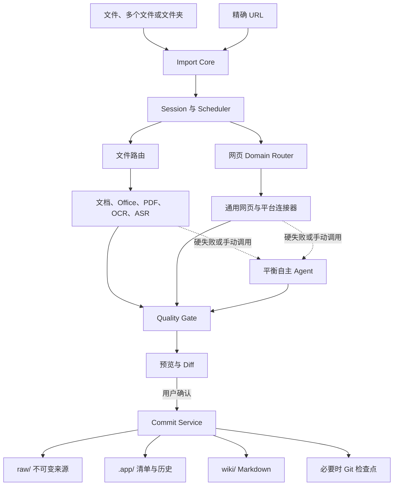

# Import 2.0 全链路重构设计

> 历史设计说明：本文保留 Import V2 的研究、引擎与实现背景。2026-07-24 之后，导入 / 编译边界、`raw/` 与 `wiki/sources/`、媒体、OCR / ASR、登录、能力安装、Source UI 和 AI 整理等产品决策，以 [`2026-07-24-import-source-media-flow-design.md`](2026-07-24-import-source-media-flow-design.md) 为唯一可信源；本文中的冲突描述不再有效。

> 日期：2026-07-11
>
> 状态：Historical / partially superseded
>
> 范围：后端架构、导入协议、文件与网页管线、能力包、Agent、数据安全、迁移与验收
>
> 暂不包含：前端视觉稿与页面组件实现

## 1. 背景与目标

现有导入能力需要从前端入口到后端执行链统一重构。Import 2.0 的目标是让用户可以把文件、多个文件、整个文件夹或一个精确 URL 交给应用，获得可预览、可确认、可追溯的高质量 Markdown，而不需要理解解析器、OCR、浏览器或 Agent 的技术差异。

系统必须保持本地优先：项目内容仍由 `raw/`、`wiki/`、`.app/`、`exports/` 与 `skills/` 中的 Markdown、JSON 和本地文件构成，不引入数据库。原始来源默认不可变，任何来源替换、删除或用户 Wiki 覆盖都必须经过明确确认，并在高风险写入前创建 Git 检查点。

### 1.1 成功标准

- 文件支持单个、多选和文件夹递归导入；同一草稿可多次追加文件。
- 第一阶段支持 Markdown、DOC、DOCX、XLS、XLSX、PPT、PPTX、PDF，并允许后续通过引擎包扩展格式。
- URL 只处理用户粘贴的精确页面；第一阶段包括通用网页、微信公众号、知乎和 Bilibili，第二阶段增加小红书与 X。
- 确定性工具优先；解析彻底失败时可由本地 Agent 自动辅助，也可由用户手动调用。
- 所有结果先预览、再确认；批量任务允许部分成功，单项失败不影响其他项目提交。
- 导入过程可取消、可恢复、有进度、有脱敏日志，不留下孤儿进程或泄露登录凭据。
- 每一篇 Markdown 都能追溯到来源、版本、解析路线、引擎版本和质量报告。

### 1.2 非目标

- 不做整站递归爬取、站点镜像、失败后的镜像搜索或评论区抓取。
- 不绕过登录、验证码、付费墙或平台风控。
- 不默认生成 AI 摘要，不把视频原文件永久存入项目。
- 不把 Agent 作为唯一导入路径，也不允许 Agent 静默修改正式项目内容。
- 本规范不决定 Import 页面最终视觉布局；UI 将依据 `UI-Frontend-design/` 和 `import-v2-reference.html` 另行设计。

## 2. 已确认的关键决策

| 主题 | 决策 |
| --- | --- |
| 导入交互 | 所有内容先进入可累积的导入草稿，预览后确认提交 |
| 核心架构 | Rust 编排核心 + 版本化引擎/连接器能力包 + 结构化协议 |
| 项目存储 | Markdown、JSON 和本地文件；不使用数据库 |
| 原始来源 | 所有已确认版本永久保留，只有显式清理才能删除 |
| 重复与更新 | 内容哈希去重；同一来源变化时新增不可变版本并显示 Diff |
| 文件解析 | 专用解析器优先，MarkItDown 作通用回退与质量基准 |
| 老式 Office | LibreOffice 无界面转 DOCX/XLSX/PPTX，再进入现代解析链；Office Oxide 直接解析兜底 |
| PDF/OCR | 文本层优先，低质量页再 OCR；Docling 负责布局，Tesseract/PaddleOCR 分级提供 |
| 视频 | 保存封面、元数据、字幕/转录和来源 URL；下载的音视频为临时数据 |
| 网页范围 | 精确 URL，域名优先路由，不递归、不搜索镜像 |
| 社交内容 | 主体内容，不抓评论；登录由用户主动完成 |
| Agent | 默认采用平衡自主模式，可调用当前任务工具与同站资源，但结果必须预览确认 |
| 内网 URL | 默认拦截 localhost/私网目标，显示最终目标后可单次授权 |
| 资源调度 | 默认平衡模式，按 CPU、内存、电池状态动态限流 |
| 旧系统切换 | Import 2.0 完成全量验收后一次性替换旧导入器，不长期双轨运行 |
| 开源边界 | 核心保持宽松许可证；GPL/AGPL/非商业/限制商业分发组件不进入产品 |

## 3. 总体架构



### 3.1 模块职责

- **Import Session Service**：创建草稿、累计导入项、持久化逐项状态、恢复会话。
- **Scanner and Inspector**：递归扫描、格式识别、风险检测、路径去重和初步资源估算。
- **Routing Service**：为文件或 URL 选择确定性解析路线，并记录每次尝试。
- **Pack Manager**：发现、下载、校验、启动、升级和回滚能力包。
- **Task Scheduler**：控制并发、资源、暂停、取消、超时和进程树终止。
- **Quality Gate**：验证 Markdown 结构、正文覆盖、资源引用和安全性，生成警告与 Diff。
- **Agent Adapter**：向本地 Agent 或 BYOK 提供受控任务上下文，接收候选结果。
- **Source Registry**：维护来源、内容哈希、版本、路径/URL 别名和 Wiki 关联。
- **Commit Service**：只在确认后执行逐项原子写入，并负责必要的 Git 检查点。
- **History Service**：保存可读历史、详细尝试账本和脱敏诊断信息。

React 前端只消费 DTO 和事件，不直接访问文件系统、Git、Agent、能力包进程或秘密存储。

## 4. 导入会话、状态与数据流

### 4.1 会话语义

一次打开的导入草稿对应一个 `ImportSession`。用户可以多次拖入文件或文件夹，也可以逐次加入 URL；新内容追加到同一草稿而不是立即写入项目。只有用户选中的项目会提交。

每个 `ImportItem` 独立运行并采用以下状态：

```text
queued → inspecting → waiting_capability / waiting_login / extracting
       → validating → preview_ready → committing → completed
```

辅助状态包括 `paused`、`cancelled`、`skipped` 和 `failed`。`waiting_login`、验证码、云端 BYOK、付费调用与正式提交不能自动越过。

### 4.2 逐项提交

- 预览阶段只写 staging 和会话元数据。
- 确认时，Commit Service 重新验证会话与项目 ID，不接受前端提供的任意目标路径。
- 每个项目独立原子提交；一个批次可以同时包含完成、失败、跳过和取消项目。
- 不为失败项创建占位 Markdown。只有达到最低质量并经确认的候选才进入 `wiki/`。
- 取消时先请求进程正常终止，随后终止整个子进程树；已提交项目不回滚。
- 应用重启后恢复未完成会话，但登录、验证码、Agent、BYOK 和付费步骤保持等待状态。

### 4.3 关键 DTO

- `ImportSession`：会话 ID、项目路径标识、创建/更新时间、默认资源模式、项目列表、总体状态。
- `ImportItem`：项目 ID、输入类型、显示名、状态、进度、选中状态、路由、错误、质量报告、预览路径。
- `AttemptRecord`：阶段、引擎/连接器、版本、开始/结束时间、退出状态、警告、是否可重试。
- `QualityReport`：质量等级、正文覆盖、结构检查、资源检查、安全检查、警告码、推荐动作。
- `CommitRequest`：会话 ID、选中项目 ID、逐项冲突处理选择；不包含自由文件路径。
- `SourceManifest`：来源 ID、版本列表、来源定位符、内容哈希、解析路线、当前 Wiki 路径、历史关联。

所有 ID 由后端生成并视为不透明稳定标识；前后端共享版本化 schema，不使用临时字符串协议。

## 5. 项目文件布局

```text
.app/
  import-sessions/<session-id>/
    session.json
    items/<item-id>.json
    staging/<item-id>/...
  import-history/<batch-id>.json
  sources/<source-id>.json
  source-index.json
  source-artifacts/<source-id>/<version-id>/baseline.md
  cache/import/...

raw/
  sources/<source-id>/<version-id>/original.<ext-or-snapshot>
  assets/<source-id>/<version-id>/...

wiki/sources/
  files/<relative-folder>/<stable-name>.md
  web/<domain>/<stable-name>.md
  video/<platform>/<stable-name>.md
```

`SourceManifest` 是来源关系的权威索引；`raw/` 保存不可变原始版本与有意义的资源；`.app/source-artifacts/` 保存确定性解析基线；`wiki/` 保存用户可编辑的当前文档。转换后的现代 Office 文件、缩略图和 OCR 缓存属于可再生成数据，可由存储管理清理。

文件夹导入默认保留相对目录结构。路径冲突由后端生成稳定名称并在预览中显示，不静默覆盖现有文件。外部手工编辑过的 Wiki 必须保留。

## 6. 重复导入、更新与三方合并

- 相同内容哈希已存在时，项目标记为“已导入”并默认取消选中；用户仍可明确选择创建独立副本。
- 相同文件路径或规范化 URL 返回不同内容时，沿用 `sourceId` 并新增不可变 `versionId`。
- 相同内容来自不同路径或 URL 时，共用内容对象但增加来源别名，保留完整溯源。
- URL 规范化移除锚点和明确的常见追踪参数；平台签名参数由连接器单独处理，不能进入 Wiki、清单或日志。
- 当前 Wiki 未偏离上次基线时，可在确认后一键更新。
- 当前 Wiki 已被编辑时，基于“旧解析基线 / 当前 Wiki / 新解析基线”生成三方合并候选。用户可选择合并、创建新文档或只保存新来源。
- 任何覆盖、来源替换、删除或批量重写前必须展示影响路径并创建 Git 检查点。

## 7. 能力包架构

### 7.1 包类型

- `document-standard`：现代 Office、Markdown 和通用文档解析。
- `office-legacy`：LibreOffice 无界面转换链。
- `document-layout`：Docling、复杂 PDF 与版面分析。
- `ocr-basic`：Tesseract 与基础语言模型。
- `ocr-cjk-accurate`：PaddleOCR 中文高质量模型、表格/公式/布局模型。
- `browser-runtime`：隔离浏览器与平台连接器运行时。
- `media-runtime`：严格 LGPL 构建的 FFmpeg 与媒体预处理。
- `asr-model-*`：whisper.cpp 多语种模型，按需下载。
- 第一方平台连接器：微信、知乎、Bilibili；第二阶段为小红书和 X。

### 7.2 安装与分发

- 基础应用保持轻量，能力包和模型按需下载。
- 下载前显示来源、版本、体积、许可证、磁盘需求和功能用途。
- 包清单必须签名；文件使用 SHA-256 校验；安装后执行健康检查。
- 不允许运行 `pip install`、`npm install` 或任意安装脚本。
- 更新采用并排版本，健康检查失败自动回滚；旧版在无任务占用后再清理。
- 能力包不能直接写 `raw/`、`wiki/`、Git 或秘密存储，只能读当前任务授权输入并写 staging。

### 7.3 进程协议

能力包使用 JSON-RPC 2.0 over stdio，不开放本地端口。每个请求携带协议版本、请求 ID、会话 ID、项目 ID、任务 ID、输入描述、staging 根目录和超时。进度、日志、警告、产物清单和取消确认均使用结构化消息。

后端验证能力声明、协议版本、所有输出路径、文件数量、总大小和哈希。取消或超时后终止整个进程树；单包崩溃不能带崩应用或其他任务。

## 8. 文件导入管线

### 8.1 扫描与识别

- 文件夹递归扫描并增量回报结果；多个拖入动作追加到同一会话。
- 默认跳过符号链接、隐藏/系统文件、项目内部目录和不支持文件；预览中显示跳过原因。
- 使用扩展名、文件签名和 MIME 共同判断格式，扩展名不可信。
- 对文件数、目录深度、单文件大小、展开体积和预计临时空间设置可配置上限。
- CJK 文件名、Unicode、长路径、大小写差异及 Windows/macOS/Linux 路径行为属于强制测试范围。

### 8.2 解析路由

- Markdown、文本、CSV 和本地 HTML 优先由轻量确定性实现处理。
- DOCX/XLSX/PPTX 使用通过 Golden Corpus 的现代 Office 解析器；Office Oxide 必须先通过独立质量基准，不能因其 API 可用就直接成为唯一主引擎。
- MarkItDown 作为成熟的宽格式通用回退和质量对照，不承担高保真主解析职责。
- PDF 由 Docling 负责布局、阅读顺序和表格；已有文本层优先，只有缺失或低质量页面进入 OCR。
- 项目现有 Rust 提取器保留为最低成本回退；全部确定性路线失败后才能进入 Agent。

### 8.3 老式 Office 转换链

```text
DOC/XLS/PPT 原件
→ 隔离 LibreOffice --headless 转换
→ DOCX/XLSX/PPTX
→ 现代 Office 解析器
→ Markdown
```

- LibreOffice 使用独立用户配置目录，禁用宏、插件、外部链接更新和网络访问。
- 原件永久保留；转换结果是 `.app/` 下的可再生成缓存，不能冒充来源原件。
- 转换后验证文件签名、可重新打开性、页/表/幻灯片数量、正文覆盖和图片数量。
- 老式宏、ActiveX、OLE、特殊字体、动画和复杂图表无法安全还原时，保留安全附件或预览并产生警告，不执行代码。
- 转换失败或质量异常时尝试 Office Oxide 直接解析，再失败才进入 Agent。

### 8.4 格式质量合同

- **文档**：保留标题层级、段落顺序、列表、脚注、链接、表格和有意义图片。
- **PDF**：去除重复页眉页脚，恢复多栏阅读顺序，标记 OCR 页面和低置信度区域。
- **Excel**：小工作簿输出单页；中等工作簿输出总览与工作表页；超大工作簿分块并保留完整 CSV。公式和值同时保留，隐藏表和截断范围明确标记。
- **PowerPoint**：按幻灯片组织标题、正文、备注、表格、图表和图片；不把纯装饰元素全部输出。
- **Markdown**：规范化为 GFM，但保留正文含义、资源链接和用户原始文件。
- 所有产物使用统一 frontmatter 和来源信息；无法可靠恢复的内容必须产生质量警告，不能静默删除。

### 8.5 OCR、字幕和 ASR

- OCR 顺序为文本层检测、页面预处理、局部/整页 OCR、布局合并和置信度检查。
- `ocr-basic` 提供 Tesseract 英文、简体中文和可选繁体中文；`ocr-cjk-accurate` 提供 PaddleOCR 高质量中文与结构模型。
- 字幕优先级为人工字幕、平台自动字幕、媒体内嵌字幕、whisper.cpp 本地 ASR。
- ASR 默认推荐多语种 small 模型，base/small/medium 按需下载；第一阶段不做说话人分离。
- 只保留 VTT/SRT、带时间戳 Markdown 和质量信息；视频/音频下载与切片任务结束后清理。

## 9. URL 抓取与平台连接器

### 9.1 路由原则

路由采用域名优先，不先用通用抓取器碰运气：

1. 规范化并安全校验精确 URL。
2. 根据域名选择第一方连接器；未知域名进入通用 HTTP 路线。
3. 通用路线依次为 HTTP 获取、Readability.js 提取、隔离浏览器回退。
4. 每条路线记录尝试账本；同一路径最多自动重试两次，随后切换路线或要求用户操作。
5. 同域名限流，微信等敏感平台默认单并发。

系统不进行递归爬取、不自动搜索镜像、不抓评论。代理只来自系统、应用或连接器配置，不硬编码代理地址。

### 9.2 微信工作流

- 使用完整、合法的浏览器请求头配置进行 HTTP 抓取。
- 不以 HTTP 200 直接判断成功，必须识别验证页、挑战页、空正文和伪成功响应。
- 成功后使用微信专用正文解析；失败可按配置通过代理重试一次，再进入隔离浏览器。
- 需要登录或验证码时暂停，由用户在专用浏览器完成。
- 不生成失败占位 Markdown，不搜索第三方镜像。

知乎和 Bilibili 遵循同样的“域名专用连接器 → 合法登录 → 结构化提取 → 浏览器回退”模式。小红书与 X 放在第二阶段；小红书 `xsec_token` 等签名信息只存在于安全会话中，不进入项目或日志。

### 9.3 网页与视频产物

- 文章保存标题、作者、发布日期、正文、原始 URL、有意义图片和抓取时间。
- 在页面许可和连接器策略允许时保存 HTML/结构化快照；请求头、Cookie 和令牌永不保存。
- 登录态页面快照视为本地敏感来源，默认不进入导出包。
- Bilibili 等视频保存封面、标题、作者、发布日期、简介、章节、字幕/转录和来源 URL；原始音视频只作临时处理。

## 10. Agent 辅助

### 10.1 默认：平衡自主模式

Agent 可读取当前导入项的原文件、转换产物、网页快照和解析日志；可自主调用当前任务获准的转换、浏览器、OCR、ASR 和 Markdown 检查工具，并可访问原始 URL、同站资源与页面正常运行所需接口。Agent 可以多轮尝试、选择解析路线、恢复正文结构、重建表格、关联图片和整理 OCR/字幕。

以下边界保持不变：

- Agent 不能获得 Cookie、API Key、文档密码或平台签名参数；认证抓取由连接器代理执行。
- 不允许执行宏、绕过验证码、绕过付费墙或静默修改 `raw/`、`wiki/`。
- Agent 只写 staging；结果进入 Quality Gate、预览和 Diff，确认后由后端提交。
- 不强制逐段证据映射，但必须给出总体处理说明、使用工具、失败/不确定项和质量警告。
- 项目设置可启用“硬失败后自动调用本地 Agent”；低质量但成功的结果默认只显示手动优化入口。
- 云端 BYOK 永不自动调用；每次显示发送范围、提供商、模型和预计消耗并要求确认。

### 10.2 可选 AI 优化

用户主动选择后，Agent 可以总结、改写、补标题、清理口语和生成视频章节。确定性忠实解析版必须保留；AI 优化版明确标记并通过 Diff 选择，不能覆盖唯一基线。

## 11. 错误、恢复与可观测性

错误类型至少区分：能力缺失、格式不支持、文件损坏、密码需要、认证失效、验证码/风控、响应异常、转换失败、解析失败、质量不足、资源不足、策略拒绝、提交冲突和提交失败。每个错误提供稳定错误码、发生阶段、是否可重试、用户建议和脱敏诊断引用。

- 只有确定安全且幂等的步骤自动重试；同一路径最多两次。
- 登录、验证码、云端 Agent、付费调用和破坏性提交不自动重试。
- 失败项目提供重试、切换解析器、启用 OCR、调用 Agent、跳过和查看日志等动作。
- 普通历史保持简洁；详细尝试、耗时和警告保存到 `.app/import-history/`。
- 日志统一脱敏 Cookie、Authorization、签名参数、密码和本地用户名路径。
- 缓存键至少包含输入哈希、引擎版本、配置版本和模型版本，避免错误复用旧结果。

## 12. 安全与隐私

- 文档、HTML 和媒体均视为不可信输入；不执行宏、脚本、事件属性、PDF 动作或外部对象。
- 解析进程只能访问当前任务授权输入和 staging，并受内存、时间、文件数、展开体积和输出大小限制。
- 加密文档密码只存在于当前进程内存，不写项目、凭据库或日志。
- 隔离浏览器不读取用户日常浏览器 Cookie；平台会话由专用连接器管理并使用操作系统安全存储加密。
- HTML 转 Markdown 前移除脚本、危险链接、跟踪像素和无意义装饰；有意义图片下载到本地，避免阅读时远程跟踪。
- 导入内容中的 Prompt Injection 永远视为资料文本，不能改变系统或 Agent 权限。
- 每次 URL 重定向重新验证协议、主机与地址。`localhost` 和私网地址默认阻止；用户看到最终目标后可单次授权，后续跳转到不同私网目标需再次授权。
- 默认拒绝 `file://`、可执行下载和异常大响应；TLS 错误不能静默忽略。

## 13. 性能与资源调度

默认采用平衡模式：根据 CPU、可用内存、电池状态和前后台状态动态调整。用户可切换高性能或节能模式。

- 文件夹扫描、哈希和轻量解析有限并行并流式回报。
- OCR、ASR、浏览器、LibreOffice 和 Agent 使用独立资源队列；重型模型任务默认低并发。
- 同一项目同时只有一个正式提交任务，但扫描和预览可以并行。
- 同域名默认最多两个请求，敏感连接器默认一个。
- 大型 Excel、PDF 和媒体使用分块、流式和背压，不一次载入全部内容。
- 下载能力包或开始转换前评估磁盘空间；不足时在产生大规模临时文件前阻止任务。
- 能力包与模型下载支持断点续传、暂停、取消、哈希校验和恢复。

性能验收使用公开记录配置的参考设备：包含 10,000 个本地目录项的扫描应在 1 秒内产生首批可见项目；取消请求应在 1 秒内进入取消中状态，所有相关子进程应在 5 秒内退出。大型任务不能使用无界队列；调度器必须保留至少 20% 可用内存或 1 GiB（取较大者），不足时暂停启动新的重型任务。相同基准样本相对已发布版本出现超过 20% 的持续性能回退时阻止发布，除非回退来自已记录且获批准的质量改进。

## 14. 开源许可证与依赖策略

核心应用及第一方协议实现保持宽松开源许可。允许 MIT、Apache-2.0、BSD、MPL 等可合规分发组件；弱 copyleft 组件只作为隔离、可替换的能力包并完成对应义务。GPL、AGPL、非商业、Elastic License 2.0 等限制商业或衍生分发的组件不能进入核心产品。

- FFmpeg 仅使用严格 LGPL 构建，禁用 `--enable-gpl` 和 `--enable-nonfree`，作为独立媒体进程分发；固定源码、构建参数、组件清单和许可证材料。
- LibreOffice 作为独立 `office-legacy` 包运行；固定发行版本并审计该版本所有第三方许可证。
- 不参考 GPL 工具后复制其表达性实现。需要替代时基于公开协议、格式标准和独立测试做 clean-room 实现。
- 每个能力包升级都重新生成 SBOM、许可证清单和构建证明；许可证变化会阻止自动发布。

## 15. 旧数据迁移与一次性切换

Import 2.0 不长期保留旧导入运行路径。切换前必须完成所有验收，随后一次性替换旧实现。

- 首次启用只扫描并生成迁移报告，不移动或改写旧 `raw/` 与 `wiki/`。
- 能可靠关联的旧来源补建 `SourceManifest` 并保留原路径；无法判断的标记为“旧版未托管”。
- 旧历史保持只读，新任务写入新会话和历史结构。
- 迁移报告显示新增、关联、冲突和无法识别数量；确认后才写 `.app/` 元数据。
- 迁移必须幂等且逐项原子化，中断后可重新运行。
- 冲突只生成建议，不覆盖文件。
- 代码回退依赖 Git 与已发布旧版本；新元数据设计为旧版本可忽略，不要求旧版本理解。

## 16. 测试与硬性发布门槛

### 16.1 固定样本库

覆盖所有声明格式，包括中英文、Unicode 名称、长路径、表格、图片、公式、脚注、批注、隐藏工作表、演讲者备注、扫描与混合 PDF、加密、损坏、恶意和超大样本。

### 16.2 质量测试

Golden Corpus 同时使用结构断言与人工可读性抽查：标题层级、段落顺序、表格单元格、图片、来源链接、页/表/幻灯片数量和正文覆盖率。每个样本在执行前固定关键元素和最低阈值；发布要求全部关键断言通过。文本型文档的规范化正文覆盖率不低于 98%，干净的 300 DPI 中英文扫描样本字符准确率不低于 95%，表格非空单元格准确率不低于 95%，页数、工作表数、幻灯片数、安全与溯源断言必须 100% 正确。复杂噪声样本可采用预先记录的专属阈值，但低于通用阈值时必须产生用户可见警告，不能静默成功。

### 16.3 网页测试

通用网页使用冻结 HTML；微信、知乎、Bilibili 同时使用脱敏固定样本和人工在线冒烟测试。覆盖认证失效、验证码、挑战页、空正文、重定向、无字幕和平台结构变化。

### 16.4 安全、恢复与迁移测试

覆盖路径穿越、压缩炸弹、恶意 HTML、SSRF 重定向、宏、Prompt Injection、秘密脱敏、超时、孤儿进程、批量部分失败、取消、崩溃恢复、重复导入、三方合并、能力包下载中断、磁盘不足和迁移幂等性。

### 16.5 发布阻断条件

以下任一项出现即禁止一次性切换：原始资料被改写、秘密泄露、孤儿进程、关键样本静默丢失、迁移改变用户内容、支持格式关键用例失败、跨平台必需检查失败或统一 `npm run check` 未通过。

## 17. 实施分解

整体设计落地为五个可独立验收、按顺序集成的实施包：

1. **Import Core**：版本化 DTO、会话状态机、调度器、Pack Manager、Source Registry、Quality Gate、Commit Service 和模拟引擎。
2. **File Ingestion**：文件夹扫描、现代 Office、LibreOffice 转换、PDF、OCR、Excel 分块、图片和 ASR。
3. **Web Ingestion**：Domain Router、通用网页、微信、知乎、Bilibili、隔离浏览器和会话管理。
4. **Agent Assistance**：平衡自主模式、工具授权、自动硬失败兜底、可选 AI 优化、Diff 与审计。
5. **Migration and Cutover**：旧数据迁移、全量回归、三平台验证和旧导入器一次性替换。

每个实施包都必须先形成自己的详细实施计划和测试清单；上一个包通过本地检查与评审后才进入下一个。小红书与 X 在第一阶段切换完成后作为第二阶段连接器包。前端视觉与页面组件等设计定稿后另立 UI 规范，但后端 DTO、状态、进度、预览、确认和错误动作必须在 Import Core 中稳定提供。

## 18. 最终约束

Import 2.0 的核心原则是：**来源不可丢、处理可解释、结果先确认、失败可恢复、能力可替换、Agent 有用但不越权。** 当便利性与数据安全冲突时，允许 Agent 在 staging 中更自主地解决问题，但正式项目内容、秘密信息和高风险写入仍由后端策略与用户确认控制。

## 19. 设计输入与官方参考

- 用户沉淀的 Hermes 路由工作流：`wiki-ingest-routing.md`，用于域名优先路由、微信挑战页识别、尝试账本和结构化输出设计。
- Import 页面视觉参考：`UI-Frontend-design/import-v2-reference.html`；本规范只引用其产品语义，不确定最终 UI。
- [MarkItDown 官方仓库](https://github.com/microsoft/markitdown)
- [Docling 官方仓库](https://github.com/docling-project/docling)
- [LibreOffice 许可证](https://www.libreoffice.org/licenses/)
- [LibreOffice 无界面启动参数](https://help.libreoffice.org/latest/ug/text/shared/guide/start_parameters.html)
- [LibreOffice 命令行转换过滤器](https://help.libreoffice.org/latest/sq/text/shared/guide/convertfilters.html)
- [FFmpeg 法律与许可证说明](https://ffmpeg.org/legal.html)
- [Tesseract 官方仓库](https://github.com/tesseract-ocr/tesseract)
- [PaddleOCR 官方仓库](https://github.com/PaddlePaddle/PaddleOCR)
- [whisper.cpp 官方仓库](https://github.com/ggml-org/whisper.cpp)
