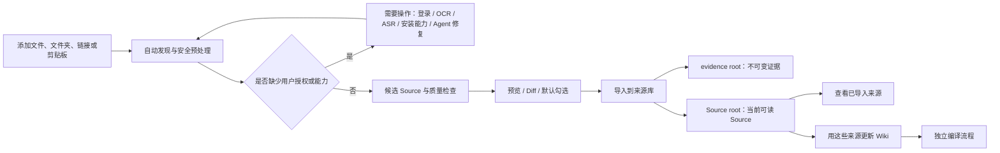

# Import、来源库与媒体处理全流程设计

> 状态：已确认，作为实现依据
> 确认日期：2026-07-24
> 适用范围：Import V2、逻辑 evidence / Source / app-state roots（新建原生知识库分别映射为 `raw/`、`wiki/sources/`、`.app/`）、本地文件与媒体、网页与平台内容、OCR、ASR、登录态、能力包、Source 阅读与 AI 整理
> 决策权威：当本文件与旧版 PRD、SPEC、APP flow、技术说明、Import V2 设计或实现计划冲突时，以本文件为准；旧文档只保留不冲突的背景、非本范围设计和历史信息。
> 交叉边界：Import 只在已经打开的当前知识库内添加资料。知识库的新建、识别、打开、信任、兼容、修复与 `ProjectContext.layout` 合同由 [`2026-07-30-first-run-project-open-workbench-design.md`](2026-07-30-first-run-project-open-workbench-design.md) 负责；选择一个文件夹作为 Import 输入绝不表示打开或原地初始化该文件夹。Import 写入要求 trusted + writable，且 layout 必须提供 app state、evidence 与 Source write roots；缺少任一写根时返回 typed prerequisite，不自行创建原生目录。

## 1. 设计结论

导入与编译是两个独立流程。

- **导入**负责把用户选择的内容变成可追溯、可阅读、可编辑的 Source，并写入来源库。
- **编译**负责读取已经确认的 Sources，生成或更新其他 Wiki 页面。
- 导入确认后不得自动编译。
- 每个成功提交的导入项都必须同时产出不可变 evidence 与可阅读 Source；不能只写 evidence root，也不能只写内部 manifest。
- evidence root 保存不可变证据和历史，Source write root 保存用户当前阅读、编辑、引用的来源稿；新建原生知识库分别映射为 `raw/` 与 `wiki/sources/`。
- 重复内容不重复创建 Source；来源更新写入同一个逻辑来源的新版本。



## 2. 术语与用户文案

| 内部或历史术语 | 用户界面统一文案 | 含义 |
|---|---|---|
| evidence root（原生为 `raw/`） | 原始资料 | 不可变文件、页面证据、原始字幕、OCR/ASR 原始输出和版本证据 |
| Source write root（原生为 `wiki/sources/`） | 来源库 / 来源 | 可阅读、可编辑、可引用的当前 Source Markdown |
| 其他 `wiki/` 页面 | Wiki 页面 / 知识页面 | 由编译、编辑、问答或其他流程生成的派生内容 |
| commit import | 导入到来源库 | 将候选正式写入原始资料和来源库 |
| compile | 用这些来源更新 Wiki | 以已导入 Sources 为输入启动独立编译 |
| source rewrite | AI 整理 | 对当前 Source 生成高质量候选稿 |

正常界面不得向用户暴露 `staging`、`artifact`、`manifest`、`baseline` 等工程术语。它们只出现在折叠的技术详情和诊断日志中。

## 3. 产品边界与不变量

### 3.1 必须成立

1. 所有成功导入项都生成 Source。
2. 所有来源类型遵循相同的“发现 → 处理 → 预览 → 确认 → 来源库”闭环。
3. 导入不自动触发 Wiki 编译。
4. evidence root 默认不可变；Source 是可读的当前版本。
5. Source 可被用户编辑，后续刷新、OCR、ASR 和 AI 整理必须保护人工修改。
6. 长任务可取消、可在后台运行、可恢复、可查看进度和日志。
7. 登录、能力安装、OCR、ASR 和 Agent 修复均由用户主动触发。
8. React 不直接管理文件系统、Git、Agent 进程、能力包或登录秘密；全部经 Tauri IPC 进入后端服务。
9. BYOK 不参与网页、平台、文件或媒体解析恢复；BYOK 只在 Source 已经存在后参与 AI 整理和 Wiki 编译。
10. 失败项不创建占位 Source。
11. 发现、确定性提取和预览可以在 restricted/read-only 项目中使用应用临时空间只读运行；正式提交 Source 要求项目已信任、文件系统可写，且 `ProjectLayout` 提供 `appStateRoot` 及其 `importStateRoot` / `sourceStateRoot`、`evidenceRoot` 与 `sourceWriteRoot`。
12. Source AI 整理在把内容交给 Agent / Provider 前要求项目已信任；把候选稿应用到 Source 还要求 writable、Source/version/hash 重验，以及适用的 Git checkpoint / confirmation 策略。

### 3.2 本轮明确不设计

- 加密 PDF 的密码输入流程；检测后提示当前不支持。
- 网页附件发现、批量加入附件或附件递归导入。
- 平台级并发、限流、风控倒计时等专门交互。
- 直播、持续流、边播边转录等专门流程。
- 图片视觉理解、图片描述、图表解读等多模态功能。
- 面向用户的历史数据迁移、修复或项目回收站。
- 浏览器扩展、RSS、GitHub 仓库等新入口。

这些情况可显示普通不支持或可重试错误，但不得擅自扩展为未确认的产品能力。

## 4. 数据模型与目录职责

### 4.1 一个逻辑来源

一个逻辑来源由稳定 `sourceId` 标识，并拥有：

- 一个或多个不可变 `SourceVersion`。
- 一个当前可阅读版本。
- 一个或多个来源定位别名，例如规范 URL、短链接、原文件路径摘要。
- 原始资料、资源、字幕、转录、OCR、解析证据和质量信息。
- 用户编辑基线与可恢复版本。
- 是否已经参与某次 Wiki 编译的记录。

完全相同的内容不得创建第二个 Source。新的 URL、短链接或文件路径只作为别名写入现有来源记录。

### 4.2 目录职责

Import 只能使用打开评估返回的 `ProjectContext.layout`。下列目录树是**新建原生知识库的默认映射**，不是所有兼容知识库的结构要求。兼容适配器保留既有 Markdown 布局；只有明确提供 `appStateRoot`、`importStateRoot`、`sourceStateRoot`、`evidenceRoot` 与 `sourceWriteRoot` 时才能提交导入，所有路径仍需做 canonical containment 与 capability 校验。

```text
raw/
  sources/         原始本地文件、永久保留的本地音视频
  web/             页面证据、平台证据、原始字幕和远程来源快照
  assets/          图文原图、Source 所需资源

wiki/
  sources/
    local/         本地文件、剪贴板、本地图片/音频/视频
    web/
      <host>/      网页和平台来源，按稳定来源域组织
    ...
  ...              其他 Wiki 页面

.app/
  import/          会话、任务、尝试、能力需求、质量报告
  sources/         sourceId、versionId、hash、别名、基线、时间线
  compile/         编译 change set 和已消费版本
```

物理路径按稳定来源渠道组织，而不是按“视频、图片、文章”媒体类型强行分目录。媒体类型、平台和内容属性写入 Source 元数据，供 UI 分组和筛选。

### 4.3 Source Markdown 合同

Source 是忠实、规范化、可阅读的来源表达，不默认做摘要或观点重写。

建议 frontmatter：

```yaml
---
type: source
sourceId: src_...
versionId: ver_...
sourceKind: local_document
title: ...
platform: ...
canonicalUrl: ...
author: ...
publishedAt: ...
importedAt: ...
contentHash: ...
quality: ...
---
```

正文按来源保留确定性结构：

- 文档保留标题、段落、列表、表格、脚注和资源关系。
- 网页保留正文、必要图片和来源链接。
- 图文保留原配文、图片顺序和每图 OCR 文本。
- 音视频保留章节、可读转录和时间锚点。
- OCR、ASR 或自动字幕产生的不确定内容必须可追溯。
- 内部引擎 ID、staging 路径、hash 和调试信息不进入正文。

### 4.4 来源包

默认一个逻辑来源对应一个主 Markdown。确需拆分时使用“一个逻辑来源、多个可阅读文件”的来源包：

- Excel 工作簿使用 `index.md` 和 Sheet 子页。
- 超大 CSV 可使用 `index.md` 和连续行分片。
- 整个来源包共享一个 `sourceId`，一起更新、Diff、删除和版本化。

## 5. 导入会话与状态

### 5.1 会话模型

- 每个项目同一时间只有一个活动导入会话。
- 会话可持续加入新项目，并支持部分提交。
- 已提交项移入完成摘要和历史；未解决项继续留在活动会话。
- 没有未提交项时，会话结束；下一次添加内容创建新会话。
- 页面切换、项目内导航和应用重启不得丢失会话。

### 5.2 前端状态

后端可保留细粒度状态，前端统一映射为七类：

1. **正在发现**
2. **正在处理**
3. **需要操作**
4. **可确认**
5. **正在导入**
6. **已导入**
7. **失败 / 已取消**

只有真实、可测量且有上限的工作显示百分比；其他工作显示阶段和活动描述。

### 5.3 应用重启后的恢复

- 页面切换、窗口最小化：任务继续在后台运行。
- 正常退出或进程中断：保存阶段、完成分片和可复用中间结果。
- 再次打开项目：耗时下载、OCR、ASR 显示“已暂停，可继续”，不自动恢复。
- 用户点击“继续全部”后恢复，已完成分片不重做。
- 轻量状态校验可自动运行。
- 主动取消任务会清理临时媒体和中间分片；之后重试从头开始。

## 6. Import 页面构成

### 6.1 顶层结构

保留三个页签：

- 工作台
- 历史
- 能力管理

切换页签不得丢失当前会话、任务、筛选或滚动位置。历史和能力管理不重复展示来源输入与提交操作。

工作台自上而下为：

1. 紧凑来源输入区。
2. 能力矩阵。
3. 批次状态与聚合待办。
4. 连续队列列表。
5. 固定确认栏。
6. 既有右侧上下文面板。

### 6.2 来源输入

第一等入口：

- 选择文件
- 选择文件夹
- 粘贴链接
- 粘贴文本 / Markdown

这些入口都把内容加入当前知识库。“选择文件夹”只是批量资料输入，不提供“打开为项目”分支，不创建 `.app/` / Git，不移动或改造所选目录。

剪贴板预览识别结果后再创建任务，不监听全局 `Ctrl+V` 静默导入。URL 剪贴板路由到 URL；文本或 Markdown 生成本地文本 Source。图片剪贴板不在首版范围。

### 6.3 能力矩阵

矩阵继续保留，用于直观展示支持的文件、平台和能力。

每个 tile 只显示：

- 图标
- 名称
- 状态点

不直接显示状态文字。悬停或键盘聚焦显示状态摘要；点击或 Enter 固定操作 popover；Escape 或点击外部关闭。必须提供可访问名称，不能只靠颜色传达状态。

- 文件 tile：解析路线、可用状态、能力安装。
- 平台 tile：登录会话和有效状态。
- 能力 tile：安装、更新、详情。
- 完整管理进入“能力管理”页签。

#### 6.3.1 能力管理页的下载与安装

“能力管理”不是当前 Import 队列的状态摘要，而是应用级的官方能力目录。它读取应用安装事实，不依赖当前会话里是否恰好有 `waiting_capability` 条目；切换项目、页签或最小化窗口不得取消正在进行的下载与安装。

首版只展示产品清单中声明、由官方签名 catalog 发布的能力包，不提供任意 URL、本地压缩包、第三方市场或卸载入口。用户动作统一写作“下载并安装”，因为下载完成的压缩包不能绕过验签与健康检查单独保留为可用能力。

这些官方能力包属于应用发布链维护的受信任应用组件。首版以固定 catalog / trusted key、hash / signature / manifest / target / route-set 校验、事务安装、健康检查、取消与旧版本回滚保证功能正确性；不以 Windows / macOS / Linux 的 OS 级 runner 沙箱作为安装、Batch 6 或发布前置，也不得在产品文案中宣称 runner 已被沙箱化。任意 URL、本地包、第三方 catalog、用户 PATH runtime 或自定义签名源不继承此信任决策。

页面沿用紧凑工具界面，不使用能力卡片墙。结构为：

1. 顶部摘要：已安装、可安装、可更新、进行中、需要处理、当前平台未发布。
2. 筛选：全部 / 文档 / 网页 / OCR / 媒体与 ASR；另有状态筛选与名称搜索。
3. 连续列表或表格：能力名称与用途、覆盖格式 / 路线、状态与版本、下载与安装大小、许可证、主操作、详情。
4. 进行中的任务同时进入应用任务抽屉；离开本页后仍可观察、取消或在中断后继续。

示意信息密度如下：

```text
能力名称              适用范围                 状态 / 版本           大小        操作
文档兼容解析          DOC / XLS / PPT          可安装 1.0.0          286 MB      下载并安装
中文图片文字识别      PNG / JPG / TIFF …       下载中 42%            640 MB      取消
本地语音转写          音频 / 视频              已安装 1.0.0          1.2 GB      查看详情
高精度语音转写        音频 / 视频              当前平台未发布        —           查看原因
```

每行数据由后端返回四组正交事实，前端不得根据按钮或当前 Import item 猜测：

- `distribution`：`published` / `source_catalog_empty` / `not_published_for_target` / `unsupported`。
- `installation`：`absent` / `healthy` / `unhealthy`，并给出当前健康版本。
- `operation`：空，或 `queued` / `downloading` / `paused` / `verifying` / `installing` / `health_checking` / `activating` / `recovering` / `failed` / `cancelled` / `succeeded`。
- `update`：`none` / `available` / `in_progress` / `rollback_restored`。

后端再提供一个用于列表排序和主文案的派生 display state。这样“旧版本健康可用”和“新版本正在下载 / 更新失败已回退”可以同时成立。可见状态包括：

- `installed_healthy`：当前版本已安装且全部声明路线健康。
- `install_available`：当前 target 有签名发布物，可以下载并安装。
- `update_available`：已安装健康版本仍可用，同时存在更新版本。
- `queued` / `downloading` / `verifying` / `installing` / `health_checking`：可观察任务阶段；只有有界字节或步骤才显示百分比。
- `paused`：应用中断后保留可续传事实，由用户点击“继续”。
- `failed_recoverable`：展示“重试”和折叠技术详情；旧健康版本继续可用。
- `rolled_back`：新版本健康检查失败，旧健康版本仍在使用。
- `not_published_for_target`：产品支持该能力，但当前平台没有签名发布物；不得显示无效安装按钮。
- `catalog_unavailable`：当前构建未嵌入可验证的发布 catalog；明确说明构建问题，不伪装成网络失败。
- `unsupported_by_app`：catalog 条目存在但不属于当前应用版本冻结的产品清单，不下载、不执行。

点击“下载并安装”先打开单一确认对话框，至少展示：

- 能力用途、将新增的格式 / 路线和是否会继续当前 Import 待办。
- 固定版本、当前平台、发布者 / 签名 key id、来源域名。
- 包体、模型、安装后预计占用和最低可用磁盘空间。
- SPDX 许可证摘要与第三方 notices 入口。
- 运行权限事实：是否启动子进程、是否需要运行时网络、文件系统仅允许应用能力目录与当前条目的 staging 输入；签名可信不等于运行时无限权限。
- 应用级安装位置说明；不写入项目目录，不修改 `raw/`、`wiki/`、`.app/` 或 Git。
- “下载后仍会校验 SHA-256、签名、清单和健康状态；失败不会激活”的安全说明。

主按钮为“下载并安装”。对话框确认只表达这一次、这个固定版本与许可证快照的授权；版本、许可证或包体 identity 变化后必须重新确认。React 只提交 `capabilityId + expectedVersion + acknowledgementVersion`，不得接收或拼装下载 URL、SHA-256、签名、解压路径或执行命令。

#### 6.3.2 应用级能力合同与 Import 续接

为了让上述页面可实现，后端必须提供应用级只读快照和安装意图，而不能复用只接受 `projectId + sessionId + itemId` 的条目安装接口：

```text
list_app_capabilities_v1()
  -> AppCapabilityView[]

install_app_capability_v1(
  capabilityId,
  expectedVersion,
  acknowledgementVersion
)
  -> BackendTask
```

`AppCapabilityView` 至少包含：稳定能力 id、i18n 文案 key、产品用途、声明路线、覆盖格式 / 平台、当前 target、上述 distribution / installation / operation / update 事实、派生 display state、包体 / 模型 / 安装大小、许可证、发布与可安装事实、运行权限摘要、活动 task id、等待该能力的当前项目条目数，以及可复制的稳定错误码。列表中的下载状态以应用级 task 为准，不跟随某个 Import item 的生命周期销毁。

后端同时维护冻结的 `ProductCapabilityDefinition` 清单。每个能力包必须声明它提供的全部 routes、格式 / 平台、协议版本、许可证策略、是否为发布承诺的一部分。catalog 只能为这份产品清单提供固定版本与签名资产，不能反过来扩大应用可执行能力。

构建必须区分 source / development 与 distributable release。source fallback 允许空 catalog，但 UI 必须显示 `catalog_unavailable`，版本信息也必须标为不可分发开发构建；任何标记为可分发的 release build 若没有注入并验证当前版本要求的完整 catalog，构建阶段直接失败，不能静默生成“所有能力下载都不可用”的 release 二进制。

安装协调器以 `(capabilityId, targetVersion, targetTriple, archiveIdentity)` single-flight：多个入口和多个等待条目只能加入同一个下载 / 安装任务。下载使用固定发布 URL、Range 续传和安全重下；随后依次执行大小上限、SHA-256、签名、manifest、路径安全、事务安装和真实 runner 健康检查。任何一步失败都不得把新版本标记为可用，且保留或恢复旧健康版本。更新安装的 activation journal 只能在全部 runtime route 切换成功后提交；不能先删除回滚依据再尝试激活。

一个 pack 可以提供多条 route。健康检查与激活必须以产品清单中的整组 routes 为单位，而不是只检查触发安装的 `requestedRoute`；整组成功后一次性发布新 runtime snapshot，任一路线失败则整组不激活并回滚。这样从管理页主动安装时不需要虚构某个 Import route，也不会出现“包已安装但同包另一条路线仍不可用”。

保留条目级 `install_import_capability_v2` 作为 Import-linked facade：它先校验当前项目、root、session、item、requirement revision 与用户确认，再向应用级协调器登记 continuation。全局任务成功后，对当前活动项目里所有匹配的等待条目做 fan-out；每个条目都必须在 trusted + writable authority 临界区重新校验原 identity、revision 和当前状态，符合时才继续。不活动项目只获得应用级能力事实，重新打开并复核后再继续，不能跨项目静默写入。

下载失败需要区分并给出下一步：离线 / 代理、服务器不支持续传、签名或哈希不匹配、磁盘不足、杀毒软件或文件占用、当前平台未发布、健康检查失败并回滚。技术 URL、临时目录和 runner 输出只放在脱敏后的折叠详情中。

### 6.4 队列行

队列采用紧凑连续列表或表格，不使用卡片堆叠。

每行包含：

- 选择复选框
- 来源图标
- 标题或定位信息
- 用户可读状态 / 进度
- 一个主操作
- `…` 更多菜单

行选中与复选框选择必须分开。更多菜单承载取消、跳过、复制定位信息、查看日志、保留远程原媒体等低频操作。

所有可提交项默认勾选。失败、等待操作、未解决冲突和完全重复项不可勾选提交。

### 6.5 批次待办

不连续自动弹出多个模态框。轻量处理完成后，在批次状态区聚合：

- 某平台登录：N 项
- 启用本地 ASR：N 项
- 启用 OCR：N 项
- 安装某能力并继续：N 项

用户可以按组处理，也可以只处理某一行。解决一种待办后，其余待办继续留在状态区，不自动弹出。

### 6.6 固定确认栏

确认栏显示：

- 已选择数量
- 新增数量
- 更新数量
- 警告数量
- 未解决数量

主按钮文案：`导入到来源库 N 项`

不显示全局冲突策略，不提供用户开关 Git。冲突按项解决；未解决项只阻断自身，其他可确认项可以提交。纯新增直接提交；覆盖、合并、来源替换和删除必须展示受影响路径并自动创建 Git 检查点。

### 6.7 预览

提供两级预览：

- 右侧面板快速预览。
- 大尺寸 Markdown 完整预览对话框。

完整预览显示最终 Source 渲染、资源、标题、目标路径、质量和版本，不显示内部 ID。更新项显示新旧 Diff。批次选择仍留在队列，不在预览中复制一套选择逻辑。

## 7. 登录态流程

### 7.1 默认策略

1. 平台已有有效登录态时，自动复用。
2. 队列和右侧面板明确显示正在使用的账号摘要，并允许切换或退出。
3. 没有登录态时，先尝试匿名解析。
4. 只有匿名解析拿不到核心内容、平台明确要求登录，或内容属于账号权限范围时，进入“需要操作：登录并继续”。
5. 登录成功后自动恢复原任务。
6. 关闭登录窗口只表示暂不登录，任务继续等待，不算失败。

登录使用隔离平台会话。React 不读取原始 Cookie；Cookie 不得进入项目、日志、导出或复制功能。

### 7.2 登录管理

平台登录 popover 或能力页只显示：

- 已登录 / 已过期
- 平台
- 账号或资料摘要
- 最近验证时间
- 打开登录
- 重新验证
- 退出并清除

不提供原始 Cookie 查看、复制、导出、编辑或手动导入。

### 7.3 批量登录失效

- 同一平台登录态失效时，只暂停该平台受影响项。
- 第一条受影响项显示“重新登录并继续”。
- 能力矩阵状态点同步为登录失效。
- 登录验证成功后，自动恢复当前会话中所有等待该平台的任务。
- 登录后仍无权限的项目标记“当前账号无权访问”，不反复要求登录。

### 7.4 受限内容

- 用户当前账号本来有权访问的私密、仅成员或付费内容可以导入。
- Source 标记 `private` 或 `restricted`，记录平台身份摘要，不记录 Cookie。
- 当前项目第一次提交受限内容前提示：内容将保存在本地项目，后续导出或分享可能暴露它。
- 本次项目会话后续只显示锁形标记，不逐项弹窗。
- 不绕过付费墙、验证码、风控或访问权限。
- 导出包含受限来源时，导出流程应再次提示。

## 8. OCR 启用逻辑

### 8.1 原则

OCR 用于补足缺失正文，不对所有图片例行扫描。

先提取已有文本，再判断图片是否承担正文：

- 独立图片、扫描 PDF、聊天记录长图：默认视为正文载体。
- 小红书等图片轮播：即使已有标题和原配文，只要图片很可能承载主要内容，也进入 OCR 候选。
- 网页封面、头像、装饰图、普通插图：不提示 OCR。
- 结构化文档中几乎无文字、但存在主体截图的页面：进入 OCR 候选。

图片角色可依据来源类型、图片数量、尺寸比例和页面结构判断，不为判断而偷偷运行完整 OCR。

### 8.2 用户授权

- OCR 和 ASR 分开授权。
- OCR 可对单项启用，也可对当前会话的一组候选项启用。
- 授权只对当前导入会话有效；下一会话重新确认。
- 如果能力包缺失，主操作仍写“启用 OCR 并继续”，弹窗一次汇总引擎、语言包、下载量和磁盘占用。
- 已有可靠正文时不询问 OCR。

### 8.3 OCR 结果

- OCR 内容与作者原文分开保留和展示。
- 低置信度区域可定位到页码、图片或时间点。
- 整体可读但局部不确定时允许警告后提交。
- 低于最低可用门槛时不得提交，必须重试、调整或交给 Agent。

### 8.4 单独图片

单独图片必须提取出有效文字才能生成 Source。

- OCR 成功：生成“原图 + 图片文字”的 Source。
- OCR 未得到有效文本：显示“无法生成来源：未识别到文字”。
- 不写入 layout-defined evidence root，不创建 Source，不影响批次其他项目。
- 提供重新识别、让 Agent 尝试提取和移除。
- Agent 可在临时任务区尝试旋转、裁切、预处理或其他已安装 OCR 路线；只有产出有效文字并通过预览后才可提交。

## 9. ASR 与字幕逻辑

### 9.1 获取顺序

1. 平台或作者提供的原语言字幕。
2. 媒体内嵌字幕。
3. 同目录可靠伴随字幕或稿件。
4. 已存在的可信转录结果。
5. 本地 ASR。

有可靠字幕时直接处理，不询问 ASR。没有可靠字幕时，任务进入“需要操作：缺少可用字幕”，只提供 `启用本地 ASR 并继续`；不提供“仅导入现有信息”。

没有正文的音视频不能只靠标题、封面和元数据提交到来源库。

### 9.2 字幕轨道优先级

1. 作者上传的原语言字幕。
2. 平台生成的原语言自动字幕。
3. 作者上传的其他语言字幕。
4. 平台机器翻译字幕。

默认自动选择最高优先级，原语言优先于应用界面语言。全部可用字幕轨道写入原始证据，Source 正文只使用一条主字幕。

- 用户可在 `…` 中改选字幕轨道并重新生成候选。
- 完整原语言自动字幕可直接使用，不强制 ASR。
- 只有机器翻译字幕、没有原语言字幕时，仍视为缺少可靠原稿，要求本地 ASR。

### 9.3 首次启用 ASR

- 应用根据内存、GPU、剩余磁盘和媒体时长默认推荐“均衡”方案。
- 弹窗展示下载量、磁盘占用、运行设备、预计耗时和“仅在本机处理”。
- 模型缺失时主按钮为“下载并启用 ASR”；模型已存在时为“启用 ASR 并继续”。
- 高级设置提供快速 / 均衡 / 高质量，以及语言自动检测或手动指定。
- 选择作为全局 ASR 偏好记住，单项可覆盖。
- 设备不适合当前模型时推荐更轻方案。

### 9.4 能力依赖

用户授权的是“完成 ASR”，系统负责解析依赖链：

- 媒体处理能力
- ASR 引擎
- 模型
- 语言包

弹窗一次汇总全部依赖和总占用。后端按顺序安装与健康检查。中途失败时保留已成功安装组件，并从失败步骤重试。

### 9.5 转录结构

- 有平台章节时按原章节组织。
- 没有章节时，导入阶段不让 AI 猜章节，只按自然段和时间段整理。
- 每 30–60 秒或主题停顿处保留时间锚点，不在每句话前堆时间戳。
- 只有可靠识别说话人时才标记说话人。
- 原始分段和逐词时间写入原始资料。
- 主题归纳和章节重建只由后续 AI 整理完成。

### 9.6 没有有效语音

音频 ASR 未检测到有效语音或低于最低质量门槛时：

- 不生成 Source。
- 不把音频提交到 layout-defined evidence root。
- 显示“无法生成来源：未识别到有效语音”。
- 提供调整语言后重试、重新转录、让 Agent 尝试修复和移除。

视频 ASR 无效时可进入画面 OCR 兜底：

1. 自动检查是否存在大量稳定文字画面，但不直接运行完整 OCR。
2. 命中后进入“需要操作：识别视频画面文字”。
3. 用户启用后按场景变化抽取关键帧、OCR 并去重连续重复内容。
4. 得到有效文字后生成“视频信息 + 按时间排列的画面文字”Source。
5. ASR 和画面 OCR 都无有效文字时，不落 evidence root、不生成 Source，可交给 Agent 或移除。

普通已有完整语音稿的视频不自动做画面 OCR。

## 10. 多语言

- OCR 和 ASR 默认自动检测语言。
- 中英混合内容按同一次识别处理。
- 置信度足够时直接继续，并在任务详情显示语言。
- OCR 需要未安装语言包时，进入“安装对应识别包”，安装后自动恢复。
- 判断不明确或质量过低时才要求用户手动选择主要语言。
- 用户选择可应用于单项或当前会话同类等待项。
- 导入保持原语言，不自动翻译。

## 11. 本地文件与媒体流程

### 11.1 支持范围

文档：

- PDF
- DOC / DOCX
- XLS / XLSX
- PPT / PPTX
- CSV
- Markdown
- TXT
- 本地 HTML

图片：

- PNG
- JPG / JPEG
- WebP
- BMP
- TIFF
- HEIC / HEIF

音频：

- MP3
- WAV
- M4A
- AAC
- FLAC
- OGG
- Opus
- WMA

视频：

- MP4
- MOV
- MKV
- WebM
- AVI
- M4V
- WMV

字幕与稿件：

- SRT
- VTT
- ASS
- LRC
- TXT
- Markdown

以内容检测结果为准，不只相信扩展名。媒体能力包能解码的其他格式可以处理并显示真实容器。动态 GIF 按视频型媒体处理，抽帧后走画面 OCR。

### 11.2 文件夹

- 递归扫描子目录。
- 所有支持文件默认勾选并开始安全预处理。
- 忽略隐藏、系统、临时文件和 `.git/`、`.app/`、`node_modules/` 等目录。
- 保留原相对目录信息作为元数据。
- 重复文件显示已存在，不创建新 Source。
- 同一来源内容变化进入更新和 Diff。
- 不支持文件在扫描摘要中单列，不混入失败项。
- 文件夹只是批量选择方式，不创建文件夹 Source。
- 文件夹输入只读发现并把确认项复制 / 归档到当前知识库；不在原目录初始化知识库、写 marker、移动或重命名原件。
- 后端汇总总文件数、总字节数和预计输出文件数并判断软确认阈值；达到阈值时先保存扫描结果，确认前不向活动 ImportSession 添加 item。
- 总量确认展示触发原因、跳过项和每个超大 Excel / CSV 的独立估算；总量确认只放行普通文件，不能替代单文件大数据确认。用户随后独立确认全部待处理大表，二者不得共用一个布尔授权。
- 确认消费同一保存扫描并重验当前 trusted + writable authority、layout import-state root、项目、根目录、session、task、token、totals 与全部来源 fingerprint，不重新扫描目录；取消只丢弃 app-state 扫描结果，不删除、移动或改写来源。
- hard file limit 在首个越界文件处 typed 拒绝并提示缩小选择范围，不生成可接受的截断扫描；XLSX 以受限容器中的 Sheet 条目估算输出数，无法安全枚举 Sheet 的旧 XLS 明示未知并要求确认。

### 11.3 PDF

1. 自动做原生文本提取，不先启动 OCR。
2. 按页检查质量。
3. 只有无文本、乱码或明显缺失的页面进入 OCR 候选。
4. 队列显示“80 页中 12 页需要 OCR”。
5. 用户启用后只处理候选页。
6. 最终按原页序合并，保留标题、段落、表格和页码锚点。
7. 未补齐正文时停留在“需要操作”，不能提交不完整 Source。
8. 加密 PDF 首版提示当前不支持。

### 11.4 Word、PPT 与结构化文档

- Word 原生提取标题、段落、列表、表格。
- PPT 按幻灯片顺序提取文本框和演讲者备注。
- 普通插图只保存，不 OCR。
- 页面几乎无原生文本、主体为截图时进入 OCR 候选。
- OCR 只处理候选图片或幻灯片，并归属到对应章节。
- Excel / CSV 以单元格结构为准，不 OCR 嵌入图片；首版只保留图片引用。

### 11.5 Excel 与 CSV

- 一个工作簿只有一个 `sourceId`。
- `index.md` 展示工作簿信息和 Sheet 目录。
- 每个非空 Sheet 生成独立 Markdown 子页。
- CSV 通常生成单页；超大时按连续行分片。
- 默认处理所有非空 Sheet。
- 页面展示公式计算结果；公式本身保存在来源证据和右侧信息中。
- 不静默截断。
- 超大数据先显示预计文件数与体积，再由用户确认继续。

### 11.6 Markdown、TXT 与本地 HTML

- Markdown 的本地相对图片和附件随来源复制，并改写为稳定路径。
- 本地 HTML 移除脚本、事件处理、跟踪像素和危险嵌入后转 Markdown。
- 有意义的远程图片下载到来源资源目录，避免阅读时继续请求第三方。
- 远程非核心配图失败产生警告，不阻断正文。
- iframe、宏、脚本和外部对象不运行。
- TXT 只做编码检测、换行规范化和基础段落恢复。
- 已经是 Markdown 的内容仍经过资源检查和安全清理，但不改变作者原意。

网页中的 PDF、Office、音视频附件只保留链接；首版不发现或加入附件任务。

### 11.7 本地音视频与伴随文件

1. 自动检查同目录同名的 SRT、VTT、ASS、LRC、TXT、Markdown。
2. 文件名与语言能唯一匹配时自动关联，不再要求 ASR。
3. 存在多个候选时进入“需要操作：选择字幕”。
4. 已关联字幕属于音视频来源包，不单独创建重复 Source。
5. 原字幕保存在原始资料中，Source 使用规范化可读版本。
6. 没有可靠伴随稿时走本地 ASR；视频 ASR 无效时可进入画面 OCR。
7. 本地原媒体在确认导入后完整保存到 layout-defined evidence root。
8. 媒体不沿用面向文档 / 图片的小文件上限。类型识别、hash、复制和解码使用有界缓冲流；不得把完整媒体读入单个内存 `Vec`，也不得为 staging 无条件创建两份全量副本。
9. 超大媒体显示大小、预计时长、磁盘需求与真实字节进度；安全 hard limit 必须按媒体类型和可用磁盘制定，并在加入任务前给出 typed 原因，不能在格式识别前用统一 64 MiB 上限静默跳过。

### 11.8 本地媒体能力包

- 不假设系统已经安装 FFmpeg。
- 导入可先识别类型、大小、时长和字幕。
- 真正需要解码、音轨或关键帧时，如能力缺失，进入“安装媒体处理能力”。
- 安装弹窗展示来源、许可证、下载量、磁盘占用和安装位置。
- 安装与健康检查通过后恢复所有当前会话等待项。
- 应用调用自己管理且校验过的能力包，不依赖用户 PATH 中未知二进制。
- ASR / OCR / decoder 的 route extensions、真实 runner 接受格式、产品能力清单、UI 矩阵和 release catalog 必须同源；测试临时注册的额外扩展不能扩大发布承诺。
- 能力仍不支持时可交给 Agent 尝试转换，但不静默安装软件。

## 12. 网页与平台媒体流程

### 12.1 普通网页

1. 轻量请求与正文抽取。
2. 正文过短、只有页面壳或依赖 JavaScript 时，自动升级到隔离浏览器渲染。
3. 渲染后发现登录墙时进入“登录并继续”。
4. 仍无法获得完整正文时显示“让 Agent 尝试修复”。
5. 任一层成功后立即停止，不运行更重路线。
6. 保存页面证据、正文和必要图片；广告、导航、评论区不进入 Source。

### 12.2 未知平台

1. 先按普通网页尝试。
2. 能获得完整文章时作为 `web` 来源处理。
3. 页面主要是媒体且没有有效正文时，显示“当前平台没有专用解析能力”。
4. 存在能力包时主操作为“安装并继续”。
5. 没有能力包时主操作为“让 Agent 尝试导入”。
6. Agent 成功不等于该平台成为官方支持。

### 12.3 视频平台

1. 复用有效登录态或先匿名解析。
2. 提取规范 URL、标题、作者、描述、封面、章节和字幕轨道。
3. 按字幕优先级选择主字幕。
4. 没有可靠原稿时要求启用本地 ASR。
5. ASR 无有效语音且画面可能承载文字时请求画面 OCR。
6. 生成可预览的忠实 Source。
7. 用户确认后写入来源库。

远程完整媒体默认不永久保存。只有用户在 `…` 中主动选择“保留原始媒体”，查看清晰度、预计大小和磁盘影响并确认后，才永久保存。

### 12.4 图文平台

Source 按原始表达顺序：

1. 标题和作者原配文。
2. 按平台顺序排列图片。
3. 每张图片下紧跟该图 OCR 文本，并标记“图片文字”。
4. 话题、发布时间和来源链接写入元数据。
5. 评论、推荐内容和导航不导入。

OCR 不把多图文字直接揉成文章。连续文章体验由后续 AI 整理产生。单张 OCR 可独立重试。

### 12.5 复合平台内容

同一帖子同时包含文字、图片和视频时，仍是一个逻辑来源：

- 一个详情页对应一个 `sourceId`。
- 原配文、图片和视频按平台原始顺序排列。
- 图片走 OCR 决策，视频走字幕 / ASR。
- 任一必需处理未完成时，整条来源停留在“需要操作”。
- 不拆成图片 Source 和视频 Source。

### 12.6 集合、播放列表与作者主页

- 检测到集合 URL 后，只自动发现，不立即创建所有处理任务。
- 展示发现结果、总数量、媒体时长和预计需要登录 / ASR 的数量。
- 已加载项目默认全部勾选。
- 用户点击“加入导入队列 N 项”后才创建具体任务。
- 每个内容项生成独立 Source；合集本身只记录关系和元数据。
- 大型列表分页发现，并提供继续加载全部。
- 再次导入同一集合时，只加入新增或变化项目。

### 12.7 远程媒体下载

- 有可靠字幕时不下载媒体，只保存字幕、封面和页面证据。
- 需要 ASR 时只下载适合识别的音轨。
- 需要画面 OCR 时才下载适合识别的视频流或关键帧。
- 临时媒体在任务完成、取消或失败清理后删除。
- 队列显示预计临时下载量和阶段，不要求用户选择码率。
- 平台只允许整段下载时，先显示实际预计体积。

### 12.8 远程图片

- 图片帖子保存可访问的原始发布尺寸，不使用列表缩略图。
- 网页文章保存正文实际使用的最高有效尺寸。
- 过滤头像、图标、跟踪像素和重复缩略图。
- 同一图片多个尺寸只保留最佳版本。
- 主体图片缺失阻断提交；普通配图缺失只警告。
- OCR 基于最佳保存版本；阅读页可使用派生缩略图，但不替换原图。

## 13. 重复、更新、合并与删除

### 13.1 完全重复

- 按规范 URL、稳定来源 ID、文件 hash、内容 hash 和已有别名判断。
- 完全重复显示“已存在”。
- 不生成新 Source，不显示可提交复选框。
- 新定位信息只追加为别名。

### 13.2 来源更新

- 同一来源内容变化：保存新的不可变 raw 版本。
- 当前 Source 未经用户编辑：显示旧版与新版 Diff，确认后更新。
- 当前 Source 有人工编辑：以解析基线、当前人工版和新解析版做三方合并。
- 冲突只阻断该项。
- 高风险覆盖或合并前创建 Git 检查点。

### 13.3 部分提交

批次允许部分成功：

- 可确认项可以先提交。
- 等待登录、OCR、ASR、Agent 或冲突解决的项继续留在会话。
- 失败项不影响其他项目。
- 提交失败项留在队列，可重试。

### 13.4 删除来源

项目没有回收站。删除 Source 进入独立二次确认页：

- 显示将删除的 Source Markdown、raw 证据、图片、字幕、转录、基线和所有版本。
- 显示预计释放空间和引用该 Source 的 Wiki 页面数量。
- 派生 Wiki 页面不自动删除；后续 Lint 标记引用缺失。
- 确认按钮文案：`永久删除此来源`。
- 删除前自动创建 Git 检查点。
- 以 `sourceId` 为原子边界。
- 记录轻量审计：名称、时间、检查点、结果。

## 14. 提交完成与独立编译

提交完成摘要显示：

- 已导入 N 个来源
- 已更新 N 个来源
- 跳过 N 个重复项
- 仍有 N 个待处理项

主操作：

- `查看已导入来源`
- `用这些来源更新 Wiki`

编译请求携带本次成功提交的 `sourceId + versionId` change set。编译可以读取现有 Sources 和 Wiki 关系，但重点处理新版本和更新版本。历史页可以重新启动编译；系统记录哪些 Source 版本已经编译，避免无变化重复运行。

编译不得写入 layout-defined Source roots（原生为 `wiki/sources/`）。

## 15. Source 阅读页与 AI 整理

### 15.1 页面位置

Sources 继续位于现有 Wiki 导航和阅读器中，不增加顶层 Sources 应用。

- Wiki 文件树提供来源分组。
- 导入完成后可以直接打开 Source。
- 顶部工具栏只新增一个 Source 专属按钮：`AI 整理`。
- 查看原始稿、来源信息和版本历史放在可开关的右侧面板。

### 15.2 AI 整理启动

点击 `AI 整理` 打开非模态浮动工作台。工作台可拖动、调整尺寸、最小化；用户可以在任务运行期间继续阅读、编辑或切换页面。启动区包含：

启动命令必须先在后端重验 canonical identity 与 trust；restricted 项目只显示“信任知识库”，不得把 Source 内容发送给 Agent 或远程 Provider。生成候选本身不直接写项目；确认应用候选时再次重验 writable、layout Source write root、Source/version/hash 与 Git/确认策略。

- 固定任务说明。
- 当前 Agent / BYOK 路线和模型。
- 发送 / 读取范围。
- 可选自定义要求。
- 未保存编辑检查。
- “生成候选稿”主按钮。

任务在后台运行，可取消、可恢复。创建成功后留在浮动工作台中展示真实、可审计的阶段与活动；提供方没有返回活动时只显示等待状态，不伪造思考过程。工作台固定绑定启动时的项目、Source、任务和候选，切换 Wiki 页面不得把它悄然改绑到另一 Source；切换项目时隐藏工作台，任务仍在后台继续。关闭工作台只隐藏窗口，不取消任务；显式取消需要二次确认。通用任务抽屉只作为用户主动打开的诊断后备，不在任务启动或重试时强制弹出。离开页面后任务继续，完成时通知，但重启或完成后不自动弹出工作台。同一个 Source 同时只运行一个 AI 整理任务，不同 Sources 可以排队。

任务完成后，已展开的工作台扩大结果区并默认显示只读“最终稿”；用户已最小化或关闭时不得自动恢复或弹出。“Diff”和“过程”作为可选页签，不强制用户先查看 Diff。用户在最终稿视图直接确认应用或丢弃并重新生成；应用仍执行 Source/version/hash 防护、必要的 Git checkpoint 与显式确认。生成期间 Source 已变化时沿用现有三方合并处理。

Source Agent 路线明确支持 Claude Code、Codex、OpenClaw 和 Hermes，并复用用户为所选 CLI 建立的本地登录态。每次 Source AI 整理都运行在临时候选 workspace；应用只主动提供当前 Source 的有界输入，不把项目目录作为可写工作区，也不接受绕过候选 Diff、显式确认和 Git checkpoint 的直接项目写入。Claude Code 与 Codex 使用无会话、忽略项目规则/扩展的执行配置，其中 Codex 保留认证目录但不加载用户 `config.toml`；OpenClaw 使用 `agent exec` 临时状态的一次性执行，Hermes 使用 `-z` 一次性执行并跳过项目规则。四种本地 Agent 都可能访问所选 CLI 的认证/配置目录以及其工具策略允许的其他路径；这不是操作系统级只读沙箱，而是用户明确接受的较宽松隔离边界。

Agent 子进程清理宿主环境后，只按所选 Agent 恢复运行所需的路径选择器。OpenClaw 保留活动 state/config/profile、auth secret dir 与 include roots；Hermes 优先尊重显式 `HERMES_HOME`，否则从平台默认根解析 sticky `active_profile`（Windows 默认根为 `%LOCALAPPDATA%\hermes`），并保留显式 OAuth/model 路径覆盖。Source AI 临时目录正常结束立即删除；崩溃残留超过 24 小时后才清理，且同一应用进程中的活动 workspace 租约禁止被 scavenger 删除。

普通可恢复失败只保存本次任务绑定的 Source 基线、执行路线和设置，等待用户显式重试。BYOK 重试锁定 provider 与 model；Agent 重试锁定 Agent 种类，并使用重试时该 CLI 当前的 Source 执行 profile，不把 CLI 版本误当作模型，也不声称冻结之后可能变化的本地 profile/默认模型。运行时不得静默切换 Agent / BYOK、不得自动改用第二个模型，也不得通过双调用掩盖第一次失败。

### 15.3 AI 整理输入与边界

首版输入只包括：

- 当前 Source Markdown。
- Source 元数据。
- 已有 OCR、ASR、字幕和图片引用。

不默认上传或重新处理 raw 附件。内容不足时先完成 OCR 或 ASR。

AI 整理可以：

- 修正标点和明显 ASR 错误。
- 删除口头填充和机械重复。
- 合并碎片段落。
- 重建章节和标题。
- 修复 OCR 换行。
- 改善阅读顺序。
- 按用户的自定义要求重写或纠错；只要有界输入能够支持，候选可以改变事实表述、数字、人名、URL、引语和时间。

AI 整理的语义约束：

- 只依据当前 Source、元数据和随任务发送的已有证据，不引入外部事实。
- 不得把不确定内容伪装为确定事实。

后端不通过事实 token、姓名词表或数字集合比较来判断候选是否“忠实”，也不因语义变化提前拒绝结构合法的候选。确定性门禁只校验有界 JSON / 大小、Markdown 与 frontmatter 合同、唯一“内容概览”和 Source/version/hash 绑定；正文与概览中的所有变化都进入候选 Diff，由用户明确确认后才能应用。

### 15.4 内容概览

整理后的 Markdown 在标题之后、正文之前必须包含：

```markdown
## 内容概览

一至三段对本文主线、主要观点和结论的忠实概括。
```

重新运行 AI 整理时替换现有“内容概览”，不得不断追加重复概览。

### 15.5 候选与版本

- AI 整理结果永远先作为候选，并先以只读最终稿展示。
- 候选绑定 `sourceId + versionId + Markdown hash`。
- Source 在生成期间变化时必须重新 Diff 或三方合并。
- 完整 Diff（包括事实、数字、人名、URL、引语和时间变化）始终可选查看，但不是应用候选的强制前置步骤；用户明确确认后创建检查点并更新当前 Source。
- 忠实原稿永久可恢复。

### 15.6 右侧面板

右侧面板按顺序包含：

1. 来源与当前状态。
2. 一个最重要的主操作。
3. 候选预览。
4. 目标路径和证据保留说明。
5. 质量与问题定位。
6. 原始稿。
7. 版本时间线。
8. 折叠技术详情与日志。

导入完成后的媒体处理操作也放在右侧面板，不增加顶部按钮：

- 视频 / 音频：重新转录、更换字幕。
- 图片 / 扫描文档：重新识别文字。
- 平台来源：刷新来源。

处理完成后生成新候选版本，Diff 后确认更新。

### 15.7 版本时间线

只记录有意义的事件：

- 来源导入版本。
- OCR / ASR 补充或重做。
- AI 整理应用。
- 有意义的人工编辑检查点。
- 来源刷新。
- 版本恢复。

不记录每次按键。只有可靠快照提供恢复操作。

## 16. Agent 导入修复

导入失败恢复只使用本地 Agent，并由用户主动触发。Agent 使用独立 `import-recovery` Skill。

Agent 可以在当前隔离任务工作区内：

- 读取当前来源、页面证据、媒体、转换产物和日志。
- 编写并运行临时 Python、Node、Shell 或 PowerShell 脚本。
- 使用现有命令行、浏览器、已安装能力包、OCR、ASR 和媒体工具。
- 分析页面脚本、网络请求、公开 API、原始 URL、同站资源和公开技术文档。
- 多轮尝试、生成临时数据并执行验证。
- 下载普通内容和临时数据。

Agent 不可以：

- 静默安装软件。
- 执行未知下载二进制。
- 读取或输出原始 Cookie、API Key 或其他秘密。
- 绕过验证码、风控、付费墙和访问权限。
- 直接修改未经 `ProjectContext.layout` 授权的 evidence / Source / Wiki roots 或 Git。

Agent 只写 staging 候选；候选仍需质量检查、预览和用户确认。

## 17. 后端职责与状态机

### 17.1 服务边界

```text
Tauri commands
  -> typed Import DTOs
  -> ImportSessionService
  -> Discovery / Classification
  -> CapabilityResolver
  -> LoginSessionService
  -> File / Web / Platform / Media extractors
  -> OCR / ASR processors
  -> QualityGate
  -> SourceCandidateService
  -> SourceCommitService
  -> SourceVersionService
  -> CompileService (独立入口)
```

Tauri command 保持薄层，只做参数校验、权限边界和 DTO 转换。

### 17.2 核心实体

建议统一以下实体：

```text
ImportSession
ImportItem
ImportAttempt
CapabilityRequirement
LoginSessionRef
SourceCandidate
SourceRecord
SourceVersion
SourceAlias
QualityReport
CompileChangeSet
```

`ImportItem` 状态转换必须由后端持久化，前端只消费状态和发出用户意图。

### 17.3 自动与显式动作

自动执行：

- 类型识别
- 安全扫描
- 轻量抓取
- 确定性提取
- 已有字幕检查
- 质量验证
- 动态网页浏览器重试

等待用户：

- 登录或重新登录
- 安装能力包
- 启用 OCR
- 启用 ASR
- 运行 Agent 修复
- 高风险覆盖、合并、替换和删除
- 最终导入到来源库
- 独立 Wiki 编译

### 17.4 提交事务

- 每个 `sourceId` 是一个原子提交单元。
- 批次允许部分成功。
- 提交前再次校验候选 hash、目标路径和当前 Source 基线。
- 纯新增不需要高风险 Git 检查点。
- 覆盖、三方合并、来源替换和删除必须先创建检查点。
- 任一项失败时清理该项部分写入，不回滚其他已经成功的独立项。
- 提交成功后更新来源索引、阅读导航、搜索与图谱索引，但不启动 Wiki 编译。

### 17.5 当前实现需要纠正的已知漂移

实现阶段必须核对并修复：

- URL 导入当前可能跳过 `wiki/sources/` 写入，导致网页、视频和图文只留下 raw 或内部记录。
- 编译服务仍可能读取旧 `.app/source-index.json` 与 `wiki/sources/` 的混合输入。
- 旧流程可能把“确认导入”与“自动编译”绑定。
- 旧 PRD / SPEC 仍把 OCR 和视觉处理放到编译阶段。
- 旧规格把本地音视频列为后续扩展。
- 现有测试项目中的历史错误数据只在实现时一次性修复，不新增面向用户的迁移或修复 UI。

## 18. 错误与质量文案

错误首先解释用户下一步，不以技术码为标题。

示例：

| 情况 | 主文案 | 主操作 |
|---|---|---|
| 需要平台登录 | 需要登录后才能读取这项内容 | 登录并继续 |
| 登录已过期 | 登录状态已失效 | 重新登录并继续 |
| 缺少字幕 | 没有找到可用字幕 | 启用本地 ASR 并继续 |
| PDF 扫描页 | 12 页需要识别文字 | 启用 OCR 并继续 |
| 图片无文字 | 无法生成来源：未识别到文字 | 重新识别 |
| 音频无语音 | 无法生成来源：未识别到有效语音 | 重新转录 |
| 能力缺失 | 需要准备本地媒体处理能力 | 安装并继续 |
| 未知平台 | 当前平台没有专用解析能力 | 让 Agent 尝试导入 |
| 来源不可访问 | 无法刷新：来源当前不可访问 | 稍后重试 |
| 完全重复 | 此来源已经存在 | 查看已有来源 |

技术错误码、引擎输出和 staging 路径放在折叠详情中，可复制用于诊断。

## 19. 验收矩阵

### 19.1 核心闭环

- 任意成功本地文件导入均同时在 layout-defined evidence root 与 Source write root 产生完整证据和可读 Source；原生映射为 `raw/` + `wiki/sources/`。
- 任意成功网页、视频、图文导入均在 layout-defined Source write root 产生可读 Source。
- 导入完成后不自动启动编译。
- 点击“用这些来源更新 Wiki”才创建独立编译任务。
- 重复导入不创建第二个 Source。
- 更新同一来源产生版本与 Diff。

### 19.2 OCR

- 混合 PDF 只 OCR 缺失页。
- 图片轮播保留图片顺序和每图 OCR 边界。
- 普通网页配图不触发 OCR。
- 单独图片无有效文字时不写 raw、不生成 Source。
- 低质量 OCR 在可读和不可读门槛两侧行为正确。

### 19.3 ASR

- 可靠字幕存在时不要求 ASR。
- 字幕轨道按确认优先级选择。
- 没有可靠字幕时只提供本地 ASR 路线。
- 音频无有效语音时不写 raw、不生成 Source。
- 视频 ASR 无效后可以进入画面 OCR。
- 长任务可取消、恢复并保留完成分片。

### 19.4 登录与权限

- 有效登录态自动复用。
- 无登录态先匿名尝试。
- 登录成功恢复所有同平台等待项。
- 关闭登录窗口不算失败。
- 私密内容保留受限标记，秘密不进入项目和日志。

### 19.5 Source 阅读

- Source 位于现有 Wiki 导航。
- 顶部只有 `AI 整理` 新按钮。
- 原始稿、版本和重处理入口位于右侧面板。
- AI 整理生成唯一的 `## 内容概览`。
- AI 候选在用户明确确认前不覆盖当前 Source；最终稿默认展示，Diff 可选查看。
- 结构合法的事实类变化不会被启发式 token guard 提前拒绝，必须进入 Diff 和显式确认。
- Source Agent 支持 Claude Code、Codex、OpenClaw、Hermes；普通可恢复失败不静默 fallback 或双调用，只等待用户按保存基线与设置重试。

### 19.6 边界与兼容

- CJK 文件名、Unicode 路径、长路径和跨平台路径可用。
- 文件扩展名与真实格式不一致时按内容识别。
- 用户外部编辑 Source 后刷新来源触发三方合并。
- 失败项不创建占位 Markdown。
- 批次部分成功不被单项失败回滚。
- 201、600、1000、1001 与 10k 个普通输入的后台工作范围由后端 operation task 冻结；UI 只分页渲染，筛选、滚动或只加载首 200 项不得改变实际处理项或聚合待办总数。
- action groups、状态计数和“仍待处理”来自 session overview 的全量事实，不从当前筛选页遍历推导。
- >64 MiB 的真实音频 / 视频可以进入 discovery、字幕 / ASR、取消与重启恢复，不因统一文档上限被跳过。
- native 与 compatible knowledge base 的 Import preview、commit、history、cleanup、recovery 全部从当前 `ProjectContext.layout` 派生路径；不得写死 `.app/import-sessions`、`.app/sources` 或 `raw/`。
- 普通 OS kill、应用崩溃和更新重启都会由独立 `recoveryRequired` 事实触发轻量 reconciliation；不依赖索引恰好损坏，结果显示“已暂停，可继续”。

### 19.7 能力管理与 release 覆盖

- 当前 Import 会话没有等待项时，“能力管理”仍能列出产品清单、安装事实和可下载版本，并能独立“下载并安装”。
- UI 只提交稳定能力 id、固定目标版本与确认 revision；URL、hash、签名、key、临时路径、解压和 runner 启动完全由后端掌握。
- 同一能力、版本、target 与 archive identity 的并发请求只产生一次下载 / 安装任务，管理页和 Import 等待项共享进度。
- 页面切换、项目切换和最小化不取消应用级任务；进程中断后显示“已暂停，可继续”，主动取消才按产品规则清理 partial。
- 下载阶段显示真实 bytes；校验、安装、健康检查和激活只显示可靠步骤，不伪造百分比。
- hash、签名、manifest、target、路径安全或任一声明 route 健康检查失败时，新版本均不激活；更新失败继续使用旧健康版本。
- 多 route pack 只有在全部产品声明路线 probe 成功后才整体激活；管理页主动安装不需要伪造 `requestedRoute`。
- 安装成功后，当前活动项目中所有匹配 continuation 分别重验 project / root / session / item / revision / authority，再安全继续；撤权、漂移或非活动项目不得被静默写入。
- `catalog_unavailable` 与 `not_published_for_target` 有明确空态且没有安装按钮；开发 source fallback 的空 catalog 不得被描述为正式 release 可下载。
- 普通本地打包与 CI 使用同一“可分发”闸门：只要产物带正式 channel / distribution 标记，缺 catalog、缺 trusted key、条目数或产品覆盖不完整都必须 build-fail；仅显式 development artifact 可以嵌入空 fallback。
- 发布 catalog 的能力集合与用户可见格式、平台、恢复动作和 ASR profile 逐项闭合。每个承诺要么由内置路线提供，要么在四个目标平台都有签名发布物；缺一项即为 release No-Go。
- Windows x64、macOS Apple Silicon、macOS Intel、Linux x64 的 packaged app 均完成干净环境验收：列表、下载、Range 续传、安全重下、验签、事务安装、真实 runner 健康检查、应用重启恢复和 Import 精确续接。
- 四个平台分别用真实代表样本验证每个非内置格式族和网络路线；测试夹具注册的临时 pack 不能替代正式发布资产证据。
- 官方签名能力包通过当前条目 staging / output 协议执行，并如实展示用途与运行权限摘要；首版把它视为受信任应用组件，不要求 OS 级文件、网络或子进程隔离证据，但必须通过完整性、协议、全 route 原子激活、取消、重启恢复与旧版本回滚验收，且不得宣称 sandbox。

## 20. 文档维护规则

后续文档更新遵循：

1. 本文件维护已确认的产品、用户流程、前端交互和后端不变量。
2. PRD、SPEC、APP flow、TECH STACK、BACKEND STRUCTURE 和 FRONTEND GUIDELINES 应索引本文件，并删除或改写冲突结论。
3. 具体平台实现计划可以补充引擎、适配器和测试细节，但不得改变本文件的用户流程。
4. 历史设计文档保留历史价值时，应在顶部标注“部分已被本文件取代”，并链接到本文件。
5. 新决策若要改变本文件，必须经过用户明确确认，不能由实现细节反向改写产品规则。
