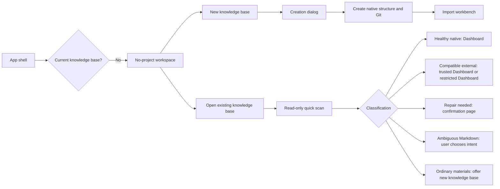

# First-run And Project Open Workbench Design

**Status:** Confirmed product and interaction design

**Date:** 2026-07-30

**Mode:** Operate

**Scope:** No-project workbench, new knowledge-base creation, opening existing knowledge bases, compatibility detection, trust, repair, and the handoff into Import.

**Authority:** This file is the product and interaction authority for the scope above. When legacy `ProjectStartView`, `SPEC/PRD.md` sections 6.1, 8.1, 8.2, 9.1, `SPEC/SPEC.md` sections 5.3 and 7.9, or `SPEC/APP_flow.md` sections 5 and 6 conflict with this file, this file wins. The Import and Source flow after entering Import remains governed by `2026-07-24-import-source-media-flow-design.md`.

## 1. Outcome

The app must feel like a working desktop tool before a project is open. It must not switch to a separate launch page, recent-project gallery, template gallery, or product-introduction surface.

The first-value target is:

> The user has imported at least one item and can read its committed Source.

Creating a project, configuring AI, compiling Wiki pages, building a graph, and starting Chat are not themselves first value. They are subsequent capabilities that become available from the same persistent workbench.

The design therefore makes four changes to the current mental model:

1. The full application shell is always present.
2. New-project creation hands off directly to the real Import workbench.
3. Opening an existing knowledge base is read-only until its format and trust state are known.
4. Unavailable modules explain their dependency and offer one relevant action instead of appearing empty or broken.

## 2. Confirmed Decisions

### 2.1 First screen

- Keep the complete desktop shell: top bar, left navigation, center workspace, right context panel, and bottom status bar.
- Keep all primary navigation visible.
- The center workspace contains exactly two compact action cards:
  - **新建知识库 / New knowledge base**
  - **打开已有知识库 / Open existing knowledge base**
- The page must not contain a hero, product slogan, template gallery, Agent/BYOK setup block, recent-project card grid, or onboarding tour.
- The right context panel explains local storage and the read-only open policy.
- Clicking an unavailable module explains that a knowledge base must be created or opened and offers the relevant action.

### 2.2 Terminology

| User-facing term | Meaning |
|---|---|
| 新建知识库 | Create a new LLM Wiki project folder |
| 打开已有知识库 | Open an existing LLM Wiki, Obsidian, or Markdown knowledge base in place |
| 导入 | Add files, folders, links, or pasted text to the currently open knowledge base |
| 来源 / Source | Readable committed material in `wiki/sources/` |
| 更新 Wiki | Explicitly compile selected Sources into derived Wiki pages |
| 兼容模式 | The folder is usable but does not use the current native LLM Wiki structure |
| 受限模式 | The folder has not been trusted; risky execution and writes are disabled |
| 只读 | The filesystem does not permit writes |
| 恢复模式 | Markdown remains readable while damaged application state is isolated |

Do not use “导入知识库” or “导入文件夹” for opening a knowledge base.

### 2.3 Template policy

- New-project templates are: 通用, 研究, 阅读, 商业, 个人成长.
- 通用 is selected by default.
- The template choice is visible in the creation dialog and can be changed before creation.
- A template initializes purpose and structure guidance. The product does not provide a template-switching command after creation.
- Native projects keep `purpose.md` and `schema.md` at the project root.
- Compatible external vaults keep generated compatibility guidance under `.app/compat/`; root-level files with the same names are user content and are never overwritten.

## 3. Information Architecture

The no-project state is a workspace state inside the existing shell, not a separate application mode.



`AppShell -> WorkspaceController -> WorkspaceRouter -> lazy feature views` remains the frontend architecture. The no-project surface should be represented as a workspace route or state within this chain; `App.tsx` must not branch to a separate launch-page component.

## 4. No-project Workbench

### 4.1 Shell behavior

- Project switcher label: **未打开知识库 / No knowledge base open**.
- Search remains visible but disabled because it has no searchable project scope.
- Navigation remains visible. Selecting Dashboard, Wiki, Chat, Graph, Workflows, Import, Lint, or Exports shows a concise dependency state in the center pane.
- Settings remains available.
- The sidebar foot does not ask the user to configure Agent or BYOK.
- The bottom status message is: **选择新建或打开已有知识库**.

### 4.2 Center workspace

Header:

- Title: **工作区 / Workspace**
- Subtitle: **选择一个知识库开始工作**

Cards:

1. **新建知识库**
   - Copy: “创建本地知识库，选择用途模板，然后添加第一批资料。”
   - Opens the new-project dialog.
2. **打开已有知识库**
   - Copy: “原地打开 LLM Wiki、Obsidian 或 Markdown 知识库；不会复制或移动文件。”
   - Opens the operating-system directory picker.

Below the cards, use one quiet local-storage note:

> 知识库保留在本地文件夹中。打开检查默认只读，不会静默整理、移动或改写文件。

Cards are permitted here because they are compact task launchers inside a persistent workbench. They must not become oversized marketing tiles.

### 4.3 Right context panel

Show:

- Workspace state: 未打开知识库
- Storage: 本地文件夹
- Open policy: 先只读检查；兼容库原地打开；普通资料文件夹不会被原地初始化

Do not show:

- Agent inventory
- Provider setup
- Template catalogue
- Product tips carousel

## 5. New Knowledge Base

### 5.1 Dialog

Use one centered modal with persistent labels, focus trapping, Escape close, and initial focus on the name field.

Fields:

1. **知识库名称**
   - Required.
   - Preserve CJK and Unicode.
   - Show inline errors for operating-system-invalid characters, reserved names, and excessive path length.
2. **保存位置**
   - Selects a parent directory.
   - First use defaults to the system Documents directory plus an `LLM Wiki` parent.
   - Later uses remember the last selected parent directory.
   - The application appends the sanitized knowledge-base name as the child directory.
   - Always show the complete final path.
3. **用途模板**
   - Default: 通用.
   - Compact choices: 通用, 研究, 阅读, 商业, 个人成长.
   - Each choice has one sentence explaining its purpose and core structure.

The final directory must not overwrite an existing non-empty directory. The dialog preserves all entered values after validation or creation failure.

### 5.2 Creation behavior

The backend creates:

```text
project-root/
├── purpose.md
├── schema.md
├── raw/
├── wiki/
├── .app/
├── exports/
└── skills/
```

It initializes a local Git repository and initial commit. No remote is added.

Creation must be transactional. On partial failure, roll back newly created application files when safe or return an exact recovery report.

### 5.3 Handoff to Import

- Successful creation closes the modal and navigates directly to Import.
- Do not open the operating-system file picker automatically.
- Show a one-time, dismissible success strip: “「{name}」已创建。添加第一批资料，生成可阅读的 Source。”
- Import retains its four first-class entries:
  - 选择文件
  - 选择文件夹
  - 粘贴链接
  - 粘贴文本 / Markdown
- Drag and drop is a shortcut, not a fifth conceptual route.
- Import continues to use the confirmed “发现 → 处理 → 预览 → 确认 → 来源库” flow.
- Import completion does not auto-compile Wiki pages and does not auto-navigate away. It selects and previews the committed Source.

## 6. Open Existing Knowledge Base

### 6.1 Non-mutating quick scan

Selecting a folder starts a cancellable, read-only quick scan. The quick scan checks:

- Canonical root and filesystem permissions
- Symlink/junction containment
- Project markers and recognizable directory layouts
- Markdown presence and basic readability
- `.app` integrity only to the depth needed for routing
- Existing Git repository and dirty state
- Case and Unicode-normalization filename collisions

The scan must not:

- Create directories
- Initialize Git
- Repair JSON
- Follow links outside the canonical root
- Execute Agent, Skill, shell, project hooks, or binaries
- Send content to an external AI provider

The backend owns the operation lifecycle. Starting assessment returns an application-scoped `assessmentOperationId`; `cancel_project_open_assessment` accepts only that opaque ID. Cancellation creates no project task, discards any incomplete assessment snapshot, and leaves the full no-project shell in place. A completed scan returns a separate short-lived `assessmentId` used by open/trust/repair commands.

### 6.2 Classification

Use a typed classification rather than the current binary `is_wiki_project` decision:

| Classification | Default outcome |
|---|---|
| Current native LLM Wiki, healthy | Open Dashboard directly |
| Older LLM Wiki, healthy enough | Open compatible Dashboard; repair only if disk writes are needed |
| `nashsu/llm_wiki` | Open compatible Dashboard |
| Obsidian Vault | If already trusted, open compatible Dashboard; otherwise open restricted compatible Dashboard |
| Recognizable Markdown Vault | If already trusted, open compatible Dashboard; otherwise open restricted compatible Dashboard |
| Ambiguous Markdown folder | Ask the user to choose its intent |
| Ordinary materials folder | Explain that it is not a knowledge base and offer to create one from these materials |
| Damaged application state with readable Markdown | Open recovery mode or show a write-confirmation repair page |
| Unreadable or inaccessible | Show a precise error and recovery action |

Healthy native projects and healthy, already trusted compatible projects do not show a confirmation page.

### 6.3 Ambiguous Markdown folder

When a folder contains Markdown but lacks reliable knowledge-base markers, show:

- **以 Markdown 知识库打开**
- **用这些资料新建知识库**

Do not guess.

Remember the choice in global application settings keyed by canonical folder identity. Do not write a marker into the selected folder. Re-prompt if the folder moves, is replaced, or its identity materially changes. Allow the user to clear the remembered decision from recent-knowledge-base management.

### 6.4 Ordinary materials folder

Do not initialize it in place and do not move its files.

Show:

> 这个文件夹更像资料集合，而不是可直接打开的知识库。

Primary action:

- **用这些资料新建知识库**

This opens the standard new-project dialog. After creation, the original folder is added to an Import session. Import copies or archives confirmed evidence according to the Import specification; the original folder remains unchanged.

### 6.5 Deep scan

After the quick scan establishes a safe route, enter Dashboard immediately and continue the deep inventory scan in the background.

- Show real discovered counts and determinate progress where available.
- Allow cancellation.
- Cancellation leaves the currently discovered Markdown readable.
- Search and in-memory graph results may be partial until the scan finishes; label them as partial rather than empty.
- Do not block the entire shell.

## 7. Compatibility, Trust, And Permissions

### 7.1 Separate status dimensions

The right context panel expresses independent dimensions:

| Dimension | Values |
|---|---|
| Type | 原生 / 兼容 |
| Trust | 受信任 / 尚未信任 |
| Filesystem | 可写 / 只读 |
| Health | 健康 / 可修复 / 恢复模式 / 不可读 |

“受限” is a UI capability summary derived from untrusted state and current capabilities, not a backend authorization enum. Trust and filesystem access must remain separate so the system can represent both trusted read-only and untrusted read-only folders. Backend commands authorize from trust, filesystem access, health, layout and explicit capabilities rather than from one display label.

Top banners appear only when the user can or must act:

- 尚未信任
- 需要确认修复
- 文件系统只读
- 深度扫描失败 or cancelled when it materially limits results

Normal “兼容模式” is not a persistent warning banner.

### 7.2 Restricted mode

An untrusted external knowledge base can use:

- Markdown reading
- File tree
- Local keyword search
- In-memory graph derived from local Markdown
- Background read-only inventory scan

It cannot use:

- Agent or Skill execution
- Project-provided commands or hooks
- Task execution that writes to the project
- Automatic edits or fixes
- External AI transmission
- `.app` creation or repair

### 7.3 Trust persistence

Trust is stored in global application settings, not in the project. It is bound to canonical folder identity. A moved or materially replaced folder requires trust again.

### 7.4 Enable full features

Clicking **信任并启用完整功能** opens a confirmation dialog or page. For a compatible vault without existing app state, it shows:

- Canonical path
- Capabilities that will be enabled
- Exact paths that will be created
- Template choice, defaulting to 通用
- Git state
- Whether a checkpoint can be created

Minimum compatible-vault writes:

```text
.app/
└── compat/
    ├── purpose.md
    └── schema.md
```

Do not create root-level `purpose.md` or `schema.md` for compatible vaults. Existing root files with those names are user content.

Do not move, rename, or restructure existing Markdown or `.obsidian`.

### 7.5 Git

If a compatible vault has no Git repository:

- Offer **初始化本地 Git 历史**, enabled by default.
- Explain that Git is local and no remote is configured.
- If declined, reading, search, and Chat remain available, but high-risk automatic writes remain disabled.

If a Git repository has uncommitted changes:

- Do not auto-commit or auto-stash.
- Reading, search, Chat, and ordinary Import remain available.
- Before Agent automatic edits, batch repair, conflict merge, overwrite, delete, or source replacement, show current changes and affected paths.
- The user may handle the changes independently and retry, or explicitly create a local checkpoint containing all current changes.

## 8. Repair And Recovery

### 8.1 Automatic preparation, explicit write

The system automatically scans and prepares safe repairs. It only shows a full repair-confirmation page when the repair would write to disk.

Safe automatic repair candidates are limited to:

- Fully regenerable caches
- Empty required application directories
- Derived indexes that can be recreated from intact user content
- Corrupt application JSON that can be replaced from an exact known schema without inventing user data

Never auto-repair by:

- Guessing missing user content
- Rewriting Markdown
- Renaming files to resolve case or Unicode collisions
- Rewriting links
- Moving original sources
- Following external links

### 8.2 Repair confirmation page

Show:

- Detected knowledge-base type
- Current readable capabilities
- Exact repair operations and paths
- Protected user paths
- Backup and Git checkpoint state
- External links that will remain blocked

Actions:

- **信任、修复并打开**
- **暂不修复，以受限模式打开**

The second action remains available whenever Markdown is readable.

### 8.3 Recovery mode

Incomplete or corrupt `.app/*.json` must not make readable Markdown disappear. Recovery mode:

- Opens Dashboard
- Preserves file tree and Markdown reading
- Uses local fallback scans for counts and readiness
- Disables writes whose state cannot be proven
- Offers the repair action contextually

### 8.4 Filesystem and link boundaries

- A root symlink or junction is allowed after canonicalization.
- Links that stay inside the canonical root can be read with loop protection.
- Links resolving outside the root are shown but not followed, indexed, or written.
- External material must be explicitly imported.
- Case-only and Unicode-normalization filename conflicts are reported; the application never auto-renames files or rewrites links.
- A read-only filesystem can remain permanently open in read-only Dashboard mode.
- Cloud placeholder files and provider-specific hydration are deferred.

## 9. Capability Readiness

Modules remain visible after a project is open. Each unavailable state gives one reason and one next action.

| Module | Minimum readiness | Unavailable action |
|---|---|---|
| Wiki / Reader | At least one readable committed Source or Wiki Markdown page | 导入资料 |
| Import | A real project; discovery/preview may be local-only, while commit requires trust + writable layout roots | 信任知识库 / 需要可写知识库 |
| Chat | Trusted project, readable Source or Wiki context, and an available Agent/BYOK route | 信任知识库 / 去配置 |
| Graph | At least one readable Source or Wiki Markdown page; a zero-edge single-page graph is valid | 等待扫描 or 导入资料 |
| Workflows | Real project plus workflow-specific access: local Health Check needs readable Markdown; complete Health Check needs trust + AI; Update Wiki and Generate Content need trusted writable access | 信任知识库 / 需要可写知识库 / 导入资料 / 去配置 |
| Lint local checks | Readable Markdown | None |
| Automatic fixes | Trusted writable project plus checkpoint capability | 信任 / 处理 Git 改动 |

AI configuration is contextual:

- Do not require Agent or BYOK during first launch, project creation, project open, or Import.
- When the user invokes an AI-dependent action without a route, show **去配置**.
- Open the existing configuration surface as a modal or overlay.
- Return to the initiating surface after configuration.
- Do not automatically start the pending workflow; the user explicitly starts it.

## 10. Startup And Re-entry

- On startup with valid history, automatically open the most recently used knowledge base.
- Always land on Dashboard, not the last route.
- If the latest folder is missing or cannot be accessed, keep the full shell and show the no-project workspace with a concise path error.
- Do not show a recent-project gallery as the default first screen.
- Project switching continues to use the project switcher.

## 11. Visual And Interaction Specification

Use the current `UI-Frontend-design/` shell structure and `src/styles.css` tokens.

Required density:

- Top bar: 48px
- Main header: 52px
- Right panel header: 52px
- Bottom status bar: 28px
- Navigation rows: 30px
- Body text: 13px
- Secondary text: 12px
- Muted/mono: 11px
- Micro labels: 10.5px uppercase with `0.08em` tracking

Rules:

- Keep panes flat and continuous.
- Use hairline borders and the sparse teal accent.
- Use Lucide icons.
- Use cards only for the two first-screen actions; use rows, panes, tables, toolbars, and confirmation pages elsewhere.
- No hero, decorative illustration, gradient, bokeh, glossy AI graphic, or nested card stack.
- Long paths truncate in-line and expose the full value in a tooltip.
- Every modal traps focus, restores focus to its trigger, supports Escape, and has specific action labels.
- Dynamic scan, success, and error states use accessible live regions.
- Do not use color as the only indicator of trust, permission, or health.

## 12. Suggested Typed Contracts

Names are illustrative; exact names can follow existing conventions.

```ts
type ProjectFormat =
  | "native_current"
  | "native_legacy"
  | "nashsu_llm_wiki"
  | "obsidian_vault"
  | "markdown_vault"
  | "ambiguous_markdown"
  | "ordinary_materials"
  | "unknown";

type ProjectTrustState =
  | "trusted"
  | "untrusted";

type ProjectFilesystemAccess =
  | "writable"
  | "read_only";

type ProjectHealth =
  | "healthy"
  | "repairable"
  | "recovery"
  | "unreadable";

interface ProjectOpenAssessment {
  assessmentId: string;
  canonicalRootPath: string;
  format: ProjectFormat;
  trust: ProjectTrustState;
  filesystemAccess: ProjectFilesystemAccess;
  health: ProjectHealth;
  layout: ProjectLayout;
  confidence: "high" | "medium" | "low";
  markers: ProjectMarker[];
  capabilities: ProjectCapability[];
  warnings: ProjectWarning[];
  repairPlan?: ProjectRepairPlan;
  git: ProjectGitAssessment;
}

interface StartProjectOpenAssessmentResult {
  assessmentOperationId: string;
}

interface ProjectMarkdownRoot {
  path: string;
  role: "source" | "wiki" | "mixed";
  exclude?: string[];
}

interface ProjectContextDocument {
  readPath?: string;
  writePath?: string;
  inferred?: boolean;
}

interface ProjectLayout {
  appStateRoot?: string;
  evidenceRoot?: string;
  markdownRoots: ProjectMarkdownRoot[];
  sourceWriteRoot?: string;
  wikiWriteRoot?: string;
  wikiIndexPath?: string;
  wikiOverviewPath?: string;
  activityLogPath?: string;
  queriesWriteRoot?: string;
  exportRoot?: string;
  skillsRoot?: string;
  importStateRoot?: string;
  sourceStateRoot?: string;
  compileStateRoot?: string;
  chatStateRoot?: string;
  taskStateRoot?: string;
  workflowStateRoot?: string;
  graphCachePath?: string;
  lintReportRoot?: string;
  lintIgnorePath?: string;
  exportRecordPath?: string;
  bookmarksPath?: string;
  settingsPath?: string;
  agentConfigPath?: string;
  purposeContext?: ProjectContextDocument;
  schemaContext?: ProjectContextDocument;
}
```

`ProjectHealth` meanings are distinct: `repairable` means the recognized layout remains coherent and a bounded, previewable plan can restore missing or stale derived/app state; `recovery` means application state is incomplete or corrupt but readable Markdown must still open in a reduced Recovery Dashboard; `unreadable` means safe Markdown access cannot be established.

Every path in `ProjectLayout` is backend-derived, project-relative and containment-checked. Missing write/state paths mean that capability is unavailable; a service must return a typed prerequisite instead of inventing a directory.

For a newly created native knowledge base, the logical defaults are:

- app state `.app/`
- evidence `raw/`
- Source Markdown `wiki/sources/`
- Wiki pages `wiki/` excluding the Source subtree where needed
- Wiki index/overview/activity log `wiki/index.md`, `wiki/overview.md`, `wiki/log.md`
- queries `wiki/queries/`
- exports `exports/html/`
- project Skills `skills/`
- Import/Source/compile/Chat/workflow/task/cache/report/settings/bookmark/export-record state under `.app/`
- purpose/schema at the project root

Compatible adapters preserve existing Markdown roots. Before trust/full enablement they normally expose only safe read roots and no project write/state roots. After explicit enablement, app-owned guidance resolves to `.app/compat/`; adapters may expose additional safe write roots only when the target is unambiguous and the corresponding capability is enabled. Enablement itself never moves existing content or silently invents native root directories.

Backend responsibilities:

- Filesystem and permission inspection
- Independent trust and filesystem-access derivation
- Canonical path and link containment
- Format classification
- Typed `ProjectLayout` and capability derivation
- Trust identity
- Assessment operation cancellation and short-lived assessment registry
- Repair planning and execution
- Git state and checkpoints
- Transactional project creation

Frontend responsibilities:

- Render typed assessment states
- Collect explicit choices and confirmations
- Navigate inside the current shell
- Guard asynchronous presentation commits with the initiating project key and epoch

React must not inspect the filesystem, mutate Git, execute repairs, or persist secrets.

## 13. Implementation Plan

### P0 — First-value path

1. Move the no-project experience inside `AppShell`.
2. Replace the `App.tsx` `AppShell`/`ProjectStartView` branch with a shell-level workspace state.
3. Add the two-card no-project workspace and dependency states for visible navigation.
4. Update the new-project modal:
   - Parent directory + generated child path
   - Documents/LLM Wiki first default
   - Remember last parent
   - Default 通用 template
   - Full-path validation
5. Navigate successful creation to Import without opening a file picker.
6. Replace the backend binary project detection with a typed read-only assessment.
7. Route healthy native knowledge bases directly to Dashboard.
8. Route ordinary material folders to “用这些资料新建知识库”; remove in-place initialization from the open-existing path.

### P1 — Compatibility and safety

1. Add ambiguous Markdown intent confirmation and globally remembered classification.
2. Add compatible restricted Dashboard.
3. Persist trust globally by canonical identity.
4. Add explicit full-feature enablement with `.app/compat/` initialization.
5. Add Git initialization choice and dirty-worktree gate.
6. Add typed repair plans and the full repair-confirmation page.
7. Add recovery mode for damaged `.app` state.
8. Add two-stage scan with cancellable background deep inventory.
9. Add independent type, trust, filesystem-access and health rows to the right context panel.

### P2 — Hardening and polish

1. Add path-length, reserved-name, CJK, Unicode normalization, and case-collision coverage.
2. Add symlink/junction root and internal/external link coverage on Windows, macOS, and Linux.
3. Add inaccessible, read-only, removed-after-selection, and concurrent-change states.
4. Add the explicit no-project-shell fallback and path error when the most recent project is missing; never silently open an older project.
5. Add keyboard, focus, screen-reader live-region, 200% zoom, and Chinese/English expansion coverage.
6. Add product metrics locally or through the approved analytics boundary:
   - time from first launch to project created/opened
   - time to first committed readable Source
   - abandonment at create, scan, trust, repair, and Import preview

## 14. Acceptance Matrix

| Scenario | Expected result |
|---|---|
| Fresh install | Full shell with two action cards |
| New project, default values | 通用 template; complete generated path visible |
| New project succeeds | Import opens; no system picker opens automatically |
| First Import succeeds | Committed Source is selected and readable; no compile starts |
| Healthy native project | Direct Dashboard |
| Healthy Obsidian Vault, first open | Restricted compatible Dashboard, no disk write |
| User trusts Obsidian Vault | Confirm `.app/compat/`, template, and Git behavior before write |
| Markdown-only ambiguous folder | User chooses open-as-vault or create-from-materials |
| Ordinary PDF/Office folder | Original untouched; offer new project and Import |
| Corrupt graph cache | Repair plan may regenerate after confirmation |
| Corrupt `.app` with readable Markdown | Recovery Dashboard remains readable |
| Root link to valid folder | Canonicalized and allowed |
| Internal link escapes root | Shown but not followed or indexed |
| Existing Git is dirty | No silent commit/stash; high-risk writes gated |
| Read-only folder | Permanent read-only Dashboard |
| Missing AI route | Contextual 去配置; return without auto-running workflow |
| Relaunch with valid history | Latest project opens to Dashboard |

## 15. Migration Notes

The following legacy behavior must be treated as superseded:

- `ProjectStartView` as a standalone launch page
- New project landing on Dashboard
- Agent/BYOK inventory on the first screen
- Three separate quick actions for new, ordinary-folder initialization, and existing-project open
- Ordinary folder in-place initialization and file movement
- Binary `is_wiki_project` classification
- Treating empty Wiki/Graph/Chat as unexplained empty content

The current Import/Source workbench, its confirmation order, and its no-auto-compile rule remain unchanged.

## 16. Research Pattern References

The design adopts established desktop-tool patterns without copying their visual identities:

- VS Code Workspace Trust: restricted execution before folder trust
- JetBrains project open/import: distinguish opening an existing project from importing external material
- Obsidian Vault: a local folder of Markdown remains the user-owned source of truth
- Blender splash/workspace pattern: a small set of entry actions can live inside a tool without becoming a marketing page
- Figma file browser: clear create/open verbs and predictable re-entry

Primary references:

- https://code.visualstudio.com/docs/editing/workspaces/workspace-trust
- https://www.jetbrains.com/help/idea/import-project-or-module-wizard.html
- https://obsidian.md/help/vault
- https://obsidian.md/help/Files%2Band%2Bfolders/How%2BObsidian%2Bstores%2Bdata
- https://github.com/nashsu/llm_wiki
