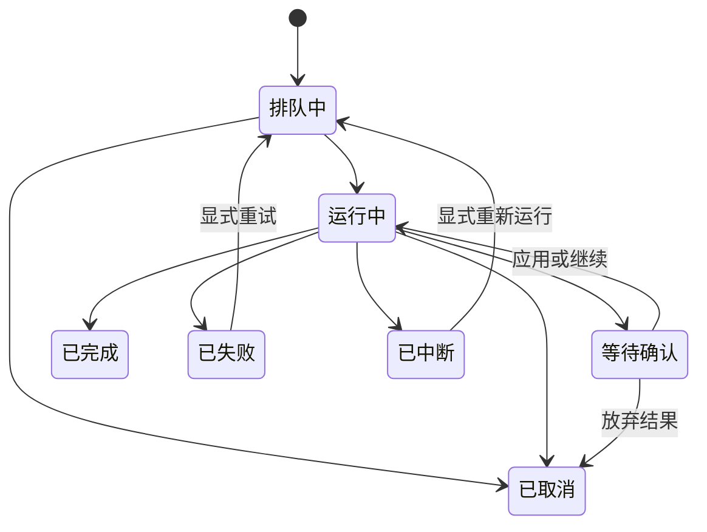

# Workflows Panel Redesign

**Status:** Confirmed product and interaction design

**Date:** 2026-07-30

**Mode:** Operate

**Scope:** Replace the current Agent main surface with a task-oriented Workflows surface. Preserve the incumbent Codex-like visual system.

**Authority:** Sole product and interaction authority for the Workflows main surface. When legacy `agent.html`, historical Agent plans, or general docs conflict with this file, this file wins.

**Project-open boundary:** The no-project shell, compatible-folder assessment, restricted/trusted/read-only permissions, Git eligibility and repair behavior are defined by [`2026-07-30-first-run-project-open-workbench-design.md`](2026-07-30-first-run-project-open-workbench-design.md). Workflows consumes the backend-derived access policy; it does not grant trust or make a read-only project writable.

## Health / Generate form amendment — 2026-09-08

Opening any of the three workflows is local navigation to an editable draft. Health and Generate use a read-only form catalog for configured route summaries and remembered choices; only Generate lists Wiki filenames. Catalog latency never disables mode, artifact or save-mode editing. Health does not scan Markdown on entry; Generate does not parse Source registries or hash source bodies to display page choices.

Start validates the final Health/Generate choices through the existing preparation and admission protocol. Sharing, overwrite and changed inputs retain the concrete review screen. These workflows have not migrated to Update's durable intent worker: execution validation can still take time after Start. A lost admission reply retries its real receipt; a confirmed success clears that pending submission, so the next deliberate run prepares anew. Navigation away does not discard task facts or reopen the old surface on a late reply.

Generate remembers artifact type, page choices and route, but does not turn a previous generated filename into an overwrite request. Source version registries are not Generate inputs. Selected Wiki content and resources remain validated; project reports still cover all Markdown actually consumed by ExportService. Older queued Generate baselines containing Source versions may require renewed scope review.

## Update Wiki intent amendment — 2026-09-08

This amendment follows the user's request to remove unnecessary preparation dependencies and takes precedence over the older Update-specific preparation/TTL wording below. Health and Generate form navigation is further amended above; old persisted tasks retain their admission contracts.

- Opening Update Wiki immediately exposes an editable form. Configured route summaries and a manually requested Source directory load independently. No full preparation, Git status, source-body scan or executable probe is required for navigation.
- Automatic selection means “resolve applicable Sources when this queued task starts”; manual selection means exact source/version choices, and an explicitly empty manual selection is not Automatic. Mode and current draft survive leaving and re-entering the form in the same project session.
- Start persists one user intent with a request ID before slow execution checks. Duplicate delivery of that request opens its original task. Analysis, selected-route validation and input binding are observable task work and cancellation remains available. No changes is a successful no-op, not a reason to run AI or create history.
- Binding persists actual scope, route and baseline together. Queued continuation and retries do not re-enter the old preparation protocol. Explicit versions, provider destination, trust, paths and checked writes remain validated at their consuming boundaries.
- App-private Git history and in-app undo remain automatic and do not touch the user's branch or staging area. Full preparation and manual Git submission are not Update prerequisites.
- V2 manual directories use metadata. Legacy indexes lack current version metadata, so legacy manual selection retains on-demand body hashing; this never blocks the default form.

## 1. Decision Summary

The current Agent page mixes execution-engine configuration, BYOK availability, workflow launchers, tasks, raw logs, and safety settings. The replacement surface is organized around work the user wants to complete.

The new primary navigation item is **工作流 / Workflows**. Agent CLI, BYOK, model, and provider configuration remain in the current Settings experience. Agent remains an execution route, not the page's organizing concept.

The first release contains three built-in workflows:

1. **更新 Wiki / Update Wiki**
2. **健康检查 / Health Check**
3. **生成内容 / Generate Content**

The surface owns workflow preparation, project-scoped queueing, progress, confirmation, results, retry, and history. It does not replace the current Lint or Exports pages.

## 2. Navigation Changes

### Left sidebar

- Rename the current group label from `工作流` to **知识处理 / Knowledge Processing**.
- Rename the `Agent` navigation item to **工作流 / Workflows**.
- Replace the Bot icon with Lucide `Workflow`.
- Do not show a badge, counter, or running indicator on the Workflows navigation item.
- Keep Import, Lint, and Exports as neighboring first-level items.
- Keep the existing Agent name/version row at the bottom of the sidebar unchanged.

### Page header

- Title: **工作流**
- Subtitle: **更新 · 检查 · 生成**
- Header action: **运行记录**
- Remove `重新检测`, `安装引导`, and `运行 Agent`.
- Do not add a large global “new workflow” button.

## 3. Scope and Non-goals

### Included

- Built-in workflow overview
- Workflow-specific preparation views
- Project-scoped serial queue
- Observable workflow pipelines
- Waiting-for-confirmation reviews
- Completion summaries
- Cancellation, retry, interruption, and recovery states
- Recent and complete run history
- Shared workflow launches from existing product surfaces

### Explicitly deferred

- Scheduled or event-triggered automation
- User-authored workflows
- Arbitrary prompt-based tasks
- Per-run custom instructions
- User-authored or imported output templates
- Source batch organization
- Redesign of Settings, Lint, or Exports
- Interactive terminal input

Advanced log search, filtering, and export are candidates rather than first-release requirements. First release must at least support real-time read-only logs and copying.

## 4. Information Architecture

The Workflows surface has four views inside the existing desktop shell:

1. **Overview**
2. **Run preparation**
3. **Task detail**
4. **Run history**

### Overview

The 2026-09-07 visual refresh follows the user's `UI-Frontend-design/workflow.html` reference as a style direction, adapted to actual capabilities and window width:

- Three equal function cards stay at the top in the fixed Update / Health / Generate order. Cards show real status and open preparation or the corresponding task; selection alone never starts execution.
- The selected preparation or task occupies an inline bordered panel below the cards. Without an open panel, the actionable attention summary appears here instead.
- The latest five runs remain below the panel, with independent access to full history.
- A narrow content pane stacks cards/options; the shared shell still owns pane collapse. Do not restore the previous 154px stacked operation-row layout at ordinary desktop content widths.

```text
┌ Workflows · Update / Check / Generate ───── Run history ┐
│ [ Update Wiki ] [ Health Check ] [ Generate Content ]   │
│ ┌ Selected configuration / current task ─────────────┐ │
│ │ Short form or horizontal phases · result / review │ │
│ └───────────────────────────────────────────────────┘ │
│ Recent runs · latest five                             │
└───────────────────────────────────────────────────────┘
```

Use the reference's quiet white/gray surfaces, subtle borders, selected teal accent, grouped choices and execution summary bar. Retain real authority, conflict review and route semantics. Prototype automation, fake counts/timings, automatic repairs and multi-type launches do not become capabilities through this visual update. `UI-Frontend-design/` stays read-only.

Keep visible copy limited to choices, scope, actionable blockers, and the primary action. Do not show an empty prerequisite success section or repeat form facts in the context panel. Default export filenames and execution metadata belong in collapsed details; the path input appears only for a specific destination. Use 13–14 px for primary content and at least 12 px for secondary Workflow text.

### Run preparation

Selecting a workflow opens its preparation panel in the same main area beneath the function cards:

```text
Workflows → Update Wiki → Run preparation
```

It contains only product-defined structured settings. Starting the workflow replaces this view with its task detail.

Starting automatically prepares the current draft and revalidates it before admission; there is no separate “Update preparation” action or redundant first-run scope checkbox. Changed scope, automatic route changes, and newly required sensitive-content acknowledgements are presented for review before starting. Overview and history load independently, so waiting for history or execution-route detection cannot block the three workflow entries. Unobserved content changes stay unknown rather than being displayed as “up to date”.

Update Wiki uses four visible phases (prepare, generate, review, save), with exact execution stages and logs available on demand. Completed results and their open action appear before stage details. A queued baseline change enters a recoverable scope review without an applicable candidate; reviewing the current selected Source versions creates a linked new attempt after the previous wait is cancelled.

### Task detail

Task detail uses the inline main-area panel for four horizontal semantic phases, results, and observable task state. Technical stages and logs stay collapsed until requested. The right panel shows scope, execution route, Git state, affected files, output location, and current actions.

### Run history

- Overview target: latest five runs.
- “Run history” opens the project-specific complete record.
- Records may be filtered by workflow and task state.
- Retention limits and the exact first-release filter set remain implementation decisions.
- Retrying creates a new record linked to the original attempt.

## 5. Workflow Selection Behavior

Keep the workflow order fixed:

1. Update Wiki
2. Health Check
3. Generate Content

Only one workflow receives a “recommended next step” treatment at a time. Cards do not reorder as project state changes.

Each card shows:

- Workflow icon and name
- One-line outcome description
- Current project-specific status
- Last run summary or prerequisite hint
- A state-aware primary action

Primary actions:

| State | Action |
|---|---|
| Ready | 运行 |
| Identical task running or queued | 查看进度 |
| Another task active | 加入队列 |
| Wiki has no detected changes | 已是最新 / 查看 |
| Missing project content | 运行, followed by prerequisite guidance |
| Missing AI execution setup | 运行, followed by setup guidance |

Do not create a duplicate task when project, workflow, input range, and baseline are identical. Open the existing task instead. A different range, output type, or changed project baseline may create a new queued task.

## 6. Built-in Workflows

### 6.1 Update Wiki

User-facing name: **更新 Wiki**

Technical terms such as Compile may remain in advanced detail and logs.

Default behavior:

- Detect new and changed Sources automatically.
- Show the detected scope and allow users to inspect or exclude items.
- Disable routine execution when no changes exist.
- Keep **完整重新编译** as an advanced operation.
- Use the configured default execution route.
- Allow a per-run route override in collapsed advanced settings without changing the global default.

Preparation summary example:

> 发现 8 个新增来源、3 个已更新来源；预计更新 14 个 Wiki 页面。

### 6.2 Health Check

User-facing name: **健康检查**

Lint remains valid in technical details and in the unchanged first-level Lint page.

Mode selection:

- When a usable AI route exists, first use defaults to Complete Check.
- Without a usable AI route, use Local Quick Check.
- Later runs remember the most recent mode.
- Complete Check runs local deterministic checks before AI deep checks and merges duplicate findings.

Here, “usable AI route” means both a prepared concrete Agent/BYOK route and a project trust state that permits external execution; route configuration alone is not sufficient.

Health Check itself is read-only. Batch repair remains a downstream action from Lint findings, not a standalone workflow.

Workflows owns launch and progress. The current Lint page continues to own its existing result and repair experience.
Local Quick Check reads the Markdown roots allowed by `ProjectContext.layout`, including committed Source and Wiki pages. It can run as a bounded in-memory check in restricted/read-only mode. Complete Check additionally requires trust and a concrete AI route, but remains read-only: a trusted read-only project may run it with a clearly non-persistent in-memory result.
Rules whose logical roots do not exist in the active layout are reported as not applicable rather than failed—for example, Wiki index drift is skipped for a Source-only compatible project while Source integrity checks still run.

#### Decision Gate H approved contract (2026-08-12)

- The application-bundled, version-pinned `wiki-lint` Skill is the only Skill authority for Agent deep analysis and repair. Project `purpose.md`, `schema.md`, layout context, and Finding evidence are untrusted data inputs and cannot override the Skill id, version, hash, operation, write roots, or round limit. A project `skills/wiki-lint/SKILL.md` never overrides or extends this contract.
- Agent repair writes only inside a task-owned candidate workspace. Its write scope is Wiki Markdown selected by the backend layout and explicitly excludes `raw/**`, faithful Source pages, `wiki/sources/**`, layout-defined Source roots, and app-owned state. The backend validates candidate manifests and applies accepted changes; the Agent never writes the real project root directly.
- The user approves the whole selected Finding batch once. Safe selected-path updates and safe new Wiki pages are covered by that approval; deletes, overwrites outside the pre-authorized existing-path set, and baseline/user-edit conflicts require a second persistent confirmation with lazy Diff.
- Each applied round is followed by deterministic Lint. Agent repair is limited to three rounds; unresolved work retains the verified Diff and Git rollback facts and becomes a typed partial/manual-review result. There is no fourth invocation and no BYOK repair fallback.
- Claude Code and Codex are the initial Agent kinds eligible for this contract once their exact invocation/output tests and later route-enablement batches pass. OpenClaw and Hermes remain unsupported until equivalent contracts land.

This decision closes the product-choice portion of `WF-D01`. H3 enabled the backend-derived Claude/Codex Complete Health route, H4B registered the guarded repair operation, and H5 exposed the downstream Lint/Workflows repair surface. Forged or stale routes still fail before invocation, and the visible Overview remains the same fixed three workflows.

**Current implementation status (2026-08-13):** H0–H5 implementation and review evidence are recorded, but H6 final validation is no-go because the required from-scratch full gate is not green in the current Windows environment and the complete performance/negative/WebView2 matrix is not closed. Decision Gate H and Batch 7 remain blocked until every H6 hard gate passes.

### 6.3 Generate Content

User-facing name: **生成内容**.

Output types:

| Output type | Default scope |
|---|---|
| 舒适阅读页 | One Wiki page |
| 知识卡片 | One or more Wiki pages |
| 概念图 | One topic and related pages |
| 项目报告 | Entire project, with optional exclusions |

Wiki has one deliberate quick-export exception: the current article's `生成 HTML` / `Generate HTML`, empty-preview action, and Wiki right-panel reading-page/card shortcuts open the Wiki-local `GenerateHtmlDialog`, keep the user on the article, and start a direct single-page Export task. That dialog offers only `beautiful_read`, `knowledge_card`, and `concept_map`; it does not expose project reports, multi-page scope, output paths, route overrides, custom prompts, or overwrite.

When the user starts Generate Content from Workflows, ask for the applicable scope in the full preparation view. Exports new and regenerate actions also enter this full path, with the existing record's type, source, and output path carried into preparation where applicable.

The implemented typed preparation carries artifact type, applicable Wiki page paths, output path, and execution route. The current concept-map input uses the first selected page as its center and the selected related pages. There are no separate free-text topic, theme, report subtype, or optional-exclusion controls in this schema; the optional report exclusions in the target scope table remain unimplemented and are not claimed as accepted. A normal run creates a new artifact; only an explicit existing output path requests overwrite, with its checkpoint and candidate confirmation. If queued inputs change, Generate Content enters `review_scope` and re-prepares the selected artifact/page intent before a retry-linked task starts.

Workflow and Wiki quick export reuse ExportService validation, create-new checked publication, and ExportRecord/receipt handling. Opening a Workflow result selects its exact record and task association, then opens that record's preview; it does not substitute the latest export. After restart an exact durable result may remain available on an interrupted task without relaunching AI or changing the interrupted task to success.

Expose user-facing template names. Keep Skill IDs in technical details:

| User-facing template | Technical Skill |
|---|---|
| 舒适阅读页 | `html-beautiful-read` |
| 知识卡片 | `html-knowledge-card` |
| 概念图 | `html-concept-map` |
| 项目报告 | `html-project-report` |

Workflows owns full preparation, the project-scoped serial queue, overwrite checkpoint and confirmation, the structured nine-stage pipeline, results, linked retry, and workflow history. Wiki quick export instead creates an ordinary cancellable Export task, makes it immediately inspectable in the global task drawer, writes only a new artifact, and opens the exact task-correlated result in Wiki preview after success. It does not create Workflow history.

Both paths reuse `ExportService`, write `ExportRecord` entries, and leave generated-artifact management and reusable preview to the unchanged Exports page. This exception does not restore a generic `Run Agent` dialog.

## 7. Shared Preparation Model

Every preparation view shows:

- What will happen
- Input scope and task size
- Expected output location
- Whether Wiki files may change
- Git checkpoint behavior
- Current execution route
- Workflow-specific structured options
- A clear **开始运行** action

The first run of a workflow in a project requires explicit scope confirmation. Later runs may offer a quick rerun with the last valid structured settings. If the project baseline, prerequisites, or applicable scope changed, return to the populated preparation view before starting. Quick rerun never means automatic launch.

Do not fabricate precise cost or duration estimates. Show verifiable scope and, when available, the last comparable run duration.

Execution route is secondary:

- Main workflow rows do not expose Agent or Provider selectors.
- Preparation shows a compact route summary.
- Advanced settings allow a one-run override.
- Missing configuration produces guidance and a Settings action.
- Returning from Settings restores the preparation state, but never starts the task automatically.
- A failed route never silently falls back to another Agent, Provider, or model.

Data boundaries remain collapsed under **执行详情**. The first use of a remote Provider must explain once that selected content leaves the device.

## 8. Project Prerequisites

Workflow entries remain visible in an empty or partially configured context, but the backend must not create a project workflow task until a real project context satisfies that workflow's access policy.

| Situation | Guidance |
|---|---|
| No knowledge base is open | 新建知识库 / 打开已有知识库 |
| External knowledge base is restricted | 本地健康检查可继续；外部 AI 或写入工作流提供“信任知识库” |
| Project is read-only | 只读检查可继续；写入工作流说明“需要可写知识库” |
| Update Wiki has no project-local Git | 应用在任务开始后自动准备本地历史；Git 不可用时在写入前失败 |
| Other checkpoint-required writes have no Git capability | 启用本地 Git或保持只读能力 |
| Dirty Git blocks another high-risk write (excluding Update Wiki) | 先自行处理，或明确确认把当前全部变更作为检查点 |
| Update Wiki has no Sources | 先添加来源 → Import |
| Health Check has no readable Source or Wiki Markdown | 导入资料 / 等待扫描 |
| Generate Content has no pages | 先更新 Wiki |
| AI route unavailable | 前往当前 Settings 配置 |

Completing a prerequisite returns the user to the intended preparation context when possible, but does not automatically launch work.

External AI, Agent and Skill execution requires a trusted project. Any mutation additionally requires writable permission, and checkpoint-required mutation requires recoverable Git history. Update Wiki establishes its application-owned history automatically during execution; other workflows retain their existing checkpoint policy. These conditions are revalidated by the backend when the user starts or confirms work; frontend disabled state is not authorization.

## 9. Queue and Project Isolation

- Workflows, tasks, confirmations, and history are isolated by project. When project app state is not writable, permitted read-only runs and their results remain in memory and are labeled as non-persistent.
- Do not provide a cross-project task aggregate in this surface.
- Each project executes one workflow at a time.
- Additional workflows enter a serial queue.
- Queued tasks can be reordered or cancelled.
- A waiting-for-confirmation task pauses the queue.
- Completion may recommend a next workflow but never launches it automatically.

## 10. Task State Model

User-visible task states:

- 排队中
- 运行中
- 等待确认
- 已完成
- 已失败
- 已取消
- 已中断

Agent thinking, tool calls, model streaming, and command execution are activity detail, not task states.



## 11. Observable Pipelines

Every task exposes:

1. Overall task state
2. Current workflow-specific stage
3. Current object and count-based sub-progress

The main visualization is a vertical activity timeline:

- Current stage expanded
- Completed stages collapsed with duration
- Future stages muted
- Failure stage expanded with an actionable summary
- Human confirmation inserted as a visible decision node
- Raw stdout/stderr nested under detailed logs

### 11.1 Update Wiki pipeline

1. 分析来源变化
2. 创建 Git 检查点
3. 规划 Wiki 更新
4. 生成页面候选
5. 校验链接与结构
6. 检查冲突与风险
7. 应用文件变更
8. 刷新索引与图谱
9. 完成并记录结果

Example sub-progress:

> 正在生成页面 · 8 / 14
>
> 当前：`wiki/concepts/agent-memory.md`

### 11.2 Health Check pipeline

1. 读取当前可读 Source / Wiki Markdown 状态
2. 检查 Markdown 与 frontmatter
3. 检查链接、孤立页面和索引漂移
4. 执行 AI 深度检查（如启用）
5. 合并并去重检查结果
6. 按严重程度分类
7. 生成检查报告
8. 完成

Example sub-progress:

> 正在检查链接 · 286 / 412 页 · 已发现 7 项问题

### 11.3 Generate Content pipeline

1. 确认内容范围
2. 读取 Wiki 稳定版本
3. 加载输出模板
4. 生成内容与视觉结构
5. 组装资源和页面
6. 校验链接、资源与格式
7. 写入 Exports
8. 生成预览
9. 完成

Example sub-progress:

> 正在生成知识卡片 · 4 / 10
>
> 当前：Agent Memory 对比

## 12. Confirmation and Git Safety

Use the term **Git 检查点** directly.

Rules:

- Update Wiki automatically stores exact before/planned snapshots under private `refs/llm-wiki/operations/<task-id>/` using a temporary index. Only successful publication promotes the planned snapshot to `after`; the ordinary branch, HEAD, staging area and unrelated files remain unchanged. Dirty files are valid input. Users do not manually submit a checkpoint as a prerequisite.
- A project without local Git may initialize object storage when the user starts Update Wiki, without an all-files initial commit. A project nested inside an external Git repository is rejected before initialization to preserve that repository’s behavior. Preparation and navigation never initialize Git.
- Completed updates expose undo in their task detail. Failed/interrupted publication can restore from the durable before/planned snapshots. Restore compares current bytes with the operation’s before/installed bytes, preserving later external edits. Durable `undo-started`/`undo` refs distinguish incomplete and completed recovery; new Update Wiki publication waits for incomplete recovery to finish.
- Preparation opens immediately and restores the selected workflow’s local draft. Discovery runs in the background; cancelling preparation dismisses UI intent and ignores late results. Selected Source versions and guidance bind start admission; the Wiki baseline is captured when the queued update runs, rather than hashing the whole Wiki during navigation.
- Health Check itself creates no checkpoint. After a selected repair batch is approved, queued dispatch must create the required clean-HEAD project-local checkpoint before the first Agent repair invocation; checkpoint failure means zero Agent invocations and zero candidate or real-project mutation.
- Generate Content requires a checkpoint before overwriting an existing artifact; creating a new artifact does not require one.
- Users cannot disable a checkpoint required by a high-risk action.
- Safe selected-path updates and safe new Wiki pages may apply under the initial batch approval after candidate validation.
- Deletes, unexpected overwrites, and user-edit/baseline conflicts require a second persistent confirmation. `raw/**` or Source-root changes are invalid candidates, not confirmable risks.

High-risk review leads with:

- Why the result is high risk
- Counts of created, modified, overwritten, and deleted files
- Exact affected paths
- Whether user edits were detected
- Git checkpoint identifier
- Per-file expandable Diff

Use specific actions such as **应用 8 个文件变更**, not a generic “Confirm”.

Tasks capture an input baseline. Users may continue editing while work runs. Before applying, compare the current files against the baseline. Conflicts move the task to Waiting for Confirmation and use a three-way Diff; never silently overwrite later user edits.

## 13. Cancellation, Failure, and Recovery

### Cancellation

- Queued task: cancel immediately and offer a short Undo.
- Running task: require confirmation and explain that generated candidates will be discarded.
- Waiting for confirmation: use **放弃本次结果**.
- Atomic file application: temporarily disable cancellation until application or rollback completes.
- Cancellation is not a failure state.
- A cancelled workflow leaves no unconfirmed partial result in formal Wiki or Exports paths.

### Failure and retry

- Show the failed stage, completed stages, project mutation state, cause, and suggested action.
- Offer **按原设置重试**, **调整本次设置后重试**, and Settings when applicable.
- Never silently change Agent, Provider, or model.
- Every retry creates a new task linked to the original attempt.
- Collapse related attempts into one history group when helpful.

### Application close or crash

- Closing the main window while the tray process remains active does not stop tasks.
- Waiting confirmations survive restart.
- Queued tasks survive restart but require the user to confirm queue continuation.
- A terminated model or Agent invocation becomes **已中断**.
- Do not claim mid-execution resume when the execution engine cannot provide it.
- Preserve task baseline, settings, logs, Git state, and an explicit rerun action.

## 14. Completion Results

Completion prioritizes product outcomes over terminal output.

### Update Wiki

- Pages created, updated, and skipped
- Affected file paths
- Application-owned before/after history and undo or interrupted recovery (Update Wiki); other workflows retain their checkpoint/result identifiers
- Duration and execution route
- **查看更新内容**
- **再次运行**
- Suggested next action: **运行健康检查**

### Health Check

- Findings by severity and type
- Local and deep-check coverage
- Duration and execution route
- **前往 Lint 查看结果**
- **再次运行**

### Generate Content

- Artifact type and count
- Output paths
- Validation result
- Duration and execution route
- **查看生成结果**
- **再次运行**

## 15. Right Context Panel

The panel is contextual and never becomes a second Settings page.

| Selection | Panel content |
|---|---|
| Nothing selected | Project workflow summary, pending Source changes, last health result, recent artifact |
| Workflow selected | Prerequisites, scope, route summary, Git policy, output location |
| Task selected | Current stage, scope, route, Git state, affected files, actions |

Agent, BYOK, model, and provider settings are read-only summaries with a link to the current Settings experience.

## 16. Cross-surface Entry Points

Keep all current task-relevant launch points, with the Wiki single-page exception called out explicitly:

- Dashboard → Update Wiki
- Wiki article quick actions → Wiki-local `GenerateHtmlDialog` → direct single-page Export task
- Workflows Generate Content → full preparation with applicable single-page, selected multi-page, or project Wiki scope
- Lint → Run Health Check again
- Exports new / generate again → full Generate Content preparation
- Workflows → all three built-in workflows

Dashboard, Lint, Exports, and Workflows entries use the shared workflow preparation model and project-scoped Workflow task service. Wiki quick export is intentionally outside that orchestration: it stays in Wiki, creates an ordinary Export task, never enters the Workflow queue or history, and still converges on the same ExportService, ExportRecord, and Exports result management.

## 17. Notifications and Logs

System notifications are limited to:

- Waiting for confirmation
- Completed
- Failed

Do not send notifications for queueing, start, or ordinary stage progress. Notifications include project name, workflow, and a safe outcome summary without sensitive paths or model output.

Logs are read-only. First release must support real-time viewing and copying. Search, level filtering, diagnostic-summary copying, and single-run export may follow if scope permits. Do not provide an interactive command prompt.

## 18. First-run and Empty States

Do not show a tutorial modal.

Introductory copy:

> 使用工作流更新、检查和生成你的知识库。

The three workflow rows explain their outcomes and the current project state. Prerequisite guidance appears only when the user acts or when it is the recommended next step.

## 19. Accessibility, Localization, and Responsiveness

- Preserve keyboard navigation, visible focus, semantic buttons, and screen-reader labels.
- Give progress indicators an accessible name, current value, and stage text.
- Status uses icon, label, and tone; never color alone.
- Chinese and English labels must fit without obscuring the primary action.
- File paths use the established mono type and expose the full value through accessible text or tooltip.
- Respect reduced-motion preferences; stage changes use restrained transitions.
- At narrower desktop widths, the right panel becomes the existing dismissible overlay rather than compressing the task timeline below a readable width.

## 20. Acceptance Criteria

- Within five seconds of opening Workflows, the user can identify the active task or recommended next action.
- Starting any built-in workflow requires no more than three primary action steps.
- A user can understand current stage, progress, and required intervention without opening raw logs.
- Agent, BYOK, model, and Skill details do not dominate the primary workspace.
- Every write result exposes affected files, Git state, and a recovery path.
- Dashboard, Lint, Exports, and Workflows launch full workflows into one task model; Wiki single-page quick export remains the documented direct-Export exception.
- Queue, cancellation, interruption, failure, conflict, waiting confirmation, and completion all have explicit recoverable states.
- Settings, Lint, and Exports remain behaviorally unchanged in this redesign.
- All workflow text and layouts remain usable in Chinese and English.

## 21. Implementation Boundary

This document defines product behavior and interface structure only. It does not itself authorize implementation changes to the current React or Rust code.

The current implementation uses the Workflows route and the typed task/IPC contracts described in the [module guide](../../../src/features/workflows/README.md) and [backend structure](../../../SPEC/BACKEND_STRUCTURE.md). The former AgentView route and migration controller are retired. Historical implementation plans record migration decisions; the living module and architecture documents describe current ownership and verification commands.
